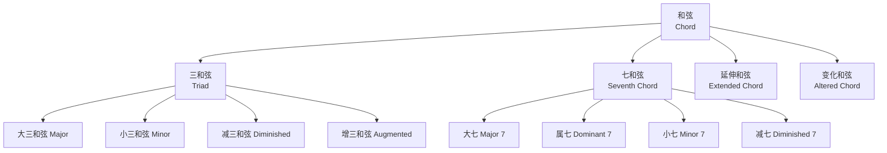
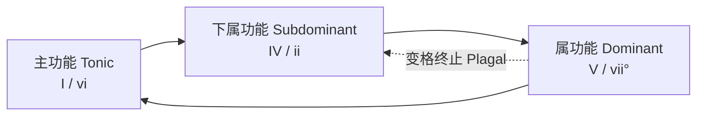

---
aliases:
  - Chord
  - 和弦
  - 和声学
  - Harmony
tags:
created: 2026-05-17
updated: 2026-05-17
  - MusicTheory
  - Harmony
  - ArtsAndCreativity
  - Music
---

# 和弦 (Chord)

## 概述

和弦（Chord）是三个或以上不同音高（Pitch）同时发声的组合，是西方和声学（Harmony）的基本构成单位。从古典音乐（Classical Music）到爵士（Jazz）、摇滚（Rock）和流行音乐（Pop Music），和弦构成了音乐的"纵向"（Vertical）维度。

## 和弦分类体系

## 核心概念表

| 概念 | 英文 | 定义 | 示例 |
|------|------|------|------|
| 根音 | Root | 和弦的基础音 | C 大三和弦的根音是 C |
| 三音 | Third | 与根音相距三度的音 | C 大三和弦的 E |
| 五音 | Fifth | 与根音相距五度的音 | C 大三和弦的 G |
| 七音 | Seventh | 与根音相距七度的音 | C7的 B♭ |
| 转位 | Inversion | 根音不在最低声部的排列 | C/E、C/G |
| 功能 | Function | 和弦在调性中的角色 | 主、属、下属 |

## 三和弦

### 四种基本类型

三和弦（Triad）由根音（Root）、三音（Third）和五音（Fifth）按照三度关系叠置而成：

$$ \text{Triad} = \text{Root} + \text{Third} + \text{Fifth} $$

| 类型 | 音程结构（从根音起） | 标记 | 音响色彩 | 示例(C) |
|------|-------------------|------|---------|---------|
| 大三和弦 | 大三度 + 小三度 | C / Cmaj | 明亮、稳定、欢快 | C-E-G |
| 小三和弦 | 小三度 + 大三度 | Cm / C- | 柔和、忧伤、暗淡 | C-E♭-G |
| 减三和弦 | 小三度 + 小三度 | Cdim / C° | 紧张、不稳定 | C-E♭-G♭ |
| 增三和弦 | 大三度 + 大三度 | Caug / C+ | 不协和、梦幻 | C-E-G♯ |

### 音程与频率比

和声协和度（Consonance）与频率比相关：

$$ \text{大三度: } \frac{5}{4}, \quad \text{小三度: } \frac{6}{5}, \quad \text{纯五度: } \frac{3}{2}, \quad \text{增五度: } \frac{25}{16} $$

协和度排序：纯五度 $\gt$ 大三度 $\gt$ 小三度 $\gt$ 增/减音程

## 七和弦

### 五种常见类型

七和弦（Seventh Chord）在三和弦基础上叠加七音（Seventh）：

$$ \text{Seventh Chord} = \text{Triad} + \text{Seventh} $$

| 类型 | 结构（从根音向上） | 标记 | 色彩 | 应用场合 |
|------|-----------------|------|------|---------|
| 大七和弦 | 大三+小三+大三 | Cmaj7 / C△7 | 柔和的、梦幻的 | 爵士、Bossa Nova |
| 属七和弦 | 大三+小三+小三 | C7 / G7 | 紧张、需要解决到 I 级 | 布鲁斯、摇滚、古典 |
| 小七和弦 | 小三+大三+小三 | Cm7 / C-7 | 柔和、忧伤 | 爵士、R&B |
| 半减七和弦 | 小三+小三+大三 | Cm7♭5 / Cø7 | 不稳定、复杂的 | 现代爵士、影视配乐 |
| 减七和弦 | 小三+小三+小三 | Cdim7 / C°7 | 极度紧张、对称结构 | 连接和声、过渡 |

### 属七和弦的解决

属七和弦（Dominant Seventh）的根音上行纯四度（或下行纯五度）解决到主和弦：

$$ V^7 \rightarrow I: \quad G^7 \rightarrow C $$

导音（Leading Tone）B 上行半音到 C，七音 F 下行半音到 E。

## 调性和弦功能

### C 大调音阶各级和弦

$$ I (\text{C}) \quad ii (\text{Dm}) \quad iii (\text{Em}) \quad IV (\text{F}) \quad V (\text{G}) \quad vi (\text{Am}) \quad vii° (\text{Bdim}) $$

| 级数 | 和弦 | 功能组 | 性质 | 倾向性 |
|------|------|--------|------|--------|
| I（主音） | C | 主功能（Tonic） | 大三和弦 | 最稳定，解决点 |
| ii（上主音） | Dm | 下属功能（Subdominant） | 小三和弦 | 柔和，倾向于 V |
| iii（中音） | Em | 主功能替代 | 小三和弦 | 柔和的连接 |
| IV（下属音） | F | 下属功能 | 大三和弦 | 上行倾向到 V |
| V（属音） | G | 属功能（Dominant） | 大三和弦 | 最强倾向性到 I |
| vi（下中音） | Am | 主功能替代 | 小三和弦 | 小调色彩 |
| vii°（导音） | Bdim | 属功能替代 | 减三和弦 | 极其不稳定 |

### 功能圈

### 终止式

终止式（Cadence）是和声进行的结束公式：

$$ \text{完全终止（Authentic Cadence）: } V \rightarrow I $$

$$ \text{变格终止（Plagal Cadence）: } IV \rightarrow I \quad \text{（"阿门"终止）} $$

$$ \text{半终止（Half Cadence）: } ? \rightarrow V \quad \text{（结束在属，未完）} $$

$$ \text{伪终止（Deceptive Cadence）: } V \rightarrow vi \quad \text{（出人意料）} $$

## 和弦扩展

### 延伸音

在和弦上方叠加的三度音程（九度、十一度、十三度）称为延伸音（Tensions / Upper Extensions）：

$$ \text{Cmaj9} = \text{C} + \text{E} + \text{G} + \text{B} + \text{D} $$

$$ \text{C13} = \text{C} + \text{E} + \text{G} + \text{B♭} + \text{D} + \text{F} + \text{A} $$

延伸音的可选性：根据音乐风格和声部排列，并非所有延伸音都需要同时出现。

### 变化和弦

变化和弦（Altered Chord）通过升高（♯）或降低（♭）和弦音来创造特殊音响效果：

$$ \text{C7♯9: C E G B♭ D♯（常用于爵士和布鲁斯）} $$

$$ \text{C7♭5: C E G♭ B♭（全音阶色彩）} $$

$$ \text{C7♯5♯9: C E G♯ B♭ D♯（张力极强的爵士音效）} $$

## 声部连接

### 基本原则

1. **最小运动原则**：各声部尽量以最小音程移动（全音或半音）
2. **共同音保持**：相邻和弦的共同音保持在同一声部不做移动
3. **避免平行五度/八度**：传统和声学禁止两个外声部连续平行进行

### 导音解决规则

- 七音（Seventh）下行解到下一和弦的三音
- 大调导音（Leading Tone）上行解到主音
- 变化音倾向性解决

## 常见和弦进行

### 流行音乐进行

$$ \text{I - V - vi - IV（经典流行）: C - G - Am - F} $$

$$ \text{I - IV - V - I（布鲁斯基础）: C - F - G - C} $$

$$ \text{ii - V - I（爵士核心）: Dm - G - C} $$

$$ \text{I - vi - II - V（50s 进行）: C - Am - Dm - G} $$

$$ \text{I - iii - IV - V: C - Em - F - G} $$

### 和弦替代

- **关系大小调替代**：Am 替代 C，Em 替代 G
- **三全音替代**（Tritone Substitution）：用♭II7代替 V7，如 D♭7代替 G7
- **下属功能扩展**：ii - V 代替单纯 V

## 和弦标记体系

| 标记 | 含义 | 实际音 |
|------|------|--------|
| C | C 大三和弦 | C-E-G |
| Cm / C- | C 小三和弦 | C-E♭-G |
| Cdim / C° | C 减三和弦 | C-E♭-G♭ |
| Caug / C+ | C 增三和弦 | C-E-G♯ |
| Csus2 | 挂留二度和弦 | C-D-G |
| Csus4 | 挂留四度和弦 | C-F-G |
| C/G | C 和弦,G 为低音（转位） | C-E-G + G 低音 |
| Cmaj7 | C 大七和弦 | C-E-G-B |

## 现代和弦理论

### 调式互换

调式互换（Modal Interchange）从平行调（Parallel Key）借用和弦来丰富和声色彩。C 大调中的常见借用和弦：

| 借用来源 | 和弦 | 标记 | 效果 |
|---------|------|------|------|
| C 自然小调 | E♭ | ♭III | 柔和、色彩变化 |
| C 自然小调 | A♭ | ♭VI | 温暖、流行常用 |
| C 自然小调 | B♭ | ♭VII | 摇滚、布鲁斯色彩 |
| C 和声小调 | G♯dim | vii° | 紧张、爵士 |

### 四度和弦

四度和弦（Quartal Harmony）以纯四度或增四度叠置构成，打破了三度叠置的传统。C 四度和弦为 C - F - B♭，在爵士钢琴和电影配乐中广泛使用。

### 合成和弦

合成和弦（Polychord）由两个和弦叠加形成：$\frac{\text{C△7}}{\text{G7}}$，产生丰富的色彩叠加。

## 和弦听辨训练

通过听音训练（Ear Training）识别和弦：大三和弦明亮、小三和弦暗淡、属七紧张、大七柔和、减七尖锐。功能听辨包括 I - IV - V - I、ii - V - I、I - vi - IV - V 等经典进行。

## 相关条目

- [[Scale]]
- [[Counterpoint]]
- [[JazzHarmony]]
- [[Musicology]]
- [[INDEX|当前目录索引]]
