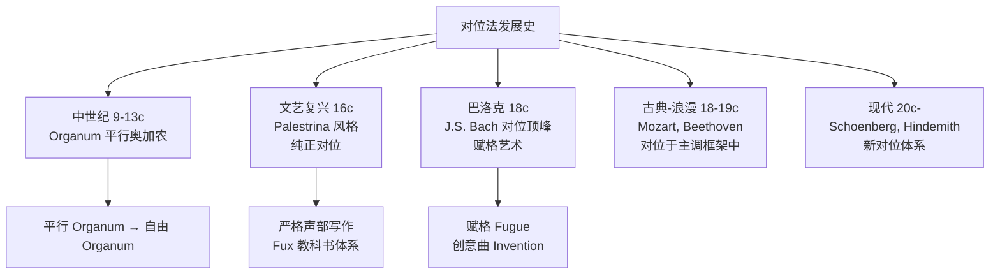
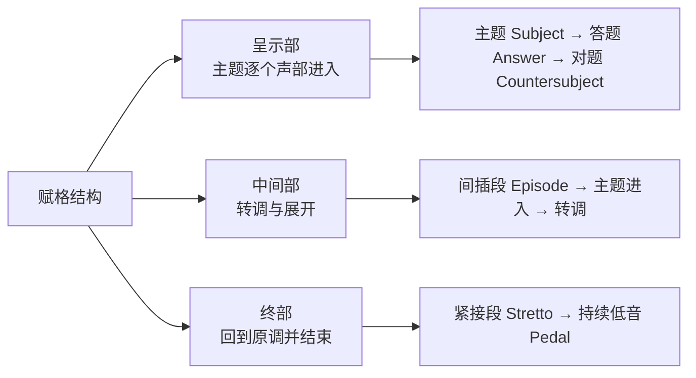

# 对位法 (Counterpoint)

对位法（Counterpoint）是研究多条独立旋律线如何同时和谐进行的作曲技法。它源自拉丁文 *punctus contra punctum*（音对音），是复调音乐（Polyphony）的核心技术。

## 复调音乐 vs 主调音乐

| 比较项 | 复调音乐（Polyphony） | 主调音乐（Homophony） |
|--------|---------------------|---------------------|
| 旋律关系 | 多条旋律独立平等 | 一条旋律为主 + 和弦伴奏 |
| 横向 vs 纵向 | 注重横向线条的独立与交织 | 注重纵向和声的推进 |
| 代表作曲家 | J.S. 巴赫（Bach） | 大多数流行音乐、浪漫派 |
| 代表形式 | 赋格、卡农 | 歌曲（主歌+副歌） |

$$ \text{Counterpoint} = \sum_{i=1}^{n} \text{Melody}_i + \text{Independence} + \text{Harmony} $$

## 对位法的发展历史

## Fux 的五类对位

Johann Joseph Fux 在 *Gradus ad Parnassum*（1725）中建立了至今仍在沿用的教学体系。

### 第一类：音符对音符（1:1 / Note against Note）
- 每个定旋律（Cantus Firmus, CF）音对一个对位（Counterpoint, CP）音
- 只使用协和音程：纯一、纯五、纯八度，大小三度、大小六度

### 第二类：两个音符对一个（2:1）
- 每拍两个对位音 — 强拍（第一音）必须协和
- 弱拍（第二音）可以用经过音（Passing Tone）制造不协和

### 第三类：四个音符对一个（4:1）
- 每拍四个音，节奏细分
- 更多经过音和邻音（Neighbor Tone）的运用

### 第四类：切分（Syncopation / Suspension）
$$ \text{准备（协和）} \rightarrow \text{延留（不协和）} \rightarrow \text{下行解决（协和）} $$

### 第五类：花式对位（Florid Counterpoint）
混合使用前四类的所有技法，节奏最为自由、丰富，最接近实际作曲。

## 对位法的核心原则

### 旋律写作原则
1. **级进为主**：大部分旋律进行为二度，跳进后反向级进
2. **音域控制**：不超过十度（一个八度加一个三度）
3. **单一高潮**：全曲只有一个最高点
4. **避免同音反复**：不连续重复同一音

### 纵向关系原则
1. 优先使用协和音程（三、六度及其复合音程）
2. 避免平行五度和平行八度（会削弱声部独立性）
3. 避免隐伏五度/八度（外声部同向跳进到达五/八度）
4. 不协和音需准备并在后半拍解决

## 赋格（Fugue）— 对位法的最高形式

巴赫将赋格发展至巅峰。赋格的基本结构：

## 对位与和声的关系

$$ \text{对位} = \text{水平方向的旋律独立性} $$
$$ \text{和声} = \text{垂直方向的音高组合} $$
$$ \text{优秀音乐} = \text{两者兼顾} $$

## 对位技法在流行音乐中的应用

- **乐队合奏中的声部写作**：吉他、键盘、贝斯各司其职
- **合唱编写**：SATB（女高、女低、男高、男低）声部独立进行
- **爵士 big band 编曲**：铜管组和萨克斯组的对位交织
- **复调性编曲**：如 Queen 的 Bohemian Rhapsody 中的多声部段落

## 现代对位技法

20世纪作曲家发展了对位法的新可能性：
- **线性对位**（Linear Counterpoint）：不再受传统协和规则约束，各声部完全独立进行
- **微复调**（Micropolyphony）：大量声部细微交织，整体形成音色织体（如 Ligeti）
- **十二音对位**：在十二音序列框架下的对位写作

## 相关条目

[[Chord]], [[Scale]], [[JazzHarmony]], [[Musicology]], [[06_ArtsAndCreativity/Music/MusicTheory/INDEX|MusicTheory]]
