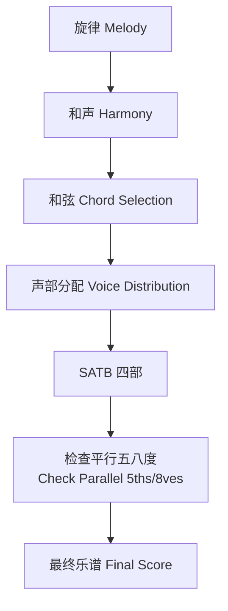
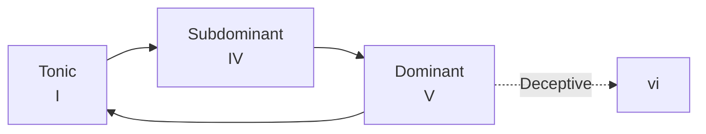

# 和声学概论 (Harmony Overview)

## 一、音程 (Intervals)

音程是两个音之间的音高距离。基本音程包括：

| 音程名称 | 半音数 | 示例 |
|----------|--------|------|
| 纯一度 (Perfect Unison) | 0 | C–C |
| 小二度 (Minor 2nd) | 1 | C–D♭ |
| 大二度 (Major 2nd) | 2 | C–D |
| 小三度 (Minor 3rd) | 3 | C–E♭ |
| 大三度 (Major 3rd) | 4 | C–E |
| 纯四度 (Perfect 4th) | 5 | C–F |
| 增四度/减五度 (Tritone) | 6 | C–F♯ |
| 纯五度 (Perfect 5th) | 7 | C–G |
| 小六度 (Minor 6th) | 8 | C–A♭ |
| 大六度 (Major 6th) | 9 | C–A |
| 小七度 (Minor 7th) | 10 | C–B♭ |
| 大七度 (Major 7th) | 11 | C–B |
| 纯八度 (Perfect Octave) | 12 | C–C |

音程分为**协和音程 (Consonant Intervals)** 与**不协和音程 (Dissonant Intervals)**。协和音程又分为**完全协和 (Perfect Consonance)** 和**不完全协和 (Imperfect Consonance)**。

## 二、三和弦 (Triads)

三和弦由三个音按三度叠置构成：

- **大三和弦 (Major Triad)**：大三度 + 小三度（如 C–E–G）
- **小三和弦 (Minor Triad)**：小三度 + 大三度（如 C–E♭–G）
- **增三和弦 (Augmented Triad)**：大三度 + 大三度（如 C–E–G♯）
- **减三和弦 (Diminished Triad)**：小三度 + 小三度（如 C–E♭–G♭）

### 和弦转位 (Chord Inversions)

```
根音位置 (Root Position) —— 根音在低音
第一转位 (First Inversion) —— 三音在低音
第二转位 (Second Inversion) —— 五音在低音
```

## 三、七和弦 (Seventh Chords)

七和弦是在三和弦基础上叠加七度音：

| 和弦类型 | 结构 | 标记 |
|----------|------|------|
| 大七和弦 (Major 7th) | 大三和弦 + 大七度 | CM7 / Cmaj7 |
| 大小七和弦 (Dominant 7th) | 大三和弦 + 小七度 | C7 |
| 小七和弦 (Minor 7th) | 小三和弦 + 小七度 | Cm7 |
| 半减七和弦 (Half-dim 7th) | 减三和弦 + 小七度 | Cø7 |
| 减七和弦 (Dim 7th) | 减三和弦 + 减七度 | C°7 |

## 四、声部进行 (Voice Leading)

声部进行的核心原则：

1. **平稳进行 (Smooth Motion)**：各声部尽量以级进方式移动
2. **避免平行五八度 (Avoid Parallel 5ths/8ves)**：平行纯五度和纯八度削弱声部独立性
3. **反向进行 (Contrary Motion)**：加强声部独立性
4. **声部交叉 (Voice Crossing)**：尽量避免高声部低于低声部

### SATB 四声部写作 (SATB Four-Part Writing)

```
声部排列 (从高到低)：
S (Soprano 女高) —— 旋律声部
A (Alto 女低) —— 内声部
T (Tenor 男高) —— 内声部
B (Bass 男低) —— 低音声部
```



## 五、终止式 (Cadences)

终止式是乐句结束处的和声进行：

| 终止式类型 | 进行 | 效果 |
|------------|------|------|
| 正格终止 (Authentic) | V → I | 完满结束 |
| 半终止 (Half) | 结束于 V | 暂停感 |
| 变格终止 (Plagal) | IV → I | 教堂风格 |
| 阻碍终止 (Deceptive) | V → VI | 意外进行 |

## 六、和声功能 (Harmonic Function)

和声功能理论将和弦分为三种主要功能：

- **主功能 (Tonic, T)**：I 级和弦，稳定中心
- **属功能 (Dominant, D)**：V 级和弦，倾向于解决到主和弦
- **下属功能 (Subdominant, S)**：IV 级和弦，从主到属的过渡

### 功能进行原则

$$
T \rightarrow S \rightarrow D \rightarrow T
$$

这是古典和声中最基本的进行模式。倒置（如 D → S）通常被视为不自然。



## 七、和弦外音 (Non-Chord Tones)

和弦外音分为：

- **经过音 (Passing Tone)**：级进填充两个和弦音之间
- **辅助音 (Neighbor Tone)**：从和弦音上行或下行级进后返回
- **延留音 (Suspension)**：前和弦的音延续到后和弦，然后级进解决
- **先现音 (Anticipation)**：后和弦的音提前出现
- **倚音 (Appoggiatura)**：强拍上的非和弦音，跳跃进入后级进解决

## 八、转调 (Modulation)

转调是从一个调转换到另一个调。常见方法：

1. **自然转调 (Diatonic Modulation)**：通过共同和弦进入新调
2. **变和弦转调 (Chromatic Modulation)**：通过变和弦实现
3. **直接转调 (Direct/Phrase Modulation)**：无过渡直接跳入新调
4. **共同音转调 (Common-Tone Modulation)**：通过共同音连接

### 转调过程


## 九、和声分析实践 (Harmonic Analysis Practice)

分析步骤如下：

1. 确定调性 (Key) 与调式 (Mode)
2. 标记每一拍的和弦
3. 标注和弦转位
4. 识别终止式
5. 标注和弦外音
6. 分析功能进行

## 十、常见和弦进行 (Common Chord Progressions)

| 进行类型 | 模式 | 风格 |
|----------|------|------|
| I–V–vi–IV | 流行经典 | Pop/Rock |
| ii–V–I | 爵士进行 | Jazz |
| I–IV–V–IV | 蓝调进行 | Blues |
| i–VII–VI–V | 和声小调 | Classical Minor |
| I–vi–ii–V | 经典循环 | 50s Progression |

### 练习建议

在钢琴上弹奏上述和弦进行，注意体会不同进行带来的情感色彩。配合耳训 (Ear Training) 训练，逐步建立对和弦功能的听觉认知。
