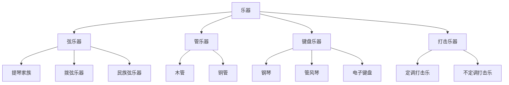

---
aliases:
  - 乐器演奏技巧
  - 演奏法
  - 器乐表演
  - 合奏
  - 视奏
  - Instrumental Performance
  - Playing Techniques
  - Ensemble
  - Sight-reading
tags:
  - Arts
  - Music
  - InstrumentalPerformance
  - Technique
  - Practice
  - Interpretation
  - Ensemble
  - Sight-reading
---

# 乐器演奏

## 一、乐器演奏概述

乐器演奏（Instrumental Performance）是通过乐器表达音乐的艺术与技术。主要乐器分类包括弦乐器（Strings）、管乐器（Winds）、键盘乐器（Keyboard）和打击乐器（Percussion）。

### 乐器分类

### 各乐器组代表

| 组别 | 乐器 | 音域 | 记谱法 |
|------|------|------|--------|
| 弓弦 | 小提琴（Violin） | G3 - E7 | 高音谱号 |
| 弓弦 | 大提琴（Cello） | C2 - C6 | 低音谱号/次中音谱号 |
| 木管 | 长笛（Flute） | C4 - C7 | 高音谱号 |
| 木管 | 单簧管（Clarinet） | E3 - C7 | 高音谱号（移调乐器） |
| 铜管 | 小号（Trumpet） | F#3 - C6 | 高音谱号（移调乐器） |
| 铜管 | 长号（Trombone） | E2 - F5 | 低音谱号 |
| 键盘 | 钢琴（Piano） | A0 - C8 | 大谱表 |
| 打击 | 定音鼓（Timpani） | 视调音而定 | 低音谱号 |

---

## 二、演奏技巧基础

### 弦乐技巧

| 技巧 | 英文 | 描述 | 记号 |
|------|------|------|------|
| 连弓 | Legato | 一弓演奏多个音符 | 连线 |
| 分弓 | Détaché | 每音一弓，平稳过渡 | — |
| 顿弓 | Staccato | 短促有力的音符 | 音符上方圆点 |
| 跳弓 | Spiccato | 弓子弹跳 | 音符上方点加竖线 |
| 拨弦 | Pizzicato | 手指拨弦 | pizz. |
| 揉弦 | Vibrato | 手指揉动改变音高 | 波浪线 |
| 双音 | Double Stop | 同时演奏两根弦 | 和弦 |

### 管乐技巧

| 技巧 | 英文 | 描述 |
|------|------|------|
| 吐音 | Tonguing | 用舌尖阻断气流发音 |
| 双吐 | Double Tonguing | "tu-ku" 快速交替 |
| 花舌 | Flutter Tonguing | 舌头颤动制造特殊效果 |
| 气震音 | Vibrato | 腹部控制气流波动 |
| 滑音 | Glissando | 快速滑动改变音高 |
| 泛音 | Overtone | 超吹获得高音 |

### 键盘技巧

$$ \text{手指独立性 (Finger Independence)} + \text{手腕放松 (Wrist Relaxation)} = \text{流畅演奏} $$

| 技巧 | 英文 | 描述 |
|------|------|------|
| 音阶 | Scale | 24个大小调音阶练习 |
| 琶音 | Arpeggio | 和弦分解演奏 |
| 颤音 | Trill | 相邻两个音快速交替 |
| 八度 | Octave | 1-5指弹奏八度音程 |
| 踏板 | Pedaling | 延音/柔音/持音踏板使用 |

---

## 三、练习方法论

### 有效练习原则

1. **刻意练习（Deliberate Practice）**：有目标、有反馈的专注练习
2. **分段练习（Sectional Practice）**：将曲目拆解为小段
3. **慢速练习（Slow Practice）**：确保准确性后再提速
4. **脱离乐谱（Away from Score）**：记忆演奏加深理解
5. **录音回听（Record and Review）**：客观评估自己的演奏

### 练习计划示例

| 时间段 | 内容 | 时长 | 目标 |
|--------|------|------|------|
| 热身 | 长音/空弦/音阶 | 10-15min | 建立基本控制 |
| 技术训练 | 练习曲（Etude） | 20-30min | 攻克具体技术难点 |
| 曲目练习 | 正在学习的曲目 | 30-45min | 艺术表达 |
| 视奏 | 新谱快速浏览 | 10-15min | 提升读谱能力 |
| 放松 | 自由演奏 | 5-10min | 享受音乐 |

---

## 四、音乐诠释

### 诠释要素

| 要素 | 英文 | 描述 |
|------|------|------|
| 速度 | Tempo | 音乐进行速度 |
| 力度 | Dynamics | 音量强弱变化 |
| 乐句 | Phrasing | 音乐句法划分 |
| 运音法 | Articulation | 音符连接方式 |
| 节奏弹性 | Rubato | 速度的微妙变化 |
| 音色 | Timbre | 声音的色彩与质感 |

### 力度记号

$$ \text{ppp} \rightarrow \text{pp} \rightarrow \text{p} \rightarrow \text{mp} \rightarrow \text{mf} \rightarrow \text{f} \rightarrow \text{ff} \rightarrow \text{fff} $$

$$ \text{渐强（Crescendo）}: \quad \text{cresc.} \quad \text{或} \quad \langle $$

$$ \text{渐弱（Diminuendo）}: \quad \text{dim.} \quad \text{或} \quad \rangle $$

---

## 五、合奏与协作

### 合奏形式

| 形式 | 人数 | 描述 |
|------|------|------|
| 二重奏（Duo） | 2 | 两种乐器对话 |
| 三重奏（Trio） | 3 | 如钢琴三重奏 |
| 四重奏（Quartet） | 4 | 弦乐四重奏经典配置 |
| 室内乐团（Chamber Orchestra） | 10-40 | 小型管弦乐队 |
| 交响乐团（Symphony Orchestra） | 60-100+ | 大型管弦乐队 |

### 合奏素养

- **聆听（Active Listening）**：倾听其他声部
- **融合（Blend）**：调整音色以融入整体
- **平衡（Balance）**：控制音量配合整体
- **默契（Ensemble Intuition）**：非言语交流的默契

---

## 六、视奏能力

### 视奏技巧（Sight-reading Skills）

视奏是指首次看到乐谱时即时演奏的能力。

| 技巧 | 描述 |
|------|------|
| 前瞻阅读（Looking Ahead） | 眼睛走在手前面 |
| 辨识模式（Pattern Recognition） | 识别音阶、琶音、和弦模进 |
| 简化策略（Simplification） | 省略次要音符保持节奏 |
| 节奏优先（Rhythm First） | 节奏准确比音高更重要 |
| 调性感知（Key Awareness） | 预先感知调性内音高 |

---

## 七、演奏心理

### 舞台焦虑管理

1. **充分准备（Thorough Preparation）**：最有效的抗焦虑方法
2. **模拟演出（Mock Performance）**：在他人面前练习
3. **呼吸技巧（Breathing Techniques）**：深腹式呼吸放松
4. **正念练习（Mindfulness）**：专注于当下而非评价
5. **积极自我对话（Positive Self-talk）**：替代消极思维

### 演奏者与听众的交流

$$ \text{演奏} = \text{技术} \times \text{表达} \times \text{沟通} $$

真正的演奏不仅是准确无误地执行乐谱，更是通过音乐与听众建立情感连接（Emotional Connection）的过程。
