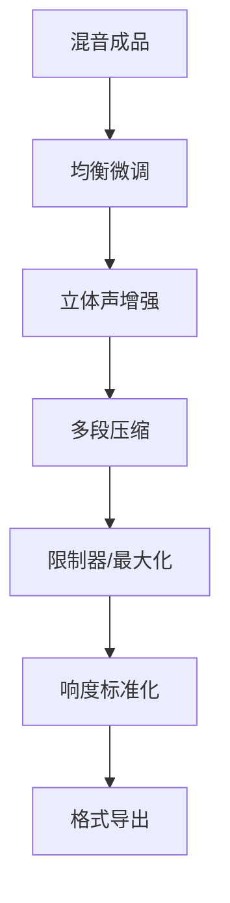

---
aliases:
  - 音乐制作
  - 录音工程
  - 混音
  - 母带处理
  - Music Production
  - Recording
  - Mixing
  - Mastering
  - DAW
tags:
  - Arts
  - Music
  - Production
  - Recording
  - Audio
  - SoundEngineering
  - Mixing
  - Mastering
  - Synthesis
---

# 音乐制作与录音

## 一、音乐制作概述

音乐制作（Music Production）涵盖从创意构思到最终录音成品输出的全过程。现代音乐制作主要依靠数字音频工作站（Digital Audio Workstation, DAW）完成。

### 音乐制作流程

### 主流DAW对比

| DAW | 开发商 | 平台 | 特色 |
|-----|--------|------|------|
| Ableton Live | Ableton | Win/Mac | 电子音乐、现场演出 |
| Logic Pro | Apple | Mac | 全面、编曲强大 |
| Pro Tools | Avid | Win/Mac | 行业标准录音 |
| FL Studio | Image-Line | Win/Mac | 步进音序器、电子音乐 |
| Cubase | Steinberg | Win/Mac | MIDI编辑、管弦乐 |
| Reaper | Cockos | Win/Mac/Linux | 轻量、高度可定制 |

---

## 二、录音技术

### 麦克风类型

| 类型 | 原理 | 特点 | 适用场景 |
|------|------|------|----------|
| 动圈（Dynamic） | 电磁感应 | 结实、低灵敏 | 现场、鼓、吉他音箱 |
| 电容（Condenser） | 静电变化 | 高灵敏、细节丰富 | 人声、原声乐器 |
| 铝带（Ribbon） | 铝带振动 | 温暖柔和 | 吉他、铜管 |
| 界面（Boundary/PZM） | 压力区 | 无染色 | 环境声、会议 |

### 拾音方式

- 心形指向（Cardioid）：拾取前方声音，抑制后方
- 全指向（Omnidirectional）：拾取全部方向声音
- 八字指向（Figure-8）：拾取前后，抑制两侧
- 超心形（Supercardioid）：更强的指向性

### 录音信号链

$$ \text{声源} \rightarrow \text{麦克风} \rightarrow \text{前置放大器} \rightarrow \text{音频接口} \rightarrow \text{DAW} $$

---

## 三、混音技术

混音（Mixing）是将多个音轨混合为立体声文件的过程。

### 混音核心要素

| 要素 | 说明 | 常用工具 |
|------|------|----------|
| 音量平衡（Level） | 各轨道相对音量 | 推子、自动化 |
| 声像定位（Panning） | 声音在立体声场中的位置 | 声像旋钮 |
| 均衡（EQ） | 频率调整 | 参数均衡器 |
| 压缩（Compression） | 动态范围控制 | 压缩器、限制器 |
| 混响（Reverb） | 空间感营造 | 卷积/算法混响 |
| 延迟（Delay） | 回声效果 | 延迟器、回声 |

### EQ频率分区

| 频段 | 频率范围 | 特性 |
|------|----------|------|
| 超低频（Sub-bass） | 20-60 Hz | 体感震动 |
| 低频（Bass） | 60-250 Hz | 节奏根基 |
| 中低频（Low-mid） | 250-500 Hz | 丰满/浑浊 |
| 中频（Mid） | 500 Hz-2 kHz | 人声/乐器主体 |
| 中高频（High-mid） | 2-6 kHz | 临场感/攻击性 |
| 高频（High） | 6-20 kHz | 空气感/亮度 |

---

## 四、母带处理

母带处理（Mastering）是最后一个步骤，优化整体音质和响度。

### 母带处理步骤

### 响度标准

$$ \text{LUFS (Loudness Units Full Scale)} $$

| 平台 | 目标响度 | 真峰值上限 |
|------|----------|------------|
| Spotify | -14 LUFS | -1 dBTP |
| Apple Music | -16 LUFS | -1 dBTP |
| YouTube | -14 LUFS | -1 dBTP |
| 广播（ITU-R BS.1770） | -23 LUFS | -2 dBTP |

---

## 五、合成器与音色设计

### 合成方式

| 合成类型 | 原理 | 经典音色 |
|----------|------|----------|
| 减法合成（Subtractive） | 过滤谐波丰富的波形 | 贝斯、主音 |
| 加法合成（Additive） | 叠加正弦波 | 铃铛、管风琴 |
| FM合成（FM Synthesis） | 频率调制 | 电钢琴、金属音 |
| 波表合成（Wavetable） | 扫描波表 | 现代电子 |
| 粒子合成（Granular） | 声音粒子重组 | 氛围、实验音色 |

### 减法合成信号链

$$ \text{振荡器 VCO} \rightarrow \text{滤波器 VCF} \rightarrow \text{放大器 VCA} $$

$$ \text{包络 Envelope} \rightarrow \text{VCF, VCA} $$

$$ \text{LFO} \rightarrow \text{VCO, VCF, VCA} $$

---

## 六、声学基础

### 室内声学

| 现象 | 描述 | 处理方法 |
|------|------|----------|
| 反射（Reflection） | 声音在墙壁反弹 | 吸音板、扩散体 |
| 驻波（Standing Wave） | 特定频率的增强/抵消 | 低频陷阱 |
| 混响时间（RT60） | 声音衰减60dB的时间 | 调整吸音材料 |
| 梳状滤波（Comb Filtering） | 直达声与反射声干涉 | 近场监听、吸音 |

### 监听环境

- 监听音箱（Studio Monitors）：应放置在等边三角形位置
- 监听耳机（Headphones）：适合检查细节但声场不自然
- 声学处理（Acoustic Treatment）：减少染色，获得平坦频率响应

---

## 七、实践建议

### 新手起步配置

1. 音频接口（Audio Interface）：如 Focusrite Scarlett 系列
2. 麦克风：一支电容麦克风 + 一支动圈麦克风
3. 监听耳机：开放式耳机（混音）+ 封闭式耳机（录音）
4. DAW：从免费或入门版开始（如 Reaper、Logic Pro）

### 学习资源

- 混音参考曲目（Reference Tracks）：与自己的作品对比
- 频谱分析仪（Spectrum Analyzer）：可视化频率分布
- 相位相关计（Phase Correlation Meter）：检查立体声相位
