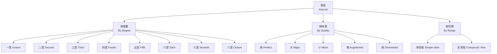

---
aliases: [Intervals, 音程, 音程基础, MusicIntervals, 音程理论]
tags: ['MusicTheory', 'Intervals', 'EarTraining', 'Harmony']
created: 2026-05-17
updated: 2026-05-17
---

# 音程详解

## 概述

音程（Interval）是两个音之间的音高距离（Pitch Distance）。
下方音称为根音（Root / Lower Note）。
上方音称为冠音（Upper Note）。

音程分为两类：
**旋律音程（Melodic Interval）**——两个音先后发声。
**和声音程（Harmonic Interval）**——两个音同时发声。

音程是西方音乐理论中最基本的构件之一。
它是和弦（Chord）的基础。
音阶（Scale）的基础。
调性（Tonality）的基础。

理解音程不仅是理论学习的基础。
对视谱演奏（Sight-Reading）有重要实践意义。
对即兴创作（Improvisation）有重要实践意义。
对和声分析（Harmonic Analysis）有重要实践意义。
对听力训练（Ear Training）有重要实践意义。

音程的听觉辨识能力
是音乐家基本功的核心组成部分。
无论是古典音乐家还是爵士即兴演奏者。
都依赖对音程的快速识别能力。

## 音程分类与命名体系



## 自然音程速查表

| 度数 | 半音数 | 音程名称 | 简写 | 协和性 | 示例（C 为根音） |
|------|--------|---------|------|--------|---------------|
| 纯一度 | 0 | Perfect Unison | P1 | 极完全协和 | C-C |
| 小二度 | 1 | Minor Second | m2 | 不协和 | C-Db |
| 大二度 | 2 | Major Second | M2 | 不协和 | C-D |
| 小三度 | 3 | Minor Third | m3 | 不完全协和 | C-Eb |
| 大三度 | 4 | Major Third | M3 | 不完全协和 | C-E |
| 纯四度 | 5 | Perfect Fourth | P4 | 完全协和 | C-F |
| 增四度 | 6 | Augmented Fourth | A4 | 不协和 | C-F# |
| 减五度 | 6 | Diminished Fifth | d5 | 不协和 | C-Gb |
| 纯五度 | 7 | Perfect Fifth | P5 | 完全协和 | C-G |
| 小六度 | 8 | Minor Sixth | m6 | 不完全协和 | C-Ab |
| 大六度 | 9 | Major Sixth | M6 | 不完全协和 | C-A |
| 小七度 | 10 | Minor Seventh | m7 | 不协和 | C-Bb |
| 大七度 | 11 | Major Seventh | M7 | 不协和 | C-B |
| 纯八度 | 12 | Perfect Octave | P8 | 极完全协和 | C-C' |

增四度与减五度
在十二平均律中同为6个半音。
统称三全音（Tritone）。
协和度相同但记谱方向不同。
增四从根音向上扩。
减五从根音向上缩。
在古典音乐中被视为"音乐中的魔鬼"（Diabolus in Musica）。
在中世纪和文艺复兴时期被禁止使用。

## 五类音程的性质

音程根据其质量（Quality）分为五类：

- **纯音程（Perfect, P）**
  一度、四度、五度、八度。
  在大小调体系中保持不变。
  不能有大/小的变体。

- **大音程（Major, M）**
  二度、三度、六度、七度。
  自然大调音阶中根音到各级音的音程。

- **小音程（Minor, m）**
  大音程降低半音。
  大二度变小二度。
  大三度变小三度。

- **增音程（Augmented, A）**
  纯或大音程增加半音。
  纯五度增半音为增五度（A5）。

- **减音程（Diminished, d）**
  纯或小音程减少半音。
  纯五度减少半音为减五度（d5）。

以半音数表示音程关系：

```
半音数:  0   1   2   3   4   5   6   7   8   9   10  11  12
性质:   P1  m2  M2  m3  M3  P4  A4  P5  m6  M6  m7  M7  P8
                                  d5
```

### 等音程

等音程（Enharmonic Intervals）指半音数相同但记谱不同的音程。
增四度（C-F#）等于减五度（C-Gb）。
大六度（C-A）等于减七度（C-Bbb）。
理解等音程对视谱和移调具有重要意义。

## 协和性分类

协和与不协和（Consonance and Dissonance）
是音程在听感上的重要分类。

协和音程：稳定、和谐、不要求解决。
不协和音程：紧张、不稳定、倾向于解决到协和音程。

| 类别 | 英文 | 包含音程 | 听觉特征 | 和声功能 |
|------|------|---------|---------|---------|
| 极完全协和 | Perfect Consonance | P1, P8 | 空洞、融合 | 框架性、基底 |
| 完全协和 | Perfect Consonance | P4, P5 | 稳定、和谐 | 和声支柱、终止 |
| 不完全协和 | Imperfect Consonance | M3, m3, M6, m6 | 柔和、悦耳 | 和声丰富度 |
| 不协和 | Dissonance | m2, M2, m7, M7, A4/d5 | 紧张 | 推动音乐向前 |

协和性的感知并非绝对。
不同音乐风格和历史时期对协和性定义有所变化。
中世纪音乐中，三度和六度被视为不协和。
文艺复兴时期，三度和六度逐渐被接受。
巴洛克时期，七和弦中的七度成为常用。
爵士乐和现代音乐中，三全音被广泛接受为色彩性音程。

## 音程转位

音程转位（Interval Inversion）
是将根音移高八度或冠音移低八度。
使上下音位置互换。

**转位规则：原度数 + 转位度数 = 9**

| 原音程 | 转位音程 | 质量变换 |
|--------|---------|---------|
| 纯一度（P1） | 纯八度（P8） | 纯↔纯 |
| 大二度（M2） | 小七度（m7） | 大↔小 |
| 小三度（m3） | 大六度（M6） | 小↔大 |
| 纯四度（P4） | 纯五度（P5） | 纯↔纯 |
| 增四度（A4） | 减五度（d5） | 增↔减 |
| 大六度（M6） | 小三度（m3） | 大↔小 |
| 纯八度（P8） | 纯一度（P1） | 纯↔纯 |

质量变换规则：
纯↔纯，大↔小，增↔减。
互为转位音程的协和性相同。
纯音程转位后仍为纯音程。
这是纯音程区别于其他音程的重要性质。

## 复音程

超过八度的音程称为复音程（Compound Interval）。

复音程的度数等于相应单音程度数加7。
十度（Tenth）= 三度 + 7。
十二度（Twelfth）= 五度 + 7。

$$ \text{复音程度数} = \text{对应单音程度数} + 7 \times \text{八度跨越数} $$

复音程的听觉性质由其对应的单音程决定。
大十度与大三度协和性相似。
音域更广、声部间距更大。
适用于更开阔的和声织体（Open Voicing）。

常见复音程：
九度 = 二度 + 7（常用于爵士和声）。
十一度 = 四度 + 7（挂留和弦核心）。
十三度 = 六度 + 7（爵士延伸和弦）。

## 音程听觉训练方法

### 特征记忆法

将每个音程与熟悉的歌曲片段关联。
是初学者最有效的音程记忆方法。

| 音程 | 上行参考曲 | 下行参考曲 |
|------|-----------|-----------|
| m2 | 《命运交响曲》开头 | 《生日快乐》 |
| M2 | 《生日快乐》开头 | 《玛丽有只小羊羔》 |
| m3 | 《樱花》民谣 | 《致爱丽丝》开头 |
| M3 | 《红河谷》 | 《送别》（长亭外） |
| P4 | 《婚礼进行曲》 | 《国际歌》开头 |
| A4/d5 | 《Maria》（西城故事） | 《蓝色多瑙河》 |
| P5 | 《星球大战》主题 | 《小星星》 |
| m6 | 《Love Story》主题 | 下行较难识别 |
| M6 | 《我的太阳》 | 《Nobody Knows》 |
| m7 | 《Star Trek》主题 | 《All My Loving》 |
| M7 | 《Take On Me》前奏 | 《I Love You》 |
| P8 | 《Somewhere Over the Rainbow》 | 《月亮代表我的心》 |

### 系统训练方法

**唱名法（Solfege）**
用 do-re-mi-fa-sol-la-ti-do 唱自然大调音阶。
建立各音级之间的相对音高感。
固定 Do 和流动 Do 两种体系各有优势。

**构唱（Interval Singing）**
给定一个参考音。
在心中构唱出指定音程的上方或下方音。
再用琴验证。
这是最高效的内化方法。
初学者应从同度和八度开始。
逐步扩展到大三度、纯五度等简单音程。

**对比法（Comparative Method）**
在多个不同调上反复听同一音程。
区分音程的绝对不变性。
调性色彩的相对变化。

**和弦上下文法（Chord Context）**
在真实音乐片段中识别音程。
在大三和弦中识别三度。
根音-三音为大三度（4半音）。
三音-五音为小三度（3半音）。

### 推荐工具

**EarMaster**
支持自定义练习序列。
包括音程识别、和弦识别、节奏训练。

**Perfect Ear**
免费、覆盖全面。
包括音程、音阶、和弦等多种训练模块。

**Tenuto**
与乐理教材配套的轻量训练。
支持自定义练习范围。
每日坚持10~15分钟。
效果优于每周一次长时间训练。

## 音程在音乐中的应用

旋律进行（Melodic Motion）以音程为基本单位。
**级进（Stepwise Motion）**使用二度，平滑连贯。
常用于旋律的主题陈述部分。

**跳进（Leap）**使用三度及以上，带来张力与表现力。
常用于旋律的高潮和情感表达部分。
大跳（超过五度）非常引人注目。

和声音程（双音）是构建和弦（三度叠置）的基础。
经过音（Passing Tone）和辅助音（Neighboring Tone）
填充音程之间的空隙，构成旋律装饰。

在四部和声（Four-Part Harmony）中。
声部进行的音程控制——
避免平行五度（Parallel Fifths）。
避免平行八度（Parallel Octaves）。
这是古典和声的基本规则。

爵士乐中，七音和九音、十一音、十三音
丰富了和声的色彩性。
旋律小调的经过性和声提供了独特的音乐色泽。

## 相关条目

- [[Harmony]]
- [[Scales]]
- [[Chords]]
- [[EarTraining]]
- [[MusicNotation]]
- [[ChordProgressions]]
- [[CircleOfFifths]]

