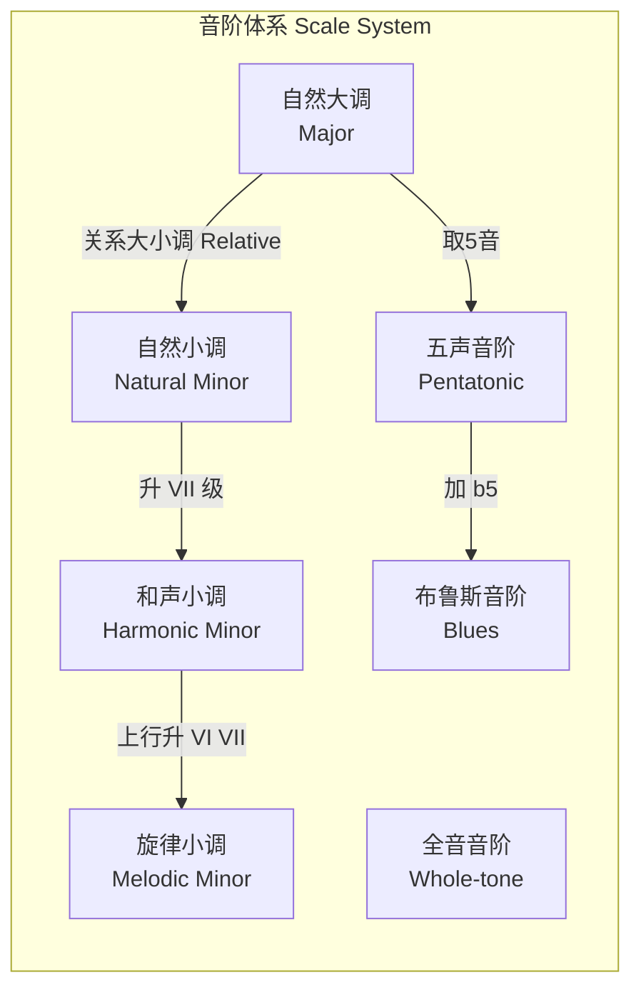
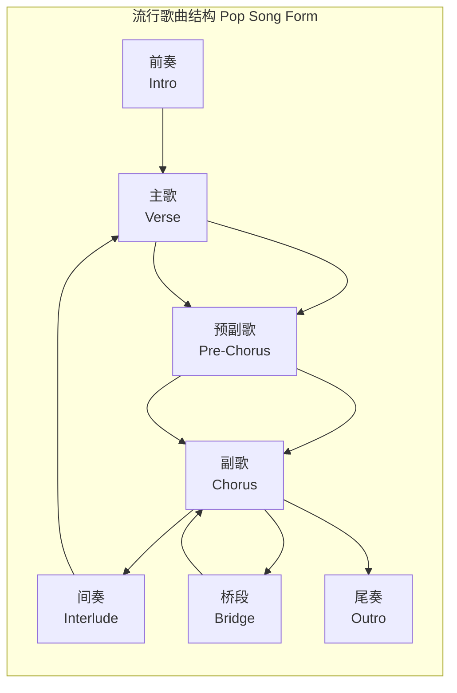

# 音乐理论 (Music Theory)

> 音乐理论是研究音乐结构、记谱法及创作手法的学科，涵盖旋律、和声、节奏、音阶与曲式等核心要素，是理解、分析及创作音乐的基石。

## 基础乐理 (Fundamentals)

### 音高与十二平均律 (Pitch & 12-TET)

十二平均律（12-Tone Equal Temperament, 12-TET）将八度平均分为 12 个半音（Semitone），每个半音频率比为 $2^{1/12}$：

$$
f_n = f_0 \times 2^{n/12}
$$

其中 $f_0$ 为基准音频率（通常 A4 = 440Hz），$n$ 为距离基准音的半音数。

### 音名与唱名

| 音名 (Letter Name) | 简谱 | 首调唱名 (Solfège) | 频率 (A4=440Hz) |
|-------------------|------|-------------------|----------------|
| C | 1 | Do | 261.63 Hz |
| D | 2 | Re | 293.66 Hz |
| E | 3 | Mi | 329.63 Hz |
| F | 4 | Fa | 349.23 Hz |
| G | 5 | Sol | 392.00 Hz |
| A | 6 | La | 440.00 Hz |
| B | 7 | Si | 493.88 Hz |

### 音符时值与节拍 (Note Values & Time Signatures)

| 音符 | 时值 | 休止符 |
|------|------|--------|
| 全音符 (Semibreve) | 4 拍 | 全体止符 |
| 二分音符 (Minim) | 2 拍 | 二分休止符 |
| 四分音符 (Crotchet) | 1 拍 | 四分休止符 |
| 八分音符 (Quaver) | 1/2 拍 | 八分休止符 |
| 十六分音符 (Semiquaver) | 1/4 拍 | 十六分休止符 |

---

## 音阶 (Scales)

### 大调音阶 (Major Scale)

大调音阶结构：**全 全 半 全 全 全 半**（W-W-H-W-W-W-H）

以 C 大调为例：C - D - E - F - G - A - B - C

$$
\text{公式: } 1 \quad 2 \quad 3 \quad 4 \quad 5 \quad 6 \quad 7 \quad 1'
$$

### 小调音阶 (Minor Scale)

三种小调音阶：

| 类型 | 音程结构 | 示例（A 小调） |
|------|---------|---------------|
| 自然小调 (Natural Minor) | W-H-W-W-H-W-W | A B C D E F G A |
| 和声小调 (Harmonic Minor) | W-H-W-W-H-3H-H | A B C D E F G# A |
| 旋律小调 (Melodic Minor) | 上行: W-H-W-W-W-W-H / 下行同自然小调 | A B C D E F# G# A |

### 其他常见音阶

- **五声音阶** (Pentatonic Scale) —— 无半音，广泛用于民乐、摇滚、布鲁斯
- **全音音阶** (Whole-tone Scale) —— 全音递增，产生朦胧梦幻效果
- **半音阶** (Chromatic Scale) —— 全部半音，共 12 个音
- **布鲁斯音阶** (Blues Scale) —— 小调五声音阶 + b5

---

## 音程 (Intervals)

### 音程分类

| 半音数 | 音程名称 | 示例 |
|-------|---------|------|
| 0 | 纯一度 (Perfect Unison) | C-C |
| 1 | 小二度 (Minor 2nd) | C-Db |
| 2 | 大二度 (Major 2nd) | C-D |
| 3 | 小三度 (Minor 3rd) | C-Eb |
| 4 | 大三度 (Major 3rd) | C-E |
| 5 | 纯四度 (Perfect 4th) | C-F |
| 6 | 增四度/减五度 (Tritone) | C-F# |
| 7 | 纯五度 (Perfect 5th) | C-G |
| 8 | 小六度 (Minor 6th) | C-Ab |
| 9 | 大六度 (Major 6th) | C-A |
| 10 | 小七度 (Minor 7th) | C-Bb |
| 11 | 大七度 (Major 7th) | C-B |
| 12 | 纯八度 (Perfect Octave) | C-C' |

---

## 和弦 (Chords)

### 三和弦 (Triads)

由根音、三音、五音构成：

| 类型 | 构成 | 标记 | 示例 (C) |
|------|------|------|---------|
| 大三和弦 (Major) | 大三度 + 小三度 | C | C-E-G |
| 小三和弦 (Minor) | 小三度 + 大三度 | Cm | C-Eb-G |
| 增三和弦 (Augmented) | 大三度 + 大三度 | Caug | C-E-G# |
| 减三和弦 (Diminished) | 小三度 + 小三度 | Cdim | C-Eb-Gb |

### 七和弦 (Seventh Chords)

在三和弦基础上增加七音：

| 类型 | 构成 | 标记 | 示例 |
|------|------|------|------|
| 大七和弦 (Major 7th) | M3 + m3 + M3 | CM7 | C-E-G-B |
| 属七和弦 (Dominant 7th) | M3 + m3 + m3 | C7 | C-E-G-Bb |
| 小七和弦 (Minor 7th) | m3 + M3 + m3 | Cm7 | C-Eb-G-Bb |
| 半减七和弦 (m7b5) | m3 + m3 + M3 | Cm7b5 | C-Eb-Gb-Bb |
| 减七和弦 (Dim 7th) | m3 + m3 + m3 | Cdim7 | C-Eb-Gb-Bbb |

### 和弦功能 (Harmonic Function)

- **主功能** (Tonic, I) —— 稳定、归属感
- **下属功能** (Subdominant, IV) —— 离开主音的趋势
- **属功能** (Dominant, V) —— 强烈回归主音的趋势
- **II、III、VI** —— 替代功能（Substitute Function）

---

## 和声进行 (Harmonic Progression)

### 常见和声进行

- **I-IV-V-I** —— 最基础的终止式（Perfect Cadence）
- **II-V-I** —— 爵士音乐中的核心进行
- **I-V-vi-IV** —— 流行音乐中使用最多的和弦进行
- **vi-IV-I-V** —— 常见于现代流行与摇滚

### 终止式 (Cadence)

| 终止类型 | 进行 | 听觉效果 |
|---------|------|---------|
| 完全终止 (Perfect Authentic) | V → I | 结束感最强 |
| 半终止 (Half Cadence) | 停在 V | 悬念、不完整 |
| 变格终止 (Plagal Cadence) | IV → I | 教会式"阿们" |
| 阻碍终止 (Deceptive Cadence) | V → vi | 意外转向 |

---

## 节奏与节拍 (Rhythm & Meter)

### 节奏型 (Rhythmic Patterns)

- **二拍子** (Duple Meter) —— 2/4、4/4，进行曲风格
- **三拍子** (Triple Meter) —— 3/4、3/8，圆舞曲风格
- **复拍子** (Compound Meter) —— 6/8、9/12，摇曳感
- **混合拍子** (Irregular Meter) —— 5/4、7/8，如《Take Five》

### 切分音 (Syncopation)

切分音是重音落在弱拍或弱位上的节奏手法，产生推动感：

$$
\downarrow \uparrow \downarrow \uparrow \quad \rightarrow \quad \text{重音后移产生 Syncopation}
$$

### 常见节奏术语

| 术语 | 含义 |
|------|------|
| Rubato | 弹性速度，节奏自由处理 |
| Swing | 八分音符非均分演奏（三连音感） |
| Ostinato | 固定反复的节奏或旋律型 |
| Hemiola | 二拍子与三拍子的短暂重叠 |

---

## 视唱练耳 (Ear Training)

### 听力训练内容

- **单音辨识** (Single Note Recognition) —— 建立绝对/相对音感
- **音程辨识** (Interval Recognition) —— 从同度到八度的所有音程
- **和弦辨识** (Chord Recognition) —— 三和弦、七和弦的类型与转位
- **节奏听写** (Rhythmic Dictation) —— 捕捉并记谱节奏模式
- **旋律听写** (Melodic Dictation) —— 将听到的旋律转为记谱

### 练习方法

- **固定唱名法** (Fixed Do) —— C 永远是 Do，利于绝对音感
- **首调唱名法** (Movable Do) —— Do 随调变化，利于相对音感与转调
- **Solfege 音节练习**—— Do Re Mi Fa Sol La Ti Do

---

## 曲式与结构 (Musical Form)

| 曲式 | 结构 | 常见应用 |
|------|------|---------|
| 二段式 (Binary) | A - B | 巴洛克舞曲 |
| 三段式 (Ternary) | A - B - A | 古典小品、流行歌曲 |
| 回旋曲式 (Rondo) | A - B - A - C - A | 古典奏鸣曲末乐章 |
| 奏鸣曲式 (Sonata Form) | 呈示 - 展开 - 再现 | 古典奏鸣曲第一乐章 |
| 主歌-副歌 (Verse-Chorus) | A - B - A - B - C - B | 现代流行音乐 |

---

## 转调与离调 (Modulation & Chromaticism)

### 近关系转调 (Close Key Modulation)

- 关系调 / 平行调 / 属调 / 下属调
- 共同和弦转调 (Pivot Chord Modulation)：利用两调共有的和弦作为桥梁
- 等和弦转调（减七和弦 / 增三和弦作为支点）

### 远关系转调 (Remote Key Modulation)

- 三度关系转调（C → E、C → Ab）
- 那不勒斯关系（bII 调）
- 直接转调 (Direct Modulation)：无准备直接进入新调

### 变和弦 (Altered Chords)

- **增六和弦** (Augmented 6th Chords)：意大利、法国、德国三种形式，强烈倾向属和弦
- **拿波里六和弦** (Neapolitan 6th, bII6)：替代下属功能
- **重属和弦** (Secondary Dominant)：V/V、V/vi 等临时属和弦

---

## 对位法 (Counterpoint)

### 基本原则

- **第一类**：全音符对全音符（1:1）
- **第二类**：全音符对二分音符（2:1）
- **第三类**：全音符对四分音符（4:1）
- **第四类**：延留音与切分处理
- **第五类**：花体对位（混合前四类）

### 和声对位规则

- 禁止平行五度与平行八度
- 反向进行（Contrary Motion）为最佳声部运动
- 斜向与同向运动需谨慎
- 不协和音需预备、延留、解决

---

## 现代音乐理论与爵士和声 (Modern & Jazz Harmony)

### 和弦扩展与替换

- **延伸音**：9th、11th、13th
- **变化属和弦** (Altered Dominant)：b9、#9、b5、#5
- **三全音替代** (Tritone Substitution)：将属七和弦替换为上行减五度的属七
- **上四度进行**：爵士即兴中的核心和声运动

### 调式音阶 (Modes)

| 调式 | 音程结构 | 色彩 |
|------|---------|------|
| 伊奥尼亚 (Ionian) | W-W-H-W-W-W-H | 大调明亮 |
| 多利亚 (Dorian) | W-H-W-W-W-H-W | 小调爵士风味 |
| 弗里几亚 (Phrygian) | H-W-W-W-H-W-W | 西班牙色彩 |
| 利底亚 (Lydian) | W-W-W-H-W-W-H | 升 IV 的梦幻感 |
| 混合利底亚 (Mixolydian) | W-W-H-W-W-H-W | 属七音阶 |
| 爱奥利亚 (Aeolian) | W-H-W-W-H-W-W | 自然小调 |
| 洛克利亚 (Locrian) | H-W-W-H-W-W-W | 减五度的紧张感 |

---

### 相关条目
- [[06_ArtsAndCreativity/Music/MusicTheory/INDEX|Music/MusicTheory 索引]]
- [[06_ArtsAndCreativity/Music/MusicTheory/ChordTheory|和弦理论进阶]]
- [[06_ArtsAndCreativity/Music/MusicTheory/HarmonyAnalysis|和声分析]]
- [[06_ArtsAndCreativity/Music/MusicTheory/Orchestration|配器法]]
- [[INDEX|当前目录索引]]
