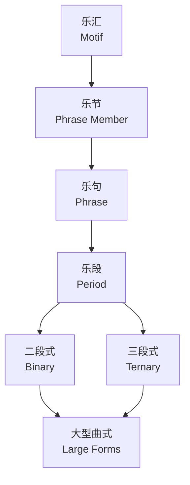
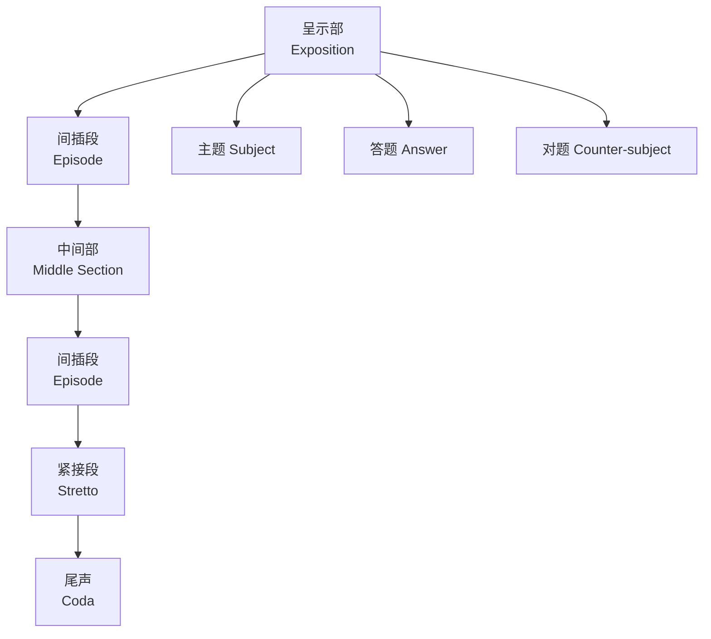

---
aliases:
  - Musical Form
  - 曲式
tags:
created: 2026-05-17
updated: 2026-05-17
  - music
  - musical-form
  - theory
  - composition
  - analysis
---

# 曲式 (Musical Form)

## 一、概述 (Overview)

曲式 (Musical Form) 是音乐作品的结构组织方式，决定了音乐材料的安排、发展与再现。曲式分析是理解和诠释音乐作品的基础工具。常见曲式包括一段式、二段式、三段式、奏鸣曲式、回旋曲式、变奏曲式和赋格。

## 二、基本结构单位 (Basic Structural Units)



**乐段结构 (Period Structure)**：

| 类型 | 结构 | 调性关系 |
|------|------|----------|
| 平行乐段 (Parallel) | aa' | 起句主调 → 落句主调 |
| 对比乐段 (Contrasting) | ab | 起句主调 → 落句属调 |
| 展开乐段 (Developing) | 材料持续发展 | 调性不稳定 |

## 三、二段式 (Binary Form)

**结构 (Structure)**：
$$
\text{Binary Form} = \text{Section A} + \text{Section B}
$$

- **简单二段式 (Simple Binary)**：A 段从主调转到属调，B 段从属调回到主调
- **再现二段式 (Rounded Binary)**：B 段末尾再现 A 段材料

**特征 (Characteristics)**：
- 比例均衡，通常每段 8-16 小节
- 巴洛克舞曲（小步舞曲、加沃特舞曲）常用

## 四、三段式 (Ternary Form)

**结构 (Structure)**：
$$
\text{Ternary Form} = A - B - A
$$

其中 B 段（中段 Trio）与 A 段形成对比：

| 段落 | 功能 | 调性 |
|------|------|------|
| A | 呈示主题 (Exposition) | 主调 (Tonic) |
| B | 对比中段 (Contrast) | 下属/关系调 |
| A' | 再现 (Recapitulation) | 主调 (Tonic) |

## 五、奏鸣曲式 (Sonata Form)

### 5.1 结构 (Structure)

```mermaid
flowchart LR
  subgraph 呈示部 Exposition
    A1[主部<br/>1st Subject]
    B1[连接部<br/>Transition]
    C1[副部<br/>2nd Subject]
    D1[结束部<br/>Codetta]
  end
  subgraph 展开部 Development
    E1[主题材料发展<br/>Thematic Development]
  end
  subgraph 再现部 Recapitulation
    A2[主部<br/>1st Subject]
    B2[连接部<br/>Transition]
    C2[副部<br/>2nd Subject (主调)]
    D2[结束部<br/>Codetta]
  end
  subgraph Coda
    F1[尾声<br/>Coda]
  end
  A1 --> B1 --> C1 --> D1 --> E1 --> A2 --> B2 --> C2 --> D2 --> F1
```

### 5.2 调性布局 (Key Scheme)

| 部分 | 主调 | 副调 |
|------|------|------|
| 呈示部 (Exposition) | 主调 (I) | 属调 (V) 或关系大调 |
| 再现部 (Recapitulation) | 主调 (I) | 主调 (I) |

## 六、回旋曲式 (Rondo Form)

**结构模式 (Structure Patterns)**：

- **五部回旋曲 (5-part Rondo)**：A - B - A - C - A
- **七部回旋曲 (7-part Rondo)**：A - B - A - C - A - B' - A

主部 (Refrain, A) 每次出现于主调，插部 (Episode, B/C) 提供调性与主题对比。

## 七、变奏曲式 (Variation Form)

**固定变奏 (Theme and Variations)**：
$$
\text{Theme} \to V_1 \to V_2 \to V_3 \to \cdots \to V_n
$$

**变奏手法 (Variation Techniques)**：

| 手法 | 说明 |
|------|------|
| 旋律变奏 (Melodic) | 加花、装饰 |
| 节奏变奏 (Rhythmic) | 改变节奏型 |
| 和声变奏 (Harmonic) | 改变和声走向 |
| 调式变奏 (Modal) | 大调/小调转换 |
| 对位变奏 (Contrapuntal) | 加入复调手法 |

## 八、赋格 (Fugue)

**赋格结构 (Fugue Structure)**：



**赋格的基本元素 (Elements of Fugue)**：
- 主题 (Subject)：全曲核心旋律
- 答题 (Answer)：主题在属调上的模仿
- 对题 (Counter-subject)：与主题相伴的旋律
- 间插段 (Episode)：主题材料的自由发展
- 紧接段 (Stretto)：主题重叠进入，产生高潮

## 九、曲式分析原则 (Analytical Principles)

1. 调性布局 (Key Scheme) — 调性是曲式的重要标识
2. 终止式 (Cadence) — 划分结构的标志点
3. 主题材料 (Thematic Material) — 重复、对比与变奏
4. 结构比例 (Structural Proportion) — 黄金分割、对称

## 十、著名曲式分析案例 (Famous Analytical Examples)

| 作品 | 作曲家 | 曲式 |
|------|--------|------|
| 第 40 号交响曲 K.550 第一乐章 | Mozart | 奏鸣曲式 |
| 《致爱丽丝》WoO 59 | Beethoven | 回旋曲式 (A-B-A-C-A) |
| 《卡农》P.37 | Pachelbel | 固定低音变奏 |
| 《C 大调前奏曲》BWV 846 | J.S. Bach | 赋格 |
| 《军队进行曲》Op. 51 No. 1 | Schubert | 三段式 |

