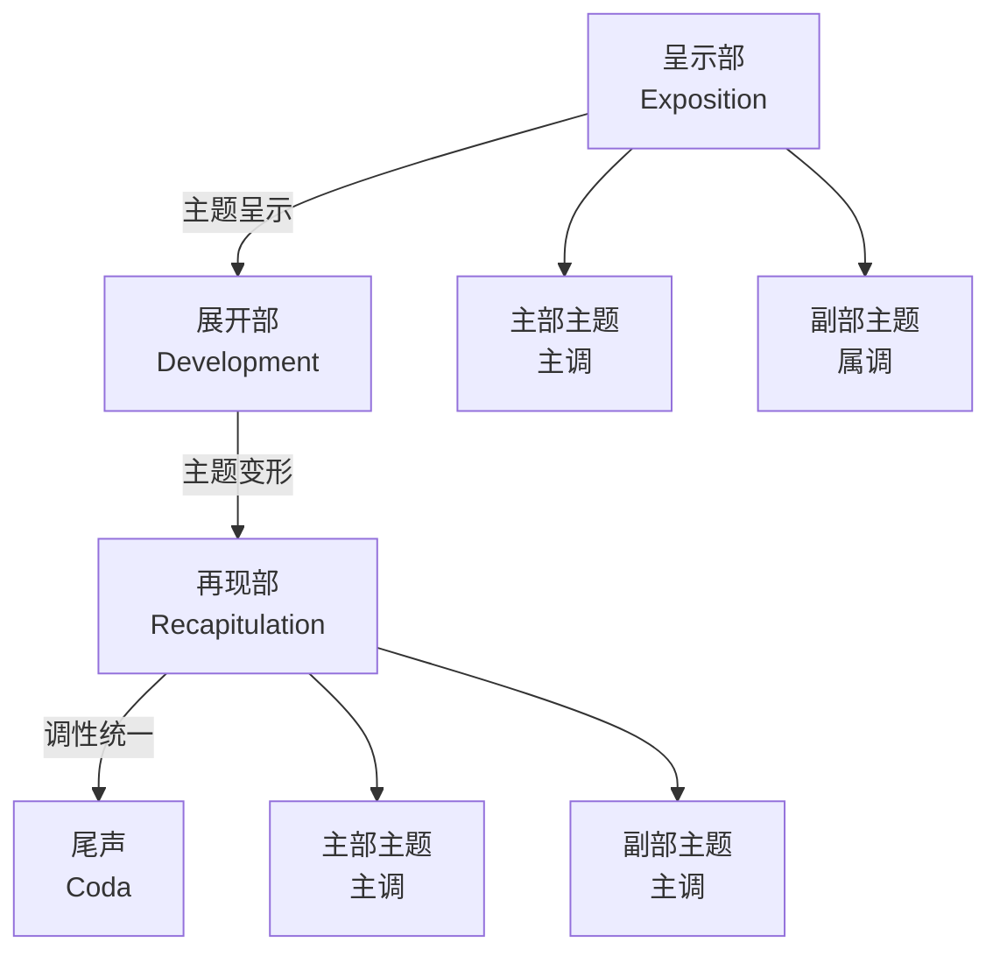
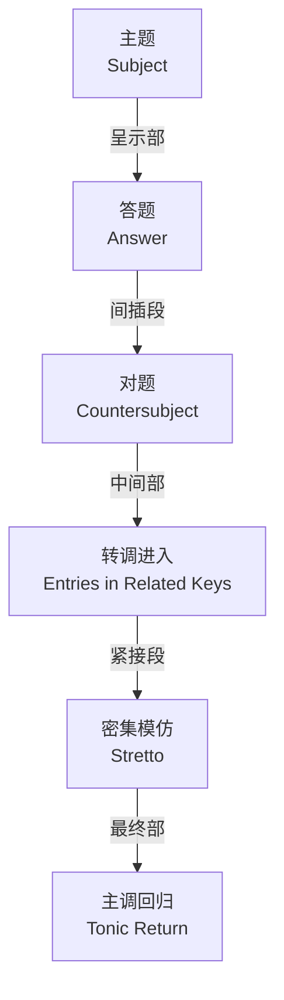

---
aliases:
  - Musical Form
  - Form Analysis
  - 曲式学
  - 音乐结构
tags:
  - music
  - theory
  - form
  - analysis
  - structure
---

# 曲式分析 (Musical Form Analysis)

## 概述 (Overview)

曲式分析（Musical Form Analysis）是研究音乐作品结构组织的学科。它探讨作曲家如何通过重复、对比、变奏、展开等手法，将乐思组织成具有逻辑性和美学价值的整体。掌握曲式分析能力，是理解音乐语言、进行音乐创作和学术研究的基石。

### 曲式的基本单位

| 单位 (Unit) | 定义 (Definition) | 典型长度 (Typical Length) |
| --- | --- | --- |
| 乐汇 (Motive) | 最小的旋律或节奏型 | 1–3小节 |
| 乐节 (Phrase) | 相对完整的乐思单位 | 2–4小节 |
| 乐句 (Period) | 包含问句与答句的组合 | 8–16小节 |
| 乐段 (Section) | 更大的结构单位 | 16–32小节 |

## 一部曲式 (One-Part Form / Monothematic)

### 定义与特征

一部曲式是最简单的曲式结构，作品由一个连贯的段落构成，没有明显的重复或对比段落。常见于前奏曲（Prelude）、无词歌（Song Without Words）等体裁。

其结构标记为：

$$A$$

### 分析要点

分析一部曲式时，需关注：

- 主题的发展手法（模进、分裂、扩展）
- 调性布局的渐进性
- 结构的黄金分割点（通常出现在0.618处）

$$\phi = \frac{1+\sqrt{5}}{2} \approx 1.618$$

黄金比例常出现在音乐的高潮布局中，虽然不是所有作曲家都有意识地使用，但许多经典作品的结构比例接近这一数值。

## 二部曲式 (Binary Form)

### 简单二部曲式

二部曲式（Binary Form）由两个段落组成，标记为：

| 形式 (Type) | 结构 (Structure) | 调性布局 (Key Layout) |
| --- | --- | --- |
| 简单二部 (Simple Binary) | A ∥ B | 主调 → 属调/关系调 → 主调 |
| 带再现二部 (Rounded Binary) | A ∥ B+A' | 第二段末尾再现A段材料 |

巴洛克时期的舞曲组曲（Dance Suite）大量采用二部曲式。例如巴赫《法国组曲》中的阿勒曼德（Allemande）和库朗特（Courante）。

### 二部曲式的和声特征

A段通常结束在半终止（Half Cadence）或属调完全终止（Perfect Cadence in Dominant）。B段则通过转调、模进等手法最终回归主调（Tonic）。

## 三部曲式 (Ternary Form)

### 标准三部曲式

三部曲式（Ternary Form）是音乐中最常见的结构之一，标记为：

$$A \quad B \quad A$$

其中B段与A段形成鲜明对比，最后的A段可以是完全重复或变化再现。

### 类型划分

| 类型 (Type) | 特征 (Characteristics) | 代表作品 (Examples) |
| --- | --- | --- |
| 简单三部 (Simple Ternary) | A、B、A段落分明 | 贝多芬《致爱丽丝》 |
| 复三部曲式 (Compound Ternary) | 各段本身为二部或三部曲式 | 肖邦《夜曲》Op.9 No.2 |
| 回旋性质 (Rondo-like) | 插部多次出现 | 莫扎特《土耳其进行曲》 |

### 小步舞曲与谐谑曲

小步舞曲（Minuet）和谐谑曲（Scherzo）常采用三部曲式，且中段（Trio）通常采用不同的织体和调性：

- 小步舞曲：优雅、三拍子、 moderate 速度
- 谐谑曲：快速、节奏活跃、带有幽默感

## 奏鸣曲式 (Sonata Form)

### 结构框架

奏鸣曲式（Sonata Form）是古典主义时期最重要的器乐结构，通常用于交响曲、协奏曲、弦乐四重奏的第一乐章。

$$\text{呈示部 (Exposition)} \rightarrow \text{展开部 (Development)} \rightarrow \text{再现部 (Recapitulation)}$$

### 呈示部 (Exposition)

呈示部呈示两个对比主题群：

| 主题群 (Theme Group) | 调性 (Key) | 性格 (Character) |
| --- | --- | --- |
| 主部主题 (Primary Theme) | 主调 (Tonic) | 果断、精力充沛 |
| 连接部 (Transition) | 调性转换 | 过渡性材料 |
| 副部主题 (Secondary Theme) | 属调/关系调 (Dominant/Relative) | 抒情、歌唱性 |
| 结束部 (Closing Section) | 属调/关系调 | 巩固新调性 |

### 展开部 (Development)

展开部是奏鸣曲式的戏剧核心：

- 对呈示部主题进行分裂、模进、转调
- 引入新材料或引用其他乐章主题
- 调性最不稳定，常经过多个远关系调
- 最终通过属准备（Dominant Preparation）导向再现部

### 再现部 (Recapitulation)

再现部回归主调，但常保留呈示部的调性对比逻辑：

- 主部主题在主调再现
- 副部主题移至主调（调性统一的关键）
- 结束部在主调收束
- 可能附加尾声（Coda）

## 回旋曲式 (Rondo Form)

### 结构特征

回旋曲式（Rondo Form）以主部主题的多次回归为特征，标记为：

$$A \quad B \quad A \quad C \quad A \quad D \quad A \dots$$

主部主题（Refrain）通常具有舞曲性质，插部（Episodes）则提供对比。

### 分类

| 类型 (Type) | 结构 (Structure) | 时期 (Period) |
| --- | --- | --- |
| 五部回旋 (Five-Part Rondo) | ABACA | 古典主义 |
| 七部回旋 (Seven-Part Rondo) | ABACADA | 古典/浪漫 |
| 奏鸣回旋 (Sonata-Rondo) | ABACABA（展开部性质） | 贝多芬、肖邦 |

回旋曲式常用于终乐章（Finale），以其明朗欢快的性格收束全曲。

## 变奏曲式 (Variation Form)

### 固定低音变奏

变奏曲式（Variation Form）以一个主题为基础进行多次变奏。巴洛克时期的帕萨卡利亚（Passacaglia）和恰空（Chaconne）采用**固定低音（Ground Bass）**：

$$\text{主题} \rightarrow \text{变奏 I} \rightarrow \text{变奏 II} \rightarrow \dots \rightarrow \text{变奏 N}$$

### 自由变奏

古典主义以后的变奏曲更为自由：

- 装饰变奏：保持和声骨架，旋律加花
- 性格变奏：改变体裁、速度、调式
- 结构变奏：改变节拍、织体、声部数量

巴赫《哥德堡变奏曲》（Goldberg Variations）是固定低音变奏的巅峰之作。勃拉姆斯《亨德尔主题变奏曲》则展示了性格变奏的丰富可能性。

## 赋格 (Fugue)

### 基本结构

赋格（Fugue）是巴洛克复调音乐的最高形式，基于主题的模仿与对位：

| 部分 (Section) | 内容 (Content) |
| --- | --- |
| 呈示部 (Exposition) | 各声部依次进入，主调/属调交替 |
| 间插段 (Episode) | 过渡性材料，转调发展 |
| 中间部 (Middle Entries) | 主题在关系调呈现 |
| 紧接段 (Stretto) | 声部提前进入，增强紧张感 |
| 最终部 (Final Entry) | 主题回归主调，完满终止 |

### 对位技术

赋格的核心是对位法（Counterpoint）：

- **八度模仿 (Real Answer)**：属调完全模仿
- **五度模仿 (Tonal Answer)**：主/属音调整，保持调性
- **增值/减值 (Augmentation/Diminution)**：主题时值扩大/缩小
- **逆行 (Retrograde)**：主题从后向前演奏
- **倒影 (Inversion)**：主题音程方向反转

## 结语 (Conclusion)

曲式分析是理解音乐「语法」的钥匙。从简单的二部曲式到复杂的奏鸣曲式，从舞曲的循环结构到赋格的对位迷宫，每一种曲式都承载着特定的美学意图和历史语境。分析者不仅要识别结构标签，更要理解作曲家如何在形式框架内进行创造性突破——正是在规则与自由的张力中，伟大的音乐作品得以诞生。

> 「形式即内容。」—— 勋伯格 (Schoenberg)
