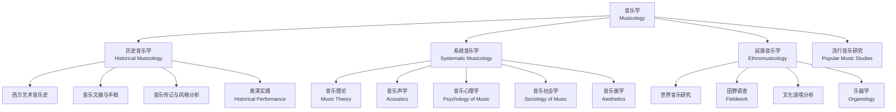

# 音乐学 (Musicology)

音乐学 (Musicology) 是对音乐进行系统学术研究的学科，核心任务是理解音乐本身以及音乐与文化、社会、历史、心理和物理的关系。

## 音乐学的分支架构 (Branches of Musicology)

## 历史音乐学 (Historical Musicology)

### 西方音乐史的核心分期

$$ \text{Medieval (500-1400)} \rightarrow \text{Renaissance (1400-1600)} \rightarrow \text{Baroque (1600-1750)} $$
$$ \rightarrow \text{Classical (1750-1820)} \rightarrow \text{Romantic (1820-1900)} \rightarrow \text{Modern/Contemporary (1900-现在)} $$

| 时期 (Period) | 核心特征 (Characteristics) | 代表作曲家 (Representative Composers) |
|--------------|--------------------------|-------------------------------------|
| 中世纪 (Medieval) | Gregorian Chant、早期复调 | Hildegard von Bingen, Machaut |
| 文艺复兴 (Renaissance) | 声乐复调（弥撒、牧歌） | Josquin, Palestrina, Gesualdo |
| 巴洛克 (Baroque) | 通奏低音、协奏曲、赋格 | Bach, Handel, Vivaldi |
| 古典 (Classical) | 奏鸣曲式、交响曲、弦乐四重奏 | Haydn, Mozart, Beethoven |
| 浪漫 (Romantic) | 标题音乐、艺术歌曲、民族乐派 | Schubert, Chopin, Wagner, Tchaikovsky |
| 现代 (Modern) | 无调性、序列、实验音乐 | Stravinsky, Schoenberg, Cage |

## 系统音乐学 (Systematic Musicology)

### 音乐理论 (Music Theory)

音乐理论研究的五个基本维度：

$$ \text{Music} = \text{Rhythm（节奏）} + \text{Melody（旋律）} + \text{Harmony（和声）} + \text{Form（曲式）} + \text{Texture（织体）} $$

### 音乐声学 (Acoustics)

声音的物理属性：

$$ \text{频率 (Frequency)} \rightarrow \text{音高 (Pitch)} $$

$$ \text{振幅 (Amplitude)} \rightarrow \text{响度 (Loudness / Dynamics)} $$

$$ \text{波形 (Waveform)} \rightarrow \text{音色 (Timbre / Tone Color)} $$

**泛音列 (Harmonic Series)**：

$$ f, 2f, 3f, 4f, 5f, 6f, 7f, \dots $$

基音上方的泛音依次构成：八度、八度+五度、两个八度、两个八度+大三度……

### 音乐心理学 (Psychology of Music)

关键研究领域：
- **音高感知 (Pitch Perception)**：我们如何分辨两个音的高低差
- **节奏同步 (Beat Induction)**：人如何跟随节奏
- **音乐与情绪 (Music and Emotion)**：为什么音乐能引发情感
- **绝对音感 (Absolute Pitch)**：先天还是后天

## 民族音乐学 (Ethnomusicology)

### 方法论 (Methodology)

$$ \text{Ethnomusicology} = \text{Music} + \text{Culture} + \text{Fieldwork} $$

关键概念：
- **局内人/局外人视角 (Emic/Etic)**：研究音乐时究竟是参与者还是旁观者
- **参与观察 (Participant Observation)**：研究者不仅要观察音乐表演，还应学习表演
- **文化相对主义 (Cultural Relativism)**：不以"西方标准"评判非西方音乐

### 世界音乐体系 (World Music Systems)

| 体系 (System) | 音阶特征 (Scale Characteristics) | 代表乐器 (Representative Instruments) |
|--------------|--------------------------------|-------------------------------------|
| 西方古典 | 大小调七声音阶 | 钢琴、小提琴 |
| 印度古典 | Raga 体系（含 22 微分音） | Sitar, Tabla |
| 印尼甘美兰 | Sléndro / Pélog | Gamelan 锣群 |
| 中国音乐 | 五声调式 / 七声 | 古琴、二胡、笛子 |
| 阿拉伯音乐 | Maqam 体系（含 1/4 音） | Oud, Ney |

## 中国音乐学传统 (Chinese Musicology Tradition)

中国传统音乐理论有独特的体系：
- **乐律**：三分损益法（公元前 4 世纪）→ 朱载堉的十二平均律（1584 年）
- **记谱**：减字谱（古琴）、工尺谱、简谱
- **美学**：《乐记》的音乐本体论、"大音希声"的审美理想

## 音乐学的研究方法 (Research Methods)

| 方法 (Method) | 研究对象 (Object) | 常用工具 (Tools) |
|--------------|-----------------|----------------|
| 档案研究 (Archival) | 手稿、书信、出版物 | 图书馆、数字档案 |
| 音乐分析 (Analysis) | 乐谱 | 谱例分析、Schenker、集合论 |
| 民族志 (Ethnography) | 社会中的音乐 | 录音、访谈、参与观察 |
| 实验 (Experiment) | 听众心理 | E-Prime, EEG, fMRI |
| 计算 (Computational) | 海量音乐数据 | MIR, Music21, Spotify API |

## 当代音乐学的新方向 (New Directions)

- **计算音乐学 (Computational Musicology)**：使用机器学习分析大规模音乐数据
- **声音研究 (Sound Studies)**：超越音乐，研究一切声音的文化意义
- **表演研究 (Performance Studies)**：关注音乐表演的过程性而非仅限乐谱
- **应用民族音乐学 (Applied Ethnomusicology)**：将研究用于文化保护、社会正义等实践领域

## 相关条目 (Related Entries)

- [[Chord]], [[Scale]], [[Counterpoint]], [[JazzHarmony]]
- [[MusicTheory]], [[Ethnomusicology]], [[Acoustics]]
- [[INDEX|当前目录索引]]
