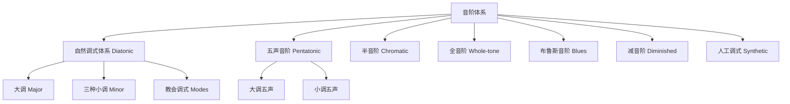

# Scale

音阶（Scale）是按音高从低到高（或从高到低）排列的一组音符，是旋律（Melody）和和声（Harmony）的原材料。不同文化和不同风格的音阶体系塑造了人类音乐的丰富多样性。

## 音阶的基本物理基础

在十二平均律（Equal Temperament）中，一个八度被平均划分为 12 个等距离的半音（Semitone）：

$$ \text{1 个八度} = 1200 \text{ cents} $$
$$ \text{1 个半音} = 100 \text{ cents} $$
$$ \text{1 个全音} = 200 \text{ cents} $$

## 音阶类型体系

## 大调音阶（Major Scale）

大调音阶是西方音乐中最基础的音阶，其全音-半音模式为：

$$ \text{W - W - H - W - W - W - H} $$

以 C 大调为例：

$$ C \quad D \quad E \quad F \quad G \quad A \quad B \quad C $$
$$ W \quad W \quad H \quad W \quad W \quad W \quad H $$

### 所有大调的调号

| 大调 | 调号（升/降号数） | 具体升降音符 |
|------|-----------------|-------------|
| C | 无 | — |
| G | 1♯ | F♯ |
| D | 2♯ | F♯, C♯ |
| A | 3♯ | F♯, C♯, G♯ |
| E | 4♯ | F♯, C♯, G♯, D♯ |
| B | 5♯ | F♯, C♯, G♯, D♯, A♯ |
| F♯ | 6♯ | F♯, C♯, G♯, D♯, A♯, E♯ |
| F | 1♭ | B♭ |
| B♭ | 2♭ | B♭, E♭ |
| E♭ | 3♭ | B♭, E♭, A♭ |
| A♭ | 4♭ | B♭, E♭, A♭, D♭ |

## 小调音阶（Minor Scale）

### 三种小调的比较（a 小调为示例）

| 音级 | 自然小调 | 和声小调 | 旋律小调（上行） |
|------|---------|---------|----------------|
| 1 | A | A | A |
| 2 | B | B | B |
| 3 | C | C | C |
| 4 | D | D | D |
| 5 | E | E | E |
| 6 | F | F | F♯ |
| 7 | G | G♯ | G♯ |
| 8 | A | A | A |

**特点和声差异**：
- 自然小调：♭3, ♭6, ♭7 → 朴素柔和
- 和声小调：♭3, ♭6, ♮7 → 导音倾向性强，常用于古典和声
- 旋律小调：上行 ♭3, ♮6, ♮7 / 下行还原为自然小调

## 五声音阶（Pentatonic Scale）

由五个音构成的音阶，广泛存在于世界各音乐文化中：

$$ \text{大调五声（Major Pentatonic）: C - D - E - G - A} $$
$$ \text{小调五声（Minor Pentatonic）: C - E♭ - F - G - B♭} $$

## 教会调式（Church Modes）

以 C 大调音阶为基础，从不同音级开始：

| 调式 | 起始音 | 特征音 | 色彩描述 | 常见风格 |
|------|-------|-------|---------|---------|
| Ionian | 1 | ♮ | 明亮的 | 流行、古典 |
| Dorian | 2 | ♭3, ♭7 | 柔和爵士感 | 爵士、民谣 |
| Phrygian | 3 | ♭2, ♭3, ♭6, ♭7 | 西班牙/异域 | Flamenco |
| Lydian | 4 | ♯4 | 梦幻、空灵 | 电影配乐 |
| Mixolydian | 5 | ♭7 | 布鲁斯摇滚 | Rock, Blues |
| Aeolian | 6 | ♭3, ♭6, ♭7 | 忧郁悲伤 | 流行、古典 |
| Locrian | 7 | ♭2, ♭3, ♭5 | 紧张不安 | 爵士先锋 |

## 世界其他音阶体系

- **印度 Raga**：超过 200 种 Raga，使用 22 个 Shruti（微分音）
- **日本传统**：都节音阶（阴调式）、琉球音阶（阳调式）
- **阿拉伯 Maqam**：包含 1/4 音（约 50 cents）的精细音高变化
- **印尼甘美兰**：Sléndro（5 音近似等距）和 Pélog（7 音非等距）

## 调律法的数学

| 调律法 | 计算方法 | 优缺点 |
|-------|---------|--------|
| 纯律（Just Intonation） | 基于简单整数比的泛音列 | 纯和声好，但无法自由转调 |
| 五度相生律（Pythagorean） | 连续纯五度叠加 | 三度音程不和谐（81:64） |
| 十二平均律（Equal Temperament） | 12√2 等分八度 | 可自由转调，所有音程略微偏离纯谐 |

## 布鲁斯音阶与爵士音阶

布鲁斯音阶是小调五声音阶增加一个 ♭5（蓝调音）：

$$ \text{C Blues: C - E♭ - F - F♯ - G - B♭ - C} $$

爵士常用调式音阶体系——和弦与音阶对应关系（Chord-Scale Theory）：

| 和弦类型 | 对应音阶 |
|---------|---------|
| Cmaj7 | C Ionian / C Lydian |
| Cm7 | C Dorian / C Aeolian |
| C7 | C Mixolydian / C Altered |
| Cm7♭5 | C Locrian / C Locrian ♯2 |

## 相关条目

- [[Chord]]
- [[Counterpoint]]
- [[JazzHarmony]]
- [[Musicology]]
- [[INDEX|当前目录索引]]
