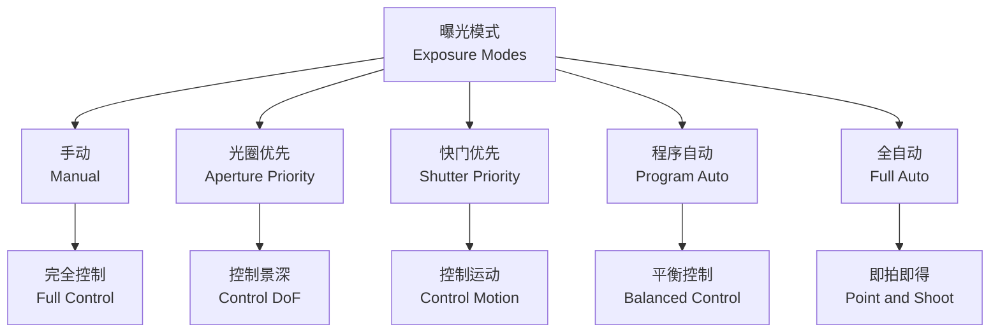
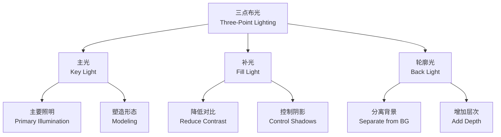

---
aliases:
  - 摄影与摄像技术
  - Photography and Cinematography
  - 摄影技术
  - Cinematography
  - 影像技术
tags:
  - photography
  - cinematography
  - imaging
  - technology
  - visual-arts
---

# 摄影与摄像技术 (Photography and Cinematography)

## 概述 (Overview)

摄影（Photography）与摄像技术（Cinematography）是捕捉、记录与创造视觉影像的艺术与技术。从达盖尔银版法（Daguerreotype）到数字传感器（Digital Sensor），影像技术经历了近两个世纪的革命性发展。

摄影术的本质是**光的书写**（Writing with Light），而摄像（Cinematography）则是**运动中的光的书写**。两者共享光学（Optics）、化学/电子学（Chemistry/Electronics）与美学的基本原理。

### 摄影与摄像的核心区别 (Core Differences)

| 维度 (Dimension) | 摄影 (Photography) | 摄像 (Cinematography) |

| :-- | :-- | :-- |

| 时间维度 | 瞬间凝固 | 时间流动 |

| 叙事方式 | 静态构图 | 运动与剪辑 |

| 核心决策 | 单一画面的最优解 | 序列画面的连贯性 |

| 后期空间 | 有限的修饰 | 广泛的调色、剪辑 |

| 观看方式 | 凝视 | 沉浸 |

| 设备重点 | 机身与镜头 | 机身、镜头、稳定、音频 |

## 曝光 (Exposure)

### 曝光三角 (Exposure Triangle)

曝光（Exposure）是影像捕捉的核心技术，由三个参数共同决定：

$$\text{Exposure} = f(\text{Aperture}, \text{Shutter Speed}, \text{ISO})$$

**光圈（Aperture）：**

光圈控制镜头进光量与景深（Depth of Field），用 $f$-number 表示：

$$f\text{-number} = \frac{f}{D}$$

其中 $f$ 为焦距，$D$ 为光圈直径。

| $f$-number | 进光量 (Light) | 景深 (DoF) | 应用场景 |

| :-- | :-- | :-- | :-- |

| $f/1.4$ | 最大 | 最浅 | 人像、低光 |

| $f/2.8$ | 大 | 浅 | 人像、特写 |

| $f/5.6$ | 中等 | 中等 | 通用 |

| $f/11$ | 小 | 深 | 风景 |

| $f/16$ | 最小 | 最深 | 微距、风景 |

**快门速度（Shutter Speed）：**

快门速度 $t$ 控制光线作用于传感器的时间：

$$\text{Motion Blur} \propto t \cdot v$$

其中 $v$ 为被摄体运动速度。

| 快门速度 | 效果 | 应用 |

| :-- | :-- | :-- |

| $1/4000$ s | 凝固高速运动 | 体育、水滴 |

| $1/250$ s | 凝固一般运动 | 日常摄影 |

| $1/60$ s | 轻微运动模糊 | 标准手持 |

| $1/15$ s | 明显运动模糊 | 创意效果 |

| $1$ s+ | 长曝光 | 夜景、流水 |

**感光度（ISO）：**

ISO 表示传感器对光的敏感程度：

$$\text{Image Noise} \propto \text{ISO}$$

高 ISO 增加感光能力，但引入噪点（Noise）。

### 曝光模式 (Exposure Modes)

## 构图 (Composition)

### 经典构图法则 (Classical Composition Rules)

构图（Composition）是将三维世界组织为二维画面的艺术。

**三分法则（Rule of Thirds）：**

将画面分为 $3 \times 3$ 网格，关键元素置于交点或线上：

$$\text{Composition Strength} = -\sum_{i} w_i \cdot (x_i - x_{\text{ideal}})^2$$

**黄金分割（Golden Ratio）：**

$$\phi = \frac{1 + \sqrt{5}}{2} \approx 1.618$$

画面按黄金比例分割，产生和谐美感。

**引导线（Leading Lines）：**

利用线条引导观众视线至画面焦点。

**框架内框架（Frame within Frame）：**

利用门窗、拱门等自然框架增强纵深感。

### 构图的类型学 (Typology of Composition)

| 构图类型 (Type) | 特征 (Characteristics) | 心理效果 (Psychological Effect) | 例子 (Example) |

| :-- | :-- | :-- | :-- |

| 对称构图 (Symmetrical) | 左右/上下镜像 | 稳定、庄重、形式感 | 建筑摄影、韦斯·安德森电影 |

| 非对称构图 (Asymmetrical) | 视觉重量不均 | 动态、紧张、活力 | 新闻摄影、动作片 |

| 极简构图 (Minimalist) | 元素极少 | 宁静、冥想、孤立 | 杉本博司的海景 |

| 复杂构图 (Complex) | 多层元素 | 丰富、信息密集、沉浸 | 文艺复兴绘画、史诗片 |

| 中心构图 (Central) | 主体居中 | 聚焦、强调、直接 | 肖像摄影 |

| 边缘构图 (Off-Center) | 主体偏离中心 | 不安、期待、叙事推进 | 悬疑片构图 |

### 景深控制 (Depth of Field Control)

景深（Depth of Field）是画面中清晰范围的纵深距离：

$$\text{DoF} \approx \frac{2 \cdot u^2 \cdot c \cdot N}{f^2}$$

其中：

- $u$：对焦距离
- $c$：容许弥散圆直径
- $N$：光圈值
- $f$：镜头焦距

| 景深效果 | 技术实现 | 应用场景 |

| :-- | :-- | :-- |

| 浅景深 | 大光圈 + 长焦 + 近距 | 人像、隔离主体 |

| 深景深 | 小光圈 + 广角 + 远距 | 风景、环境肖像 |

| 全景深 | 超焦距对焦 | 街头摄影、新闻 |

## 灯光 (Lighting)

### 光的基本属性 (Properties of Light)

光是摄影的灵魂。理解光的属性是掌握摄影技术的基础：

| 属性 (Property) | 描述 (Description) | 控制手段 (Control) |

| :-- | :-- | :-- |

| 强度 (Intensity) | 光的明暗程度 | 光源功率、距离、ND 滤镜 |

| 方向 (Direction) | 光从哪个角度照射 | 灯位调整 |

| 色温 (Color Temperature) | 光的颜色偏向 | 滤色片、白平衡设置 |

| 质地 (Quality) | 硬光 vs. 柔光 | 扩散材料、反射面 |

| 对比度 (Contrast) | 亮部与暗部的差异 | 补光、反光板 |

### 三点布光法 (Three-Point Lighting)

经典的三点布光是人像与访谈的基础：

**布光比率（Lighting Ratio）：**

$$\text{Lighting Ratio} = \frac{\text{Key Light Intensity}}{\text{Fill Light Intensity}}$$

- 1:1 平光（High Key）
- 2:1 标准人像
- 4:1 戏剧性人像
- 8:1 低调（Low Key）、神秘

### 自然光与人工光 (Natural vs. Artificial Light)

| 特征 (Feature) | 自然光 (Natural Light) | 人工光 (Artificial Light) |

| :-- | :-- | :-- |

| 可控性 | 低 | 高 |

| 成本 | 免费 | 设备投入 |

| 时间限制 | 黄金时刻、蓝调时刻 | 随时 |

| 质感 | 柔和、多变 | 可控、一致 |

| 色温变化 | 随时间变化 | 固定或可调 |

**黄金时刻**（Golden Hour）的计算：

日出后/日落前约1小时，太阳角度低，光线柔和温暖：

$$\text{Golden Hour Quality} = f(\text{Sun Altitude}, \text{Atmospheric Conditions})$$

## 摄影机运动 (Camera Movement)

### 运动类型与技术 (Movement Types and Techniques)

摄影机运动（Camera Movement）赋予影像时间维度与情感动力：

| 运动方式 (Movement) | 技术实现 (Technical Means) | 叙事功能 (Narrative Function) | 情感效果 (Emotional Effect) |

| :-- | :-- | :-- | :-- |

| 固定镜头 (Static) | 三脚架锁定 | 观察、客观、稳定 | 冷静、疏离 |

| 推轨 (Dolly) | 轨道车、滑轨 | 接近/远离主体 | 介入/疏离 |

| 摇摄 (Pan) | 云台水平旋转 | 跟随、搜索、连接 | 探索、焦虑 |

| 俯仰 (Tilt) | 云台垂直旋转 | 揭示、强调高度 | 敬畏、脆弱 |

| 手持 (Handheld) | 手持或肩扛 | 纪实、临场 | 真实、不安 |

| 斯坦尼康 (Steadicam) | 稳定器系统 | 流畅跟随 | 梦境、流畅 |

| 摇臂 (Jib/Crane) | 悬臂升降 | 宏大视角转换 | 史诗、命运 |

| 无人机 (Drone) | 航拍器 | 鸟瞰、环境 | 超越、自由 |

### 运动的动机 (Motivation of Movement)

所有摄影机运动应当有**动机**（Motivation）：

- **叙事动机**（Narrative Motivation）：跟随移动的主体
- **情感动机**（Emotional Motivation）：表达心理状态
- **揭示动机**（Revelatory Motivation）：逐步展示信息
- **过渡动机**（Transitional Motivation）：连接时空

## 数字成像 (Digital Imaging)

### 传感器技术 (Sensor Technology)

数字摄影的核心是图像传感器（Image Sensor）：

**CMOS vs. CCD：**

| 特征 (Feature) | CMOS | CCD |

| :-- | :-- | :-- |

| 功耗 | 低 | 高 |

| 速度 | 快 | 慢 |

| 成本 | 低 | 高 |

| 噪点 | 较高 | 较低 |

| 应用 | 主流相机 | 科学/天文摄影 |

**传感器尺寸（Sensor Size）：**

$$\text{Image Quality} \propto \text{Sensor Area} \cdot \text{Pixel Quality}$$

| 画幅 (Format) | 尺寸 (Dimensions) | 应用 (Application) |

| :-- | :-- | :-- |

| 中画幅 (Medium Format) | $43.8 \times 32.9$ mm | 商业、风光 |

| 全画幅 (Full Frame) | $36 \times 24$ mm | 专业摄影、电影 |

| APS-C | $23.5 \times 15.6$ mm | 消费级相机 |

| Micro 4/3 | $17.3 \times 13$ mm | 无反相机 |

| 1英寸 (1-inch) | $13.2 \times 8.8$ mm | 高端卡片机 |

| 手机传感器 | $\sim 6 \times 4$ mm | 移动设备 |

### 分辨率与画质 (Resolution and Image Quality)

**分辨率标准：**

| 标准 (Standard) | 分辨率 (Resolution) | 应用场景 |

| :-- | :-- | :-- |

| HD (720p) | $1280 \times 720$ | 网络视频 |

| Full HD (1080p) | $1920 \times 1080$ | 广播、网络 |

| 4K UHD | $3840 \times 2160$ | 流媒体、影院 |

| 4K DCI | $4096 \times 2160$ | 数字影院 |

| 8K UHD | $7680 \times 4320$ | 高端制作 |

**画质不仅取决于分辨率，还取决于：**

- 动态范围（Dynamic Range）
- 色彩深度（Color Depth）
- 压缩算法（Compression Algorithm）
- 镜头解析力（Lens Resolution）

### 数字后期流程 (Digital Post-Production Workflow)

**调色（Color Grading）参数：**

- **曝光**（Exposure）：整体明暗
- **对比度**（Contrast）：明暗差异
- **色温**（White Balance）：冷暖倾向
- **饱和度**（Saturation）：色彩浓度
- **色调曲线**（Curves）：精细 tonal 控制
- **HSL 选择**（HSL Selection）：选择性调整

## 摄影伦理 (Photography Ethics)

### 纪实摄影的伦理 (Ethics of Documentary Photography)

摄影不仅是技术，更涉及伦理选择：

| 议题 (Issue) | 问题 (Question) | 原则 (Principle) |

| :-- | :-- | :-- |

| 知情同意 | 被摄者是否知情？ | 尊重被摄者自主权 |

| 隐私边界 | 公共场合的隐私期待 | 最小伤害原则 |

| 图像操纵 | 后期修改的限度 | 纪实真实性 |

| 苦难消费 | 是否利用他人痛苦？ | 尊严与同情 |

| 文化敏感 | 是否尊重文化差异？ | 文化相对主义 |

## 结语 (Conclusion)

摄影与摄像技术（Photography and Cinematography）是人类记录与创造视觉现实的核心手段。从曝光（Exposure）的精密控制到构图（Composition）的美学决策，从灯光（Lighting）的情感编码到摄影机运动（Camera Movement）的时间雕塑，再到数字成像（Digital Imaging）的技术革新，摄影技术始终在扩展人类视觉的边界。

正如安塞尔·亚当斯（Ansel Adams）所言："你不是在拍摄你所看见的，你是在拍摄你感受的。"技术的终极目的，是服务于那份无法言说的感受。
