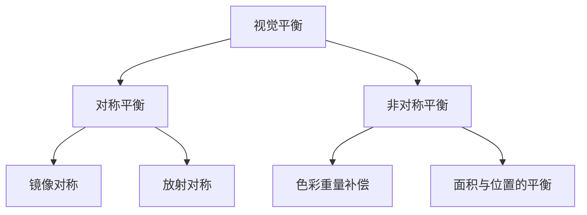
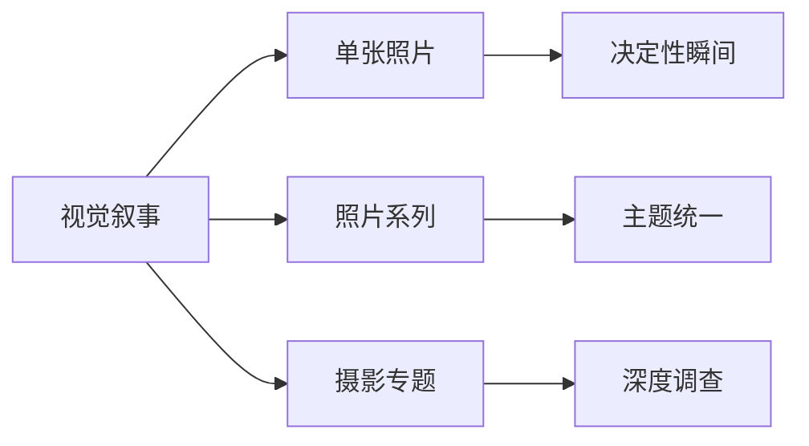

---
aliases:
  - 摄影与视觉艺术
  - Photography and Visual Arts
  - 摄影艺术
  - 视觉叙事
tags:
  - photography
  - visual-arts
  - composition
  - lighting
  - visual-storytelling
---

# 摄影与视觉艺术

## 一、构图法则 (Composition Rules)

### 1.1 经典构图原则

构图是摄影视觉语言的语法基础。好的构图引导视线、传达情感、建立秩序。

| 构图法则 | 方法 | 效果 |
|----------|------|------|
| 三分法 (Rule of Thirds) | 将画面分为 3×3 网格 | 自然、平衡 |
| 对称构图 (Symmetry) | 左右/上下镜像 | 庄严、稳定 |
| 引导线 (Leading Lines) | 线条指向主体 | 深度感 |
| 框架构图 (Framing) | 前景框住主体 | 层次感 |
| 负空间 (Negative Space) | 大量留白 | 孤独、简洁 |
| 对角线 (Diagonal) | 斜线布局 | 动感、张力 |

### 1.2 视觉平衡的艺术

- **对称平衡** (Symmetrical Balance) 传达稳定与经典感
- **非对称平衡** (Asymmetrical Balance) 通过大小、颜色、纹理的对比达成动态均衡

## 二、布光技巧 (Lighting Techniques)

### 2.1 光的特性

| 特性 | 描述 | 视觉效果 |
|------|------|----------|
| 强度 (Intensity) | 光的明暗程度 | 高对比或细腻层次 |
| 方向 (Direction) | 光源的位置 | 塑造立体感 |
| 色温 (Color Temperature) | 暖色/冷色偏向 | 情感氛围 |
| 质感 (Quality) | 硬光或柔光 | 锐利或柔和 |

### 2.2 经典布光模式

| 模式 | 方法 | 适用场景 |
|------|------|----------|
| 伦勃朗光 (Rembrandt Lighting) | 45°侧光，对侧形成一个三角光区 | 肖像摄影 |
| 蝴蝶光 (Butterfly Lighting) | 正面高位光，鼻下形成蝶形阴影 | 时尚摄影 |
| 侧光 (Split Lighting) | 半张脸完全照亮、另一半在阴影中 | 戏剧性人像 |
| 背光 (Backlighting) | 光源在主体后方 | 轮廓光、剪影 |

### 2.3 自然光与人工光

- **黄金时刻 (Golden Hour)** — 日出后、日落前一小时，光线温暖柔和
- **蓝色时刻 (Blue Hour)** — 日出前、日落后，天空呈现蔚蓝色调
- **多点布光 (Multi-light Setup)** — 主光、辅光、轮廓光、背景光的组合

## 三、色彩理论 (Color Theory)

### 3.1 色轮与配色方案

| 配色方案 | 构成 | 情绪效果 |
|----------|------|----------|
| 互补色 (Complementary) | 色轮相对的颜色 | 强烈对比、视觉冲击 |
| 类比色 (Analogous) | 色轮相邻的颜色 | 和谐、舒适 |
| 三色组 (Triadic) | 色轮三等分的颜色 | 丰富、活泼 |
| 单色 (Monochromatic) | 同一色调的明度变化 | 统一、优雅 |

### 3.2 色彩心理学

- **红色** — 激情、危险、能量
- **蓝色** — 冷静、忧郁、信任
- **黄色** — 快乐、温暖、警告
- **绿色** — 自然、平静、生长
- **紫色** — 神秘、高贵、创意
- **黑色** — 力量、优雅、死亡

## 四、视觉叙事 (Visual Storytelling)

### 4.1 叙事要素

| 要素 | 说明 |
|------|------|
| 主体 (Subject) | 故事的核心人物或物体 |
| 环境 (Environment) | 故事发生的空间背景 |
| 动作 (Action) | 正在发生的事件 |
| 情感 (Emotion) | 通过表情和氛围传达的感受 |

### 4.2 决定性瞬间 (The Decisive Moment)

布列松 (Henri Cartier-Bresson) 提出：摄影是在几分之一秒内，同时识别一个事件的意义和其形式的精确组织。

## 五、摄影流派 (Photography Genres)

| 流派 | 核心关注 | 代表摄影师 |
|------|---------|-----------|
| 纪实摄影 (Documentary) | 记录真实社会生活 | 布列松、萨尔加多 |
| 人像摄影 (Portrait) | 捕捉人物性格 | 尤素福·卡什 |
| 风光摄影 (Landscape) | 自然与城市景观 | 安塞尔·亚当斯 |
| 街拍 (Street) | 捕捉日常瞬间 | 罗伯特·弗兰克 |
| 时尚摄影 (Fashion) | 展示服装与风格 | 赫尔穆特·牛顿 |
| 抽象摄影 (Abstract) | 形式与线条的探索 | 曼·雷 |
| 野生动物 (Wildlife) | 自然生态记录 | 弗兰斯·兰廷 |

## 六、后期与数字技术

- **色彩分级 (Color Grading)** — 统一色调、营造氛围
- **影调控制 (Tonal Control)** — 黑、白、灰的精细调整
- **裁剪与构图修正 (Cropping)** — 二次构图
- **合成与蒙版 (Compositing & Masking)** — 多张图像融合

---
*摄影是用光作画的艺术。理解视觉语言的规则，才能有意识地打破它们。*
