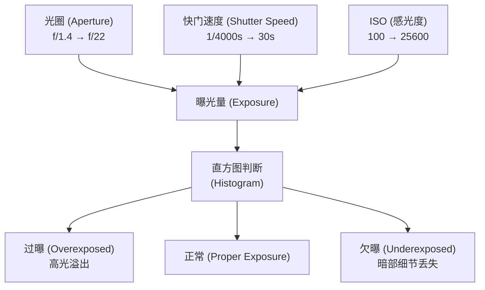
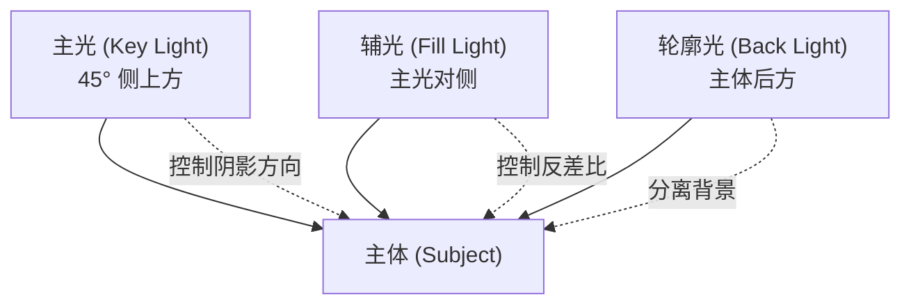
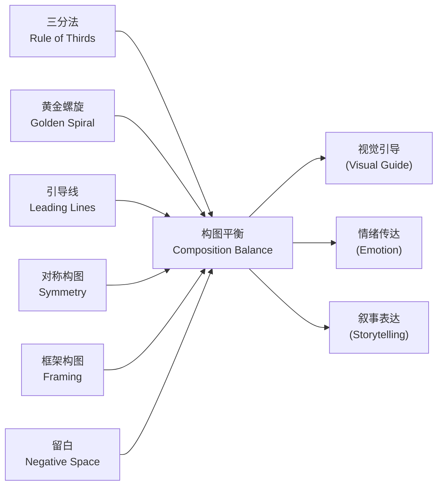

# 摄影技法与后期 (Photography Techniques & Post-processing)

## 1. 曝光三角 (Exposure Triangle)

### 1.1 基本概念

| 参数 | 常见值 | 作用 | 影响 |
|:----:|:----:|:----:|:------:|
| **光圈 (Aperture)** | f/值 (f/1.4, f/2, f/2.8...) | 控制进光量 | 数值越小进光越多，景深越浅 |
| **快门速度 (Shutter Speed)** | 时间 (1/4000, 1/250, 1/60, 30s...) | 控制曝光时长 | 高速凝固运动，低速产生动态模糊 |
| **ISO (感光度)** | 100, 200, 400, 800, 1600... | 传感器对光的敏感度 | 越高噪点越多，画质下降 |

### 1.2 光圈景深对照

| 光圈值 | 进光量 | 景深 | 典型应用 |
|:------:|:------:|:----:|:--------:|
| **f/1.4 - f/2.8** | 多 | 浅 | 人像、弱光、背景虚化（Bokeh） |
| **f/4 - f/5.6** | 中 | 中 | 环境人像、街头摄影 |
| **f/8 - f/11** | 少 | 深 | 风光、建筑、集体照 |
| **f/16 - f/22** | 极少 | 极深 | 微距、长曝光、星芒效果 |

### 1.3 快门速度应用

| 快门速度 | 用途 | 典型应用 |
|:--------:|:----:|:--------:|
| **1/4000 - 1/1000s** | 凝固高速运动 | 体育、飞鸟、赛车 |
| **1/500 - 1/250s** | 日常手持拍摄 | 街头、人文抓拍 |
| **1/125 - 1/60s** | 静态主体手持 | 人像、静物（需防抖） |
| **1/30 - 1/15s** | 追随摄影 (Panning) | 动感模糊背景 |
| **1/4 - 30s** | 长曝光 | 流水雾化、车流光轨、星空 |

### 1.4 曝光补偿 (Exposure Compensation)

| EV 值 | 效果 | 典型场景 |
|:----:|:----:|:--------:|
| **EV +1~+3** | 过曝（亮调） | 高调人像、雪景、逆光补偿 |
| **EV 0** | 标准曝光 | 多数正常光照场景 |
| **EV -1~-3** | 欠曝（暗调） | 低调人像、剪影、保留高光细节 |

### 1.5 互易律 (Reciprocity)

```
f/2.8 + 1/250s + ISO 100
    = f/4 + 1/125s + ISO 100  (缩小一档光圈，快门放慢一档，曝光相同)
    = f/2.8 + 1/500s + ISO 200  (快门加快一档，ISO 提高一档，曝光相同)
```



---

## 2. 测光模式 (Metering Modes)

### 2.1 测光模式对比

| 模式 | 原理 | 典型场景 |
|:----:|:----:|:--------:|
| **评价/矩阵测光 (Evaluative/Matrix)** | 画面分区加权平均 | 绝大多数场景通用 |
| **中央重点测光 (Center-weighted)** | 中央区域权重最高 | 人像、主体居中的构图 |
| **点测光 (Spot)** | 极小区域(约1-5%)精确测光 | 逆光、高反差舞台、月亮 |
| **局部测光 (Partial)** | 中央约6-10%区域测光 | 佳能特有，逆光人像 |

### 2.2 直方图 (Histogram) 判读

| 直方图形状 | 曝光状况 | 处理建议 |
|:----------:|:--------:|:--------:|
| **左山峰（暗部堆积）** | 欠曝 | 增加曝光补偿或后期提亮 |
| **右山峰（亮部堆积）** | 过曝 | 减少曝光补偿或后期压暗 |
| **中间山峰** | 曝光适中 | 保留最多细节 |
| **两端溢出** | 对比度过高 | 降低反差或使用 HDR |
| **山峰集中偏左** | 低调（暗调） | 适合情绪、氛围类照片 |
| **山峰集中偏右** | 高调（亮调） | 适合清新、明亮风格 |

---

## 3. 相机类型 (Camera Types)

| 类型 | 优点 | 缺点 |
|:----:|:----:|:----:|
| **单反 (DSLR)** | 光学取景无延迟、电池续航强、镜头群丰富 | 体积大、反光镜震动、视频追焦较弱 |
| **微单 (Mirrorless)** | 体积小、电子取景所见即所得、视频功能强 | 续航较短、电子取景有延迟、镜头群仍在发展 |
| **中画幅 (Medium Format)** | 传感器面积是全画幅约1.7倍 | 价格昂贵、机身笨重、对焦速度慢 |
| **手机 (Smartphone)** | 便携性无敌 | 传感器小、数码变焦画质差、弱光噪点多 |

### 3.1 传感器尺寸对比

| 规格 | 尺寸 | 裁切系数 | 代表机型 |
|:----:|:---------:|:--------:|:--------:|
| **中画幅** | 44×33mm | 0.8x | GFX 系列、Hasselblad X1D |
| **全画幅** | 36×24mm | 1.0x | Sony A7 系列、Canon R 系列、Nikon Z 系列 |
| **APS-C** | 23.5×15.6mm | 1.5x (Nikon/Sony) / 1.6x (Canon) | Fuji X 系列、Sony A6000 系列 |
| **M4/3** | 17.3×13mm | 2.0x | Olympus / Panasonic LUMIX |
| **1 英寸** | 13.2×8.8mm | 2.7x | Sony RX100 系列 |

---

## 4. 镜头 (Lenses)

### 4.1 焦距分类

| 焦距 | 视角 | 透视压缩 | 典型应用 |
|:----:|:----:|:--------:|:--------:|
| **超广角 (14-20mm)** | 94-114° | 夸张前景、透视变形 | 风光、建筑、室内 |
| **广角 (24-35mm)** | 63-84° | 轻微透视拉伸 | 风光、环境人像、纪实 |
| **标准 (35-70mm)** | 34-63° | 接近人眼视角 | 人文、街头、日常 |
| **中长焦 (70-135mm)** | 12-34° | 中等压缩 | 人像（85mm 黄金焦段） |
| **长焦 (135-300mm)** | 4-12° | 强压缩 | 人像、野生动物、体育 |
| **超长焦 (400mm+)** | <4° | 极端压缩 | 鸟类、野生动物、天体 |

### 4.2 定焦 vs 变焦 (Prime vs Zoom)

| 类型 | 优点 | 缺点 |
|:----:|:----:|:----:|
| **定焦 (Prime)** | 画质更好、光圈更大、重量更轻 | 焦距固定、需靠脚变焦 |
| **变焦 (Zoom)** | 灵活、一镜走天下 | 画质妥协、光圈较小、重量大 |

### 4.3 特殊镜头

| 镜头类型 | 特点 | 用途 |
|:--------:|:----:|:----:|
| **微距 (Macro)** | 1:1 放大倍率 | 昆虫、花卉、产品细节 |
| **鱼眼 (Fisheye)** | 180° 超广角+桶形畸变 | 创意、VR 全景 |
| **移轴 (Tilt-Shift)** | 修正透视畸变/选择性合焦 | 建筑、微缩模型效果 |
| **反射 (Mirror/Reflex)** | 折反光学结构筒身短 | 超长焦轻便方案（有甜甜圈焦外） |

---

## 5. 滤镜 (Filters)

| 类型 | 作用 | 用途 | 规格 |
|:----:|:----:|:----:|:----:|
| **CPL (偏振镜)** | 消除非金属反光 | 增强蓝天饱和度、消除水面/玻璃反光 | 旋转调整 |
| **ND (减光镜)** | 减少进光量 | 白天长曝光、大光圈强光下使用 | ND2/4/8/16/32/64/1000 |
| **GND (渐变 ND)** | 平衡明暗反差 | 风光摄影平衡天空与地面曝光 | 软/硬过渡 |
| **UV/保护镜** | 保护镜头前组镜片 | 防尘防刮防指纹 | 最常用但争议最大 |

---

## 6. 光线 (Lighting)

### 6.1 光源类型

| 光源类型 | 特点 | 色温 | 典型场景 |
|:----:|:----:|:----:|:--------:|
| **自然光 (自然光)** | 不可控、色温变化大 | ~5600K (正午) / ~3500K (黄金时段) | 风光、日常、环境人像 |
| **机顶闪 (Speedlight)** | 便携、功率有限 | ~5600K | 婚礼、活动补光 |
| **影室灯 (Studio Strobe)** | 功率大、附件丰富 | ~5600K | 棚拍人像、产品摄影 |
| **连续光 (LED)** | 所见即所得、可控性强 | 可调色温 | 视频、静物、微距 |

### 6.2 光位 (Lighting Directions)

| 光位 | 用途 | 特点 |
|:----:|:----:|:----:|
| **顺光 (Front Light)** | 均匀照亮主体 | 缺乏立体感、平面化 |
| **45° 侧光 (Rembrandt Light)** | 经典人像光位 | 立体感强，三角形光斑 |
| **90° 侧光 (Split Light)** | 一半亮一半暗 | 戏剧化、强对比 |
| **逆光 (Back Light)** | 轮廓光/剪影 | 突出轮廓、氛围感 |
| **顶光 (Top Light)** | 强调顶部纹理 | 人像容易显骷髅光 |
| **底光 (Bottom Light)** | 诡异恐怖感 | 常用于恐怖片氛围 |

### 6.3 灯光附件 (Light Modifiers)

| 附件 | 用途 | 典型应用 |
|:----:|:----:|:--------:|
| **柔光箱 (Softbox)** | 柔化光线、降低阴影硬度 | 人像、静物 |
| **柔光伞 (Umbrella)** | 便宜、光线扩散均匀 | 便携外拍 |
| **雷达罩 (Beauty Dish)** | 柔和但有反差 | 时尚人像、化妆摄影 |
| **蜂巢 (Grid)** | 控制光线方向、减少散射 | 精准打光 |
| **束光筒 (Snoot)** | 极窄光束 | 局部高光、背景光斑 |
| **色片 (Gel)** | 改变光线颜色 | 创意色彩氛围 |
| **遮光板 (Barn Doors)** | 控制光线范围 | 精准控光 |

### 6.4 三点布光 (Three-Point Lighting)

| 光位 | 位置 | 作用 |
|:----:|:----:|:----:|
| **主光 (Key Light)** | 主体前方 45° 偏上 | 主要照明来源，决定光影基调 |
| **辅光 (Fill Light)** | 主光对面 | 填充阴影区域，降低反差 |
| **轮廓光 (Back Light / Hair Light)** | 主体后方偏上 | 勾勒轮廓、分离背景 |



---

## 7. 后期工作流 (Post-processing Workflow)

### 7.1 RAW vs JPEG

| 特性 | 色深 | 白平衡 | 后期宽容度 | 文件大小 |
|:----:|:--------:|:--------:|:--------:|:--------:|
| **RAW** | 12-14 bit | 后期可无损调整 | 极大（过曝/欠曝可恢复范围广） | 大 (25-50MB) |
| **JPEG** | 8 bit | 拍摄时固定 | 极小（压缩损失不可逆） | 小 (5-10MB) |

### 7.2 后期流程 (Post-production Pipeline)

| 步骤 | 工具 | 作用 | 技巧 |
|:----:|:----:|:----:|:----:|
| **1. 导入 (Import)** | Lightroom Bridge | 文件管理、关键字标注、星级评分 | 建立统一目录结构 |
| **2. 筛选 (Cull)** | 缩略图浏览 | 删除废片、标记最佳 | 按锐度+构图+曝光综合判断 |
| **3. 基础调整** | Camera RAW / Lightroom | 曝光、对比度、高光阴影、白平衡 | 保护高光与暗部细节 |
| **4. 裁剪与构图** | 裁剪工具、旋转/校正 | 二次构图、矫正畸变 | 遵循三分法/黄金比例 |
| **5. 调色 (Color Grading)** | 色轮 (曲线/HSL/分离色调) | 建立统一的色彩风格 | 注意肤色保护 |
| **6. 局部调整** | 渐变滤镜/径向滤镜/画笔 | 局部曝光修正、选择性调整 | 模拟自然光照过渡 |
| **7. 精修 (Photoshop)** | 污点修复/仿制图章/频率分离/液化 | 去除瑕疵、塑形、合成 | 不破坏纹理为前提 |
| **8. 输出锐化 (Output Sharpening)** | 锐化 (智能锐化/高反差保留) + 降噪 | 补偿软硬件损失 | 按输出媒介调整 |
| **9. 导出 (Export)** | 色彩空间 (sRGB/AdobeRGB) | 确定文件格式与大小 | Web 用 sRGB，印刷用 AdobeRGB |

### 7.3 调色工具 (Color Grading Tools)

| 工具 | 特点 | 优点 |
|:----:|:----:|:----:|
| **色温/色调 (Temp/Tint)** | 基础白平衡校正 | 快速建立色温基础 |
| **色调曲线 (Tone Curve)** | RGB 通道独立调整对比度 | 精确控制影调 |
| **HSL / 颜色分级** | 色相/饱和度/明度分色调整 | 精准控制单个颜色 |
| **色轮 (Color Wheels)** | 阴影/中间调/高光分别调色 | 电影级调色 |
| **校准 (Calibration)** | RGB 通道色相/饱和度分色偏移 | 模拟胶片风格 |
| **LUT (Look-Up Table)** | 预设颜色映射查找表 | 快速套用风格 |

### 7.4 频率分离 (Frequency Separation)

| 层 | 包含内容 | 作用 | 技巧 |
|:----:|:----:|:----:|:----:|
| **低频层 (Low Frequency)** | 颜色、光影过渡 | 调整肤色均匀度 | 高斯模糊后用画笔修正色块 |
| **高频层 (High Frequency)** | 纹理、毛孔细节 | 保留皮肤质感 | 应用图像减法后修细纹 |

### 7.5 加深减淡 (Dodge & Burn)

| 操作 | 作用 | 用途 |
|:----:|:----:|:----:|
| **Dodge (减淡)** | 提亮 50% 中性灰图层上的区域 | 增强高光、提亮眼神光 |
| **Burn (加深)** | 压暗 50% 中性灰图层上的区域 | 加深阴影、强化轮廓 |

---

## 8. 构图法则 (Composition Rules)

### 8.1 经典构图法则

| 法则 | 描述 | 用途 |
|:----:|:----:|:----:|
| **三分法 (Rule of Thirds)** | 画面分为 3×3 网格 | 快速提高构图平衡 |
| **黄金螺旋 (Golden Spiral)** | 斐波那契螺旋引导视线 | 引导视觉焦点 |
| **对称构图 (Symmetry)** | 左右/上下对称 | 建筑、倒影、仪式感 |
| **引导线 (Leading Lines)** | 线条引导视线到主体 | 增强纵深感和方向性 |
| **框架构图 (Framing)** | 利用前景元素框住主体 | 增强层次感和代入感 |
| **留白 (Negative Space)** | 主体周围大面积的空白区域 | 突出主体、简洁有力 |
| **填充画面 (Fill the Frame)** | 主体占满画面 | 排除干扰、强化细节 |
| **对角线构图 (Diagonal Lines)** | 沿对角线安排元素 | 增加动感和张力 |



---

> "摄影是用光作画的艺术。理解曝光是基础，掌握构图是骨架，后期处理是锦上添花，而最重要的永远是你的视角与故事。"

## 相关条目 (Related Notes)

[[ArtHistory]], [[06_ArtsAndCreativity/DramaAndFilm/FilmStudies/INDEX|FilmStudies]], [[06_ArtsAndCreativity/FineArts/Composition/INDEX|Composition]], [[02_NaturalSciences/Physics/Optics/INDEX|Optics]], [[Lighting]]
