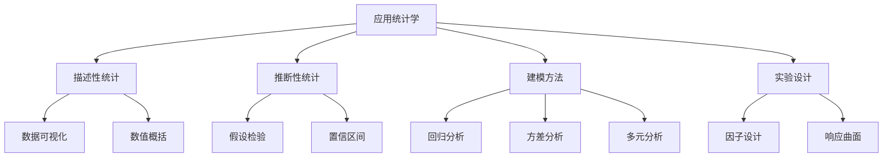
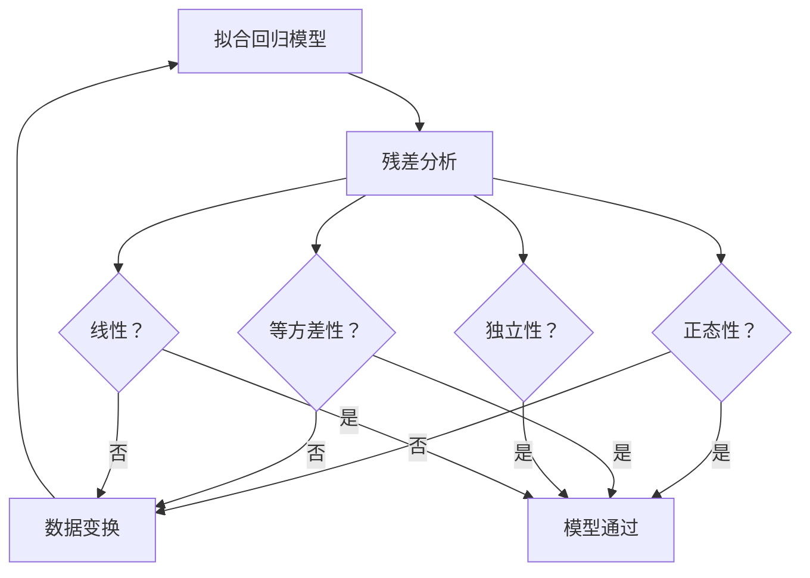

# 应用统计学概论 Applied Statistics Overview

> 应用统计学（Applied Statistics）是统计学的方法论与现实世界问题结合的分支，专注于使用统计工具收集、分析、解释数据并支持决策。它架起了统计理论和各领域实践之间的桥梁。

## 描述性统计 Descriptive Statistics

见 [[Statistics]] 中的详细内容。核心包括：

$$
\bar{x} = \frac{1}{n}\sum_{i=1}^n x_i, \quad s = \sqrt{\frac{1}{n-1}\sum_{i=1}^n (x_i - \bar{x})^2}
$$

### 数据汇总表

| 统计量 | 符号 | 稳健性 | 适用数据类型 |
|:------:|:----:|:------:|:-----------:|
| 均值 | $\bar{x}$ | 不稳健 | 对称连续数据 |
| 中位数 | $M$ | 稳健 | 偏态/有异常值 |
| 众数 | — | 稳健 | 分类数据 |
| 标准差 | $s$ | 不稳健 | 对称分布 |
| 四分位距 | $IQR$ | 稳健 | 任何分布 |
| 偏度 | $\gamma_1$ | — | 对称性度量 |
| 峰度 | $\gamma_2$ | — | 尾部厚度度量 |

## 回归分析 Regression Analysis

### 简单线性回归 Simple Linear Regression

模型形式：

$$
y_i = \beta_0 + \beta_1 x_i + \varepsilon_i
$$

参数估计（最小二乘法，OLS）：

$$
\hat{\beta}_1 = \frac{\sum(x_i - \bar{x})(y_i - \bar{y})}{\sum(x_i - \bar{x})^2}, \quad \hat{\beta}_0 = \bar{y} - \hat{\beta}_1\bar{x}
$$

**模型诊断**：

### 多元线性回归 Multiple Linear Regression

$$
y_i = \beta_0 + \beta_1 x_{i1} + \beta_2 x_{i2} + \cdots + \beta_p x_{ip} + \varepsilon_i
$$

矩阵形式：

$$
\mathbf{y} = \mathbf{X}\boldsymbol{\beta} + \boldsymbol{\varepsilon}
$$

OLS 解：

$$
\hat{\boldsymbol{\beta}} = (\mathbf{X}^T\mathbf{X})^{-1}\mathbf{X}^T\mathbf{y}
$$

### 回归诊断指标

| 诊断 | 统计量 | 标准/阈值 |
|:----:|:------:|:---------:|
| 多重共线性 | VIF（方差膨胀因子） | VIF > 10 表示严重 |
| 异常值 | Cook's D | $D_i > 4/n$ |
| 自相关 | Durbin-Watson | 接近 2 为无自相关 |
| 异方差 | Breusch-Pagan 检验 | $p > 0.05$ 接受同方差 |

### 逻辑回归 Logistic Regression

用于二分类问题的广义线性模型：

$$
\log\left(\frac{p}{1-p}\right) = \beta_0 + \beta_1 x_1 + \cdots + \beta_p x_p
$$

$$
p = \frac{1}{1 + e^{-(\beta_0 + \beta_1 x_1 + \cdots + \beta_p x_p)}}
$$

## 方差分析 Analysis of Variance (ANOVA)

### 单因素 ANOVA

将总变异分解为组间变异和组内变异：

$$
SS_{total} = SS_{between} + SS_{within}
$$

| 变异来源 | 平方和 | 自由度 | 均方 | F |
|:--------:|:------:|:------:|:----:|:-:|
| 组间 | $SS_B$ | $k-1$ | $MS_B$ | $MS_B/MS_W$ |
| 组内 | $SS_W$ | $N-k$ | $MS_W$ | |
| 总计 | $SS_T$ | $N-1$ | | |

### 双因素 ANOVA

包含两个因子 A 和 B 及其交互作用：

$$
y_{ijk} = \mu + \alpha_i + \beta_j + (\alpha\beta)_{ij} + \varepsilon_{ijk}
$$

| 效果 | 解释 |
|:----:|:----:|
| 主效应 A | 因子 A 各水平的差异 |
| 主效应 B | 因子 B 各水平的差异 |
| 交互作用 A×B | 因子 A 的效果受因子 B 水平影响 |

### 事后检验 Post-hoc Tests

| 方法 | 适用条件 | 特点 |
|:----:|:--------:|:----:|
| Tukey HSD | 所有组等样本量 | 控制家族错误率 |
| Bonferroni | 任意情况 | 最保守 |
| Scheffé | 复杂对比 | 最灵活 |
| Dunnett | 与对照组比较 | 检验功效高 |

## 实验设计 Design of Experiments (DOE)

### 基本原则

| 原则 | 含义 | 操作方式 |
|:----:|:----:|:--------:|
| 随机化（Randomization） | 消除系统偏差 | 随机分配处理 |
| 重复（Replication） | 估计误差方差 | 独立重复实验 |
| 区组化（Blocking） | 控制协变量影响 | 按无关因素分组 |
| 正交性（Orthogonality） | 独立估计各因子效应 | 正交表设计 |

### 常见设计类型

- **完全随机设计（CRD）**：最简单，处理完全随机分配
- **随机区组设计（RCBD）**：按区组控制干扰因素
- **析因设计（Factorial Design）**：同时研究多个因子的主效应和交互作用
- **嵌套设计（Nested Design）**：因子层级嵌套
- **响应曲面设计（RSM）**：优化响应变量

$$
2^k \text{析因设计：全因子 } 2^k \text{ 次试验}
$$

### 样本量计算

**均值检验**（双组，独立 t 检验）：

$$
n = \frac{(z_{\alpha/2} + z_\beta)^2 \cdot 2\sigma^2}{\delta^2}
$$

其中 $\delta$ 为可检测的最小效应量，$\sigma$ 为总体标准差。

**比例检验**：

$$
n = \frac{(z_{\alpha/2} + z_\beta)^2 [p_1(1-p_1) + p_2(1-p_2)]}{(p_1 - p_2)^2}
$$

## 统计质量控制 Statistical Quality Control (SQC)

### 控制图 Control Charts

**均值控制图（$\bar{X}$ 图）**：

$$
UCL = \bar{\bar{x}} + A_2 \bar{R}, \quad LCL = \bar{\bar{x}} - A_2 \bar{R}
$$

**极差控制图（R 图）**：

$$
UCL = D_4 \bar{R}, \quad LCL = D_3 \bar{R}
$$

其中 $A_2, D_3, D_4$ 为控制图常数（依样本量 $n$ 而定）。

### 过程能力分析

$$
C_p = \frac{USL - LSL}{6\sigma}
$$

$$
C_{pk} = \min\left(\frac{USL - \mu}{3\sigma}, \frac{\mu - LSL}{3\sigma}\right)
$$

| $C_p$ 值 | 过程能力等级 | 不合格品率 |
|:--------:|:-----------:|:----------:|
| < 1.0 | 不足 | > 0.27% |
| 1.0–1.33 | 一般 | 0.006%–0.27% |
| 1.33–1.67 | 良好 | < 0.006% |
| > 1.67 | 卓越 | 极低 |

## 多元分析 Multivariate Analysis

| 方法 | 目的 | 适用场景 |
|:----:|:----:|:--------:|
| 主成分分析（PCA） | 降维 | 多变量相关、指标合成 |
| 因子分析（FA） | 发现潜在结构 | 问卷设计、心理学 |
| 判别分析（LDA） | 分类 | 组别预测 |
| 聚类分析 | 分组 | 市场细分 |
| 典型相关分析（CCA） | 两组变量关联 | 多维关联分析 |
| MANOVA | 多响应变量比较 | 多指标组间比较 |

## 应用领域

| 领域 | 典型应用 | 统计方法 |
|:----:|:--------:|:--------:|
| 生物医学 | 临床试验、流行病学 | 生存分析、Logistic 回归 |
| 经济学 | 经济预测、政策评估 | 时间序列、VAR 模型 |
| 工程制造 | 质量控制、可靠性 | SPC、Weibull 分析 |
| 社会科学 | 调查分析、教育测量 | 因子分析、结构方程 |
| 环境科学 | 污染监测、生态模型 | 空间统计、时间序列 |
| 市场营销 | 客户分析、A/B 测试 | 聚类、联合分析 |

## 统计软件实现

| 任务 | R 函数 | Python 模块 | SAS 过程 |
|:----:|:------:|:-----------:|:--------:|
| t 检验 | t.test() | scipy.stats.ttest_ind | PROC TTEST |
| ANOVA | aov() | statsmodels.OLS | PROC GLM |
| 线性回归 | lm() | sklearn.linear_model | PROC REG |
| 逻辑回归 | glm(family=binomial) | statsmodels.Logit | PROC LOGISTIC |
| PCA | prcomp() | sklearn.decomposition.PCA | PROC PRINCOMP |
| 聚类 | kmeans() | sklearn.cluster.KMeans | PROC FASTCLUS |
| 控制图 | qcc 包 | qcc 包 | PROC SHEWHART |

## 相关条目

- [[Statistics]]
- [[DataMining]]
- [[MachineLearning]]
- [[NumericalAnalysis]]
- [[ProbabilityTheory]]
- [[Biostatistics]]
- [[Econometrics]]
- [[StatisticalQualityControl]]
- [[ExperimentalDesign]]
