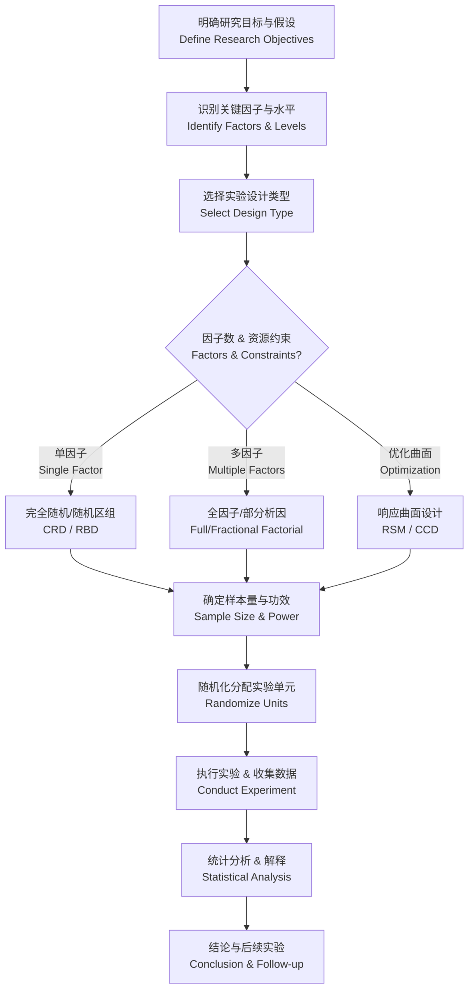

# 实验设计

## 概述

实验设计（Experimental Design）是应用统计学中关于如何规划、安排和执行实验以高效获取可靠数据并得出有效结论的核心方法论。良好的实验设计能够最大限度地减少系统误差与随机误差，提高统计推断（Statistical Inference）的精度和可信度。实验设计的三大基本原则由英国统计学家Ronald Fisher于20世纪初期系统提出，至今仍是科学研究与工业实验的基石。通过合理的实验设计，研究者可以在有限的资源约束下获得最大量的信息，识别关键影响因素及其交互作用（Interaction Effects），并为后续的优化与决策提供坚实的证据基础。

## 实验设计的三大基本原则

### 随机化（Randomization）

随机化是指将实验单元（Experimental Unit）随机分配至不同处理组（Treatment Group），以避免系统性偏差（Systematic Bias）。随机化确保处理效应（Treatment Effect）的估计无偏，是统计推断的基础。随机化可通过随机数表、计算机生成随机数或物理随机化（如抽签）实现。在临床试验中，随机化还能平衡已知和未知的混杂因素（Confounding Factors）。

### 重复（Replication）

重复是对同一处理的多次独立实验，用于估计实验误差（Experimental Error）并提高结果的可靠性。重复不同于重复测量（Repeated Measures）——重复指独立实验单元的重复，而重复测量是对同一单元的多观测。足够的重复次数能提高统计功效（Statistical Power），降低第二类错误（Type II Error）的概率。重复次数的确定需考虑效应量（Effect Size）、显著性水平（Significance Level）和期望功效。

### 区组化（Blocking）

区组化是将实验单元按照已知的变异来源（Source of Variation）分组（区组），使区组内单元尽可能同质（Homogeneous）。区组化可以有效控制已知干扰变量（Nuisance Variable）的影响，从而提高处理效应估计的精度。经典案例包括农田实验中将土地按肥力分区组，以及临床试验中将患者按年龄或疾病严重程度分层。

## 实验设计流程

## 关键概念对比

| 概念 | 定义 | 应用场景 |
|------|------|---------|
| 处理（Treatment） | 施加于实验单元的特定条件组合 | 所有实验均需明确定义处理 |
| 实验单元（Experimental Unit） | 独立接受处理的最小对象 | 动物实验中为单只动物 |
| 因素（Factor） | 可能影响响应的自变量 | 温度、剂量、材料类型等 |
| 水平（Level） | 因素的具体取值 | 温度为 20°C、30°C、40°C |
| 主效应（Main Effect） | 单因素对响应的平均影响 | 单因素方差分析的核心对象 |
| 交互作用（Interaction） | 因素间的协同或拮抗效应 | 多因素实验的分析重点 |
| 混淆（Confounding） | 效应无法区分的情况 | 部分析因设计的固有特征 |
| 响应变量（Response Variable） | 实验测量的结果变量 | 产量、强度、时间等 |

## 常用实验设计类型

### 完全随机设计（Completely Randomized Design, CRD）

实验单元完全随机分配到各处理组，适用于实验单元高度同质（Homogeneous）的情况。统计分析采用单因素方差分析（One-Way ANOVA）。其数学模型为：

$$Y_{ij} = \mu + \tau_i + \varepsilon_{ij}, \quad \varepsilon_{ij} \sim N(0, \sigma^2)$$

其中 $\mu$ 为总体均值，$\tau_i$ 为第 $i$ 个处理的效应，$\varepsilon_{ij}$ 为随机误差。CRD的优点是设计简单、自由度大；缺点是无法控制单元间的异质性。

### 随机区组设计（Randomized Block Design, RBD）

将实验单元按干扰因素分成区组（Block），在每个区组内随机分配处理。其模型为：

$$Y_{ij} = \mu + \tau_i + \beta_j + \varepsilon_{ij}$$

其中 $\beta_j$ 为第 $j$ 个区组的效应。RBD比CRD更高效，能控制区组间变异。当区组效应显著时，RBD的统计功效高于CRD。若每个区组内仅包含一个完整重复，则称为完全区组设计（Randomized Complete Block Design, RCBD）。

### 拉丁方设计（Latin Square Design）

同时控制两个干扰因素的行（Row）和列（Column）两个方向的区组化设计。要求处理数等于行区组数和列区组数。例如 $3 \times 3$ 拉丁方：

$$\begin{matrix}
A & B & C \\
B & C & A \\
C & A & B
\end{matrix}$$

其数学模型包含行效应、列效应和处理效应，相比RBD能多控制一个干扰源。

## 析因设计

### $2^k$ 析因设计

最简单的多因素设计，每个因子取高低两个水平。可以估计所有主效应和交互作用效应。例如 $2^3$ 设计包含 8 个处理组合。主效应和交互作用的计算基于正交对比（Orthogonal Contrast），分析结果可绘制主效应图和交互作用图进行可视化。

### 部分析因设计（Fractional Factorial Design）

当因子数较多时，只进行全部处理组合的一个子集。通过混淆（Aliasing）牺牲高阶交互作用以换取实验规模的大幅缩减。例如 $2^{5-2}$ 设计将 32 个处理减少到 8 个。分辨率（Resolution）描述混淆模式：
- 分辨率 III：主效应与两因子交互作用混淆
- 分辨率 IV：主效应清晰，两因子交互作用相互混淆
- 分辨率 V：主效应和两因子交互作用清晰

### Plackett-Burman设计

用于筛选实验（Screening Experiment）的两水平部分设计，处理数 $N$ 为 4 的倍数。可高效估计 $N-1$ 个主效应，但所有交互作用相互混淆，适合因子数较多时的初步筛选。

## 响应曲面法（Response Surface Methodology, RSM）

### 中心复合设计（Central Composite Design, CCD）

由析因点（Factorial Points）、轴向点（Axial/Star Points）和中心点（Center Points）组成，用于拟合二阶响应曲面模型：

$$Y = \beta_0 + \sum_{i=1}^k \beta_i x_i + \sum_{i=1}^k \beta_{ii} x_i^2 + \sum_{i<j} \sum \beta_{ij} x_i x_j + \varepsilon$$

CCD的可旋转性（Rotatability）确保预测方差在距中心等距处相等。选择合适的轴向距离 $\alpha$ 可满足可旋转性或正交性要求。

### Box-Behnken设计

球形设计（Spherical Design），每个因子取三个水平，不需要轴向点。常用于 3-7 个因子的优化实验。Box-Behnken设计的优点是所需实验次数少于CCD，且不会出现极端水平的组合，适用于因子水平边界受限的情况。

## 方差分析（ANOVA）

### 单因素方差分析

比较单个因子的多个水平均值是否存在显著差异。检验假设：$H_0: \mu_1 = \mu_2 = \cdots = \mu_k$。F统计量为：

$$F = \frac{MS_{treatment}}{MS_{error}} \sim F_{(k-1, N-k)}$$

当 $F$ 大于临界值时拒绝 $H_0$，表明至少有一个处理均值与其他不同。多重比较（如Tukey HSD、Bonferroni校正）用于进一步确定具体差异。

### 双因素方差分析

同时考察两个因子及其交互作用对响应变量的影响。模型包含主效应项和交互效应项。平方和分解为：

$$SS_{total} = SS_A + SS_B + SS_{AB} + SS_{error}$$

交互作用是否显著决定了后续分析策略——交互显著时需分析简单主效应（Simple Main Effects），而非仅关注主效应。

### 交互作用效应

当一个因子在不同水平下另一因子的效应不同时，即存在交互作用（Interaction Effect）。交互作用是析因设计的核心分析对象。交互作用的可视化通常采用交互作用图（Interaction Plot），若两条线不平行则提示存在交互作用。

## 样本量确定与功效分析

### 样本量计算

基于效应量（Effect Size）、显著性水平 $\alpha$ 和检验功效 $1-\beta$ 计算所需的最小样本量。常见效应量指标包括：

$$d = \frac{\mu_1 - \mu_2}{\sigma} \quad \text{(Cohen's d)}$$

$$f = \sqrt{\frac{\eta^2}{1 - \eta^2}} \quad \text{(Cohen's f)}$$

$$f^2 = \frac{R^2}{1 - R^2} \quad \text{(回归效应量)}$$

### 功效分析（Power Analysis）

在给定样本量和效应量的条件下计算统计检验的功效，用于实验规划。功效分析需考虑：
- 显著性水平 $\alpha$ 通常设为 0.05
- 功效通常要求达到 0.80 以上
- 效应量的确定可基于文献综述、预实验或最小实际显著差异（Minimum Practically Significant Difference）

G*Power 是常用的功效分析软件，支持 t 检验、F 检验、$\chi^2$ 检验等多种检验方法的功效计算。

## 混淆与别名结构（Confounding and Aliasing）

在部分析因设计中，某些效应无法区分，称为混淆。别名结构（Alias Structure）描述了哪些效应彼此混淆。合理设计别名结构是部分析因设计的关键。例如 $2^{3-1}$ 设计中，因子 $C = AB$，则主效应 $C$ 与两因子交互 $AB$ 混淆：$l_C = l_{AB}$。设计者应根据专业知识将高阶交互归于误差，确保低阶效应可估计。

## 协方差分析（ANCOVA）

在方差分析中纳入连续型协变量（Covariate），控制其影响后比较处理组差异。模型为：

$$Y_{ij} = \mu + \tau_i + \beta(X_{ij} - \bar{X}) + \varepsilon_{ij}$$

ANCOVA可降低误差方差，提高检验功效，但需满足回归平行性假设（Homogeneity of Regression Slopes）。

## 随机效应与混合效应模型

当因子的水平是随机抽样而非固定选择时，需采用随机效应模型（Random Effects Model）或混合效应模型（Mixed Effects Model）。方差分量（Variance Components）的估计是随机效应模型的核心目标，常用方法包括矩估计（Method of Moments）、最大似然估计（MLE）和限制性最大似然估计（REML）。

## 裂区设计（Split-Plot Design）

裂区设计适用于包含难以随机化或实施大范围变更的因子的实验。例如，在工业实验中，温度可能难以频繁调整（作为整区因子 Whole-Plot Factor），而添加剂易于更改（作为子区因子 Sub-Plot Factor）。裂区设计有两类误差项：整区误差和子区误差，分析时需使用相应的误差项检验各因子效应。裂区设计的统计模型为：

$$Y_{ijk} = \mu + \alpha_i + \beta_{j(i)} + \gamma_k + (\alpha\gamma)_{ik} + \varepsilon_{ijk}$$

其中 $\alpha_i$ 为整区因子效应，$\beta_{j(i)}$ 为整区内区组效应，$\gamma_k$ 为子区因子效应。裂区设计在农业（大区施肥料、小区施品种）、工业（批次-批次内工艺参数）和生物医学（动物-组织样本）实验中应用广泛。

## 交叉设计（Crossover Design）

交叉设计中，每个实验单元依次接受多种处理。两阶段交叉设计（2×2 Crossover）的模型包括处理效应、周期效应（Period Effect）和携带效应（Carryover Effect）。交叉设计适用于慢性病药物临床试验（如高血压、哮喘），因为患者可作为自身对照，减少个体间变异。其优势在于所需样本量较小，但需保证洗脱期（Washout Period）足够长以消除携带效应。

## 正交实验设计（Taguchi Methods）

田口方法（Taguchi Methods）强调使用正交表（Orthogonal Array）安排实验，通过信噪比（Signal-to-Noise Ratio, SN Ratio）优化产品质量。常用信噪比指标包括：
- 望目特性：$SN = 10 \log_{10}(\bar{y}^2 / s^2)$
- 望小特性：$SN = -10 \log_{10}(\frac{1}{n}\sum y_i^2)$
- 望大特性：$SN = -10 \log_{10}(\frac{1}{n}\sum 1/y_i^2)$

田口方法在制造业（参数设计 Parameter Design 和容差设计 Tolerance Design）中应用广泛，但部分统计学家对其交互作用忽视和数据驱动的分析方法持批评态度。

## 非参数与重抽样方法

当实验数据不满足正态假设或方差齐性时，可采用非参数替代方法：
- **Kruskal-Wallis检验**：单因素ANOVA的非参数替代
- **Friedman检验**：随机区组设计的非参数替代
- **置换检验（Permutation Test）**：通过随机重排处理标签构建经验分布，无需分布假设
- **自助法（Bootstrap）**：从样本中有放回重抽样估计统计量分布，用于构建置信区间和假设检验

### 多重比较校正

多重比较（Multiple Comparisons）是实验设计中常见的问题。多重比较校正方法包括：
- **Bonferroni校正**：$\alpha_{adj} = \alpha / m$，其中 $m$ 为比较次数，最保守的方法
- **Holm-Bonferroni方法**：逐步向下校正，比Bonferroni更高效
- **Tukey HSD（Honestly Significant Difference）**：用于所有成对比较
- **Dunnett检验**：适用于多个处理与对照的比较
- **False Discovery Rate（FDR）**：Benjamini-Hochberg方法控制错误发现率，在高通量实验中广泛应用

## 实验设计软件比较

| 软件 | 特点 | 适用场景 |
|------|------|---------|
| Minitab | DOE模块全面，操作简便 | 工业实验，教学 |
| JMP | 交互式DOE，定制设计灵活 | 研发实验，响应曲面 |
| Design-Expert | 专注DOE和RSM，可视化优秀 | 工艺优化，配方设计 |
| R（DoE.base, FrF2） | 免费开源，可编程 | 高级分析，学术研究 |
| SAS（PROC GLM, PROC MIXED） | 企业级功能，混合模型优势 | 临床试验，医药研究 |

## 实验设计的常见误区

正确的实验设计需避免以下常见误区：
1. 忽视随机化：非随机分配导致隐藏偏倚
2. 重复不足：样本量过小导致功效不足，有意义的效应无法检测
3. 混淆因子未控制：遗漏重要干扰变量导致错误结论
4. 过度依赖事后分析：合适的实验设计应在数据收集前完整规划
5. 忽略交互作用：单因子实验无法揭示因子间的协同或拮抗效应
6. 伪重复（Pseudoreplication）：将重复测量误认为独立重复
7. 区组选择不当：区组内变异过大削弱区组化的收益

## 相关条目

[[Probability]], [[DataScience]], [[MachineLearning]], [[StatisticalModeling]], [[BayesianStatistics]]
