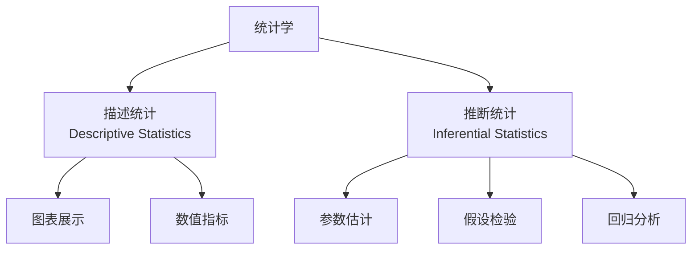

# 统计学 Statistics

> 统计学（Statistics）是关于数据的收集、整理、分析、解释与呈现的科学。它提供了一套从不确定性中提炼信息的严谨方法论，是现代科学研究、商业决策和政策制定的基础工具。

## 学科分类

## 描述统计 Descriptive Statistics

### 集中趋势度量

| 指标 | 定义 | 适用场景 |
|:----:|:----:|:--------:|
| 均值（Mean） | $\bar{x} = \frac{1}{n}\sum_{i=1}^n x_i$ | 对称分布、无异常值 |
| 中位数（Median） | 排序后中间值 | 偏态分布、有异常值 |
| 众数（Mode） | 出现频次最高值 | 分类数据 |

### 离散程度度量

$$
\text{方差：} s^2 = \frac{1}{n-1}\sum_{i=1}^n (x_i - \bar{x})^2
$$

$$
\text{标准差：} s = \sqrt{s^2}
$$

$$
\text{变异系数：} CV = \frac{s}{\bar{x}} \times 100\%
$$

| 度量 | 公式 | 说明 |
|:----:|:----:|:----:|
| 极差 | $R = \max - \min$ | 最简单的变异度量 |
| 四分位距 | $IQR = Q_3 - Q_1$ | 稳健的离散度 |
| 标准差 | $s$ | 最常用的离散度 |

## 概率理论 Probability Theory

### 基本概率法则

- **加法法则**：$P(A \cup B) = P(A) + P(B) - P(A \cap B)$
- **乘法法则**：$P(A \cap B) = P(A)P(B|A)$
- **全概率公式**：$P(B) = \sum_i P(B|A_i)P(A_i)$
- **贝叶斯定理**：$P(A_i|B) = \frac{P(B|A_i)P(A_i)}{P(B)}$

### 常用概率分布

| 分布 | 类型 | 参数 | 均值 | 方差 | 应用 |
|:----:|:----:|:----:|:----:|:----:|:----:|
| 二项分布 | 离散 | $n, p$ | $np$ | $np(1-p)$ | 成功次数 |
| 泊松分布 | 离散 | $\lambda$ | $\lambda$ | $\lambda$ | 事件计数 |
| 正态分布 | 连续 | $\mu, \sigma$ | $\mu$ | $\sigma^2$ | 自然现象 |
| t 分布 | 连续 | $\nu$ | $0$ | $\frac{\nu}{\nu-2}$ | 小样本 |
| F 分布 | 连续 | $d_1, d_2$ | $\frac{d_2}{d_2-2}$ | — | 方差比较 |
| 卡方分布 | 连续 | $k$ | $k$ | $2k$ | 拟合优度 |

正态分布的概率密度函数（PDF）：

$$
f(x) = \frac{1}{\sigma\sqrt{2\pi}} \exp\left(-\frac{(x-\mu)^2}{2\sigma^2}\right)
$$

## 抽样分布 Sampling Distributions

### 中心极限定理（Central Limit Theorem）

对于独立同分布的随机变量 $X_1, \ldots, X_n$，当 $n$ 足够大时：

$$
\bar{X} \sim N\left(\mu, \frac{\sigma^2}{n}\right)
$$

### 均值的标准误

$$
SE(\bar{x}) = \frac{\sigma}{\sqrt{n}}
$$

当总体标准差 $\sigma$ 未知时，用样本标准差 $s$ 代替：

$$
SE(\bar{x}) = \frac{s}{\sqrt{n}}
$$

## 参数估计 Parameter Estimation

### 点估计

- 矩估计（Method of Moments）
- 极大似然估计（Maximum Likelihood Estimation, MLE）

### 区间估计

总体均值的置信区间（$\sigma$ 已知）：

$$
\bar{x} \pm z_{\alpha/2} \cdot \frac{\sigma}{\sqrt{n}}
$$

总体均值的置信区间（$\sigma$ 未知）：

$$
\bar{x} \pm t_{\alpha/2, n-1} \cdot \frac{s}{\sqrt{n}}
$$

## 假设检验 Hypothesis Testing

### 检验框架

| 步骤 | 内容 |
|:----:|:----:|
| 1 | 设立原假设 $H_0$ 与备择假设 $H_1$ |
| 2 | 选择显著性水平 $\alpha$ |
| 3 | 计算检验统计量 |
| 4 | 确定 p 值 |
| 5 | 做出决策：若 $p < \alpha$，拒绝 $H_0$ |

### 两类错误

| | 不拒绝 $H_0$ | 拒绝 $H_0$ |
|:-:|:------------:|:----------:|
| $H_0$ 为真 | 正确（$1-\alpha$） | 第一类错误（$\alpha$） |
| $H_0$ 为假 | 第二类错误（$\beta$） | 正确（$1-\beta$，即统计功效） |

### 常见检验方法

| 检验名称 | 用途 | 检验统计量 |
|:--------:|:----:|:----------:|
| 单样本 t 检验 | 单组均值与已知值比较 | $t = \frac{\bar{x} - \mu_0}{s/\sqrt{n}}$ |
| 独立样本 t 检验 | 两组均值比较 | $t = \frac{\bar{x}_1 - \bar{x}_2}{\sqrt{\frac{s_1^2}{n_1} + \frac{s_2^2}{n_2}}}$ |
| 配对 t 检验 | 配对数据均值差 | $t = \frac{\bar{d}}{s_d/\sqrt{n}}$ |
| 卡方检验 | 分类变量独立性 | $\chi^2 = \sum \frac{(O-E)^2}{E}$ |
| F 检验 | 方差齐性/ANOVA | $F = \frac{MS_{between}}{MS_{within}}$ |

## 回归分析 Regression Analysis

### 简单线性回归

$$
y_i = \beta_0 + \beta_1 x_i + \varepsilon_i, \quad \varepsilon_i \sim N(0, \sigma^2)
$$

$$
\hat{\beta}_1 = \frac{\sum(x_i - \bar{x})(y_i - \bar{y})}{\sum(x_i - \bar{x})^2}
$$

### 决定系数

$$
R^2 = 1 - \frac{SS_{res}}{SS_{tot}} = \frac{SS_{reg}}{SS_{tot}}
$$

### 方差分析表 ANOVA Table

| 变异来源 | 平方和 | 自由度 | 均方 | F 值 |
|:--------:|:------:|:------:|:----:|:----:|
| 回归 | $SS_{reg}$ | $k$ | $MS_{reg}$ | $MS_{reg}/MS_{res}$ |
| 残差 | $SS_{res}$ | $n-k-1$ | $MS_{res}$ | |
| 总计 | $SS_{tot}$ | $n-1$ | | |

## 统计软件与工具

| 软件/语言 | 特点 | 适用领域 |
|:---------:|:----:|:--------:|
| R | 开源、包丰富、可视化优秀 | 学术研究、生物统计 |
| Python（SciPy, StatsModels） | 通用编程、ML 集成 | 数据科学、工程 |
| SPSS | 图形界面、操作便捷 | 社会科学、医学 |
| SAS | 企业级、合规性高 | 制药、金融 |
| Stata | 计量经济专项 | 经济学、政治学 |
| JMP | 交互式探索 | 六西格玛、质量工程 |

## 相关条目

- [[ProbabilityTheory]]
- [[DataScience]]
- [[MachineLearning]]
- [[Econometrics]]
- [[Biostatistics]]
- [[AppliedStatisticsOverview]]
- [[BayesianInference]]
