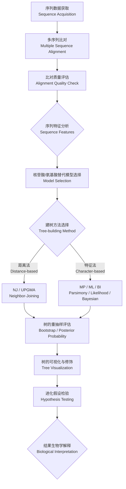

# 系统发育学

## 概述

系统发育学（Phylogenetics）研究物种、基因或蛋白质之间的进化关系（Evolutionary Relationship），通过构建系统发育树（Phylogenetic Tree）来揭示生物演化历史。它是进化生物学（Evolutionary Biology）、生物信息学（Bioinformatics）和比较基因组学（Comparative Genomics）的核心工具。系统发育分析基于分子序列（DNA/RNA/蛋白质）或形态学特征数据，利用数学模型和统计推断重建祖-裔关系。随着高通量测序技术的普及，系统发育学已成为病毒追踪（如 SARS-CoV-2溯源）、药物靶点发现、生态多样性研究和人类起源探索中不可或缺的技术手段。

## 系统发育树的基本概念

### 树的拓扑结构

- **树根（Root）**：表示所有序列的共同祖先（Most Recent Common Ancestor, MRCA），赋予进化方向
- **节点（Node）**：内部节点（Internal Node）代表祖先类群，叶节点（Leaf/Terminal Node）代表现有类群
- **分支（Branch/Edge）**：连接节点的线段，长度常表示进化距离（Evolutionary Distance）或时间
- **有根树（Rooted Tree）vs 无根树（Unrooted Tree）**：有根树具有进化方向，无根树仅表示亲疏关系
- **分支长度（Branch Length）**：代表进化改变量，单位为每个位点的替代数（Substitutions per Site）

### 单系群、并系群与多系群

- **单系群（Monophyly）**：包含共同祖先及其所有后代，是分类学中唯一被认可的类群定义
- **并系群（Paraphyly）**：包含共同祖先及其部分后代（如爬行纲相对于鸟类）
- **多系群（Polyphyly）**：不包含最近共同祖先的群体，基于趋同进化（Convergent Evolution）特征

## 系统发育分析流程

## 距离法

### UPGMA（Unweighted Pair Group Method with Arithmetic Mean）

假设恒定进化速率（分子钟，Molecular Clock），基于遗传距离矩阵（Genetic Distance Matrix），采用算术平均聚类算法。简单但假设严格，当进化速率不均时易产生错误拓扑。UPGMA 生成的树为有根树，分支长度代表进化时间而非替代数。在实践中，UPGMA 适用于关系密切、进化速率均匀的序列，如群体遗传学（Population Genetics）分析。

### 邻接法（Neighbor-Joining, NJ）

不假设恒定进化速率，通过最小化总分支长度（Minimum Evolution Criterion）构建树。计算效率高，适用于大数据集。NJ 算法每次合并使总树长最小的最近邻对，最终生成无根树。NJ 树的支长估计较为准确，但不同基因或不同位点对树形的贡献权重相同。NJ 的改进版本包括 BIONJ 和 FastME。

## 基于特征的方法

### 最大简约法（Maximum Parsimony, MP）

寻找需要最少进化事件（突变、替换）的树。适用于进化率较低、序列分歧较小的数据集。MP 的假设是简单性偏好（Parsimony Principle），即最简解释最可能为真。MP 的局限性在于：
- 长枝吸引（Long Branch Attraction, LBA）：当两支较长分支连接到一起时，MP 可能错误将其聚为一支
- 同塑性（Homoplasy）：平行进化（Parallel Evolution）和逆向突变（Reverse Mutation）导致信号噪音

### 最大似然法（Maximum Likelihood, ML）

在给定的替代模型下，寻找使观测数据概率最大的树。统计理论基础扎实，计算强度大。ML 的评分函数为：

$$L(\text{tree}, \text{model} \mid \text{data}) = P(\text{data} \mid \text{tree}, \text{model})$$

ML 的优点是能够利用完整的替代模型信息，对分支长度的估计为无偏估计。通过似然比检验（Likelihood Ratio Test, LRT）可比较不同进化假设。主要软件包括 RAxML-NG、IQ-TREE 和 PhyML。对于大数据集，ML 通常在可接受时间内获得高精度树形。

### 贝叶斯推断（Bayesian Inference, BI）

利用马尔可夫链蒙特卡洛（Markov Chain Monte Carlo, MCMC）方法对树空间进行采样，估计后验概率分布（Posterior Probability Distribution）。贝叶斯方法可以整合先验信息（Prior Information），其核心公式为贝叶斯定理：

$$P(\text{tree} \mid \text{data}) = \frac{P(\text{data} \mid \text{tree}) \times P(\text{tree})}{P(\text{data})}$$

- **MCMC 策略**：MrBayes、BEAST 等软件使用 Metropolis-Hastings 算法在树空间随机游走
- **后验概率（Posterior Probability, PP）**：给定数据下拓扑结构的后验支持度
- **收敛诊断**：通过有效样本量（Effective Sample Size, ESS $\ge 200$）和潜在比例缩减因子（Potential Scale Reduction Factor, PSRF $\approx 1.0$）判断 MCMC 收敛
- **老化（Burn-in）**：舍弃收敛前的样本，通常丢弃前 25% 的 MCMC 迭代

## 替代模型

### 核苷酸替代模型

- **Jukes-Cantor（JC69）**：最简单的模型，所有替代率相等
- **Kimura 2-parameter（K80）**：区分转换（Transition, Ti）和颠换（Transversion, Tv）速率
- **Felsenstein 81（F81）**：考虑碱基频率不等
- **Hasegawa-Kishino-Yano（HKY85）**：结合 K80和 F81，区分 Ti/Tv 率和碱基频率
- **General Time Reversible（GTR）**：最通用的可逆模型，6个率参数 + 碱基频率参数
- **模型选择**：通过似然比检验（LRT）、赤池信息准则（Akaike Information Criterion, AIC）、贝叶斯信息准则（Bayesian Information Criterion, BIC）选择最优模型

位点间速率变异（Rate Heterogeneity）用 $\Gamma$ 分布（离散伽马分布，通常 4 类）或比例不变位点（Proportion of Invariant Sites, $p_{inv}$）建模。

### 氨基酸替代模型

- **PAM 矩阵（Point Accepted Mutation）**：基于全球蛋白质序列比对的经验替代矩阵
- **BLOSUM 矩阵（BLOcks SUbstitution Matrix）**：基于局部比对的经验替代矩阵
- **JTT、WAG、LG**：常用的经验氨基酸替代模型，LG 模型是目前蛋白质系统发育分析的推荐模型
- **跨膜蛋白建议使用特定模型（如 JTT-TM）**，考虑氨基酸在跨膜区域的不同替代偏好

### 密码子替代模型

密码子模型（Codon Model）同时考虑同义替代（Synonymous Substitution, $dS$）和非同义替代（Nonsynonymous Substitution, $dN$），其比值 $\omega = dN/dS$ 是选择压力（Selection Pressure）的重要指标：

$$\omega < 1 \text{ 纯化选择}, \quad \omega = 1 \text{ 中性进化}, \quad \omega > 1 \text{ 正选择}$$

## 树评估

### 自举法（Bootstrap）

从原始数据中重抽样（通常 100-1000 次），构建多个树，计算各分支在重抽样树中出现的频率。自举支持率（Bootstrap Support, BS）$\ge 70\%$ 通常被认为可信，$\ge 95\%$ 为高支持度。快速自举（UFBoot, UltraFast Bootstrap）是 IQ-TREE 中实现的高效自举方法，大幅缩短计算时间。

### 后验概率

贝叶斯分析中分支出现的概率。$\ge 0.95$ 被认为具有统计学支持。后验概率相比自举法往往数值更高，但可能高估支持度（尤其是模型错误指定时）。SH-aLRT（Shimodaira-Hasegawa approximate Likelihood Ratio Test）是另一种常用的分支支持度估计方法。

## 分子钟（Molecular Clock）

### 严格分子钟（Strict Molecular Clock）

所有谱系的进化速率恒定，进化距离与分歧时间成正比：

$$d = 2\mu t$$

其中 $d$ 为遗传距离，$\mu$ 为每单位时间替代率，$t$ 为分歧时间。严格分子钟适用于亲缘关系较近的类群（如种群水平分析）。

### 宽松分子钟（Relaxed Molecular Clock）

允许不同谱系进化速率不同，使用对数正态分布（Lognormal Distribution）或指数分布模型描述速率变异。主要模型包括：
- 非相关对数正态模型（Uncorrelated Lognormal, UCLN）
- 非相关指数模型（Uncorrelated Exponential, UCED）
- 自相关速率模型（Autocorrelated Rates）：相邻分支速率相似，适用于物种水平以上的分析

## 主要软件比较

| 软件 | 方法 | 特点 |
|------|------|------|
| RAxML-NG | ML | 支持大数据集，多线程并行 |
| MrBayes | BI | 灵活的贝叶斯分析，广泛应用 |
| BEAST2 | BI | 时间标定树，分子钟分析 |
| IQ-TREE | ML | 自动模型选择（ModelFinder），UFBoot |
| MEGA | ML/MP/NJ | 图形界面友好，教学常用 |
| PAUP* | MP/ML/Distance | 经典软件，功能全面 |
| PhyloBayes | BI | 适用于大规模基因组数据，支持 CAT 模型 |

## 基因树与物种树的差异

基因树（Gene Tree）和物种树（Species Tree）之间的差异是系统发育分析中的一个核心理论问题。由于谱系分选不完整（Incomplete Lineage Sorting, ILS）、基因重复与丢失（Gene Duplication and Loss, GDL）和水平基因转移（Horizontal Gene Transfer, HGT），单个基因的树形可能与真实的物种树不一致。ILS 在快速连续分化事件中尤为常见，是人类和黑猩猩分化中的已知现象。解决基因树-物种树不一致的方法包括：
- **串联法（Concatenation）**：将所有基因连接成一个超矩阵建树，损失单个基因信息
- **一致法（Consensus）**：分别构建基因树，再通过多数一致规则合并
- **溯祖法（Coalescent-based Methods）**：如 ASTRAL、*BEAST，使用多物种溯祖模型（Multi-species Coalescent, MSC）估计物种树
- **贝叶斯联合估计**：同时在模型中估计基因树和物种树

## 系统发育网络

当进化历史涉及网状进化事件（如杂交 Hybridization、基因渗入 Introgression、HGT）时，树形结构不足以描述物种关系，需使用系统发育网络（Phylogenetic Network）。网络中的节点可有两个以上的祖先（Reticulation Node）。算法包括 Neighbor-Net（基于距离的网状网络）和 PhyloNet、PhyloNetworks（基于最大似然的网状结构推断）。

## 分歧时间估计

分子钟与化石校正（Fossil Calibration）结合可估计类群分歧时间。常用方法包括：
- **非参数速率平滑（Non-parametric Rate Smoothing, NPRS）**：通过罚似然（Penalized Likelihood）平滑速率变异
- **贝叶斯松散钟（Bayesian Relaxed Clock）**：如 BEAST2中的 UCLN 模型
- **化石校正先验**：使用对数正态分布（Lognormal）或均匀分布（Uniform）描述化石约束
- **MCMCTree（PAML 套件）**：近似似然法进行时间和速率估算

## 系统发育比较方法

系统发育比较方法（Phylogenetic Comparative Methods, PCMs）利用物种树的拓扑结构和分支长度来解释性状进化。常用方法包括：
- **系统发育独立对比（Phylogenetic Independent Contrasts, PICs）**：消除系统发育非独立性后的性状相关性分析
- **系统发育广义最小二乘（Phylogenetic Generalized Least Squares, PGLS）**：将系统发育信号纳入回归模型
- **Pagel's λ**：测量系统发育信号（Phylogenetic Signal）强度的指标
- **祖先状态重建（Ancestral State Reconstruction）**：使用最大似然或贝叶斯方法推断祖先性状
- **进化速率异质性（Rate Heterogeneity Across Lineages）**：通过 REV 模型或局部分子钟建模

PCMs 的常用软件包括 phytools（R 包）、geiger（R 包）、BayesTraits 和 Diversitree（R 包）。

## 数据获取与建树管线

现代系统发育分析的标准数据流程包括：
1. **同源序列获取**：NCBI GenBank、Ensembl、UniProt 数据库检索
2. **多序列比对**：MAFFT（快速）、MUSCLE（准确）、PRANK（考虑插入缺失的进化历史）
3. **比对裁剪（Trimming）**：使用 Gblocks、trimAl、BMGE 去除不确定的比对区域
4. **模型选择**：ModelFinder（IQ-TREE）、jModelTest 2（核苷酸）、ProtTest 3（氨基酸）
5. **树的构建与搜索**：RAxML-NG、IQ-TREE、MrBayes
6. **替代模型检验**：SH-test、AU-test（Approximately Unbiased Test）比较不同拓扑假设
7. **树的可视化**：FigTree（图形界面）、ggtree（R 包，完美整合 ggplot2）、iTOL（在线交互式系统发育树注释）

## 系统发育学的前沿方向

系统发育学的研究前沿包括：
- **系统发育基因组学（Phylogenomics）**：利用全基因组数据构建高分辨率物种树
- **宏条形码（Metabarcoding）和环境 DNA（eDNA）系统发育**：从环境样本中扩增多条码区域进行群落系统发育分析
- **病毒系统动力学（Phylodynamics）**：结合系统发育学与流行病学，追踪病毒传播、突变和种群动态（如 SARS-CoV-2）
- **微生物组系统发育（Microbiome Phylogenetics）**：基于16S rRNA 基因的微生物群落多样性和进化分析
- **整合系统发育学（Integrated Phylogenetics）**：联合形态学、分子、行为等多维数据构建总证据树（Total Evidence Tree）

## 相关条目

[[ComputationalBiology]], [[Genetics]], [[DataScience]], [[Genomics]], [[MolecularBiology]], [[EvolutionaryBiology]]
