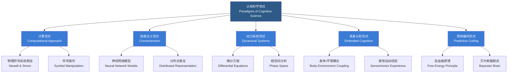

# 认知科学方法论

## 一、概述

认知科学方法论（Cognitive Science Methodology）探讨研究心智与认知过程的多元范式与方法体系。认知科学本质上是跨学科的（Interdisciplinary），其方法论融合了实验心理学（Experimental Psychology）、认知神经科学（Cognitive Neuroscience）、计算机科学（Computer Science）、语言学（Linguistics）和心灵哲学（Philosophy of Mind）等学科的研究工具与视角。核心挑战在于如何跨越不同分析层次——从神经机制到认知过程再到行为表现——实现多层次整合理解。三角测量（Triangulation）策略——即运用多种独立方法研究同一问题——是实现跨层次整合的关键方法论原则。

## 二、认知科学研究范式

### 2.1 范式总览

### 2.2 各范式对比

| 范式 | 核心假设 | 代表学者 | 核心方法 | 局限性 |
|------|----------|----------|----------|--------|
| 计算范式 (Computational) | 心智是信息处理系统 | Newell, Simon, Fodor | 符号 AI 建模、反应时实验 | 忽视身体与环境 |
| 连接主义 (Connectionism) | 认知源于分布式并行处理 | Rumelhart, McClelland | 神经网络模拟、误差分析 | 难以建模高层推理 |
| 动力系统 (Dynamical Systems) | 认知是连续的动态过程 | Kelso, Thelen, Smith | 微分方程建模、吸引子分析 | 数学复杂性高 |
| 具身认知 (Embodied Cognition) | 认知依赖身体与交互 | Varela, Thompson, Clark | 机器人实验、生态学范式 | 实验控制困难 |
| 预测编码 (Predictive Coding) | 大脑是预测机器 | Friston, Rao, Ballard | 贝叶斯建模、fMRI 验证 | 神经机制证据有限 |

### 2.3 计算范式（Computational Approach）

将心智视为信息处理系统（Information Processing System），关注认知过程在算法层次（Algorithmic Level）和实现层次（Implementation Level）的表征。物理符号系统假设（Physical Symbol System Hypothesis, Newell & Simon）认为物理符号系统具有产生智能行为的充分必要条件。认知科学中的经典计算模型包括 SOAR（State, Operator, And Result）和 ACT-R（Adaptive Control of Thought—Rational）等综合认知架构。

### 2.4 连接主义范式（Connectionism）

认知源于大量简单处理单元（人工神经元）构成的网络中的分布式并行处理。核心概念包括：

- **分布式表征（Distributed Representation）**：信息编码为网络中多个单元的激活模式
- **并行分布式处理（Parallel Distributed Processing, PDP）**：Rumelhart 和 McClelland 的两卷本奠基著作
- **学习规则**：Hebbian 学习（"firing together, wiring together"）、反向传播（Backpropagation）、对比散度（Contrastive Divergence）
- **亚符号加工（Subsymbolic Processing）**：不需要显式符号操作的高级认知能力涌现

### 2.5 动力系统范式（Dynamical Systems Approach）

认知不是离散的符号操作序列，而是认知系统与环境之间连续的、时间依赖的耦合。关键概念包括：

- **状态空间与轨迹（State Space & Trajectory）**：认知系统状态随时间演化
- **吸引子（Attractor）**：系统演化趋向的稳定状态，用以解释知觉分类和记忆检索
- **分岔（Bifurcation）**：参数变化导致的系统行为质变，用以解释认知发展中的阶段转变
- 用微分方程（Differential Equations）而非离散计算规则描述认知过程

### 2.6 具身认知范式（Embodied Cognition）

认知不仅发生在大脑中，还涉及身体结构（Body Morphology）、感觉运动经验（Sensorimotor Experience）以及与环境的具体交互（Environment Interaction）。核心主张：

- **离身认知困境**：传统认知科学将心智视为脱离身体的抽象信息处理器
- **镜像神经元（Mirror Neurons）**：动作执行与观察时均激活的神经元，为具身模仿提供神经基础
- **延展心智假说（Extended Mind Hypothesis, Clark & Chalmers）**：外部工具（笔记本、手机）可视为心智的延伸部分

### 2.7 预测编码与自由能原理

预测编码（Predictive Coding）是近年来最具整合力的认知科学理论框架：

$$F = -\ln p(s) + D_{KL}[q(\theta) \| p(\theta|s)]$$

其中 $F$ 为自由能（Free Energy），$s$ 为感觉输入，$\theta$ 为模型参数。大脑被视为一个贝叶斯推理引擎，不断生成对感觉输入的预测并将预测误差（Prediction Error）向上传递以更新模型。

## 三、实验方法体系

### 3.1 心理物理法（Psychophysics）

- **信号检测论（Signal Detection Theory, SDT）**：区分敏感度（Sensitivity）和反应偏向（Response Bias）的数学框架。指标包括 $d'$（敏感度）和 $\beta$（判断标准）

$$d' = Z(\text{Hit rate}) - Z(\text{False alarm rate})$$

- **阈限测量**：极限法（Method of Limits）、恒定刺激法（Method of Constant Stimuli）、调整法（Method of Adjustment）

### 3.2 反应时法（Reaction Time, RT）

- **减法法（Subtractive Method, Donders）**：通过任务间反应时差异推断心理加工阶段的持续时间
- **加因素法（Additive Factors Method, Sternberg）**：通过不同实验因素对反应时的交互效应推断加工阶段的序列结构
- **速度-准确性权衡（Speed-Accuracy Tradeoff）**：反应时与准确率之间的负相关关系

### 3.3 眼动追踪（Eye Tracking）

记录注视（Fixation）、眼跳（Saccade）、追随运动（Pursuit Movement）等眼动指标，推断视觉注意和阅读等认知过程的实时特征。常用指标包括注视时长、首次注视时间、回视率等。

### 3.4 脑成像技术对比

| 技术 | 信号类型 | 时间分辨率 | 空间分辨率 | 优势 | 劣势 |
|------|----------|------------|------------|------|------|
| fMRI | BOLD 血氧信号 | 秒级 (1-3s) | 毫米级 (1-3mm) | 空间精度高 | 时间分辨率低 |
| EEG/ERP | 头皮电位 | 毫秒级 | 厘米级 | 时间精度极高 | 空间分辨率差 |
| MEG | 脑磁场 | 毫秒级 | 毫米级 | 时间+空间兼顾 | 设备昂贵 |
| PET | 放射性示踪剂 | 分钟级 | 毫米级 | 可定位神经递质 | 有创、时间低 |
| NIRS | 近红外光学信号 | 秒级 | 厘米级 | 便携、无创 | 仅限于皮层 |

#### 3.4.1 fMRI 实验设计

- **组块设计（Block Design）**：任务与基线交替长块
- **事件相关设计（Event-Related Design）**：随机呈现单个试次
- **分析方法**：一般线性模型（General Linear Model, GLM）、独立成分分析（Independent Component Analysis, ICA）、功能连接分析（Functional Connectivity）

#### 3.4.2 EEG/ERP 成分

- **N170**：面部加工，枕颞区负波，约 170ms
- **P300**：注意更新与决策，顶区正波，约 300ms
- **N400**：语义异常，中央顶区，约 400ms
- **P600**：句法异常，顶区正波，约 600ms

## 四、计算建模方法

### 4.1 符号 AI 模型

| 架构 | 核心机制 | 记忆结构 | 应用领域 |
|------|----------|----------|----------|
| SOAR | 产生式规则 + 通用问题求解 | 工作记忆、长期记忆、语义记忆 | 问题求解、规划 |
| ACT-R | 模块化认知架构与脑区对应 | 陈述性记忆、程序性记忆 | 技能学习、记忆建模 |

### 4.2 神经网络模型

认知建模中的神经网络包括前馈网络（Feedforward Networks）、循环网络（Recurrent Networks）、卷积网络（Convolutional Networks）等。深度学习模型被广泛应用于认知建模——例如使用 RNN 建模语言加工的时间动态过程、CNN 建模视觉加工的层次化特征提取、VSA（Vector Symbolic Architectures）建模符号推理。

### 4.3 贝叶斯认知模型

- **理性分析框架（Rational Analysis）**：将认知理解为对不确定性的最优贝叶斯推断
- **层次贝叶斯模型（Hierarchical Bayesian Models）**：同时建模个体层面与群体层面的认知过程差异
- **自由能原理（Free Energy Principle, Friston）**：将知觉、行动和学习统一为自由能最小化的单一原则

$$F = D_{KL}[q(\psi) \| p(\psi|s)] - \ln p(s)$$

## 五、行为实验设计原则

| 设计要素 | 类型 | 优点 | 缺点 |
|----------|------|------|------|
| 被试内设计 (Within-Subject) | 同一被试接受所有条件 | 统计效力高、个体差异控制好 | 顺序效应、练习效应 |
| 被试间设计 (Between-Subject) | 不同被试分配不同条件 | 无顺序效应 | 个体差异大、需更多被试 |
| 混合设计 (Mixed Design) | 部分因素被试内、部分被试间 | 灵活平衡 | 分析复杂 |

- **伪随机与拉丁方（Latin Square）**：控制顺序效应与练习效应
- **样本量确定**：基于先验效应量（Effect Size）和统计功效（Statistical Power）的估算，一般需达到 80% 以上

## 六、跨学科整合策略

认知科学的核心挑战在于将不同分析层次整合为统一的理论框架：

| 分析层次 | 研究对象 | 典型方法 | 时间尺度 |
|----------|----------|----------|----------|
| 生物物理层次 | 离子通道、突触传递 | 电生理、钙成像 | 微秒-毫秒 |
| 神经回路层次 | 局部环路、脑区连接 | fMRI、光学成像 | 毫秒-秒 |
| 认知过程层次 | 知觉、记忆、决策 | 反应时、眼动 | 秒-分钟 |
| 行为表现层次 | 行为输出、绩效 | 行为实验 | 分钟-小时 |
| 计算模型层次 | 算法、表征 | 计算机模拟 | 任意的 |

三角测量（Triangulation）策略——利用多种方法（如 fMRI+EEG+计算建模）研究同一问题——是实现整合的关键路径。

## 七、心灵哲学方法

- **心身问题（Mind-Body Problem）**：二元论（Dualism）vs 物理主义（Physicalism）
- **意向性（Intentionality）**：心理状态"关于某物"的性质（Brentano, Searle）
- **意识问题（Problem of Consciousness）**：易问题（Easy Problems）vs 困难问题（Hard Problem, Chalmers）
- **功能主义（Functionalism）**：心理状态由功能角色而非物理基质定义——同一心智可运行于不同物理载体
- **解释鸿沟（Explanatory Gap）**：物理描述与现象经验描述之间的不可还原性

### 八.1 意识研究的神经相关物（Neural Correlates of Consciousness, NCC）

寻找与特定意识体验相关的最小神经机制集合。前额叶-顶叶网络（Fronto-Parietal Network）和后侧热区（Posterior Hot Zone）是当前研究的两个主要候选区域。

### 八.2 整合信息理论（Integrated Information Theory, Tononi）

$$\Phi = \text{系统的整合信息量}$$

$\Phi$ 度量系统整体大于部分之和的程度。意识水平与 $\Phi$ 值正相关。该理论对意识障碍评估、麻醉深度监测有临床意义。

### 八.3 全球工作空间理论（Global Workspace Theory, Baars）

有意识内容相当于全局工作空间中被广泛广播的信息。无意识过程是局部且模块化的，当信息进入全局工作空间时才成为有意识的。

## 九、认知科学伦理问题

| 伦理议题 | 核心问题 | 相关技术 |
|----------|----------|----------|
| 神经增强 (Neuroenhancement) | 认知增强是否公平？ | 经颅磁刺激、神经反馈 |
| 脑机接口 (BCI) | 神经数据隐私如何保护？ | 植入式电极、EEG 设备 |
| 神经成像与隐私 | fMRI 能否揭示内心想法？ | 脑解码技术 |
| 意识与道德地位 | AI 有意识时应享有权利吗？ | 人脑+AI 融合 |

## 相关条目

- [[02_NaturalSciences/Biology/Neuroscience/INDEX|Neuroscience]]
- [[03_HumanitiesAndSocialSciences/Psychology/INDEX|Psychology]]
- [[ArtificialIntelligence]]
- [[03_HumanitiesAndSocialSciences/Linguistics/INDEX|Linguistics]]
