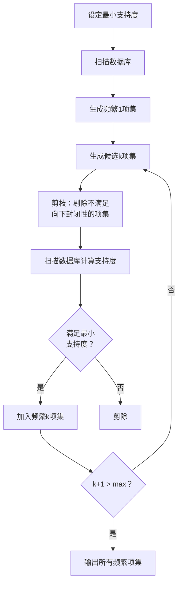

# 数据挖掘 Data Mining

> 数据挖掘（Data Mining）是从大规模数据集中自动发现隐含模式、关联和知识的过程。它是知识发现（Knowledge Discovery in Databases, KDD）的核心步骤，融合了统计学、机器学习、数据库技术和人工智能等多学科方法。

## KDD 过程

| 步骤 | 任务 | 技术方法 |
|:----:|:----:|:--------:|
| 数据选择 | 确定数据源与目标变量 | SQL 查询、采样 |
| 数据预处理 | 清洗、缺失值处理、异常值检测 | 均值填充、箱线图 |
| 数据转换 | 归一化、离散化、特征提取 | Min-Max、PCA |
| 数据挖掘 | 应用算法发现模式 | 分类、聚类、关联 |
| 模式评估 | 评估模式的有效性和新颖性 | 交叉验证、提升度 |
| 知识呈现 | 可视化、报告生成 | 图表、规则表示 |

## 主要任务

### 分类 Classification

将数据实例分配到预定义的类别中。

**常用算法**：

| 算法 | 原理 | 优点 | 缺点 |
|:----:|:----:|:----:|:----:|
| 决策树（Decision Tree） | 基于特征划分的树形结构 | 可解释性强 | 容易过拟合 |
| 支持向量机（SVM） | 最大间隔超平面 | 高维数据有效 | 大规模数据较慢 |
| k 近邻（k-NN） | 基于最近邻投票 | 无需训练 | 计算复杂度高 |
| 朴素贝叶斯（Naive Bayes） | 基于贝叶斯定理 | 简单高效 | 特征独立假设 |
| 逻辑回归（Logistic Regression） | Sigmoid 函数映射 | 概率输出 | 线性决策边界 |
| 随机森林（Random Forest） | 集成多棵决策树 | 抗过拟合 | 模型较大 |
| 神经网络（Neural Network） | 多层感知机 | 拟合复杂模式 | 需要大量数据 |

**评估指标**：

| 指标 | 公式 | 含义 |
|:----:|:----:|:----:|
| 准确率（Accuracy） | $(TP+TN)/(TP+TN+FP+FN)$ | 总体正确率 |
| 精确率（Precision） | $TP/(TP+FP)$ | 正类预测的可靠性 |
| 召回率（Recall） | $TP/(TP+FN)$ | 正类捕获率 |
| F1 分数 | $2 \cdot \frac{P \cdot R}{P + R}$ | 精确率与召回率的调和 |
| AUC | ROC 曲线下面积 | 排序能力 |

### 聚类 Clustering

将数据对象分组，使得组内相似度高、组间相似度低。

| 算法 | 类型 | 核心思想 | 适用场景 |
|:----:|:----:|:--------:|:--------:|
| K-means | 划分式 | 最小化组内距离平方和 | 球形聚类、大数据 |
| DBSCAN | 密度式 | 基于密度连通性 | 任意形状、噪声数据 |
| 层次聚类（Hierarchical） | 层次式 | 自底向上/自顶向下合并 | 层次结构数据 |
| Gaussian Mixture | 概率式 | 高斯分布加权组合 | 软聚类、概率输出 |
| Spectral Clustering | 谱方法 | 图拉普拉斯特征分解 | 非凸聚类 |

K-means 目标函数：

$$
J = \sum_{j=1}^k \sum_{i \in C_j} \|x_i - \mu_j\|^2
$$

**聚类评估**：

| 指标 | 内部/外部 | 说明 |
|:----:|:---------:|:----:|
| Silhouette Score | 内部 | $s(i) = \frac{b(i)-a(i)}{\max\{a(i),b(i)\}}$ |
| Davies–Bouldin Index | 内部 | 类内散度与类间距离之比 |
| 调整兰德指数（ARI） | 外部 | 基于配对计数的校正 |
| 互信息（NMI） | 外部 | 归一化互信息 |

### 关联规则挖掘 Association Rule Mining

发现数据集中变量之间的有趣关系。

**核心概念**：

- **支持度（Support）**：$P(A \cap B)$
- **置信度（Confidence）**：$P(B|A) = \frac{P(A \cap B)}{P(A)}$
- **提升度（Lift）**：$\frac{P(A \cap B)}{P(A)P(B)}$

$$
\text{Lift}(A \rightarrow B) = \frac{\text{Confidence}(A \rightarrow B)}{\text{Support}(B)}
$$

**经典算法**：

| 算法 | 策略 | 特点 |
|:----:|:----:|:----:|
| Apriori | 逐层搜索 + 剪枝 | 经典、易于理解 |
| FP-Growth | 构建 FP-Tree | 无需生成候选项集 |
| Eclat | 垂直数据格式 | 倒排表、快速交集计算 |

### 异常检测 Anomaly Detection

识别与正常模式显著不同的数据点。

**方法分类**：

| 方法类型 | 算法 | 适用场景 |
|:--------:|:----:|:--------:|
| 统计方法 | Z-score、Grubbs 检验 | 单变量、正态分布 |
| 邻近性方法 | k-NN、LOF | 多变量、密度不均匀 |
| 聚类方法 | DBSCAN、CBLOF | 簇间异常 |
| 集成方法 | Isolation Forest | 高维数据 |
| 深度方法 | Autoencoder、GAN | 复杂高维模式 |

## 数据预处理

### 数据清洗

- 缺失值处理：删除、均值/中位数填充、回归填充、KNN 填充
- 异常值处理：3σ 原则、IQR 方法、截尾
- 重复数据处理：去重
- 噪声平滑：分箱、聚类、回归

### 数据变换

$$
\text{Min-Max 归一化：} x' = \frac{x - \min(x)}{\max(x) - \min(x)}
$$

$$
\text{Z-score 标准化：} x' = \frac{x - \mu}{\sigma}
$$

$$
\text{主成分分析（PCA）：} Z = XW
$$

其中 $W$ 为协方差矩阵的特征向量矩阵。

## 大数据挖掘挑战

| 挑战 | 描述 | 应对策略 |
|:----:|:----:|:--------:|
| 可扩展性（Scalability） | 数据量超出单机处理能力 | 并行计算（MapReduce、Spark） |
| 高维灾难（Curse of Dimensionality） | 维度增长导致稀疏性 | 降维（PCA、t-SNE、特征选择） |
| 数据流（Data Stream） | 数据持续到达、概念漂移 | 增量学习、滑动窗口 |
| 数据隐私（Privacy） | 敏感信息泄露风险 | 差分隐私、联邦学习 |
| 可解释性（Interpretability） | 黑箱模型难以理解 | LIME、SHAP、XAI |

## 工具与平台

| 工具/平台 | 类型 | 主要特点 |
|:---------:|:----:|:--------:|
| scikit-learn | Python 库 | 分类、聚类、回归全套算法 |
| WEKA | Java 工具 | 图形界面、算法集合 |
| RapidMiner | 可视化平台 | 拖拽式工作流 |
| Apache Spark MLlib | 分布式计算 | 大规模数据处理 |
| H2O.ai | 机器学习平台 | AutoML、Java/Python/R |
| KNIME | 可视化平台 | 模块化、可扩展 |
| TensorFlow / PyTorch | 深度学习框架 | 神经网络、表示学习 |
| Orange | 可视化工具 | 教学、交互式探索 |

## 相关条目

- [[MachineLearning]]
- [[DatabaseSystems]]
- [[BigData]]
- [[DataVisualization]]
- [[ArtificialIntelligence]]
- [[FeatureEngineering]]
- [[PatternRecognition]]
- [[AnomalyDetection]]
