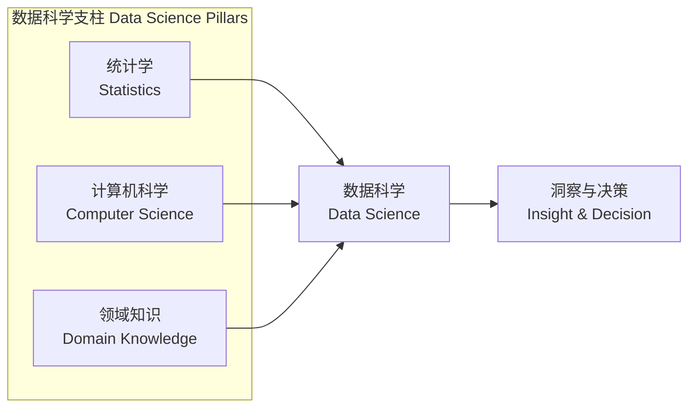
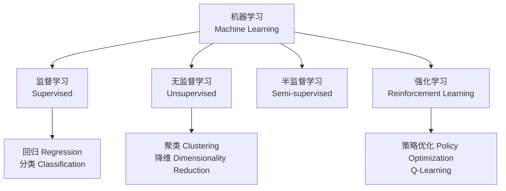

# 数据科学 (Data Science)

> 数据科学是一门从数据中提取知识和洞察的交叉学科，综合应用统计学、计算机科学、领域知识与机器学习，贯穿数据采集、清洗、分析、建模与可视化全流程。

## 学科概述 (Overview)

### 定义与范畴
数据科学（Data Science）位于统计学、计算机科学和领域知识的交叉点，是"用数据思考"的方法论体系。



### 数据科学工作流 (Data Science Workflow)

1. **问题定义** (Problem Definition)
2. **数据采集** (Data Collection)
3. **数据清洗** (Data Cleaning)
4. **探索性数据分析** (Exploratory Data Analysis, EDA)
5. **特征工程** (Feature Engineering)
6. **模型构建与评估** (Model Building & Evaluation)
7. **部署与监控** (Deployment & Monitoring)

---

## 数据管道 (Data Pipeline)

### 数据采集 (Data Collection)

| 数据源类型 | 示例 | 采集方式 |
|-----------|------|---------|
| 结构化数据 (Structured) | 关系数据库、CSV | SQL 查询、ETL |
| 半结构化数据 (Semi-structured) | JSON、XML、日志文件 | API 调用、文件解析 |
| 非结构化数据 (Unstructured) | 文本、图像、音频、视频 | Web Scraping、流处理 |
| 流数据 (Streaming) | 传感器、股票行情 | Kafka、Flink |

### 数据清洗 (Data Cleaning)

常见数据质量问题与处理方法：

| 问题 | 常见处理策略 |
|------|-------------|
| 缺失值 (Missing Values) | 删除、均值/中位数填充、KNN 插补、模型预测 |
| 异常值 (Outliers) | IQR 法、Z-Score、DBSCAN 检测、Winsorization |
| 重复数据 (Duplicates) | 基于关键字段去重 |
| 不一致格式 (Inconsistent Format) | 正则表达式标准化、类型转换 |
| 噪声数据 (Noisy Data) | 平滑（移动平均、Loess）、分箱 |

### 特征工程 (Feature Engineering)

- **数值特征变换**：标准化 (Standardization) $z = (x - \mu)/\sigma$、归一化 (Min-Max Scaling)
- **类别特征编码**：One-Hot Encoding、Label Encoding、Target Encoding
- **时间特征提取**：年、月、日、星期、是否为节假日、周期性编码
- **文本特征**：TF-IDF、Word2Vec、BERT Embeddings
- **特征交叉** (Feature Crossing)：组合多个特征产生交互效应

---

## 统计基础 (Statistical Foundations)

### 描述性统计 (Descriptive Statistics)

| 指标 | 公式 / 说明 |
|------|-----------|
| 均值 (Mean) | $\bar{x} = \frac{1}{n}\sum_{i=1}^n x_i$ |
| 中位数 (Median) | 排序后的中间值 |
| 标准差 (Std Dev) | $s = \sqrt{\frac{1}{n-1}\sum(x_i - \bar{x})^2}$ |
| 偏度 (Skewness) | 分布不对称性度量 |
| 峰度 (Kurtosis) | 分布尾部厚度度量 |

### 概率分布 (Probability Distributions)

| 分布类型 | 参数 | 应用场景 |
|---------|------|---------|
| 正态分布 (Normal) | $\mu, \sigma^2$ | 自然现象、误差分布 |
| 二项分布 (Binomial) | $n, p$ | A/B 实验转化率 |
| 泊松分布 (Poisson) | $\lambda$ | 事件计数（网站访问量） |
| 指数分布 (Exponential) | $\lambda$ | 等待时间、系统可靠性 |
| 贝塔分布 (Beta) | $\alpha, \beta$ | 先验分布、转化率建模 |

### 推断统计 (Inferential Statistics)

- **假设检验** (Hypothesis Testing)：$H_0$ 与 $H_1$，p 值，显著性水平 $\alpha = 0.05$
- **置信区间** (Confidence Interval)：$\bar{x} \pm z_{\alpha/2} \cdot \frac{\sigma}{\sqrt{n}}$
- **效应量** (Effect Size)：Cohen's d、$\eta^2$
- **贝叶斯推断** (Bayesian Inference)：$P(\theta \mid D) \propto P(D \mid \theta)P(\theta)$

---

## 机器学习 (Machine Learning)

### 学习范式



### 常见算法

| 算法 | 类型 | 特点 |
|------|------|------|
| 线性回归 (Linear Regression) | 监督-回归 | 可解释性强 |
| 逻辑回归 (Logistic Regression) | 监督-分类 | 输出概率 |
| 决策树 (Decision Tree) | 监督-分类/回归 | 可解释、易过拟合 |
| 随机森林 (Random Forest) | 监督-分类/回归 | Bagging 集成 |
| XGBoost / LightGBM | 监督-分类/回归 | Boosting 集成，竞赛利器 |
| SVM | 监督-分类 | 核技巧处理非线性 |
| K-Means | 无监督-聚类 | 简单高效 |
| DBSCAN | 无监督-聚类 | 无需预设 K，处理噪声 |
| PCA | 无监督-降维 | 线性降维 |
| t-SNE / UMAP | 无监督-降维 | 可视化高维数据 |

### 模型评估 (Model Evaluation)

| 任务 | 指标 |
|------|------|
| 回归 | MSE、RMSE、MAE、$R^2$ |
| 二分类 | Accuracy、Precision、Recall、F1、AUC-ROC |
| 多分类 | Macro/Micro F1、Confusion Matrix |
| 聚类 | Silhouette Score、Davies-Bouldin Index |

### 欠拟合与过拟合 (Underfitting & Overfitting)

- **过拟合**：在训练集上表现优异，在测试集上表现差
  - 解决：正则化 (L1/L2)、Dropout、早停法、增加数据量
- **欠拟合**：模型在训练集和测试集上表现均差
  - 解决：增加模型复杂度、特征工程、减少正则化强度

---

## 深度学习 (Deep Learning)

### 核心架构

| 架构 | 适用场景 | 核心组件 |
|------|---------|---------|
| 全连接网络 (MLP) | 结构化数据 | Dense Layer + Activation |
| 卷积神经网络 (CNN) | 图像、序列 | Conv2D、Pooling、BatchNorm |
| 循环神经网络 (RNN) | 序列数据 | LSTM、GRU |
| Transformer | NLP、多模态 | Self-Attention、Multi-Head Attention |
| 图神经网络 (GNN) | 图结构数据 | Message Passing、Graph Conv |

### 训练关键概念

- **反向传播** (Backpropagation)：链式法则计算梯度
- **优化器** (Optimizer)：SGD、Adam、AdamW、RMSprop
- **学习率调度** (LR Schedule)：Step Decay、Cosine Annealing、Warm-up
- **损失函数** (Loss Function)：MSE、Cross-Entropy、Contrastive Loss
- **正则化** (Regularization)：Dropout、Weight Decay、Label Smoothing

---

## 数据可视化 (Data Visualization)

### 可视化原则

- **Tufte 原则**：数据墨水比率最大化，避免 Chartjunk
- **Anscombe 四重奏**：揭示可视化在发现数据模式中的不可替代作用
- **Cleveland 层级**：位置 > 长度 > 角度 > 面积 > 颜色饱和度 > 颜色色调

### 常见图表类型

| 图表 | 用途 | 适用工具 |
|------|------|---------|
| 散点图 (Scatter Plot) | 双变量关系 | Matplotlib、Seaborn |
| 直方图 (Histogram) | 单变量分布 | Plotly、ggplot2 |
| 箱线图 (Box Plot) | 分组分布对比 | Seaborn、Vega-Lite |
| 热力图 (Heatmap) | 相关性矩阵 | Seaborn、Plotly |
| 折线图 (Line Chart) | 时间序列趋势 | Matplotlib、Bokeh |
| 条形图 (Bar Chart) | 类别比较 | Altair、ggplot2 |

---

## 大数据与工程 (Big Data & Engineering)

### 大数据特征 (4V)

- **Volume（体量）** —— TB 至 PB 级别
- **Velocity（速度）** —— 实时流处理
- **Variety（多样性）** —— 结构、半结构、非结构
- **Veracity（真实性）** —— 数据质量与可信度

### 常用工具生态

| 类别 | 工具 |
|------|------|
| 编程语言 | Python、R、Julia、Scala |
| 数据处理 | Pandas、Spark、Dask、Flink |
| 数据库 | PostgreSQL、MongoDB、ClickHouse |
| 数据仓库 | Snowflake、BigQuery、Redshift |
| 可视化 | Tableau、Power BI、Superset |
| MLOps | MLflow、Kubeflow、Airflow |
| 云平台 | AWS SageMaker、GCP Vertex AI、Azure ML |

---

## 数据科学伦理 (Data Ethics)

- **公平性** (Fairness) —— 消除算法偏见（Bias）、公平性指标（Demographic Parity、Equal Opportunity）
- **可解释性** (Explainability) —— SHAP、LIME、Integrated Gradients
- **隐私保护** (Privacy) —— 差分隐私 (Differential Privacy)、联邦学习 (Federated Learning)
- **透明度** (Transparency) —— 模型卡 (Model Cards)、数据清单 (Datasheets)

---

## 实验设计与因果推断 (Experiment Design & Causal Inference)

### A/B 测试 (A/B Testing)

- **假设**：$H_0$（无差异）vs $H_1$（有差异）
- **样本量计算** (Power Analysis)：需事先确定 $\alpha$、$\beta$、效应量
- **分流策略**：随机分配、分层随机化、MAB 自适应分配
- **多重比较校正**：Bonferroni、FDR (Benjamini-Hochberg)
- **常见陷阱**：新颖性效应 (Novelty Effect)、Simpson's 悖论、Early Stopping

### 因果推断方法

| 方法 | 适用场景 | 假设 |
|------|---------|------|
| RCT | 金标准 | 随机化可行 |
| IV (工具变量) | 存在不可观测混杂 | 工具变量满足排他性 |
| DID (双重差分) | 政策评估 | 平行趋势假设 |
| RDD (断点回归) | 阈值附近处理 | 连续性假设 |
| PS Matching | 观察性研究 | 无未观测混杂 (CIA) |

---

## 时间序列分析 (Time Series Analysis)

### 分解模型

$$
y_t = T_t + S_t + R_t \quad (\text{加法})
$$
$$
y_t = T_t \times S_t \times R_t \quad (\text{乘法})
$$

其中 $T$ 为趋势 (Trend)，$S$ 为季节 (Seasonal)，$R$ 为残差 (Residual)。

### 常用模型

| 模型 | 特点 | 适用场景 |
|------|------|---------|
| ARIMA | 差分 + 自回归 + 移动平均 | 单变量平稳序列 |
| SARIMA | 含季节性成分 | 含周期数据 |
| Prophet | 可分解趋势/季节/节假日 | 业务时间序列 |
| LSTM | 长短期记忆网络 | 非线性多变量预测 |
| Transformer (Time Series) | Attention 机制 | 长序列预测 |

---

## 推荐系统 (Recommendation Systems)

### 方法分类

- **协同过滤** (Collaborative Filtering)
  - User-based：找到相似用户，推荐其喜欢的物品
  - Item-based：找到相似物品，推荐用户历史偏好物品
  - Matrix Factorization (SVD, NMF)
- **内容过滤** (Content-based Filtering)：基于物品属性特征
- **混合方法** (Hybrid)：结合协同过滤与内容过滤
- **深度学习推荐**：Wide & Deep、DIN、BERT4Rec

### 评估指标

| 指标 | 定义 |
|------|------|
| Precision@K | Top-K 中相关比例 |
| Recall@K | 相关物品被召回比例 |
| NDCG@K | 考虑排序位置的折扣累计增益 |
| MAP | 平均精度的平均 |
| HR (Hit Rate) | 用户是否命中推荐物品 |

---

## 自然语言处理 (Natural Language Processing, NLP)

### 核心任务

- **文本分类**：情感分析、主题分类
- **序列标注**：命名实体识别 (NER)、词性标注 (POS)
- **关系抽取**：实体间关系识别
- **文本生成**：摘要、翻译、对话系统
- **语义理解**：文本蕴含、问答系统

### NLP 技术演进

```
规则系统 → 统计方法(NB, HMM) → 神经网络(LSTM) → Transformer(BERT/GPT)
```

### 词嵌入 (Word Embeddings)

- **Word2Vec**：CBOW / Skip-gram，分布式语义表示
- **GloVe**：基于全局共现矩阵
- **FastText**：子词信息，处理 OOV 问题
- **BERT**：双向上下文表示，预训练 + Fine-tuning
- **GPT**：单向自回归，提示学习 (Prompt Learning)

---

### 相关条目
- [[07_InterdisciplinarySciences/DataScience/INDEX|07_InterdisciplinarySciences/DataScience 索引]]
- [[07_InterdisciplinarySciences/DataScience/MachineLearning|机器学习]]
- [[07_InterdisciplinarySciences/DataScience/Statistics|统计学]]
- [[07_InterdisciplinarySciences/DataScience/BigData|大数据技术]]
- [[07_InterdisciplinarySciences/DataScience/NaturalLanguageProcessing|自然语言处理]]
- [[INDEX|当前目录索引]]
