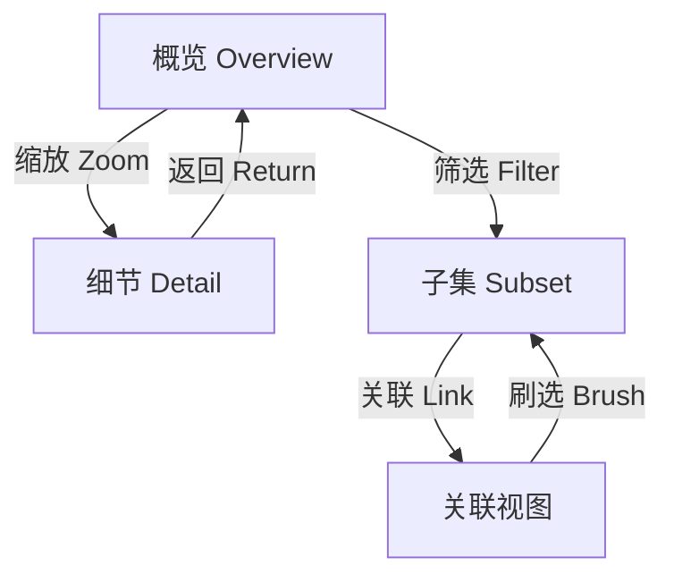

# 数据可视化 Data Visualization

> 数据可视化（Data Visualization）是利用图形、图表和交互界面等视觉元素表示数据的技术与方法。它将抽象数据映射为可视化编码（Visual Encoding），使复杂的数据模式、趋势和异常得以被快速感知和理解。

## 可视化理论

### 视觉感知与编码

根据 Jacques Bertin 的图形符号学和 Cleveland & McGill 的感知层次，不同视觉通道的感知精度排序：

| 感知精度 | 视觉通道 | 适用场景 |
|:--------:|:--------:|:--------:|
| 最高 | 位置（Position） | 散点图、坐标轴 |
| 较高 | 长度（Length） | 柱状图 |
| 中等 | 角度（Angle） | 饼图 |
| 中等 | 面积（Area） | 气泡图 |
| 较低 | 颜色饱和度 | 热力图 |
| 最低 | 颜色色相 | 分类标记 |

### 图表选择指南

| 分析目标 | 推荐图表 | 数据维度 | 示例 |
|:--------:|:--------:|:--------:|:----:|
| 比较分类 | 柱状图（Bar Chart） | 1 分类 + 1 数值 | 各部门销售额 |
| 趋势展示 | 折线图（Line Chart） | 1 时间 + 1 数值 | 月度收入变化 |
| 分布展示 | 直方图（Histogram） | 1 数值 | 年龄分布 |
| 相关性 | 散点图（Scatter Plot） | 2 数值 | 身高与体重 |
| 构成比例 | 堆叠柱状图 | 1 分类 + 多数值 | 市场份额 |
| 地理数据 | 地图（Map/Choropleth） | 地理 + 数值 | 各省 GDP |
| 层级结构 | 树图（Treemap） | 层级 + 数值 | 文件系统 |
| 网络关系 | 力导向图（Force-Directed） | 节点 + 边 | 社交网络 |
| 时间序列 | 面积图（Area Chart） | 时间 + 数值 | 累积流量 |
| 多变量 | 平行坐标（Parallel Coordinates） | 多数值 | 多维数据探索 |

## 设计原则

### 核心原则

- **数据-墨水比率（Data-Ink Ratio）**：$R_{di} = \frac{\text{数据墨水面积}}{\text{总墨水面积}}$，追求最大化数据信息密度
- **图表垃圾（Chartjunk）**：避免无意义的装饰性元素
- **格式塔原则（Gestalt Principles）**：接近性、相似性、连续性、闭合性

$$
\text{Data-Ink Ratio} = 1 - \frac{\text{Non-Data Ink}}{\text{Total Ink}}
$$

### 色彩设计

| 色彩方案类型 | 用途 | 例证 |
|:-----------:|:----:|:----:|
| 定性（Qualitative） | 分类变量区分 | {红, 蓝, 绿, 橙} |
| 顺序（Sequential） | 有序数值范围 | 浅灰 → 深蓝 |
| 发散（Diverging） | 围绕中点的偏差 | 蓝 → 白 → 红 |
| 色盲友好（Colorblind Safe） | 可访问性 | 使用形状标记辅助 |

## 常用工具

### 编程类工具

| 工具 | 语言 | 特点 | 图表类型 |
|:----:|:----:|:----:|:--------:|
| Matplotlib | Python | 基础、全面的 2D 绘图 | 基本图表 |
| Seaborn | Python | 统计图表、默认样式美观 | 统计图表 |
| ggplot2 | R | 图形语法（Grammar of Graphics） | 高度可定制 |
| Plotly | Python/R/JS | 交互式、在线分享 | 交互图表 |
| D3.js | JavaScript | 灵活、Web 原生 | 任意定制 |
| Vega-Lite | JSON | 声明式语法 | 快速原型 |
| Bokeh | Python | 交互式、流数据 | 仪表板 |
| Altair | Python | 声明式、Vega-Lite 封装 | 简洁语法 |

### 商业/桌面工具

| 工具 | 类型 | 适用场景 |
|:----:|:----:|:--------:|
| Tableau | BI 平台 | 企业级分析、仪表板 |
| Power BI | BI 平台 | 微软生态、实时数据 |
| Looker | BI 平台 | 嵌入式分析、数据建模 |
| Qlik Sense | BI 平台 | 关联数据探索 |
| Flourish | Web 工具 | 叙事可视化、新闻报道 |
| Datawrapper | Web 工具 | 记者、快速制图 |

## 交互式可视化

### 交互类型

- **筛选（Filtering）**：通过条件过滤数据子集
- **缩放（Zooming）**：查看不同粒度数据
- **悬停提示（Tooltip）**：鼠标悬停显示详细信息
- **联动刷选（Brushing & Linking）**：多个视图联动选择
- **钻取（Drill-down）**：从汇总到明细的层级展开

## 数据叙事 Data Storytelling

一个完整的数据叙事包含三个要素：

| 要素 | 说明 | 示例 |
|:----:|:----:|:----:|
| 数据（Data） | 可信的量化证据 | 销售额同比下降 15% |
| 叙事（Narrative） | 有逻辑的连贯故事 | 因市场竞争加剧和供应链中断 |
| 视觉（Visual） | 清晰的图表呈现 | 交互式折线图展示月度趋势 |

叙事结构：

1. **背景设定（Context）**：现状是什么？为何关注？
2. **冲突/问题（Conflict）**：数据揭示什么异常或问题？
3. **发现（Discovery）**：深入分析揭示哪些洞见？
4. **行动建议（Action）**：基于数据应该做什么？

## 数据可视化最佳实践

- **了解你的受众**：专家需要细节，管理者需要摘要
- **选择合适的图表类型**：误用图表会误导结论
- **保持简洁**：每张图表传达一个核心信息
- **标注清晰**：坐标轴、图例、单位、数据来源
- **考虑色盲用户**：约 8% 男性为红绿色盲
- **使用一致的视觉风格**：品牌色、字体、布局
- **提供交互探索的入口**：让用户自己发现

## 相关条目

- [[DataMining]]
- [[BigData]]
- [[HumanComputerInteraction]]
- [[InformationRetrieval]]
- [[DashboardDesign]]
- [[StatisticalGraphics]]
- [[InformationVisualization]]
