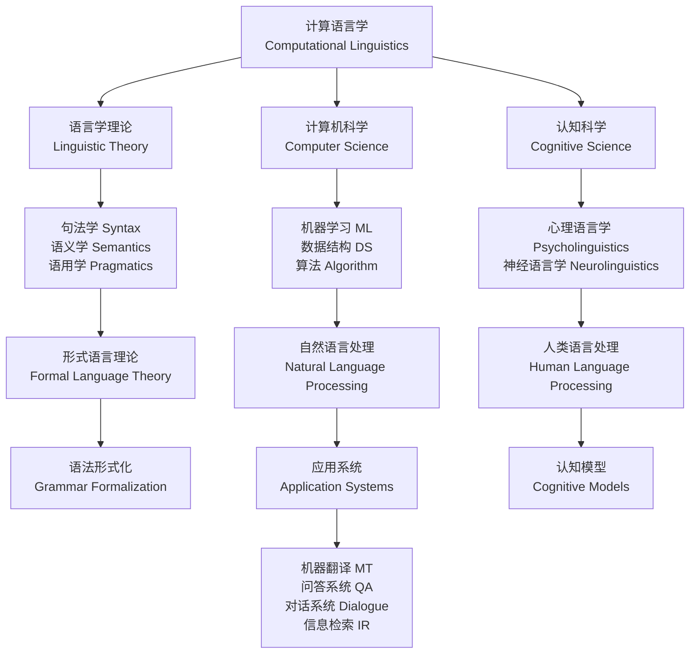

# 计算语言学

## 概述

计算语言学（Computational Linguistics, CL）是运用计算方法研究人类语言的结构、意义与使用的交叉学科。它在语言学理论（Linguistic Theory）、人工智能（Artificial Intelligence）与自然语言处理（Natural Language Processing, NLP）之间架起桥梁，推动人机交互（Human-Computer Interaction）与语言技术的发展。计算语言学的研究目标包括：构建形式化语言模型以解释语言能力（Competence）和语言表现（Performance），开发能够理解、生成人类语言的计算机系统，以及通过大规模语料数据验证语言学假设。从早期的基于规则系统到当代深度学习和大语言模型（Large Language Models, LLMs），计算语言学经历了深刻的方法论变革。

## 计算语言学与相关学科关系

## 语料库语言学（Corpus Linguistics）

### 语料库设计原则

- **代表性（Representativeness）**：语料库应均衡覆盖语言变体（Language Varieties）、体裁（Genre）和语域（Register）
- **平衡性（Balance）**：各类文本按比例抽样，反映目标语言域的实际分布
- **规模（Scale）**：从早期的百万词级（Brown Corpus, 1960s）到当今万亿词级（Web-scale Corpora）
- **标注层次（Annotation Layers）**：从词性标注到语义标注和话语标注
- **动态更新（Dynamic Updating）**：当代语料库需定期更新以反映语言演变

### 语料库标注层级

- **词性标注（Part-of-Speech Tagging, POS Tagging）**：为每个词标注语法类别（名词、动词、形容词等）。常用标记集包括 Penn Treebank POS Tagset（45个标签）和 Universal Dependencies POS Tagset（17个粗粒度标签）。词性标注的经典模型包括隐马尔可夫模型（Hidden Markov Model, HMM）和条件随机场（Conditional Random Field, CRF）
- **句法标注（Treebanking）**：建立句法树标注库，如 Penn Treebank（宾州树库，约4万句）和 Universal Dependencies 项目（跨语言的依存句法标注）
- **语义标注**：语义角色（Semantic Roles）、命名实体（Named Entities）、共指关系（Coreference）、语义框架（Semantic Frames）
- **话语标注**：修辞关系（Rhetorical Relations）、篇章连接标记（Discourse Connectives）、信息结构（Information Structure）

## 句法分析（Syntactic Parsing）

### 短语结构句法与依存句法

- **短语结构（Constituency/Phrase Structure）**：句子由嵌套的短语构成，用上下文无关语法（Context-Free Grammar, CFG）描述。CFG 定义为四元组 $G = (N, \Sigma, P, S)$，其中 $N$ 为非终结符集，$\Sigma$ 为终结符集，$P$ 为产生式规则集，$S$ 为起始符
- **依存句法（Dependency Syntax）**：词与词之间存在直接依存关系（Dependency Relation），形成依存树（Dependency Tree）。依存关系头词（Head）和依存词（Dependent）构成非对称二元关系

### 概率上下文无关语法（Probabilistic CFG, PCFG）

CFG 的每个产生式赋予概率，满足 $\sum_r P(r \mid A) = 1$（对所有非终结符 $A$）。通过 CKY 算法（Cocke-Kasami-Younger）寻找最可能的句法树。CKY 算法复杂度为 $O(n^3 \cdot |G|)$，其中 $n$ 为句子长度，$|G|$ 为语法规模。PCFG 的优点是学习简便（从树库中最大似然估计），缺点是无法捕捉词汇偏好和结构上下文。

### 基于转换的依存分析（Transition-based Dependency Parsing）

- **Arc-Standard 算法**：使用栈（Stack）和缓冲区（Buffer），通过 SHIFT、LEFT-ARC、RIGHT-ARC 等动作逐步构建依存树
- **分类器**：用机器学习（如多层感知机、LSTM、Transformer）预测下一个动作
- **优势**：线性时间复杂度 $O(n)$，可通过全局特征提升精度
- **代表系统**：Stanford Parser（部分转换模式）、spaCy、MaltParser

### 基于图的依存分析（Graph-based Dependency Parsing）

将依存分析视为有向图上的最大生成树（Maximum Spanning Tree, MST）问题。利用 Chu-Liu-Edmonds 算法求解。基于图的方法复杂度为 $O(n^2)$，但能利用全局信息进行优化。现代方法常融合转换和图的优点形成混合模型。

## 语义分析（Semantic Analysis）

### 词义消歧（Word Sense Disambiguation, WSD）

根据上下文确定多义词（Polysemous Word）的特定含义。方法包括：基于词典的 Lesk 算法（计算上下文与义项定义的重叠度）、监督学习的特征分类器（朴素贝叶斯、SVM），以及基于预训练语言模型的上下文嵌入（Contextual Embeddings）。WSD 的评估在 SemEval（Semantic Evaluation）共享任务中进行。

### 语义角色标注（Semantic Role Labeling, SRL）

识别句子中谓词（Predicate）的论元（Argument）及其语义角色（施事 Agent、受事 Patient、工具 Instrument、处所 Location 等）。基于框架语义学（FrameNet）或动词词典（PropBank, VerbNet）标注体系。SRL 的经典模型包括 BiLSTM-CRF 和基于 Transformer 的编码器-解码器架构。语义角色标注形式化为：

$$(Prop, Arg_1, Arg_2, \ldots, Arg_n)$$

其中 $Prop$ 为谓词，$Arg_i$ 为第 $i$ 个论元。

### 分布语义学（Distributional Semantics）

基于分布假设（Distributional Hypothesis）：具有相似上下文的词具有相似语义。通过词-上下文共现矩阵构建语义空间，采用余弦相似度（Cosine Similarity）计算语义距离：

$$\cos(\vec{v}_w, \vec{v}_u) = \frac{\vec{v}_w \cdot \vec{v}_u}{\|\vec{v}_w\| \times \|\vec{v}_u\|}$$

从 one-hot 表示到 Word2Vec（CBOW/Skip-gram）、GloVe、FastText，再到 BERT、RoBERTa 等上下文编码模型，分布语义学经历了里程碑式的演进。

## 话语分析（Discourse Analysis）

- **话语结构**：修辞结构理论（Rhetorical Structure Theory, RST），篇章关系分类（因果 Causality、对比 Contrast、序列 Sequence、解释 Explanation）
- **共指消解（Coreference Resolution）**：识别指向同一实体的不同表述（如"奥巴马"→"他"→"第44任总统"）。评估指标为 MUC、BCUBED 和 CEAF
- **话语连接词识别**：标记篇章关系的语言线索（因为、但是、因此、然而等）
- **篇章分割（Discourse Segmentation）**：将文本划分为话语单元（Elementary Discourse Unit, EDU）

## 机器翻译（Machine Translation, MT）

### 基于规则的方法（Rule-Based MT, RBMT）

依靠语言学家编写的大规模双语词典和语法规则系统。构建成本高、覆盖率有限、可移植性差，但在特定领域（如法律翻译）仍具价值。

### 统计机器翻译（Statistical MT, SMT）

- **IBM 模型**：从词对齐到短语对齐的一系列统计翻译模型。IBM Model 3引入增殖（Fertility）概念描述源语言单词对应目标语言单词的数量。模型优化基于 EM 算法（Expectation-Maximization）
- **短语翻译（Phrase-based Translation）**：基于短语的 SMT 系统（如 Moses），考虑局部上下文，翻译准确率显著高于词级模型
- **对数线性模型（Log-linear Model）**：整合翻译模型、语言模型、重排序模型等多个特征，通过最小错误率训练（Minimum Error Rate Training, MERT）优化权重：

$$P(e \mid f) \propto \prod_{i} \phi_i(e, f)^{\lambda_i}$$

### 神经机器翻译（Neural MT, NMT）

- **编码器-解码器架构**：循环神经网络（RNN）将源语言编码为上下文向量，解码器逐词生成目标语言
- **注意力机制（Bahdanau Attention, 2015）**：解码时动态关注源语言不同位置，解决长距离依赖问题
- **Transformer 架构（Vaswani et al., 2017）**：完全基于自注意力（Self-Attention）机制，并行计算效率高。位置编码（Positional Encoding）使用正弦余弦函数：

$$PE_{(pos, 2i)} = \sin\left(\frac{pos}{10000^{2i/d_{model}}}\right), \quad PE_{(pos, 2i+1)} = \cos\left(\frac{pos}{10000^{2i/d_{model}}}\right)$$

- **大语言模型（LLMs）**：GPT 系列（生成式预训练）、BERT 系列（掩码语言建模）在机器翻译中通过 fine-tuning 或 zero-shot prompt 实现高质量翻译

## 信息抽取（Information Extraction, IE）

### 命名实体识别（Named Entity Recognition, NER）

识别文本中的命名实体（人名、地名、机构名、时间、日期、货币等）。主流方法：BiLSTM-CRF、BERT-based 模型。评估指标为精确率（Precision）、召回率（Recall）和 F1-score：

$$F_1 = 2 \times \frac{\text{Precision} \times \text{Recall}}{\text{Precision} + \text{Recall}}$$

### 关系抽取（Relation Extraction, RE）

识别实体之间的语义关系（如 BornIn(Person, Location)）。方法包括模式匹配（Pattern Matching）、远程监督（Distant Supervision）、预训练模型微调（Fine-tuning）。常用数据集包括 ACE、SemEval 和 TACRED。

### 事件抽取（Event Extraction）

识别文本中描述的事件及其参与者（触发词 Trigger、论元角色 Argument Role）。包含事件检测（Event Detection）和事件论元抽取（Event Argument Extraction）两个子任务。

## NLP 评估

### 自动评价指标

- **BLEU（Bilingual Evaluation Understudy）**：基于 n-gram 精确率的机器翻译评价指标，改进版本包括 n-gram 精度的几何平均加长度惩罚（Brevity Penalty, BP）
- **ROUGE（Recall-Oriented Understudy for Gisting Evaluation）**：基于 n-gram 召回率的自动摘要评价指标，变体包含 ROUGE-N、ROUGE-L（最长公共子序列）、ROUGE-S（跳词二元组）
- **Perplexity（困惑度）**：语言模型的内在评价指标，定义为：$PPL = 2^{-\frac{1}{N}\sum_{i=1}^N \log_2 P(w_i \mid w_{<i})}$
- **METEOR**：考虑同义词匹配和词序校准的翻译评价指标

### 评价数据集与基准

- **GLUE / SuperGLUE**：通用语言理解任务基准，涵盖语法可接受性（CoLA）、情感分析（SST-2）、文本蕴含（RTE、MNLI）、问答（QNLI、BoolQ）等
- **SQuAD（Stanford Question Answering Dataset）**：阅读理解数据集，包含11万+问-答对
- **CoNLL（Conference on Natural Language Learning）**：共享任务数据集（NER、SRL、依存分析等）
- **BLiMP（Benchmark of Linguistic Minimal Pairs）**：用于评估语言模型语法知识的最小对比对测试集

## 社会媒体与网络语言处理

社交网络文本（Social Media Text）处理面临独特挑战：拼写不规范、缩写和新词频繁出现、非正式表达（俚语 Slang、表情符号 Emoji、标签 Hashtag）、多语言混合（Code-switching）、以及内容长度极短（如推文 140/280 字符限制）。处理方法包括：
- **非规范文本标准化（Lexical Normalization）**：使用词嵌入相似性或基于编辑距离（Levenshtein Distance）映射到标准形式
- **表情符号与情感分析**：Emoji Sentiment Ranking 将表情符号映射到情感极性（Positive/Neutral/Negative）
- **网络新词检测**：基于词汇增长曲线（Vocabulary Growth Curve）和上下文分布异常识别新词
- **社交媒体摘要**：事件摘要（Event Summarization）从大量短文本中提取关键事件流

## 低资源语言处理

低资源语言（Low-resource Languages）在数据量、标注资源和工具链方面严重不足。应对策略包括：
- **跨语言迁移学习（Cross-lingual Transfer Learning）**：使用多语言预训练模型（mBERT、XLM-RoBERTa、mT5）从高资源语言迁移知识
- **无监督跨语言词嵌入（Unsupervised Cross-lingual Word Embeddings）**：通过对抗训练或自映射实现双语词典归纳（Bilingual Dictionary Induction）无需平行语料
- **数据增强**：回译（Back-translation）、噪声注入（Noise Injection）、句法扰动（Syntactic Perturbation）
- **主动学习（Active Learning）**：选择最丰富信息（Information-rich）的样本进行人工标注，最大化标注效率
- **零样本跨语言迁移（Zero-shot Cross-lingual Transfer）**：在源语言上训练，直接应用于目标语言

当前覆盖不足的语言（Underrepresented Languages）包括全球约 95% 的语言，其中非洲语言和美洲原住民语言的数据资源最为匮乏。

## 多模态计算语言学

多模态计算语言学（Multimodal Computational Linguistics）整合语言输入与视觉（图像、视频）、听觉（语音）信息。主要研究任务包括：
- **视觉问答（Visual Question Answering, VQA）**：根据图像内容回答自然语言问题
- **图像描述生成（Image Captioning）**：自动生成描述图像内容的自然语句
- **视频描述与检索（Video Captioning & Retrieval）**：理解视频内容并建立语言-视频跨模态索引
- **语音情感识别（Speech Emotion Recognition）**：从韵律（Prosody）、音色（Timbre）和语速（Speech Rate）特征中识别情感状态
- **多模态机器翻译**：结合视觉语境提升模糊词语的翻译准确率

典型多模态模型包括 CLIP（文本-图像对比学习预训练）、VideoBERT 和 Flamingo。

## 大语言模型时代的计算语言学

以 GPT-4、Claude、LLaMA 为代表的大语言模型（Large Language Models, LLMs）对计算语言学的影响深远。LLM 改变了传统 NLP 任务的处理范式：
- **任务重构**：从任务专用模型（Task-specific Fine-tuning）转向提示工程（Prompt Engineering）和上下文学习（In-context Learning, ICL）
- **涌现能力（Emergent Abilities）**：大模型展示出复杂推理、代码生成和多步规划能力，传统评估框架难以完全覆盖
- **数据隐私与伦理**：模型训练数据的版权、隐私和偏见问题引发广泛社会讨论
- **可解释性（Explainability）**：链式思维提示（Chain-of-Thought, CoT）、注意力可视化、激活分析（Probing）等方法探索模型内部机制
- **模型压缩与部署**：知识蒸馏（Knowledge Distillation）、量化（Quantization）、剪枝（Pruning）使大模型实用化

## 计算语言学的标注与评估挑战

语言标注（Linguistic Annotation）是计算语言学的基础，面临以下核心挑战：
- **标注一致性（Inter-annotator Agreement, IAA）**：Cohen's Kappa 系数或 Krippendorff's Alpha 衡量标注人员间的一致性。目标值：$\kappa \ge 0.80$（几乎完全一致）
- **标注粒度选择**：粗粒度（Coarse-grained）和细粒度（Fine-grained）标注体系的取舍取决于下游任务需求
- **主观性任务**：情感分析、讽刺检测（Sarcasm Detection）等任务标注一致性天然较低，需采用软标注（Soft Labeling）或多标签框架
- **领域适应性（Domain Adaptation）**：在源领域（如新闻）训练的标注系统迁移到目标领域（如医疗）时性能显著下降
- **人工标注成本**：高质量标注每千词需 15-30 美元（英文），中文和低资源语言成本更高

## 相关条目

[[NaturalLanguageProcessing]], [[DataScience]], [[TextMining]], [[CulturalAnalytics]], [[MachineLearning]], [[ArtificialIntelligence]]
