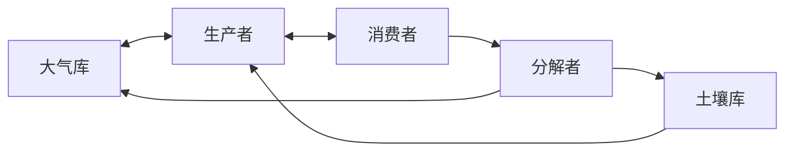

# 生态学 (Ecology)

> 生态学是研究生物与环境之间相互关系的科学，涵盖从个体到生物圈的多层次组织体系。生态学不仅揭示自然界的运行规律，还为生物多样性保护、生态系统管理和可持续发展提供理论指导。现代生态学融合了进化生物学、生理学、地球科学和社会科学的方法。

## 一、生态系统结构与功能

### 生态系统组分

**非生物组分**：
- 无机物质：C、N、P、H₂O
- 有机物质：腐殖质、蛋白质
- 气候因子：温度、光照、降水

**生物组分**：
- 生产者（自养生物）：绿色植物、藻类、光合细菌
- 消费者（异养生物）：植食动物、肉食动物、杂食动物
- 分解者：细菌、真菌

### 营养级与食物网

**经典食物链**：
$$ \text{生产者} \rightarrow \text{初级消费者} \rightarrow \text{次级消费者} \rightarrow \text{三级消费者} \rightarrow \text{分解者} $$

**营养级结构**：自然生态系统中食物链常不超过 4-5 个营养级，这是能量级递减的结果。

| 营养级 | 能量 (kcal/m²/yr) | 生物量 (g/m²) |
|--------|-------------------|---------------|
| 生产者 | 15000 | 800 |
| 初级消费者 | 1500 | 100 |
| 次级消费者 | 150 | 15 |
| 三级消费者 | 15 | 2 |

### 生态金字塔 (Ecological Pyramid)

**三种类型**：
- 数量金字塔：个体数目分布
- 生物量金字塔：生物量分布
- 能量金字塔：能量流动分布（最基础）

能量金字塔永远为正立，这是热力学第二定律的必然结果。能量从低营养级向高营养级传递时，约 90% 以热能散失（10% 定律，Lindeman 效率）。

### 生态系统能量流动

$$ \text{GPP（总初级生产力）} = \text{NPP（净初级生产力）} + R_a（自养呼吸） $$

$$ \text{NPP} = \text{GPP} - R_a $$

全球 NPP 约 105 Pg C/yr，其中陆地生态系统占约 56.4 Pg C/yr，海洋生态系统占约 48.6 Pg C/yr。

### 生物地球化学循环

**碳循环**：大气 CO₂ → 光合作用 → 有机碳 → 呼吸/分解 → CO₂。人类活动（化石燃料燃烧、土地利用变化）已显著打破了碳循环的自然平衡。

**氮循环**：固氮 → 硝化 → 同化 → 氨化 → 反硝化。人类通过 Haber-Bosch 法合成氨，使全球活性氮通量翻倍。

**磷循环**：磷是沉积型循环的代表，主要储存在岩石和沉积物中，是许多淡水生态系统的限制性营养元素。

## 二、种群生态学

### 种群基本参数

**出生率 (b) 和死亡率 (d)**：
$$ \frac{dN}{dt} = (b - d)N = rN $$

其中 N 为种群大小，r 为内禀增长率。

### 增长模型

**指数增长（J型曲线）**：
$$ N_t = N_0 e^{rt} $$

适用于资源无限的环境（如入侵物种初期、细菌培养）。

**逻辑斯蒂增长（S型曲线）**：
$$ \frac{dN}{dt} = rN\left(1 - \frac{N}{K}\right) $$

其中 K 为环境承载力。当 N=K 时，增长率为零；当 N=K/2 时，增长率最大。

**密度制约与非密度制约**：
- 密度制约因子：竞争、捕食、疾病（随密度变化）
- 非密度制约因子：自然灾害、气候极端事件（与密度无关）

### r-K 选择理论

| 特征 | r-对策者 | K-对策者 |
|------|---------|---------|
| 体型 | 小型 | 大型 |
| 寿命 | 短 | 长 |
| 后代数量 | 多 | 少 |
| 亲代投资 | 少 | 多 |
| 种群动态 | 波动大 | 相对稳定 |
| 典型物种 | 昆虫、杂草 | 大象、人类 |

### 种群调节 (Population Regulation)

**负反馈机制**：
$$ N\uparrow \rightarrow \text{资源竞争}\uparrow \rightarrow b\downarrow,\ d\uparrow \rightarrow N\downarrow $$

种群调节的机制包括：资源限制、捕食控制、疾病传播、社会行为调节（如领域行为）。

### 生活史策略

$$ \text{适合度权衡} = f(\text{繁殖投入}, \text{存活投入}, \text{生长投入}) $$

生活史进化面临的核心权衡：当前繁殖 vs 未来存活、后代数量 vs 后代质量。

## 三、群落生态学

### 种间相互作用

| 相互作用类型 | 物种A | 物种B | 实例 |
|-------------|-------|-------|------|
| 互利共生 | + | + | 授粉、菌根 |
| 偏利共生 | + | 0 | 附生植物 |
| 竞争 | - | - | 资源争夺 |
| 捕食 | + | - | 狮子-斑羚 |
| 寄生 | + | - | 绦虫-宿主 |
| 偏害 | - | 0 | 化感作用 |

### 捕食者-猎物模型 (Lotka-Volterra)

$$ \frac{dN}{dt} = rN - aNP $$
$$ \frac{dP}{dt} = baNP - mP $$

其中 N 为猎物密度，P 为捕食者密度，a 为捕食效率，b 为转化效率，m 为捕食者死亡率。

### 种间竞争模型 (Lotka-Volterra Competition)

$$ \frac{dN_1}{dt} = r_1N_1\left(1 - \frac{N_1 + \alpha_{12}N_2}{K_1}\right) $$
$$ \frac{dN_2}{dt} = r_2N_2\left(1 - \frac{N_2 + \alpha_{21}N_1}{K_2}\right) $$

其中 α 为竞争系数，表示种间竞争的强度相对于种内竞争。

### 生态位理论

**定义**：
Hutchinson 将生态位定义为物种在多维超体积空间中的位置。

$$ \text{基础生态位} \supset \text{实际生态位} $$

竞争排除原理：两个具有完全相同生态位的物种不能长期共存（Gause 原理）。

### 群落演替

**演替类型**：
- 初级演替：从无生命基质开始（如裸岩→地衣→苔藓→草本→木本）
- 次级演替：原有植被被破坏后的恢复（如弃地→草地→灌丛→森林）

**演替机制**：
$$ \text{时间} \rightarrow \text{物种组成变化} \rightarrow \text{结构复杂化} \rightarrow \text{相对稳定（顶极群落）} $$

### 岛屿生物地理学理论

**MacArthur & Wilson (1967)**：
$$ S = cA^z $$

其中 S 为物种数，A 为岛屿面积，c 和 z 为常数（z 通常在 0.2-0.35 之间）。

## 四、生物多样性与保护

### 生物多样性层次

**三个层次**：
1. 遗传多样性：种内基因变异
2. 物种多样性：物种丰富度和均匀度
3. 生态系统多样性：生境和群落类型

**多样性指数 (Shannon-Wiener)**：
$$ H' = -\sum_{i=1}^S p_i \ln p_i $$

其中 S 为物种数，p_i 为第 i 个物种的相对多度。

### 主要生物群落

| 生物群落 | 降水量 (mm/yr) | 年均温 (°C) | 主要植被 |
|---------|---------------|-------------|---------|
| 热带雨林 | 2000-4000 | 24-27 | 常绿阔叶林 |
| 温带森林 | 750-1500 | 5-15 | 落叶阔叶林 |
| 北方针叶林 | 300-900 | -5-5 | 针叶林 |
| 热带草原 | 500-1500 | 20-30 | 禾草+散生乔木 |
| 温带草原 | 250-750 | 5-20 | 禾草 |
| 荒漠 | <250 | 20-35 | 旱生灌木 |
| 冻原 | 100-300 | -12-0 | 苔藓、地衣 |
| 地中海灌丛 | 300-800 | 10-20 | 硬叶灌丛 |

## 五、生态系统服务

### 服务分类 (MEA, 2005)

**供给服务**：食物、淡水、木材、纤维、药用资源、遗传资源

**调节服务**：气候调节、洪水调节、水质净化、病虫害控制、授粉服务

**支持服务**：土壤形成、养分循环、初级生产、栖息地提供

**文化服务**：休闲旅游、精神满足、教育价值、文化遗产

### 经济价值

$$ V_{\text{total}} = \sum_{i=1}^n V_i \approx 125 \times 10^{12} \text{USD/yr} \ (\text{Costanza et al., 2014}) $$

其中 V_i 为第 i 种服务的货币化价值。

## 六、保护生物学

### 种群生存力分析 (PVA)

**最小可存活种群 (MVP)**：
$$ N_e^* = f(\text{环境随机性}, \text{遗传漂变}, \text{自然灾害}) $$

$$ \text{遗传随机性: } \frac{dH}{dt} = -\frac{1}{2N_e}H $$

其中 H 为杂合度，N_e 为有效种群大小。有效种群大小常远小于实际种群大小。

### 保护策略

**就地保护**：
- 自然保护区、国家公园
- 保护关键栖息地
- 生态廊道建设

**迁地保护**：
- 动物园、植物园
- 种子库、基因库
- 人工繁育与再引入

### 灭绝危机

**背景灭绝率**：0.1-1 E/MSY（每百万物种年）

**当前灭绝率**：100-1000 倍背景率，为人类第六次大灭绝。

$$ \text{受威胁物种比例: } 28\% \text{ 评估物种} \ (\text{IPBES, 2019}) $$

## 参考资源

- Begon M, et al. *Ecology: From Individuals to Ecosystems*. Wiley, 2006.
- MacArthur RH, Wilson EO. *The Theory of Island Biogeography*. Princeton, 1967.
- Costanza R, et al. Changes in the global value of ecosystem services. *Global Environmental Change*, 2014.
- IPBES. *Global Assessment Report on Biodiversity and Ecosystem Services*, 2019.
- 孙儒泳等. 《基础生态学》. 高等教育出版社, 2012.
- Millennium Ecosystem Assessment. *Ecosystems and Human Well-being*, 2005.

## 相关条目

- [[Ecology]], [[ClimateChange]], [[EnvironmentalPolicy]], [[Sustainability]]
