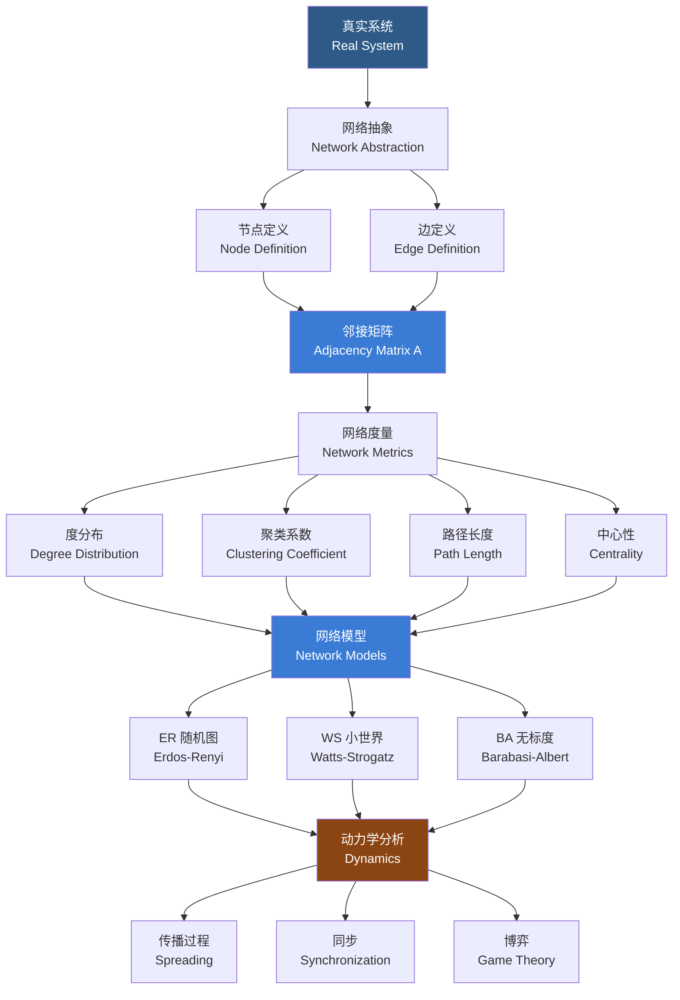

---
aliases: [NetworkScience, 网络科学]
tags: ['InterdisciplinaryMethodologies', 'NetworkScience', 'ComplexSystems', 'GraphTheory']
created: 2026-05-17
updated: 2026-05-17
---

# 网络科学

## 一、概述

网络科学（Network Science）研究复杂系统（Complex Systems）中的拓扑结构、动力学行为及其普适规律。它借用图论（Graph Theory）语言，将系统抽象为节点（Node/Vertex）与边（Edge/Link）构成的网络，跨越物理学、生物学、社会学、计算机科学、工程学等学科界限。从社交网络到蛋白质相互作用网络、从互联网到大脑神经网络，网络科学揭示了不同领域中存在的普适组织原则——如小世界性（Small-World Property）、无标度特征（Scale-Free Property）和社区结构（Community Structure）。

## 二、网络科学基础

### 2.1 网络建模流程

### 2.2 图论基础

网络用图 $G = (V, E)$ 表示，其中 $V$ 为节点集合，$E$ 为边集合。邻接矩阵（Adjacency Matrix）$A$ 是网络的核心代数表示：

$$A_{ij} = \begin{cases} 1 & \text{节点 } i \text{ 与 } j \text{ 相连（无权图）} \\ w_{ij} & \text{有权重网络} \\ 0 & \text{无连接} \end{cases}$$

对于无向图，$A_{ij} = A_{ji}$；对于有向图，$A_{ij} \neq A_{ji}$ 表示方向从 $j$ 指向 $i$。

### 2.3 网络类型分类

| 分类维度 | 类型 | 特点 | 示例 |
|----------|------|------|------|
| 方向性 | 有向 (Directed) | 边有方向 | Twitter 关注、网页超链接 |
| 方向性 | 无向 (Undirected) | 边无方向 | Facebook 好友、蛋白质交互 |
| 权重 | 加权 (Weighted) | 边有权重值 | 航空网络（航线流量） |
| 权重 | 无权 (Unweighted) | 边仅有存在与否 | 学术合作网络 |
| 节点类型 | 同质 (Homogeneous) | 一种节点、一种边 | 电力网络 |
| 节点类型 | 异质 (Heterogeneous) | 多类节点、多种边 | 知识图谱 |
| 层数 | 单层 (Single-Layer) | 单一交互层 | 基础网络分析 |
| 层数 | 多层 (Multilayer) | 多种关系层 | 社交+工作+线上 |

## 三、基本网络模型

### 3.1 网络模型对比

| 模型 | 生成机制 | 度分布 | 聚类系数 | 平均路径长度 | 特点 |
|------|----------|--------|----------|--------------|------|
| ER 随机图 $G(n,p)$ | 每个节点对以概率 $p$ 连接 | 泊松分布 | $C = p$ | $L \sim \ln n / \ln \langle k \rangle$ | 最简单的随机网络 |
| WS 小世界 | 从规则环开始随机重连 | 较窄 | $C$ 大（重连率低时） | $L \sim \ln n$ | 高聚类+短路径 |
| BA 无标度 | 增长+优先连接 | 幂律 $P(k) \sim k^{-3}$ | $C \sim n^{-0.75}$ | $L \sim \ln n / \ln \ln n$ | 枢纽节点主导 |
| 配置模型 | 指定度序列随机连接 | 任意指定 | 可变 | 可变 | 保持指定度分布 |

### 3.2 Erdos-Renyi 随机图模型 $G(n, p)$

以概率 $p$ 独立连接 $n$ 个节点中的每一对节点。度分布为二项分布：

$$P(k) = \binom{n-1}{k} p^k (1-p)^{n-1-k}$$

当 $n \to \infty$ 时，泊松近似 $P(k) \approx \frac{\langle k \rangle^k e^{-\langle k \rangle}}{k!}$。相变阈值：当 $p > 1/n$ 时，巨连通分量（Giant Component）涌现。

### 3.3 Watts-Strogatz 小世界模型

从规则环开始，以概率 $p$ 重连每条边，实现高聚类系数和短平均路径长度。模型具有相变行为：当 $p$ 增大时，网络从规则结构过渡到随机结构。在 $p$ 适中的区间同时拥有高聚类和短路径——这被称为小世界效应（Small-World Effect）。

### 3.4 Barabasi-Albert 无标度模型

通过两个机制生成：增长（Growth）和优先连接（Preferential Attachment）。新节点以正比于已有节点度的概率连接到已有节点。度分布服从幂律：

$$P(k) \sim k^{-\gamma}$$

其中 $\gamma \approx 3$（BA 模型特例）。无标度网络对随机故障（Random Failures）鲁棒，但对定向攻击（Targeted Attacks）脆弱，这一性质称为鲁棒性-脆弱性悖论（Robust-Yet-Fragile Paradox）。

## 四、网络度量指标

### 4.1 度与度分布

| 指标 | 符号 | 定义 | 意义 |
|------|------|------|------|
| 度 (Degree) | $k_i$ | 节点 $i$ 的邻居数量 | 衡量直接连接数 |
| 平均度 | $\langle k \rangle$ | 所有节点度的平均值 | 网络稀疏程度 |
| 度分布 | $P(k)$ | 随机节点度等于 $k$ 的概率 | 网络结构特征 |
| 累积度分布 | $P(K \geq k)$ | 度大于等于 $k$ 的概率 | 幂律分布的展示 |

### 4.2 聚类系数（Clustering Coefficient）

度量节点邻居之间的紧密程度。节点 $i$ 的局部聚类系数：

$$C_i = \frac{2E_i}{k_i(k_i - 1)}$$

其中 $E_i$ 为节点 $i$ 的 $k_i$ 个邻居之间的实际边数。全局聚类系数通常取所有节点的平均值 $C = \langle C_i \rangle$。另一种定义是传递性（Transitivity）：

$$C_{\Delta} = \frac{3 \times \text{三角形数量}}{\text{连通三元组数量}}$$

### 4.3 平均路径长度（Average Path Length）

网络中所有节点对之间最短路径的平均值：

$$L = \frac{2}{n(n-1)} \sum_{i \neq j} d(i, j)$$

小世界网络中平均路径长度随节点数 $n$ 对数增长：$L \sim \ln n$。

### 4.4 中心性（Centrality）

| 中心性类型 | 公式 | 含义 | 适用场景 |
|------------|------|------|----------|
| 度中心性 (Degree) | $C_D(i) = k_i$ | 节点连接的边数 | 直接影响力 |
| 介数中心性 (Betweenness) | $C_B(i) = \sum_{s \neq i \neq t} \frac{\sigma_{st}(i)}{\sigma_{st}}$ | 最短路径的中介作用 | 网络上信息流动关键节点 |
| 接近中心性 (Closeness) | $C_C(i) = \frac{n-1}{\sum_j d(i,j)}$ | 到其他节点的平均距离 | 信息传播速度 |
| 特征向量中心性 (Eigenvector) | $A x = \lambda_{\max} x$ | 重要邻居的贡献叠加 | PageRank 基础 |
| PageRank | $PR(i) = \frac{1-d}{n} + d \sum_{j \in \text{in}(i)} \frac{PR(j)}{k_j^{\text{out}}}$ | 随机跳转特征向量中心性 | 搜索引擎排序 |

## 五、社区检测（Community Detection）

### 5.1 检测方法对比

| 算法 | 类型 | 复杂度 | 是否需要预设社区数 | 特点 |
|------|------|--------|-------------------|------|
| Girvan-Newman | 分裂型 | $O(m^2 n)$ | 否 | 基于边介数移除 |
| Louvain | 凝聚型 | $O(n \log n)$ | 否 | 模块度优化、快速 |
| 标签传播 (LPA) | 局部传播 | $O(m)$ | 否 | 极快但结果不稳定 |
| Infomap | 信息论 | $O(m)$ | 否 | 基于随机游走编码 |
| 谱聚类 (Spectral) | 谱分解 | $O(n^3)$ | 是 | 基于拉普拉斯特征向量 |

### 5.2 Louvain 算法

基于模块度（Modularity）优化的凝聚算法。模块度 $Q$ 衡量社区划分质量：

$$Q = \frac{1}{2m} \sum_{ij} \left[ A_{ij} - \frac{k_i k_j}{2m} \right] \delta(c_i, c_j)$$

两阶段迭代：第一阶段局部优化节点所属社区使 $Q$ 最大化；第二阶段构建凝聚网络——每个社区视为一个新节点。复杂度 $O(n \log n)$，适合大规模网络分析。

## 六、网络动力学（Network Dynamics）

| 动力学类型 | 核心机制 | 理论框架 | 典型现象 |
|------------|----------|----------|----------|
| 流行病传播 | 接触传染 | SIR, SIS, SEIR 模型 | 阈值效应、免疫策略 |
| 信息扩散 | 社交传播 | 独立级联、线性阈值模型 | 引爆点、级联失败 |
| 网络同步 | 节点耦合 | Kuramoto 模型 | 同步相变 |
| 演化博弈 | 策略更新 | 囚徒困境、公共品博弈 | 合作涌现 |

### 6.1 传播动力学

SIR 模型：

$$\frac{dS}{dt} = -\beta SI, \quad \frac{dI}{dt} = \beta SI - \gamma I, \quad \frac{dR}{dt} = \gamma I$$

基本再生数 $R_0 = \beta / \gamma$ 决定疫情是否爆发。在网络上传播时，节点度分布、社区结构等拓扑特征显著影响传播阈值与速度。

### 6.2 网络同步

Kuramoto 模型描述耦合振子系统的同步行为：

$$\frac{d\theta_i}{dt} = \omega_i + K \sum_{j} A_{ij} \sin(\theta_j - \theta_i)$$

当耦合强度 $K$ 超过临界值 $K_c$ 时，系统从无序状态相变为全局同步状态。

## 七、网络可视化

| 布局算法 | 原理 | 适用场景 | 代表性工具 |
|----------|------|----------|------------|
| Fruchterman-Reingold | 力导向布局 | 中小规模网络 | Gephi, NetworkX |
| Kamada-Kawai | 弹簧嵌入模型 | 强调拓扑距离 | igraph |
| 环形布局 (Circular) | 节点围绕圆环 | 循环结构展示 | D3.js |
| 树状布局 (Tree) | 层次结构展开 | 层次网络 | Graphviz |
| 大尺度布局 (OpenOrd) | 并行力导向 | 百万节点以上 | Gephi |

## 八、应用领域

| 领域 | 网络类型 | 分析重点 | 代表性研究成果 |
|------|----------|----------|----------------|
| 社交网络 | 人际关系、关注关系 | 社群发现、影响力传播、同质性 | 六度分隔、三元闭包 |
| 生物网络 | 蛋白质交互、基因调控 | 模块识别、网络基元、稳健性 | 无标度性在代谢网络 |
| 引文网络 | 论文引用、合作网络 | 影响力排序、研究前沿探测 | h-index、引用瀑布 |
| 基础设施 | 电力网、交通网、供水网 | 鲁棒性、级联失效、关键节点识别 | 北美大停电级联分析 |
| 互联网 | 网页链接、通信网络 | PageRank、社区结构、流量分析 | 互联网生态位发现 |
| 大脑网络 | 神经元连接、脑区连接 | 功能连接组、小世界脑网络 | 人脑连接组计划 |

## 相关条目

- [[SystemsThinking]]
- [[ComplexityScience]]
- [[TransdisciplinaryResearch]]
- [[02_NaturalSciences/Logic/MathematicalLogic/GraphTheory|GraphTheory]]

