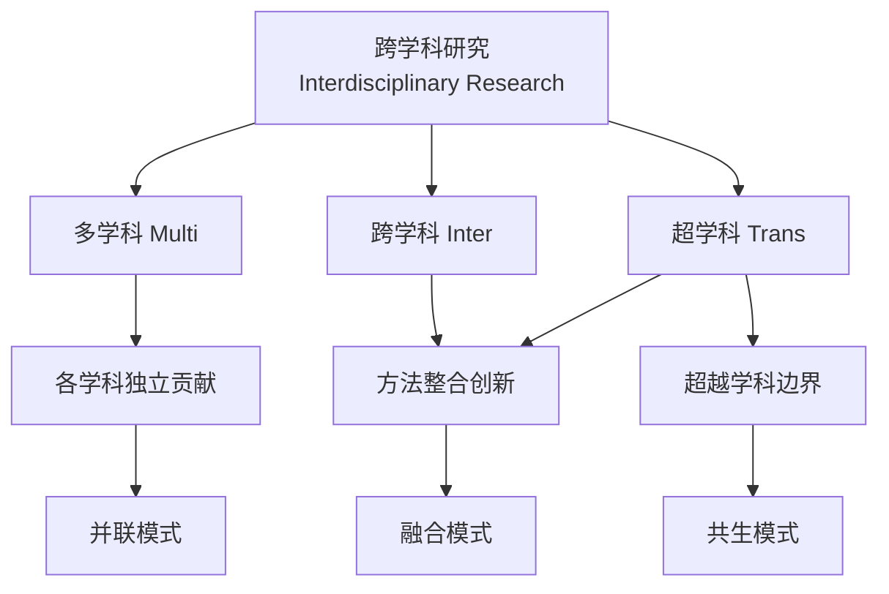
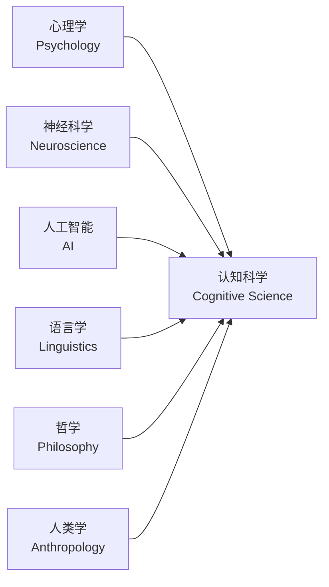
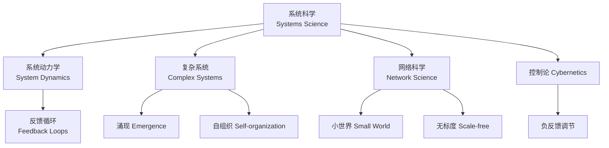
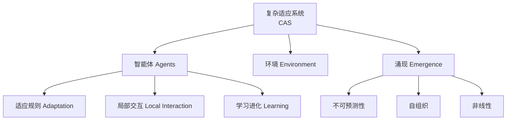

# 跨学科学习路径 Interdisciplinary Learning Path

## 概述 Overview

跨学科学习（Interdisciplinary Learning）是整合两个或以上学科的知识、方法和范式，创造性地解决复杂问题。在 VUCA（易变、不确定、复杂、模糊）时代，单一学科视角难以应对真实世界的挑战。

$$ \text{Interdisciplinary Competence} = \sum \text{Disciplinary Depth}_i + \prod \text{Integration}_j $$

## 跨学科方法论 Interdisciplinary Methodology

### 三种整合层次

| 层次 | 描述 | 特征 |
|------|------|------|
| 多学科 Multidisciplinary | 各学科从自身视角研究同一问题 | 并列关系、无方法融合 |
| 跨学科 Interdisciplinary | 整合方法创造新框架 | 方法互借、新概念涌现 |
| 超学科 Transdisciplinary | 超越学科界限构建统一知识框架 | 学科边界模糊化 |

## 关键交叉领域 Key Cross-Disciplinary Fields

### 数据科学 Data Science

$$ \text{Data Science} = \text{Statistics} + \text{Computer Science} + \text{Domain Knowledge} $$

| 组件 | 学科来源 | 核心能力 |
|------|---------|---------|
| 统计学 | 数学 | 假设检验、回归分析、贝叶斯推断 |
| 编程 | 计算机科学 | Python/R、SQL、分布式计算 |
| 可视化 | 设计 + 认知 | D3.js、Tableau、信息设计 |
| 领域知识 | 各专业领域 | 医学、金融、生物等 |

### 认知科学 Cognitive Science

$$ \text{Cognitive Science} = \text{Psychology} + \text{Neuroscience} + \text{AI} + \text{Linguistics} + \text{Philosophy} $$

| 子领域 | 核心问题 | 方法 |
|-------|---------|------|
| 认知心理学 | 心智如何处理信息 | 行为实验、反应时 |
| 认知神经科学 | 大脑如何实现认知 | fMRI、EEG、MEG |
| 计算认知科学 | 心智的计算模型 | 贝叶斯模型、神经网络 |
| 认知语言学 | 语言与思维的关系 | 语料分析、实验 |

### 生物信息学 Bioinformatics

$$ \text{Bioinformatics} = \text{Biology} + \text{Computer Science} + \text{Statistics} $$

| 研究方向 | 数据来源 | 计算模型 |
|---------|---------|---------|
| 基因组学 | DNA 测序 | 序列比对、组装 |
| 转录组学 | RNA-seq | 差异表达分析 |
| 蛋白质组学 | 质谱 | 结构预测 AlphaFold |
| 系统生物学 | 多组学数据 | 网络分析、ODE 模型 |

### 量子信息 Quantum Information

$$ \text{Quantum Information} = \text{Quantum Mechanics} + \text{Information Theory} + \text{Computer Science} $$

#### 量子计算基础

$$ |\psi\rangle = \alpha |0\rangle + \beta |1\rangle, \quad |\alpha|^2 + |\beta|^2 = 1 $$

| 概念 | 经典类比 | 量子特性 |
|------|---------|---------|
| 量子比特 Qubit | 比特 0/1 | 叠加态 Superposition |
| 量子门 Gate | 逻辑门 | 酉变换 Unitary |
| 量子纠缠 | 无类比 | 非局域关联 |
| 量子测量 | 读取状态 | 坍缩 Collapse |

$$ \text{Shor's Algorithm: } O((\log N)^3) \text{ vs classical } O(e^{(\log N)^{1/3}}) $$

### 数字人文 Digital Humanities

$$ \text{Digital Humanities} = \text{Humanities} + \text{Computation} + \text{Digital Methods} $$

| 研究方向 | 传统人文 | 数字方法 |
|---------|---------|---------|
| 文本分析 | 细读 Close Reading | 远读 Distant Reading、NLP |
| 历史 GIS | 历史地图 | 空间分析、可视化 |
| 数字档案 | 纸质档案 | 数字化、语义标注 |
| 文化分析 | 文化批评 | 网络分析、社会计算 |
| 计算语言学 | 语言描述 | 语料库、机器学习 |

### 系统科学 Systems Science

$$ \text{System} = \{\text{Elements}, \text{Interconnections}, \text{Function/Purpose}\} $$

#### 系统动力学的桑基图与反馈

$$ \frac{dS}{dt} = f(S, P, E), \quad S(t) = \int_0^t f(S, \tau) d\tau + S_0 $$

| 反馈类型 | 行为模式 | 示例 |
|---------|---------|------|
| 正反馈 Reinforcing | 指数增长 | 复利、病毒传播 |
| 负反馈 Balancing | 趋向目标 | 恒温器、供需平衡 |
| 延迟 Delay | 振荡 | 库存管理 |

## 跨学科学习方法 Integration Methods

### T 型人才 T-shaped Skills

$$ \text{T-shaped: } \underbrace{---}_{\text{Breadth}} + \underbrace{|}_{\text{Depth}} $$

| 维度 | 含义 | 投资比例 |
|------|------|---------|
| 横杠 — | 多学科广度 | 40% |
| 竖杠 \| | 核心深度 | 60% |

### 跨学科项目实践

| 项目类型 | 涉及学科 | 实践平台 |
|---------|---------|---------|
| 智能家居系统 | 嵌入式 + IoT + AI | Arduino, ESP32 |
| 脑机接口实验 | 神经科学 + 信号处理 + ML | OpenBCI, EEG |
| 社会网络分析 | 社会学 + 网络科学 + 编程 | Gephi, NetworkX |
| 数字人文分析 | 文学 + NLP + 可视化 | Voyant, Topic Modeling |
| 环境建模 | 生态学 + GIS + 系统动力学 | NetLogo, Vensim |

## 推荐资源 Recommended Resources

### 经典书籍

| 书名 | 作者 | 领域 |
|------|------|------|
| 《系统思考》 | Donella Meadows | 系统科学 |
| 《复杂》 | Melanie Mitchell | 复杂系统 |
| 《哥德尔、埃舍尔、巴赫》 | Douglas Hofstadter | 认知 + 数学 + 艺术 |
| 《人类的知识》 | Bertrand Russell | 认识论 |
| 《失控》 | Kevin Kelly | 技术 + 社会 |
| 《链接》 | Albert-László Barabási | 网络科学 |
| 《思考，快与慢》 | Daniel Kahneman | 认知科学 |
| 《科学革命的结构》 | Thomas Kuhn | 科学哲学 |

### 在线课程

- **Coursera**: Data Science Specialization / Learning How to Learn
- **edX**: MITx 系统动力学 / 复杂系统
- **Complexity Explorer**: Santa Fe Institute 免费课程
- **Stanford Online**: 认知科学导论 / 量子力学基础

## 学习顺序建议

| 阶段 | 内容 | 时长 |
|------|------|------|
| 基础 | 系统思维 + 统计学 + Python | 3-6 月 |
| 扩展 | 选择 2-3 个交叉领域深入学习 | 6-12 月 |
| 整合 | 跨学科项目实践 | 3-6 月 |
| 创新 | 在交叉点发现新问题 | 持续 |

## 跨学科思维工具 Interdisciplinary Thinking Tools

### 类比推理 Analogical Reasoning

将 A 领域的结构映射到 B 领域，发现深层相似性。

| 来源领域 | 目标领域 | 类比 |
|---------|---------|------|
| 生物学 进化论 | 经济学 市场竞争 | 自然选择 → 优胜劣汰 |
| 物理学 热力学 | 信息科学 信息论 | 熵 → 信息不确定性 |
| 生态学 生态系统 | 计算机 互联网 | 生态位 → 应用场景 |
| 神经科学 神经网络 | AI 深度学习 | 突触 → 网络权重 |

### 思辨思维 Critical Thinking

$$ \text{Claim} \xrightarrow{\text{Question}} \text{Evidence} \xrightarrow{\text{Analyze}} \text{Conclusion} $$

### 第一性原理 First Principles

将问题分解为最基本的不可再分的真理，再重新构建解决方案。

$$ \text{Elon Musk: } \text{Rocket Cost} = \frac{\text{Materials Cost}}{\text{Markup}} \neq \text{Industry Price} $$

## 跨学科研究领域精选

### 环境科学 Environmental Science

$$ \text{Environmental Science} = \text{Ecology} + \text{Chemistry} + \text{Geology} + \text{Policy} $$

| 子领域 | 涉及学科 | 核心问题 |
|-------|---------|---------|
| 气候变化 | 大气科学 + 经济学 + 政策 | 碳减排路径 |
| 生态修复 | 生物学 + 工程学 | 受损生态系统恢复 |
| 环境监测 | 传感器 + 数据科学 | 实时环境数据 |

### 计算社会科学 Computational Social Science

$$ \text{CSS} = \text{Social Science} + \text{Computation} + \text{Big Data} $$

| 方法 | 应用 |
|------|------|
| 社会网络分析 | 信息传播、影响力建模 |
| 自然语言处理 | 舆情监测、文本情感 |
| 多智能体仿真 | 城市交通、市场行为 |
| 数字足迹分析 | 人口迁移、消费模式 |

### 神经经济学 Neuroeconomics

$$ \text{Neuroeconomics} = \text{Neuroscience} + \text{Economics} + \text{Psychology} $$

研究决策的神经基础，探索理性决策模型与真实行为的偏差。

### 网络科学 Network Science

$$ \text{Network} = \text{Nodes} + \text{Edges} $$

| 网络类型 | 节点 | 边 | 研究问题 |
|---------|------|-----|---------|
| 社交网络 | 人 | 关系 | 信息传播、社区发现 |
| 生物网络 | 基因/蛋白 | 相互作用 | 疾病机制 |
| 交通网络 | 车站 | 路线 | 拥堵优化 |
| 引文网络 | 论文 | 引用 | 科学前沿探测 |

### 复杂适应系统 Complex Adaptive Systems

CAS 由大量相互作用的智能体组成，宏观涌现模式不可通过微观属性简单预测。

## 研究技能组合 Research Skill Set

| 技能 | 相关学科 | 应用场景 |
|------|---------|---------|
| 编程 | 计算机科学 | 数据处理、建模、仿真 |
| 统计学 | 数学 | 实验设计、假设检验 |
| 系统建模 | 系统科学 | 构建领域模型 |
| 可视化 | 设计 + 认知 | 沟通研究成果 |
| 学术写作 | 语言学 | 论文发表 |
| 项目管理 | 管理学 | 跨学科团队协作 |

## 跨学科挑战与应对

| 挑战 | 表现 | 应对策略 |
|------|------|---------|
| 术语壁垒 | 各学科使用不同术语表达相同概念 | 建立跨学科词汇表 |
| 方法差异 | 定量 vs 定性方法论冲突 | 混合方法研究 Mixed Methods |
| 评价标准 | 各学科发表标准不同 | 寻找跨学科期刊 |
| 深度 vs 广度 | 难以兼顾广度和深度 | T 型人才策略 |
| 合作沟通 | 学科间理解偏差 | 建立共同概念框架 |

## 相关条目

- [[LearningPath]]
- [[SystemsThinking]]
- [[ComplexSystems]]
- [[KnowledgeGraph]]
- [[DataScience]]
