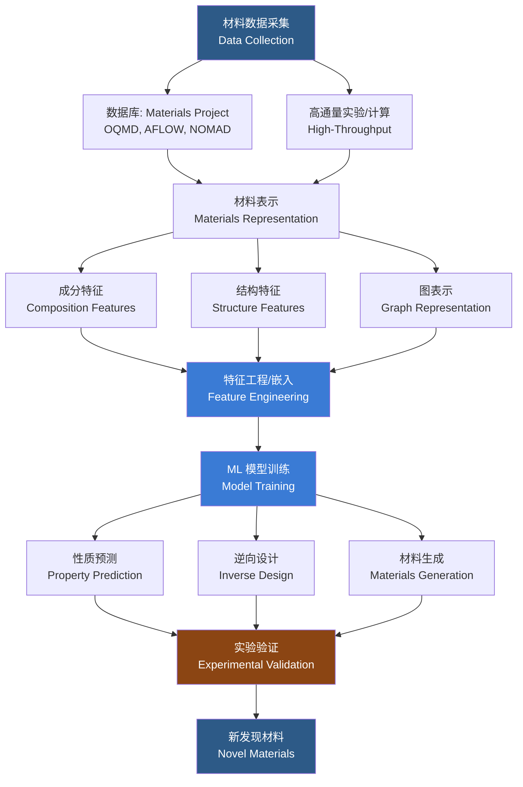

---
aliases: [MachineLearningForMaterials, 材料机器学习]
tags: ['MaterialsInformatics', 'MachineLearning', 'MaterialsScience', 'ComputationalMaterials']
created: 2026-05-17
updated: 2026-05-17
---

# 材料机器学习

## 一、概述

材料机器学习（Machine Learning for Materials Science）是材料信息学（Materials Informatics）的核心分支，致力于将机器学习方法应用于材料科学中的性质预测、结构发现、逆向设计与实验优化。传统材料研发依赖试错法和密度泛函理论（Density Functional Theory, DFT）计算，周期长、成本高。机器学习通过学习已有材料数据中的隐含规律，显著加速了新材料的发现与开发周期。核心挑战在于：小样本高维数据、物理约束的嵌入、材料表示（Materials Representation）的设计以及模型的可解释性。

## 二、材料机器学习工作流程

## 三、材料表示方法（Materials Representation）

### 3.1 表示方法对比

| 方法 | 类型 | 输入形式 | 特点 | 典型应用 |
|------|------|----------|------|----------|
| 元素属性统计 (EPS) | 成分 | 固定长度向量 | 简单、高效、忽略结构 | 带隙预测、形成能 |
| Coulomb 矩阵 | 结构 | 二维矩阵 | 包含原子对相互作用 | 分子性质预测 |
| 径向分布函数 (RDF) | 结构 | 一维曲线 | 旋转平移不变性 | 非晶结构分析 |
| 晶体图 (Crystal Graph) | 图 | 节点+边 | 消息传递、捕获拓扑 | CGCNN 模型 |
| MEGNet | 图 | 图+全局特征 | 支持温度、压力条件 | 多任务学习 |
| Mat2Vec | 嵌入 | 稠密向量 | 无监督预训练 | 迁移学习 |
| SOAP | 结构 | 对称函数 | 完整局部环境描述 | 势函数拟合 |

### 3.2 基于成分的表示

使用元素属性（Element Properties）的统计量——平均值（Mean）、方差（Variance）、最大值（Max）、最小值（Min）等——组成特征向量。代表性方案包括：

- **元素属性统计（Element Properties Statistics, EPS）**：从物理化学属性表（原子半径、电负性、电离能、熔点等）中提取统计特征
- **Matscholar 嵌入**：基于材料科学文献训练的词嵌入（Word Embedding），将元素符号映射至 200 维向量空间

### 3.3 基于结构的表示

#### Coulomb 矩阵

对分子或晶体中的每对原子 $i, j$：

$$M_{ij} = \begin{cases} 0.5 Z_i^{2.4} & i = j \\ \frac{Z_i Z_j}{|R_i - R_j|} & i \neq j \end{cases}$$

其中 $Z_i$ 为原子序数，$R_i$ 为原子位置向量。矩阵经本征值分解（Eigenvalue Decomposition）排序后作为特征输入模型。

#### Ewald 求和矩阵

将 Coulomb 矩阵中的实空间项替换为 Ewald 求和（Ewald Summation），更好地处理周期性边界条件：

$$E = \frac{1}{2} \sum_{i,j} \sum_{\mathbf{n}}' \frac{Z_i Z_j \text{erfc}(\alpha |\mathbf{r}_{ij} + \mathbf{n}|)}{|\mathbf{r}_{ij} + \mathbf{n}|} + \frac{2\pi}{\Omega} \sum_{i,j} \sum_{\mathbf{G} \neq 0} \frac{Z_i Z_j e^{-G^2/4\alpha^2}}{G^2} e^{-i\mathbf{G} \cdot \mathbf{r}_{ij}} - \frac{\alpha}{\sqrt{\pi}} \sum_i Z_i^2$$

#### 径向分布函数（Radial Distribution Function, RDF）

以参考原子为中心，统计各距离壳层内的原子对密度：

$$g(r) = \frac{1}{4\pi r^2 \rho N} \sum_i \sum_{j \neq i} \delta(r - |\mathbf{r}_i - \mathbf{r}_j|)$$

$g(r)$ 曲线作为结构特征输入模型。

### 3.4 基于图的表示

#### 晶体图（Crystal Graph）

将晶体结构表示为图 $G = (V, E)$，节点 $v_i \in V$ 为原子（含元素特征向量），边 $e_{ij} \in E$ 为原子间连接（含距离特征）。经过消息传递（Message Passing）框架更新节点特征：

$$\mathbf{h}_i^{(t+1)} = \phi\left(\mathbf{h}_i^{(t)}, \sum_{j \in \mathcal{N}(i)} \psi(\mathbf{h}_i^{(t)}, \mathbf{h}_j^{(t)}, \mathbf{e}_{ij})\right)$$

晶体图卷积神经网络（Crystal Graph Convolutional Neural Network, CGCNN）通过多轮消息传递聚合邻域信息进行端到端的性质预测。

#### MEGNet（Materials Graph Network）

扩展了 CGCNN，引入全局状态特征向量 $\mathbf{u}$（温度、压力等条件），支持多任务学习：

$$(\mathbf{h}_i^{(t+1)}, \mathbf{e}_{ij}^{(t+1)}, \mathbf{u}^{(t+1)}) = f(\mathbf{h}_i^{(t)}, \mathbf{e}_{ij}^{(t)}, \mathbf{u}^{(t)})$$

## 四、性质预测任务（Property Prediction）

| 预测目标 | 物理意义 | 常用方法 | 数据来源 |
|----------|----------|----------|----------|
| 带隙 $E_g$ (Band Gap) | 电子从价带跃迁至导带所需最小能量 | CGCNN, GNN, Random Forest | Materials Project |
| 形成能 $E_f$ (Formation Energy) | 化合物相对于单质元素的能量稳定性 | CGCNN, MEGNet, XGBoost | OQMD, AFLOW |
| 体积模量 $K$ (Bulk Modulus) | 抗均匀压缩的能力 | GNN, SVM | NOMAD |
| 剪切模量 $G$ (Shear Modulus) | 抗剪切形变的能力 | GNN, Random Forest | NOMAD |
| 热导率 $\kappa$ (Thermal Conductivity) | 热量传导能力 | GNN, SISSO | 文献采集 |
| 熔点 $T_m$ (Melting Point) | 固液转变温度 | GPR, Random Forest | 实验数据 |

### 4.1 带隙预测

$$E_g^{\text{pred}} = f_{\text{model}}(\text{representation}(\text{structure}))$$

模型预测精度通常用平均绝对误差（Mean Absolute Error, MAE）衡量，目前 CGCNN 等图神经网络在带隙预测上可达 MAE $\approx 0.2-0.3$ eV。

### 4.2 形成能预测

形成能 $E_f$ 定义为：

$$E_f = E_{\text{compound}} - \sum_i n_i E_i$$

其中 $E_{\text{compound}}$ 为化合物的总能量，$n_i$ 和 $E_i$ 分别为第 $i$ 种元素的原子数及其单质参考能量。机器学习的形成能预测可达接近 DFT 精度的水平（MAE $\approx 0.05$ eV/atom），但计算成本降低数个数量级。

## 五、生成模型（Generative Models）

### 5.1 变分自编码器（VAE）

- **CrystalGAN**：在晶体对称性约束下生成稳定的新型晶体结构
- **正交化 VAE**：在潜在空间中解耦控制不同物理性质的隐变量
- **CdVAE（Composition-Design VAE）**：成分约束下的晶体生成

### 5.2 生成对抗网络（GANs）

生成新颖的晶体结构与成分组合，由判别器验证合理性。条件 GAN（Conditional GAN）允许按目标性质（如目标带隙）生成特定功能材料。

### 5.3 扩散模型（Diffusion Models）

近年兴起的新范式，通过学习从噪声逐步去噪的过程生成晶体结构，在材料多样性方面表现优异。代表工作包括：

- **CDVAE（Crystal Diffusion VAE）**：结合 VAE 与扩散模型的三维晶体周期结构生成
- **DiffCSP**：通过连续时间扩散过程生成晶格参数和原子坐标
- **FlowMM**：基于标准化流（Normalizing Flow）的晶体生成

## 六、逆向设计（Inverse Design）

从目标性质出发反向搜索最优材料结构。核心方法包括：

| 方法 | 核心机制 | 优点 | 缺点 |
|------|----------|------|------|
| 贝叶斯优化 (Bayesian Optimization) | 代理模型（高斯过程）指导实验迭代 | 样本效率高 | 高维空间困难 |
| 遗传算法 (Genetic Algorithm) | 交叉和变异操作演化材料种群 | 全局搜索能力强 | 效率低 |
| 强化学习 (Reinforcement Learning) | 智能体在化学空间中探索高奖励区域 | 可处理复杂约束 | 训练不稳定 |
| 粒子群优化 (PSO) | 群体智能搜索最优结构 | 实现简单 | 局部最优 |

## 七、高通量筛选与主动学习

### 7.1 高通量虚拟筛选（High-Throughput Virtual Screening）

使用训练好的 ML 模型对庞大的候选材料库（如数百万种假想化合物）进行快速预筛选，筛选出少量候选物进行精确 DFT 计算或实验验证。

### 7.2 主动学习（Active Learning）

迭代策略：模型在不确定性高的区域主动选择最有信息量的实验进行验证，从而最大化每次实验的信息增益。

关键采样策略：

- **不确定性采样（Uncertainty Sampling）**：选择预测方差最大的样本
- **期望改进（Expected Improvement, EI）**：平衡探索（Exploration）与利用（Exploitation）：

$$EI(x) = \sigma(x) \cdot [u \cdot \Phi(u) + \phi(u)], \quad u = \frac{f^* - \mu(x)}{\sigma(x)}$$

其中 $f^*$ 为当前最优值，$\mu(x)$ 和 $\sigma(x)$ 为高斯过程预测的均值和标准差，$\Phi$ 和 $\phi$ 分别为标准正态的分布函数和密度函数。

- **汤普森采样（Thompson Sampling）**：从后验分布采样选择指导下一步实验

## 八、不确定性量化（Uncertainty Quantification）

| 方法 | 原理 | 特点 |
|------|------|------|
| 贝叶斯神经网络 | 网络权重引入先验分布，变分推断或 MC Dropout | 理论基础坚实、计算成本高 |
| 集成方法 (Ensemble) | 训练多个模型，方差作为不确定性 | 实现简单、效果好 |
| 高斯过程回归 (GPR) | 闭合形式的预测均值与方差 | 样本效率高、非参数 |
| 深度集成 (Deep Ensemble) | 多个不同初始化的神经网络集成 | 实际效果优于 MC Dropout |

## 九、材料数据库与工具

| 数据库 | 数据类型 | 规模 | 特色 |
|--------|----------|------|------|
| Materials Project | DFT 计算 | 15 万+化合物 | 开源、API 丰富 |
| OQMD | DFT 计算 | 100 万+化合物 | 覆盖广 |
| AFLOW | DFT 计算 | 300 万+化合物 | 自动流程 |
| NOMAD | 原始计算数据 | 数十亿计算 | 可重用的原始数据 |
| Citrination | 实验+计算 | 多源整合 | 商业平台 |

## 相关条目

- [[04_EngineeringAndTechnology/MechanicsAndMaterials/MaterialsScience/INDEX|MaterialsScience]]
- [[05_ComputerScience/ArtificialIntelligence/MachineLearning/INDEX|MachineLearning]]
- [[ComputationalChemistry]]
- [[MaterialsGenome]]

