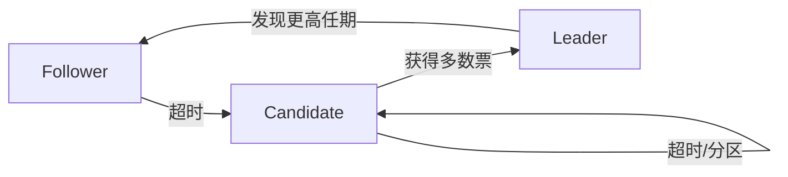

# 分布式系统 (Distributed Systems)

> 分布式系统是由多个通过网络连接、相互协作完成共同任务的独立计算节点组成的系统，其对用户表现为单一整体。节点间的通信与协调实现资源共享、计算加速和容错。分布式系统是现代互联网、云计算和大数据处理的基础。

## 基本概念

### 系统定义

**关键特征**：
- 节点自治：每个节点独立运行
- 通信网络：消息传递机制
- 共享状态：协调与一致
- 故障独立：任一节点可能失效

**设计目标**：

| 目标 | 描述 | 实现手段 |
|------|------|----------|
| 透明性 | 隐藏分布细节 | 中间件抽象 |
| 可扩展性 | 性能随规模增长 | 水平扩展 |
| 可用性 | 持续提供服务 | 冗余与故障转移 |
| 一致性 | 数据状态统一 | 共识协议 |

### 通信模型

**远程过程调用 (RPC)**：
- 客户端-服务器模型
- 序列化/反序列化
- 同步/异步调用

**消息传递**：
- 点对点：直接通信
- 发布/订阅：解耦通信
- 消息队列：缓冲与路由

## 架构风格

### 客户端-服务器

- 中心化控制
- 服务器提供资源
- 客户端发起请求
- 明确角色分工

**局限**：
- 单点瓶颈
- 服务器过载
- 单点故障

### 对等网络 (P2P)

- 节点角色对等
- 去中心化管理
- 自组织网络
- 资源分布式共享

**路由协议**：
- 结构化：Chord、Pastry（DHT）
- 非结构化：Gnutella、BitTorrent

### 微服务架构

**核心原则**：
- 单一职责：每服务专注一个功能
- 自治部署：独立部署和扩展
- 轻量通信：HTTP/REST 或 gRPC
- 去中心化数据管理

**服务间通信**：
- 同步：REST、gRPC
- 异步：消息队列（Kafka、RabbitMQ）
- 事件驱动架构

## 时钟与排序

### Lamport 时钟

**Happens-Before 关系**：
1. 同一进程：事件顺序
2. 发消息：send → receive
3. 传递性：a → b, b → c ⇒ a → c

**逻辑时钟规则**：
- $C_i$：进程 $i$ 的时钟
- 每个事件递增 $C_i = C_i + 1$
- 发消息附带时钟 $t$
- 接收时更新：$C_j = \max(C_j, t) + 1$

### 向量时钟

**定义**：$V_i[k]$ 是进程 $i$ 记录的进程 $k$ 事件计数

**规则**：
- 本地事件递增 $V_i[i] = V_i[i] + 1$
- 发消息附带 $V$
- 接收时合并：$V_j[k] = \max(V_j[k], V[k])$
- 比较：$V_a \le V_b \iff \forall k, V_a[k] \le V_b[k]$

**因果冲突检测**：
$$V_a \parallel V_b \iff \neg(V_a \le V_b) \land \neg(V_b \le V_a)$$

### 混合逻辑时钟 (Hybrid Logical Clocks, HLC)

结合物理时钟和逻辑时钟，提供因果关系追踪和物理时间近似。每个节点维护 $(l, c)$ 对，其中 $l$ 为物理时间上限，$c$ 为同一物理时间内的逻辑计数。

## 一致性模型

### 强一致性

**线性一致性 (Linearizability)**：
- 操作在调用和返回间实时生效
- 所有节点观察到相同顺序
- 性能代价高

### 最终一致性

- 允许短暂不一致
- 保证最终达到一致
- 高可用低延迟

**变种**：
- 读己之写一致性
- 单调读一致
- 因果一致性

### 因果一致性

- 具有因果关系的操作按因果顺序
- 无因果关系的操作可任意排序
- 结合了性能和一致

## CAP 定理

### 核心三要素

**一致性 (Consistency)**：
- 所有节点同时刻看到相同数据
- 强一致性模型

**可用性 (Availability)**：
- 每个请求都能获得响应
- 允许非最新数据

**分区容忍性 (Partition Tolerance)**：
- 网络分区时系统仍能工作
- 分布式系统必须选择

### CAP 权衡

| 组合 | 特点 | 典型系统 |
|------|------|----------|
| CP | 保持一致，牺牲可用 | Zookeeper、etcd |
| AP | 保持可用，牺牲一致 | Cassandra、DynamoDB |
| CA | 理想情况，实际不可达 | 单机数据库 |

**PACELC 扩展**：
- 分区时：P(artition) 下的 CAP 权衡
- 正常时：E(lse) 下的 L(atency) vs C(onsistency)

## 复制策略

### 主从复制

**流程**：
1. 领导者处理写请求
2. 写操作复制到追随者
3. 读可由追随者处理
4. 领导者故障时选举新领导者

- 写请求集中，避免冲突
- 读可水平扩展
- 领导者单点瓶颈

### 多主复制

- 多节点接受写请求
- 冲突检测与解决
- 最终一致性

**冲突解决策略**：
- Last-Write-Win (LWW)
- CRDT（无冲突数据类型）
- 应用层合并

### 法定人数 (Quorum)

**配置参数**：
- $N$：副本数
- $W$：写确认数
- $R$：读确认数

**保证条件**：
$$W + R > N \quad (\text{强一致})$$
$$W > N/2 \quad (\text{写法定人数})$$

## 共识算法

### Paxos

**角色**：
- 提议者 (Proposer)
- 接受者 (Acceptor)
- 学习者 (Learner)

**阶段**：
1. Prepare 阶段：提议生成提案编号 $n$
2. Promise 阶段：接受者承诺不接受小于 $n$ 的提案
3. Accept 阶段：提议发送 Accept 请求
4. Learned 阶段：广播决策结果

**安全性条件**：
- 至多只有一个被选定
- 只有提出的可能被选定
- 只有选定的被学习

### Raft

**简化设计**：
- 领导者选举 (Leader Election)
- 日志复制 (Log Replication)
- 安全性 (Safety)

**服务器状态**：
- Leader：处理所有请求
- Candidate：竞选
- Follower：被动复制

**任期**：
- 单调递增编号
- 每轮选举开始新任期
- 多数派确认领导者

### 拜占庭容错 (PBFT)

**假设**：
- 总节点数 $N = 3f + 1$
- 可容忍 $f$ 个故障节点
- 容忍拜占庭（任意）行为

**阶段**：
1. Pre-Prepare
2. Prepare
3. Commit

## 分布式存储

### Dynamo

**设计原则**：
- 高可用优先
- 最终一致性
- 去中心化控制

**关键技术**：
- 一致哈希
- 向量时钟
- 投弃策略
- 反熵（Merkle 树）

### Bigtable

**数据模型**：稀疏分布式多维有序映射，行键、列族、时间戳。

$$(row:string, column:string, time:int64) \to value$$

**架构**：
- Master 节点：元数据管理
- Tablet 服务器：数据存储
- Chubby：分布式锁服务

## 分布式计算

### MapReduce

**计算模型**：
$$Map: (k_1, v_1) \to [(k_2, v_2)]$$
$$Reduce: (k_2, [v_2]) \to [(k_3, v_3)]$$

**执行流程**：
1. Split：输入分割
2. Map：并行处理
3. Shuffle：按键分组
4. Reduce：聚合计算

### Apache Spark

**核心概念**：
- RDD（弹性分布式数据集）
- DAG（有向无环图调度）
- 内存计算

- 比 MapReduce 快（内存计算）
- 丰富 API（Scala、Python、R）
- 统一平台（批、流、SQL、ML）

## 容错机制

### 故障检测

**心跳检测**：
- 超时机制
- 自适应超时
- Gossip 协议传播状态

### 故障恢复

- 主备切换
- 检查点与日志重放
- 状态机复制
- 优雅降级

## 参考资源

- Tanenbaum AS, Van Steen M. *Distributed Systems: Principles and Paradigms*
- Lamport L. *Time, Clocks, and the Ordering of Events in a Distributed System*
- Ongaro D, Ousterhout J. *In Search of an Understandable Consensus Algorithm*
- 《分布式系统原理与范型》

## 相关条目

- [[ComputerNetworks]]
- [[DistributedSystems]]
- [[Cybersecurity]]
- [[CloudComputing]]
