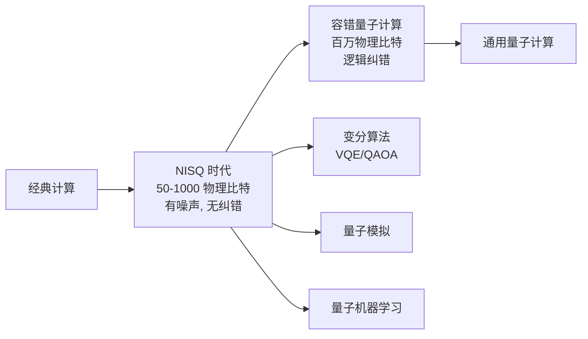
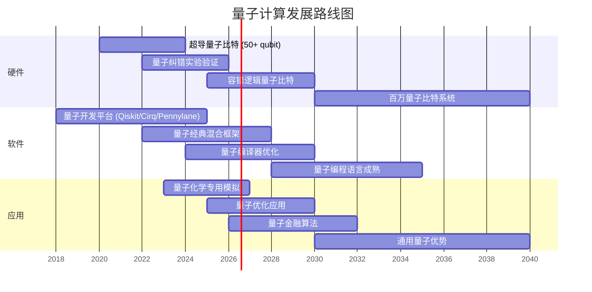

# 量子计算概论

量子计算（Quantum Computing）是一种基于量子力学原理的新型计算范式，利用量子比特（Qubit）的叠加（Superposition）、纠缠（Entanglement）和量子干涉（Quantum Interference）等特性进行信息处理。与传统计算机使用 0 或 1 的比特不同，量子比特可以同时处于 0 和 1 的叠加态，使量子计算机在某些问题上具有指数级的计算优势。这一概念最早由 Richard Feynman 于 1982 年提出，随后 David Deutsch 建立了通用量子计算的理论模型。

## 量子比特与量子门

### 量子比特的数学表示

一个量子比特的状态可表示为二维 Hilbert 空间中的单位向量：

$$ |\psi\rangle = \alpha|0\rangle + \beta|1\rangle, \quad |\alpha|^2 + |\beta|^2 = 1 $$

多量子比特系统通过张量积（Tensor Product）组合：

$$ |\psi\rangle = |\psi_1\rangle \otimes |\psi_2\rangle \otimes \cdots \otimes |\psi_n\rangle $$

### 常见单量子比特门

| 门名称 | 符号 | 矩阵表示 | 作用 |
|:---|:---:|:---:|:---|
| Pauli-X | $X$ | $\begin{pmatrix}0&1\\1&0\end{pmatrix}$ | 比特翻转（类似 NOT） |
| Pauli-Y | $Y$ | $\begin{pmatrix}0&-i\\i&0\end{pmatrix}$ | 相位+比特翻转 |
| Pauli-Z | $Z$ | $\begin{pmatrix}1&0\\0&-1\end{pmatrix}$ | 相位翻转 |
| Hadamard | $H$ | $\frac{1}{\sqrt{2}}\begin{pmatrix}1&1\\1&-1\end{pmatrix}$ | 创建叠加态 |
| Phase | $S$ | $\begin{pmatrix}1&0\\0&i\end{pmatrix}$ | Z 旋转 90° |
| T 门 | $T$ | $\begin{pmatrix}1&0\\0&e^{i\pi/4}\end{pmatrix}$ | Z 旋转 45° |

### 多量子比特门

| 门名称 | 作用 | 矩阵表示 |
|:---|:---|:---:|
| CNOT | 控制非门 | $\begin{pmatrix}1&0&0&0\\0&1&0&0\\0&0&0&1\\0&0&1&0\end{pmatrix}$ |
| SWAP | 交换两比特 | $\begin{pmatrix}1&0&0&0\\0&0&1&0\\0&1&0&0\\0&0&0&1\end{pmatrix}$ |
| Toffoli | CCNOT（三比特） | 受控受控非门 |
| Fredkin | CSWAP | 受控交换门 |

## 纠缠态 （Entanglement）

Bell 态是最大纠缠的两量子比特态：

$$ |\Phi^+\rangle = \frac{|00\rangle + |11\rangle}{\sqrt{2}}, \quad |\Phi^-\rangle = \frac{|00\rangle - |11\rangle}{\sqrt{2}} $$

$$ |\Psi^+\rangle = \frac{|01\rangle + |10\rangle}{\sqrt{2}}, \quad |\Psi^-\rangle = \frac{|01\rangle - |10\rangle}{\sqrt{2}} $$

纠缠在量子通信（Quantum Teleportation）、超密编码（Superdense Coding）和量子密钥分发（QKD）中起核心作用。

## 量子线路与测量

量子线路（Quantum Circuit）由量子比特初始化、量子门序列和测量操作组成。测量操作将量子态坍缩为经典比特：

$$ P(0) = |\langle 0|\psi\rangle|^2, \quad P(1) = |\langle 1|\psi\rangle|^2 $$

## 量子算法

### 主要量子算法

| 算法名称 | 问题 | 加速比 | 提出时间 |
|:---|:---|:---:|:---:|
| Deutsch-Jozsa | 常数/平衡函数判定 | 指数级 | 1992 |
| Shor 算法 | 大整数因子分解 | 指数级 | 1994 |
| Grover 算法 | 无序数据库搜索 | 二次加速 | 1996 |
| HHL 算法 | 线性方程组求解 | 指数级* | 2009 |
| QAOA | 组合优化 | 启发式 | 2014 |
| VQE | 量子化学基态求解 | 启发式 | 2014 |

注：*表示在某些条件下达到指数级加速。

### Shor 算法核心步骤

1. 将因子分解问题转化为周期寻找问题
2. 使用量子傅里叶变换（Quantum Fourier Transform, QFT）寻找周期
3. 利用经典后处理提取质因子

$$ N = p \times q \xrightarrow{\text{Shor}} \text{周期 } r \rightarrow \gcd(a^{r/2} \pm 1, N) $$

### Grover 算法核心思想

$$ \text{搜索次数} = O(\sqrt{N}), \quad \text{经典搜索次数} = O(N) $$

通过振幅放大（Amplitude Amplification）实现二次加速。

## 量子纠错 （Quantum Error Correction）

量子系统面临退相干（Decoherence）和噪声干扰，量子纠错通过冗余编码保护量子信息：

### 典型量子纠错码

| 编码名称 | 逻辑比特 | 物理比特 | 容错阈值 | 特点 |
|:---|:---:|:---:|:---:|:---|
| Steane 码 | 1 | 7 | $\sim 10^{-4}$ | CSS 码 |
| Surface Code | 1 | $d^2$ | $\sim 10^{-2}$ | 高阈值 |
| Shor 码 | 1 | 9 | — | 首个 QEC 码 |
| Gottesman 码 | $k$ | $n$ | 与结构相关 | 稳定子形式 |

Surface Code 的容错率最高，是当前主流实验平台的首选方案。

## 量子计算硬件平台

| 平台类型 | 量子比特类型 | 操作温度 | 相干时间 | 代表性企业 |
|:---|:---|:---:|:---:|:---|
| 超导量子比特 | Transmon | $\sim 15\,\text{mK}$ | $\sim 100\,\mu\text{s}$ | Google, IBM, Rigetti |
| 离子阱 | 囚禁离子 | 室温 | $\sim$ 秒级 | IonQ, Quantinuum |
| 光子 | 极化/路径 | 室温 | $\sim$ 毫秒 | Xanadu, PsiQuantum |
| 中性原子 | Rydberg 原子 | $\sim \mu\text{K}$ | $\sim$ 秒级 | QuEra, Atom Computing |
| 拓扑量子比特 | Majorana 零模 | $\sim \text{mK}$ | 理论鲁棒 | Microsoft |

## NISQ 时代与容错量子计算

当前处于**含噪声中等规模量子**（Noisy Intermediate-Scale Quantum, NISQ）时代：

## 量子门通用性 （Universality）

任意量子计算可由一组通用量子门集近似实现。常见的通用门集包括：

- Clifford + T 门集：$\{H, S, \text{CNOT}, T\}$
- 任意单量子比特旋转 + CNOT
- Toffoli 门 + Hadamard 门

Solovay-Kitaev 定理保证：任何单量子比特门可用 $O(\log^c(1/\epsilon))$ 个来自有限门集的门的序列近似到精度 $\epsilon$。

## 量子傅里叶变换 （QFT）

QFT 是许多量子算法的核心子程序：

$$ \text{QFT}|j\rangle = \frac{1}{\sqrt{N}} \sum_{k=0}^{N-1} e^{2\pi i jk/N} |k\rangle $$

量子傅里叶变换的电路复杂度为 $O(\log^2 N)$，而经典 FFT 的复杂度为 $O(N \log N)$。这一指数级加速是 Shor 算法实现质因子分解的理论基础。

## 量子相位估计 （Quantum Phase Estimation, QPE）

QPE 是 Shor 算法和许多量子化学算法的核心构建块：

给定酉算子 $U$ 和其特征向量 $|u\rangle$，满足 $U|u\rangle = e^{2\pi i \varphi}|u\rangle$，QPE 可估计相位 $\varphi$ 到 $n$ 比特精度，成功概率 $ \geq 1 - \epsilon $，所需量子门数量为 $O(n \log(1/\epsilon))$。

## 变分量子算法

### VQE （Variational Quantum Eigensolver）

VQE 是 NISQ 时代最有前景的量子化学算法，利用量子-经典混合架构：

1. 量子处理器准备参数化量子态 $|\psi(\theta)\rangle$
2. 测量哈密顿量期望值 $E(\theta) = \langle\psi(\theta)|H|\psi(\theta)\rangle$
3. 经典优化器更新参数 $\theta$ 以最小化 $E(\theta)$

$$ H = \sum_i h_i P_i, \quad E(\theta) = \sum_i h_i \langle\psi(\theta)|P_i|\psi(\theta)\rangle $$

### QAOA （Quantum Approximate Optimization Algorithm）

QAOA 用于求解组合优化问题（如 MaxCut），通过交替应用问题哈密顿量和混合哈密顿量来逼近最优解。

## 量子机器学习

### 量子核方法

利用量子特征映射将经典数据映射到量子 Hilbert 空间：

$$ K(x_i, x_j) = |\langle\phi(x_i)|\phi(x_j)\rangle|^2 $$

量子核方法在处理某些具有对称性或结构性模式的数据时可能提供量子优势。

### 量子神经网络 （QNN）

量子神经网络由参数化量子电路（Parameterized Quantum Circuit, PQC）构成，通过变分训练学习数据中的模式。典型的 QNN 模型包括：

- 量子卷积神经网络（QCNN）
- 量子生成对抗网络（QGAN）
- 量子注意力模型

## 量子通信与量子网络

### 量子密钥分发 （QKD）

BB84 协议是首个量子密钥分发协议，其安全性基于量子不可克隆定理（No-Cloning Theorem）和测量塌缩原理。

### 量子隐形传态 （Quantum Teleportation）

利用纠缠对和经典通信，将一个量子态从发送方传输到接收方：

$$ |\psi\rangle_{\text{Alice}} \xrightarrow{\text{Bell 测量 + 经典通信}} |\psi\rangle_{\text{Bob}} $$

### 量子中继器

量子中继器（Quantum Repeater）通过纠缠交换（Entanglement Swapping）和纠缠纯化（Entanglement Purification）克服光子在光纤中的指数衰减，实现长距离量子通信。

## 量子软件与编程框架

| 框架 | 语言 | 开发者 | 特点 |
|:---|:---|:---|:---|
| Qiskit | Python | IBM | 云量子计算、教程丰富 |
| Cirq | Python | Google | NISQ 优化、硬件感知 |
| Pennylane | Python | Xanadu | 量子机器学习自动微分 |
| Q# | 独立语言 | Microsoft | 类型安全、VS 集成 |
| Forest (pyQuil) | Python | Rigetti | 量子+经典混合执行 |
| Braket | Python | Amazon AWS | 多云量子硬件接入 |

## 量子计算的局限性

- **退相干**（Decoherence）：量子态与环境的不可逆耦合导致信息丢失
- **纠错开销**：每个逻辑量子比特需要数千个物理量子比特
- **量子优势验证**：对许多声称优势的问题，经典算法也在快速进步
- **输入/输出瓶颈**：量子数据编码和结果读出限制整体效率
- **可扩展性**：量子比特数量增加时，控制线路和串扰问题加剧

## 应用领域

- **密码学**：Shor 算法威胁 RSA/ECC，量子密钥分发（QKD）保障通信安全
- **药物研发**：量子化学模拟精确计算分子能量和反应路径
- **材料科学**：电子结构计算、超导机理研究
- **优化问题**：组合优化、供应链优化、金融投资组合
- **人工智能**：量子核方法、量子神经网络、量子自然语言处理

## 量子计算路线图

## 相关条目

- [[07_InterdisciplinarySciences/QuantumInformationScience/Cryptography|量子密码学]]
- [[ComputerArchitecture]]
- [[07_InterdisciplinarySciences/QuantumInformationScience/QuantumAlgorithms|量子算法]]
- [[07_InterdisciplinarySciences/QuantumInformationScience/QuantumErrorCorrection|量子纠错]]
- [[05_ComputerScience/MachineLearning/QuantumMachineLearning|量子机器学习]]
