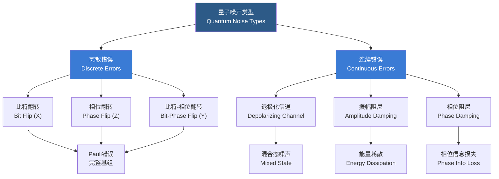

# 量子纠错

## 一、概述

量子纠错（Quantum Error Correction, QEC）是保护量子信息免受噪声（Noise）和退相干（Decoherence）影响的关键技术。由于量子不可克隆定理（No-Cloning Theorem）且测量会破坏量子状态，经典纠错（如重复码）无法直接移植到量子域。量子纠错通过将逻辑量子比特（Logical Qubit）编码到多个物理量子比特（Physical Qubit）的纠缠态（Entangled State）中，实现对错误的检测和纠正。量子纠错是实现容错量子计算（Fault-Tolerant Quantum Computing）的必要前提。

## 二、量子噪声与错误类型

### 2.1 错误类型流程

### 2.2 基本错误类型对比

| 错误类型 | Pauli 算子 | 作用效果 | 物理来源 |
|----------|------------|----------|----------|
| 比特翻转 (Bit Flip) | $X$ | $X\|0\rangle = \|1\rangle$, $X\|1\rangle = \|0\rangle$ | 热涨落、测量错误 |
| 相位翻转 (Phase Flip) | $Z$ | $Z\|0\rangle = \|0\rangle$, $Z\|1\rangle = -\|1\rangle$ | 退相干扰动 |
| 比特-相位翻转 | $Y = iXZ$ | $Y\|0\rangle = i\|1\rangle$, $Y\|1\rangle = -i\|0\rangle$ | 复合噪声过程 |
| 退极化信道 | $\rho \to (1-p)\rho + pI/2$ | 以概率 $p$ 替换为最大混合态 | 各向同性噪声 |
| 振幅阻尼 | $K_0, K_1$ Kraus 算子 | $\|1\rangle \to \|0\rangle$ 不可逆跃迁 | 自发辐射 |
| 相位阻尼 | $K_0, K_1$ Kraus 算子 | 相对相位随机化 | 弹性散射 |

## 三、基本纠错码

### 3.1 重复码与量子纠错的核心差异

| 维度 | 经典重复码 | 量子纠错码 |
|------|-----------|------------|
| 不可克隆 | 可复制比特 | 不可克隆量子态 |
| 测量破坏 | 测量不破坏信息 | 测量会塌缩量子态 |
| 错误类型 | 仅有比特翻转 | 连续错误（无限多种） |
| 错误检测 | 奇偶校验 | 综合征测量（不破坏逻辑态） |

### 3.2 三量子比特码（Three-Qubit Bit Flip Code）

最简单的量子纠错码，仅纠正比特翻转错误：

编码映射：
$$\|0_L\rangle = \|000\rangle$$
$$\|1_L\rangle = \|111\rangle$$

纠错流程：
1. **编码**：将逻辑态映射到三物理比特纠缠态
2. **噪声**：某一个比特可能发生 $X$ 翻转
3. **综合征测量（Syndrome Measurement）**：通过辅助比特进行奇偶校验（Parity Check），不破坏量子信息
4. **恢复**：根据综合征 $s = (s_1, s_2)$ 施加对应的纠正操作

| 错误位置 | 综合征 $(s_1, s_2)$ | 纠正操作 |
|----------|-------------------|----------|
| 无错误 | (0, 0) | $I$（无操作） |
| 比特 1 | (1, 0) | $X_1$ |
| 比特 2 | (1, 1) | $X_2$ |
| 比特 3 | (0, 1) | $X_3$ |

## 四、经典量子纠错码

### 4.1 Shor 九量子比特码（Shor's Nine-Qubit Code）

Shor 码结合了比特翻转码和相位翻转码的保护能力，可纠正任意单量子比特错误（$X$, $Y$, $Z$）。

编码状态：
$$\|0_L\rangle = \frac{(\|000\rangle + \|111\rangle)(\|000\rangle + \|111\rangle)(\|000\rangle + \|111\rangle)}{2\sqrt{2}}$$
$$\|1_L\rangle = \frac{(\|000\rangle - \|111\rangle)(\|000\rangle - \|111\rangle)(\|000\rangle - \|111\rangle)}{2\sqrt{2}}$$

**错误纠正机制**：
- **第一层**：每个三比特块内部使用比特翻转码，纠正块内的比特翻转错误
- **第二层**：通过 $\|+\rangle, \|-\rangle$ 基编码，保护块之间的相位翻转错误
- **纠错能力**：可纠正任意单量子比特上的任意 Pauli 错误

### 4.2 Steane 七量子比特 CSS 码（Steane Code）

Steane 码基于经典 [7, 4, 3] Hamming 码，属于 Calderbank-Shor-Steane（CSS）码家族。

| 属性 | 值 |
|------|-----|
| 编码 | 1 逻辑量子比特 → 7 物理量子比特 |
| 纠错能力 | 任意单量子比特错误 |
| 结构特点 | $X$ 与 $Z$ 错误对称处理 |
| 容错能力 | 支持横向门（Transversal Gates）实现部分容错逻辑门 |

CSS 码的构造：选取两个经典线性码 $C_1$ 和 $C_2$，满足 $C_2^\perp \subseteq C_1$。CSS 码的稳定子（Stabilizer）由 $C_1$ 和 $C_2^\perp$ 的校验矩阵生成。

### 4.3 量子纠错码对比

| 纠错码 | 物理比特数 | 逻辑比特数 | 距离 $d$ | 纠错能力 | 优点 | 缺点 |
|--------|-----------|------------|----------|----------|------|------|
| 3-bit 码 | 3 | 1 | 2 | 1 比特翻转 | 简单直观 | 不抗相位错误 |
| Shor 码 | 9 | 1 | 3 | 任意单比特 | 完整纠错 | 资源消耗多 |
| Steane 码 | 7 | 1 | 3 | 任意单比特 | 对称性好 | 编码复杂 |
| 表面码 (Surface) | $L^2$ | 1 | $L$ | $(L-1)/2$ 比特 | 局域性、高阈值 | 需二维网格 |
| 颜色码 (Color) | 可变 | 可变 | 可变 | 多种 | 可容错门丰富 | 实现门槛高 |

## 五、稳定子形式化（Stabilizer Formalism）

### 5.1 Pauli 群

单量子比特 Pauli 群由 $\{I, X, Y, Z\}$ 与相位因子 $\{\pm 1, \pm i\}$ 构成。$n$ 量子比特 Pauli 群 $P_n$ 是所有 $n$ 次 Pauli 张量积的集合：

$$P_n = \{ \pm 1, \pm i \} \times \{I, X, Y, Z\}^{\otimes n}$$

### 5.2 稳定子码

稳定子（Stabilizer）$S$ 是 Pauli 群的一个阿贝尔子群（Abelian Subgroup），不包含 $-I$。合法码字是所有稳定子算子的 $+1$ 本征态的共同交集：

$$S\|\psi\rangle = \|\psi\rangle, \quad \forall S \in S$$

逻辑子空间（Codespace）的维数由稳定子的秩（Rank）$r$ 决定，编码 $k = n - r$ 个逻辑量子比特。

### 5.3 综合征解码

对每个稳定子生成元 $g_i$ 进行测量，得到综合征向量 $s_i \in \{0, 1\}$。当 $g_i$ 测量结果为 $+1$ 时 $s_i = 0$，为 $-1$ 时 $s_i = 1$。综合征向量 $s = (s_1, s_2, \ldots, s_r)$ 唯一确定错误类型和位置：

$$g_i \|\psi_{\text{err}}\rangle = (-1)^{s_i} \|\psi_{\text{err}}\rangle$$

## 六、表面码（Surface Codes）

### 6.1 拓扑量子纠错

表面码在二维网格上定义，兼具高容错阈值（Threshold）和实验可实现的局域性（Locality）特征。两种主要实现：

- **环面码（Toric Code）**：定义在环面（Torus）上，满足周期边界条件，编码数由拓扑决定
- **平面码（Planar Code）**：定义在平面上，具有开放边界条件，编码 1 个逻辑量子比特

### 6.2 纠错机制

通过测量 plaquette（面）算子 $B_p$ 和 star（顶点）算子 $A_s$ 实现综合征提取：

$$A_s = \prod_{i \in \text{star}(s)} X_i, \quad B_p = \prod_{i \in \partial p} Z_i$$

最小权重完美匹配（Minimum Weight Perfect Matching, MWPM）解码器寻找最可能的错误配置，复杂度 $O(N^3 \log N)$。Union-Find 解码器提供了 $O(N \alpha(N))$ 的线性时间近似。

### 6.3 关键参数

| 参数 | 符号 | 典型值 | 说明 |
|------|------|--------|------|
| 码距 | $d$ | $3, 5, 7, 9, \ldots$ | 可纠正 $(d-1)/2$ 个错误 |
| 物理比特数 | $n$ | $d^2 + (d-1)^2$ | 平面码 |
| 逻辑比特数 | $k$ | 1（平面码） | 可扩展至多逻辑比特 |
| 容错阈值 | $p_{\text{th}}$ | $\sim 1\%$ | 独立错误模型下 |

## 七、无相干子空间（Decoherence-Free Subspace, DFS）

利用系统的集体对称性（Collective Symmetry），在系统与环境耦合对称的特定子空间中编码量子信息。当噪声具有集体对称性（如集体退相位、集体耗散）时，DFS 可以完全免受退相干影响。典型例子是使用两个物理量子比特编码一个逻辑量子比特，对抗集体退相位噪声。

## 八、容错量子计算（Fault-Tolerant Quantum Computing）

### 8.1 阈值定理（Threshold Theorem）

如果每个物理门的错误率低于某个阈值——量子纠错码的容错阈值（Fault-Tolerant Threshold）——则可以通过分层编码（Concatenated Coding）实现任意精度的量子计算。表面码的阈值约为 $p_{\text{th}} \approx 1\%$。

### 8.2 容错门实现

| 方法 | 原理 | 优点 | 缺点 |
|------|------|------|------|
| 横向门 (Transversal Gates) | 对码字的每个物理比特分别执行同一种门 | 不传播块内错误 | 只能实现 Clifford 门 |
| 魔态蒸馏 (Magic State Distillation) | 通过蒸馏高纯度辅助态实现非 Clifford 门 | 可容错实现 $T$ 门 | 资源开销大 |
| 门编织 (Code Twirling) | 不同码块之间的编织操作 | 逻辑门集合完备 | 实现复杂 |
| 格点手术 (Lattice Surgery) | 表面码中相邻码块之间的操作 | 局域性强 | 操作延迟 |

## 九、前沿挑战与研究方向

- **解码器硬件加速**：使用 FPGA 或 ASIC 实现纳秒级实时解码
- **低密度奇偶校验码（Quantum LDPC）**：降低物理量子比特开销
- **与超导、离子阱、拓扑量子比特的实验集成**
- **逻辑量子比特的实测演示**：Google Sycamore、Quantinuum H2 等平台的进展

### 九.1 量子 LDPC 码

低密度奇偶校验码（Low-Density Parity-Check, LDPC）的量子版本，具有恒定编码率 $k/n$ 且物理连接数随 $n$ 线性增长。当前研究热点包括双正交乘积码（Hypergraph Product Codes）和纤维丛码（Fiber Bundle Codes）。

### 九.2 纠错与量子优势的关系

量子纠错的开销是目前实现可扩展量子计算的主要障碍。Google 的 Willow 芯片在表面码上实现了码距 $d=3$ 到 $d=7$ 的逻辑比特性能提升——这是"低于阈值"的关键实验证据。

## 十、解码算法分类

| 解码算法 | 复杂度 | 精度 | 适用码型 | 硬件可行性 |
|----------|--------|------|----------|------------|
| MWPM (最小权重完美匹配) | $O(N^3 \log N)$ | 最优 | 表面码 | 中等 |
| Union-Find | $O(N \alpha(N))$ | 近似最优 | 表面码 | 高 |
| 张量网络 (Tensor Network) | 指数级 | 精确 | LDPC | 低 |
| 神经网络解码器 | $O(N)$ | 近似 | 任意码型 | 高（推理时） |
| 查表解码 (Lookup Table) | $O(1)$ | 精确 | 小码距 | 最高 |

## 相关条目

- [[02_NaturalSciences/Physics/QuantumMechanics/INDEX|QuantumMechanics]]
- [[QuantumComputing]]
- [[02_NaturalSciences/Physics/CondensedMatterPhysics/TopologicalPhases]]
- [[InformationTheory]]
