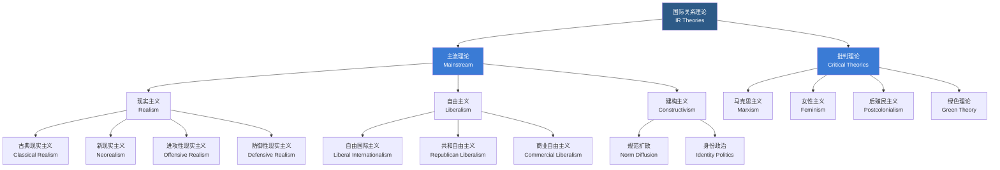

# 国际关系

## 一、概述

国际关系（International Relations, IR）研究国家之间以及非国家行为体（Non-State Actors）之间的政治互动与全球体系运行规律。作为政治学（Political Science）的重要分支，国际关系涵盖国际安全（International Security）、外交政策（Foreign Policy）、国际组织（International Organizations）、全球治理（Global Governance）等广泛议题。现代国际关系学科起源于一战后的威尔逊理想主义（Wilsonian Idealism），经过现实主义（Realism）与行为主义革命（Behavioral Revolution）的塑造，已发展出多元理论范式的综合性学科。

## 二、理论范式（Theoretical Paradigms）

### 2.1 范式总览

### 2.2 主流理论范式对比

| 范式 | 核心分析单元 | 国际体系性质 | 国家目标 | 合作可能性 | 代表学者 |
|------|-------------|--------------|----------|------------|----------|
| 现实主义 | 主权国家 | 无政府、冲突倾向 | 权力/安全最大化 | 低、临时联盟 | Morgenthau, Waltz, Mearsheimer |
| 自由主义 | 国家+非国家行为体 | 无政府但可合作 | 绝对收益最大化 | 高、制度促进 | Keohane, Doyle, Ikenberry |
| 建构主义 | 观念/身份/规范 | 主体间建构 | 身份决定利益 | 取决于共有观念 | Wendt, Finnemore, Katzenstein |
| 马克思主义 | 阶级/资本 | 资本主义世界体系 | 资本积累 | 阶级对立 | Wallerstein, Cox |
| 女性主义 | 性别关系 | 性别等级结构 | 性别解放 | 需结构变革 | Tickner, Enloe |

### 2.3 现实主义（Realism）

以国家为中心，强调权力与安全竞争是国际政治的核心动力。

- **古典现实主义（Classical Realism, Morgenthau）**：人性本恶（人性论基础），权力（Power）是国家的根本目标。《国家间政治》（Politics Among Nations）提出政治现实主义六原则
- **结构现实主义/新现实主义（Structural Realism/Neorealism, Waltz）**：国际体系的无政府状态（Anarchy）决定国家行为；权力分布（极数，Polarity）决定体系稳定性。两极体系比多极体系更稳定
- **进攻性现实主义（Offensive Realism, Mearsheimer）**：大国注定追求地区霸权（Regional Hegemony），安全竞争无法避免。《大国政治的悲剧》论证了这一结构性驱动逻辑
- **防御性现实主义（Defensive Realism）**：国家追求安全而非权力，过度扩张会引发制衡联盟从而得不偿失

### 2.4 自由主义（Liberalism）

强调国际合作、国际制度与民主在促进和平中的作用。

- **康德三角（Kantian Triangle）**：民主政体（Democratic Peace）、经济相互依赖（Economic Interdependence）、国际制度（International Institutions）三者共同促进和平
- **自由制度主义（Liberal Institutionalism, Keohane）**：国际制度降低交易成本、提供信息、促进重复博弈中的合作。《霸权之后》（After Hegemony）论证霸权衰落不等于合作终结
- **民主和平论（Democratic Peace Theory）**：民主国家之间很少发生战争——这是国际关系中最接近经验定律（Empirical Law）的发现
- **复合相互依赖（Complex Interdependence, Keohane & Nye）**：多渠道联系、议题去等级化、军事力量作用下降

### 2.5 建构主义（Constructivism）

强调观念（Ideas）、身份（Identity）与规范（Norms）在国际政治中的建构作用。

- **Wendt 的核心命题**："无政府状态是国家造就的"（Anarchy is What States Make of It）——自助（Self-Help）或合作取决于国家间的共有观念（Shared Ideas）
- **身份决定利益，利益决定行为**：国家身份（自我与他者的关系定位）塑造国家利益认知
- **规范扩散（Norm Diffusion, Finnemore & Sikkink）**：国际规范通过规范倡导者（Norm Entrepreneurs）提出、关键国家采纳、最终社会化与内化的三阶段生命周期模型

### 2.6 其他理论流派

| 流派 | 核心论点 | 关键概念 | 代表著作 |
|------|----------|----------|----------|
| 英国学派 (English School) | 存在"国际社会"——国家间共享规则与制度 | 国际社会、秩序与正义 | Bull《无政府社会》 |
| 批判理论 (Critical Theory) | 揭示国际关系中隐藏的压迫关系 | 历史结构、解放 | Cox《社会力量、国家与世界秩序》 |
| 女性主义 (Feminism) | 性别视角揭示等级与偏见 | 男性气质、性别盲视 | Tickner《国际关系中的性别》 |
| 后殖民主义 (Postcolonialism) | 挖掘殖民历史对当代关系的塑造 | 东方主义、殖民遗留 | Said《东方学》 |

## 三、分析层次（Levels of Analysis）

### 3.1 层次对比

| 层次 | 分析对象 | 变量类型 | 核心问题 | 方法论 |
|------|----------|----------|----------|--------|
| 个体 (Individual) | 领导人、决策者 | 认知、人格、信念 | 决策者特征如何影响外交决策？ | 政治心理学、过程追踪 |
| 国家 (State) | 国家内部结构 | 政体、官僚、利益集团 | 国内政治如何塑造外交行为？ | 比较案例研究、统计 |
| 体系 (System) | 国际结构 | 权力分布、制度环境 | 体系结构如何约束国家行为？ | 大样本统计、博弈论 |

### 3.2 个体层次

关注领导人个人特质、认知心理因素对决策的影响。包括政治心理学（Political Psychology）、领导人人格分析（尤其是 Operational Code 和 Leadership Trait Analysis）、危机决策模型（Crisis Decision-Making）。

### 3.3 国家层次

关注国家内部因素对国际行为的影响：政体类型（民主 vs 威权）、官僚政治（Bureaucratic Politics）、利益集团（Interest Groups）、公众舆论（Public Opinion）、国家-社会关系（State-Society Relations）。

### 3.4 体系层次

关注国际体系的权力分布、制度环境与结构约束。华尔兹的体系理论解释了体系结构（两极 vs 多极）对国家行为的制约。

## 四、国际安全（International Security）

| 概念 | 定义 | 代表理论 | 关键文献 |
|------|------|----------|----------|
| 权力平衡 (Balance of Power) | 通过内部备战或外部结盟对抗霸权 | 均势理论 | Waltz《国际政治理论》 |
| 安全困境 (Security Dilemma) | 一国增强安全导致他国不安全感 | 螺旋模型 | Jervis《国际政治中的知觉与误知觉》 |
| 威慑 (Deterrence) | 可信报复阻止攻击 | 理性威慑理论 | Schelling《冲突的策略》 |
| 联盟困境 (Alliance Dilemma) | 被牵连 vs 被抛弃 | 联盟理论 | Snyder《联盟政治》 |

### 4.1 权力平衡（Balance of Power）

国家通过内部备战（Internal Balancing）或外部结盟（External Balancing）对抗霸权或威胁，维护体系稳定。均势（Equilibrium）是现实主义最核心的概念之一。

### 4.2 安全困境（Security Dilemma）

一国增强自身安全的举措（如军备扩张）被他国视为威胁，导致对方反应性增强军备，形成螺旋式对抗。Jervis 的螺旋模型（Spiral Model）和威慑模型（Deterrence Model）基于意图认知的不同假设。

### 4.3 威慑理论（Deterrence Theory）

通过可信的报复威胁阻止对手发动攻击。核威慑的逻辑核心是"相互确保摧毁"（Mutually Assured Destruction, MAD）。延伸威慑（Extended Deterrence）涉及对盟友的核保护承诺。

### 4.4 联盟理论（Alliance Theory）

- **制衡（Balancing）vs 追随（Bandwagoning）**：面对威胁，国家选择制衡强权还是追随强权？
- **联盟困境（Alliance Dilemma, Snyder）**：被牵连的恐惧（Entrapment）与被抛弃的恐惧（Abandonment）之间的权衡

## 五、国际组织（International Organizations）

### 5.1 主要国际组织对比

| 组织 | 成立年份 | 成员国 | 核心职能 | 决策机制 |
|------|----------|--------|----------|----------|
| 联合国 (UN) | 1945 | 193 | 维护国际和平与安全、发展合作 | 安理会 P5 否决权 |
| 北约 (NATO) | 1949 | 31 | 集体防御 | 协商一致 |
| 世贸组织 (WTO) | 1995 | 164 | 贸易规则制定与争端解决 | 协商一致+反向一致 |
| 国际货币基金组织 (IMF) | 1944 | 190 | 金融稳定、危机贷款 | 加权投票制 |
| 世界银行 (World Bank) | 1944 | 189 | 发展援助、减贫 | 加权投票制 |

### 5.2 联合国（UN）

- **安全理事会（Security Council）**：五个常任理事国（P5: 美、英、法、俄、中）具有否决权（Veto Power），非常任理事国由大会选举，任期两年
- **大会（General Assembly）**：一国一票，决议不具有法律约束力但具有政治道德力量
- **维持和平行动（Peacekeeping Operations）**：蓝盔部队（Blue Helmets），部署于冲突地区，遵循同意、中立、非武力三原则

### 5.3 经济组织

- **世界贸易组织（WTO）**：多边贸易体系的规则制定与争端解决机制
- **国际货币基金组织（IMF）**：维护国际金融稳定，提供危机贷款，附加条件限制（Conditionality）
- **世界银行（World Bank）**：以发展援助与减贫为宗旨，包括国际复兴开发银行（IBRD）和国际开发协会（IDA）

## 六、外交（Diplomacy）

| 外交类型 | 行为体 | 形式 | 特点 |
|----------|--------|------|------|
| 双边外交 (Bilateral) | 两个国家 | 首脑会晤、大使交往 | 直接、灵活 |
| 多边外交 (Multilateral) | 多国/国际组织 | 国际会议、组织常设 | 制度化、机制化 |
| 轨道 II 外交 (Track II) | 非官方行为体 | 学者对话、非政府交流 | 非正式、灵活 |
| 公共外交 (Public Diplomacy) | 政府→外国公众 | 文化传播、媒体交流 | 软实力建设 |

### 6.1 外交政策分析（Foreign Policy Analysis, FPA）

- **理性行为体模型（Rational Actor Model）**：国家被视为统一理性行为体，基于成本-收益分析（Cost-Benefit Analysis）决策
- **官僚政治模型（Bureaucratic Politics Model, Allison）**：决策是不同官僚机构之间博弈与妥协的结果——"位置决定立场"（Where you stand depends on where you sit）
- **群体思维（Groupthink, Janis）**：决策群体追求一致而忽视关键信息的心理现象，导致错误决策

## 七、全球化与全球治理

### 7.1 全球化维度

| 维度 | 核心内容 | 主要驱动力 | 争议焦点 |
|------|----------|------------|----------|
| 经济全球化 | 商品、资本、人员、技术跨国流动 | 跨国公司、贸易自由化 | 不平等加剧、税基侵蚀 |
| 文化全球化 | 全球文化传播与本土文化互动 | 互联网、媒体 | 文化同质化、身份危机 |
| 政治全球化 | 跨国治理机制与全球公民社会 | 国际组织、NGO | 主权侵蚀、民主赤字 |
| 安全全球化 | 安全威胁的跨国化 | 恐怖主义、网络攻击 | 全球安全治理机制不足 |

### 7.2 全球治理

超越主权国家的跨国问题治理机制。涵盖气候变化（Climate Change）、公共卫生（Pandemic）、网络安全（Cybersecurity）、恐怖主义（Terrorism）、难民问题（Refugee Crisis）等。治理网络包括国家、国际组织、非政府组织（NGOs）、跨国公司等多层次行为体。

## 八、当代热点议题

- **大国竞争**：中美战略竞争与全球经济秩序重塑
- **全球公域治理**：网络空间、太空、深海、极地的制度建构
- **气候变化政治**：《巴黎协定》执行机制与气候正义
- **国际秩序转型**：从自由国际秩序到多元复合秩序的讨论
- **技术与安全**：人工智能军事化、网络战、量子计算的战略影响

## 相关条目

- [[03_HumanitiesAndSocialSciences/PoliticalScience/INDEX|PoliticalScience]]
- [[ComparativePolitics]]
- [[AreaStudies]]
- [[GlobalGovernance]]
