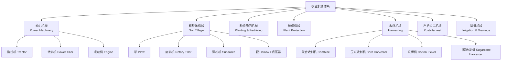

# AgriculturalMachinery

农业机械（Agricultural Machinery）是现代农业的物质基础，指在农业生产过程中用于耕作、种植、管理、收获和产后加工的各种机械设备。农业机械化是农业现代化的重要标志。

## 农业机械的分类体系

## 动力机械

### 拖拉机（Tractor）

拖拉机的核心参数是**功率**（马力，HP / kW）：

$$ \text{小型: < 50 HP} \quad \text{中型: 50-150 HP} \quad \text{大型: > 150 HP} $$

拖拉机的主要组成部分：

$$ \text{Tractor} = \text{Engine} + \text{Transmission} + \text{PTO (动力输出轴)} + \text{Hydraulic System} + \text{Three-Point Hitch} $$

- **PTO（Power Take-Off）**：为配套农具提供旋转动力的标准接口（540 rpm / 1000 rpm）
- **三点悬挂（Three-Point Linkage）**：连接犁、旋耕机等农具的标准化挂接系统

## 耕整地机械

### 土壤耕作的目的

1. 改善土壤的物理结构（透气性、保水性）
2. 清除田间杂草和作物残茬
3. 混合有机肥料和土壤改良剂
4. 制备适合播种的种床

### 主要耕整地机械

| 机具类型 | 工作原理 | 作业深度 | 适用条件 |
|---------|---------|---------|---------|
| 铧式犁（Moldboard Plow） | 翻转耕层，覆盖杂草和残茬 | 20-30 cm | 常规翻耕 |
| 深松机（Subsoiler） | 垂直松土，不翻转土层 | 30-50 cm | 打破犁底层 |
| 旋耕机（Rotary Tiller） | 旋转刀片切碎土壤 | 10-20 cm | 精细整地 |
| 圆盘耙（Disk Harrow） | 圆盘切碎土块 | 5-15 cm | 破碎表土 |
| 驱动耙（Power Harrow） | 垂直旋转碎土 | 5-15 cm | 种床准备 |

## 种植与施肥机械

| 播种机类型 | 工作原理 | 适用作物 |
|-----------|---------|---------|
| 条播机（Drill Seeder） | 开沟-下种-覆土连续作业 | 小麦、水稻、燕麦 |
| 穴播机（Planter） | 定点定量播种 | 玉米、大豆、棉花 |
| 精量播种机（Precision Seeder） | 单粒精确定位播种 | 蔬菜、甜菜 |
| 免耕播种机（No-till Drill） | 不翻耕直接播种 | 保护性耕作 |

### 施肥机械

- **撒肥机**（Fertilizer Spreader）：离心式、气力式
- **施肥播种联合作业机**：一次完成施肥和播种
- **变量施肥机**（VRT Fertilizer）：根据土壤养分图自动调整施肥量

## 植保机械

| 机型 | 工作原理 | 作业效率 | 适用场景 |
|------|---------|---------|---------|
| 背负式喷雾器 | 手动/电动加压雾化 | 1-2 亩/h | 小地块、果园 |
| 悬挂式喷杆喷雾机 | 拖拉机悬挂横杆喷雾 | 20-50 亩/h | 大田作物 |
| 无人机植保 | 多旋翼低空喷洒 | 40-80 亩/h | 各类地形 |
| 风送式喷雾机 | 强力风机输送雾滴 | 50-100 亩/h | 果园、森林 |

## 精准农业（Precision Agriculture）

$$ \text{精准农业核心技术} = \text{GNSS} + \text{GIS} + \text{RS} + \text{Variable Rate Technology (VRT)} $$

- **自动驾驶/导航**：基于 RTK-GNSS 实现厘米级定位，减少重叠和遗漏
- **变量施肥**：根据土壤养分分布图自动调整施肥量
- **产量监测**：联合收割机实时记录产量空间分布数据
- **农业无人机**：植保喷洒、长势监测、航空播种

## 农机管理与维护

| 维护类型 | 周期 | 主要内容 |
|---------|------|---------|
| 每日维护 | 每次作业前后 | 清洁、油水检查、螺栓紧固 |
| 每周维护 | 每工作 40-50 小时 | 更换机油、清洁空滤、检查轮胎 |
| 季度维护 | 每季作业后 | 全面检查、零件更换、防锈处理 |
| 年度大修 | 每年一次 | 发动机检修、传动系统检查、液压系统测试 |

## 农业机械化水平评估

$$ \text{机械化率} = \frac{\text{机械作业面积}}{\text{总作业面积}} \times 100\% $$

中国主要作物综合机械化率（2023 年参考）：
- 小麦：97%+（基本全面机械化）
- 水稻：85%+（机插秧仍是薄弱环节）
- 玉米：90%+
- 棉花：80%+（采棉机大幅提升）

## 未来发展趋势

1. **智能化**：自动驾驶、AI 视觉识别杂草/病虫害
2. **电动化**：电动拖拉机减少碳排放
3. **大型化**：大马力拖拉机 + 宽幅作业机具
4. **多功能化**：一机多用，联合作业
5. **自动化**：从单机自动化到全流程无人化

## 相关条目

- [[FisheriesManagement]]
- [[INDEX|当前目录索引]]
