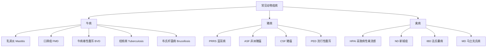

# AnimalHealth

动物健康（Animal Health）是研究动物疾病预防、诊断、治疗与健康管理的综合性学科。现代动物健康管理强调预防为主、防治结合的理念，以群体健康为核心视角，关注动物个体与群体的生理、心理和社会适应状态，保障畜牧业经济效益、动物福利和公共卫生安全。

## 动物健康管理原则

### 预防与治疗对比

| 对比维度 | 预防 | 治疗 |
|----------|------|------|
| 成本 | 低（疫苗、生物安全） | 高（药物、兽医服务） |
| 效果范围 | 群体水平保护 | 个体水平干预 |
| 动物福利 | 优（避免痛苦） | 差（疾病过程不可避免） |
| 经济产出 | 稳定生产 | 可能造成损失 |
| 抗生素使用 | 不依赖 | 需要用药 |

### 群体健康管理

**管理模式**：
- 从个别病畜诊治转向群体生产性能监测
- 建立健康基线数据（发病率、死亡率、淘汰率）
- 定期监测与风险预警
- 预防方案的动态调整

**生产周期健康管理**：
- 新生期：被动免疫（初乳管理）、断奶应激管理
- 生长期：疫苗接种、营养调控
- 繁殖期：生殖健康、围产期管理
- 生产期：泌乳或产蛋健康管理
- 淘汰期：淘汰决策与动物福利

## 常见动物疫病

### 牛病

**乳房炎（Mastitis）**：
- 病原：金黄色葡萄球菌、大肠杆菌、链球菌
- 诊断：CMT（加州乳房炎试验）、体细胞计数（SCC）、细菌培养
- 防控：挤奶后药浴、干奶期治疗、环境卫生
- 经济损失：产奶量下降、弃奶、提前淘汰

**口蹄疫（FMD）**：
- 病原：口蹄疫病毒，7 个血清型
- 症状：口、蹄部水泡和溃烂，跛行
- 防控：疫苗接种（O型、A型、Asia-1型）、扑杀政策、区域封锁

| 牛病 | 病原 | 主要症状 | 防控要点 |
|------|------|----------|----------|
| 结核病 | 牛分枝杆菌 | 慢性咳嗽、消瘦 | 检疫、扑杀 |
| 布氏杆菌病 | 流产布氏杆菌 | 流产、不孕 | 疫苗（S19/RB51）、检疫淘汰 |
| IBR | BHV-1 | 呼吸道症状、流产 | 标记疫苗（gE缺失） |
| 副结核病 | 副结核分枝杆菌 | 慢性腹泻、消瘦 | 检测淘汰、无有效疫苗 |

### 猪病

| 猪病 | 病原 | 主要症状 | 防控要点 |
|------|------|----------|----------|
| 猪瘟（CSF） | CSFV | 高热、出血、高死亡 | 兔化弱毒疫苗 |
| PED | PEDV | 新生仔猪水样腹泻、高死亡率 | 返饲、疫苗免疫 |
| PCV2 | 猪圆环病毒 2型 | 多系统衰竭综合征 | 疫苗有效 |
| 副猪嗜血杆菌病 | H. parasuis | 浆膜炎、关节炎 | 疫苗加管理 |

### 禽病

| 禽病 | 病原 | 主要症状 | 防控要点 |
|------|------|----------|----------|
| IBD | IBDV | 法氏囊萎缩、免疫抑制 | 中间型活疫苗加灭活苗 |
| 传染性支气管炎 | IBV | 呼吸道、肾病变 | 多价疫苗 |
| 马立克氏病 | MDV | 肿瘤、瘫痪 | 1日龄疫苗接种 |
| 禽白血病 | ALV | 肿瘤、免疫抑制 | 检测淘汰净化 |

## 生物安全措施

| 等级 | 措施 | 适用场景 |
|------|------|----------|
| 一级 | 消毒、灭鼠、防鸟 | 基础预防 |
| 二级 | 分区管理、淋浴更衣 | 严格控制场 |
| 三级 | 空气过滤、全进全出 | 高等核心场 |

### 消毒管理

| 消毒对象 | 推荐消毒剂 | 浓度 | 作用时间 |
|----------|------------|------|----------|
| 车辆轮胎 | 过氧乙酸 | 0.5% | 5 分钟 |
| 人员鞋底 | 氢氧化钠 | 2% | 5 分钟 |
| 圈舍空栏 | 福尔马林熏蒸 | 20 mL/m³ | 24 小时 |
| 饮用水 | 次氯酸钠 | 3-5 ppm | 30 分钟 |
| 设备工具 | 季铵盐类 | 0.5% | 15 分钟 |

## 诊断方法

| 方法类型 | 方法 | 原理 | 用途 |
|----------|------|------|------|
| 临床 | 视诊触诊听诊 | 直接观察与检查 | 初步诊断 |
| 血清学 | ELISA | 抗原-抗体-酶标检测 | 大规模筛查 |
| 血清学 | HI | 血凝抑制 | 禽流感、新城疫抗体检测 |
| 分子 | PCR | DNA扩增 | 病原核酸定性 |
| 分子 | RT-qPCR | RNA反转录荧光定量 | 病毒载量定量 |
| 分子 | LAMP | 等温扩增 | 现场快速检测 |
| 分子 | NGS测序 | 高通量测序 | 新病原发现 |

## 抗生素耐药性

### 主要耐药机制

- 酶降解（β-内酰胺酶 ESBLs）
- 靶点修饰（mecA 介导耐甲氧西林）
- 外排泵（tetK、tetL 四环素外排）
- 渗透性降低（膜孔蛋白丢失）
- 靶点保护（qnr 基因）

### 抗生素替代方案

| 替代品 | 作用机制 | 效果 |
|--------|----------|------|
| 益生菌 | 竞争性排斥、分泌抑菌物质 | 中等 |
| 益生元 | 促进有益菌群生长 | 温和 |
| 噬菌体 | 裂解特定病原菌 | 特异性强 |
| 植物精油 | 抗菌活性（香芹酚、百里香酚） | 中等 |
| 抗菌肽 | 破坏细菌膜结构 | 有前景 |

## 营养与代谢疾病

- **产乳热（Milk Fever）**：分娩后血钙急剧下降，治疗用葡萄糖酸钙静脉注射
- **酮病（Ketosis）**：能量负平衡导致体脂动员过度，血 β-羟丁酸 > 1.2 mmol/L
- **瘤胃酸中毒**：精料过多，瘤胃 pH 下降，预防控制 NFC < 40%

## 群体健康监测

**核心 KPI**：
- 繁殖指标：配种率、受胎率、产仔数
- 健康指标：发病率、死亡率、淘汰率
- 生产指标：日增重、料肉比、产奶量
- 环境指标：温湿度、氨气浓度、通风量

$$ \text{受胎率} = \frac{\text{妊娠母畜数}}{\text{配种母畜数}} \times 100\% $$

## 相关条目

[[08_AgriculturalSciences/VeterinaryMedicine/INDEX|VeterinaryMedicine]], [[08_AgriculturalSciences/FoodScience/INDEX|FoodScience]], [[AnimalGenetics]], [[FeedScience]], [[LivestockEconomics]]
