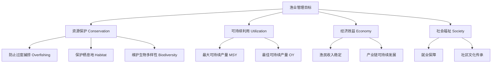

# FisheriesManagement

渔业管理（Fisheries Management）是对渔业资源进行科学管理和可持续利用的实践与政策体系，涉及生物学、生态学、经济学和社会学的综合协调。

## 渔业管理的核心目标

$$ \text{可持续渔业（Sustainable Fisheries）} = \text{生态可持续（Ecological）} + \text{经济可行（Economic）} + \text{社会公平（Social）} $$

## 渔业资源评估的数学模型

### 逻辑斯蒂增长模型与 MSY

种群增长模型：

$$ \frac{dN}{dt} = rN\left(1 - \frac{N}{K}\right) $$

- $N$ = 种群数量
- $r$ = 内在增长率
- $K$ = 环境容纳量

$$ \text{最大可持续产量（MSY）} = \frac{rK}{4} $$

当种群维持在 $N = \frac{K}{2}$ 时，可获得 MSY。

### 捕捞死亡率与总死亡率

$$ Z = F + M $$

- $Z$ = 总瞬时死亡率
- $F$ = 捕捞瞬时死亡率（受捕鱼活动控制）
- $M$ = 自然瞬时死亡率（捕食、疾病、衰老）

## 渔业管理的主要工具

### 投入控制（Input Controls）

| 工具类型 | 具体措施 | 目的 |
|---------|---------|------|
| 许可证制度 | 限制捕捞船只数量 | 控制总捕捞能力 |
| 禁渔期 | 设定特定时间禁止捕鱼 | 保护产卵期 |
| 禁渔区／海洋保护区 | 划定禁止捕鱼的海域 | 保护栖息地和幼鱼 |
| 渔具限制 | 限制网目大小、渔具类型 | 选择性捕捞，减少兼捕 |
| 船舶限制 | 限制船舶吨位和动力 | 控制捕捞强度 |

### 产出控制（Output Controls）

| 工具类型 | 具体措施 |
|---------|---------|
| 总可捕捞量（TAC） | 每年设定最大允许捕捞总量 |
| 个体配额（IQ / ITQ） | 分配给个人或企业可转让的捕捞份额 |
| 最小可捕体长 | 限制只允许捕捞达到性成熟的个体 |
| 副产品限制 | 限制兼捕物种的允许比例 |

## 全球渔业的主要挑战

1. **过度捕捞（Overfishing）**：全球约 34% 的渔业资源被过度开发
2. **兼捕（Bycatch）**：误捕海龟、海豚、海鸟等非目标物种
3. **IUU 捕捞（Illegal, Unreported, Unregulated Fishing）**：非法、不报告、不受管制的捕捞
4. **气候变化**：海水升温、酸化、洋流变化影响鱼类分布与生存
5. **栖息地破坏**：底拖网对海底生态系统的物理破坏

## 水产养殖（Aquaculture）

水产养殖是补充和替代野生捕捞的重要途径，但需要关注可持续性：

$$ \text{饲料转化率（FCR）} = \frac{\text{投入饲料重量}}{\text{鱼体重增加重量}} $$

| 养殖模式 | 特点 | 代表品种 |
|---------|------|---------|
| 池塘养殖 | 传统方式，低密度 | 鲤鱼、罗非鱼 |
| 网箱养殖 | 在水体中进行集约养殖 | 鲑鱼、鲈鱼 |
| 循环水养殖（RAS） | 室内高密度、环保可控 | 虾、石斑鱼 |
| 多营养层次综合养殖（IMTA） | 多物种共养、循环利用 | 鱼+贝+海藻 |

## 中国渔业管理政策

- **伏季休渔制度**：每年夏秋季不同海域设定 2-4 个月禁渔期
- **长江十年禁渔（2021-2031）**：史上最大的内陆水域禁渔计划
- **渔船"双控"政策**：控制渔船数量和功率双增长
- **海洋牧场**：人工鱼礁建设、增殖放流与生态修复

## 种群评估模型对比

| 模型 | 数据需求 | 优点 | 缺点 |
|------|---------|------|------|
| 产量模型（Surplus Production） | 捕捞量和 CPUE 时间序列 | 数据需求低 | 忽略年龄结构 |
| 年龄结构模型（VPA / XSA） | 渔获物年龄组成 | 精度高 | 数据需求大 |
| 长度结构模型（LBSPR） | 渔获物体长分布 | 数据易采集 | 依赖生长参数 |
| 生态系统模型（Ecopath） | 食物网和生态系统数据 | 全面考虑生态关系 | 参数不确定性强 |

## 生态标签与渔业认证

- **MSC（Marine Stewardship Council）**：野生捕捞渔业可持续发展认证
- **ASC（Aquaculture Stewardship Council）**：负责任水产养殖认证
- **BAP（Best Aquaculture Practices）**：最佳水产养殖规范认证

## 相关条目

- [[AgriculturalMachinery]]
- [[INDEX|当前目录索引]]
