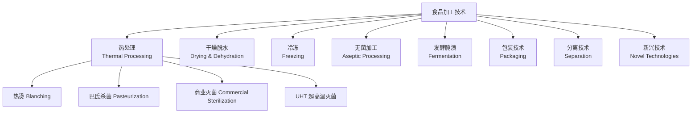

# FoodProcessing

食品加工技术（Food Processing Technology）是将农产原料转化为可食用食品的过程，其核心目标包括：保障食品安全、延长货架期、改善感官品质、增加品种多样性和提高便利性。

食品加工的分类方法多样，按加工深度可分为初加工（清理、分级、包装）和深加工（提取、转化、配制）；按单元操作性质可分为热加工、冷加工、分离、混合、发酵等。

## 食品加工技术体系

## 热处理

热处理是最古老且最常用的食品加工方法，主要目的是灭活微生物和酶，同时改善食品的感官特性。

### 热烫

热烫（Blanching）是在果蔬冷冻或干燥前进行的短时热处理，用于灭活酶类（尤其是多酚氧化酶和过氧化物酶），防止加工和贮存过程中发生酶促褐变。典型条件为 85-100°C 处理 1-10 min。过氧化物酶（POD）因其耐热性较高且检测简便，常作为热烫充分性的指标酶。

### 巴氏杀菌

巴氏杀菌（Pasteurization）是一种温和的热处理方式，旨在灭活食品中的致病菌并降低腐败菌数量：

- **LTLT**（低温长时）：63°C，30 min
- **HTST**（高温短时）：72°C，15 s

ESL（延长货架期）乳制品采用更高温度的巴氏杀菌（125-130°C，2-4 s）结合无菌灌装，可将货架期延长至 30-45 天。

### 商业灭菌与 UHT

罐头食品的典型灭菌条件为 121°C。食品的 pH 是确定杀菌强度的关键：低酸食品（pH > 4.6）需高温灭菌，高酸食品（pH < 4.6）可在 100°C 以下杀菌。

UHT（超高温瞬时灭菌）在 135-150°C 处理 2-5 s，配合无菌灌装可实现常温保存。

### 热加工参数计算

**D 值**（Decimal reduction time）：在特定温度下使微生物数量减少 90% 所需时间。

$$ D = \frac{t}{\log N_0 - \log N} $$

**z 值**：使 D 值变化 10 倍所需的温度变化。

$$ z = \frac{T_2 - T_1}{\log D_1 - \log D_2} $$

**F₀ 值**：在 121°C 下达到与给定热处理等效的致死效果所需时间（min）。

$$ F_0 = \int_0^t 10^{(T-121)/z} dt $$

常见微生物的 D 值和 z 值：

| 微生物 | D₁₂₁（min） | z 值（°C） |
|--------|------------------|-------------------|
| C. botulinum 芽孢 | 0.1-0.3 | 10 |
| C. sporogenes 芽孢 | 0.8-1.5 | 10-11 |
| B. stearothermophilus 芽孢 | 1.5-5.0 | 7-10 |
| 沙门氏菌（营养细胞） | D₆₅.₆ = 0.03-0.5 | 4-6 |

## 干燥与脱水

干燥通过去除水分降低水分活度（a_w），从而抑制微生物生长和酶促反应。

### 干燥方法

| 方法 | 原理 | 优点 | 局限性 | 应用实例 |
|------|------|------|--------|----------|
| 热风干燥 | 热空气对流 | 设备简单、成本低 | 品质损失大 | 脱水蔬菜、水果干 |
| 喷雾干燥 | 雾化后热风干燥 | 快速、适合热敏物料 | 设备成本高 | 奶粉、速溶咖啡 |
| 冷冻干燥 | 冰晶升华 | 品质最优、复水性好 | 能耗高、周期长 | 冻干咖啡、疫苗 |
| 滚筒干燥 | 加热滚筒表面干燥 | 适用于黏性物料 | 热负荷大 | 马铃薯泥、婴儿米粉 |
| 渗透脱水 | 高渗溶液脱水 | 可保留风味 | 仅部分脱水 | 果脯、蜜饯 |

### 干燥动力学

Page 模型常用于描述薄层干燥过程：

$$ \frac{M - M_e}{M_0 - M_e} = \exp(-kt^n) $$

其中 M 为水分含量，M₀ 为初始水分含量，Mₑ 为平衡水分含量，k 为干燥常数，n 为 Page 指数。

## 冷冻

冷冻将食品温度降至冰点以下，使大部分水分凝固，抑制微生物生长和化学反应。

快速冷冻（如液氮冷冻、IQF）形成细小冰晶，对细胞结构损伤小；慢速冷冻形成大冰晶，会破坏细胞壁和细胞膜，导致解冻后汁液流失严重。

| 方法 | 冷媒 | 冷冻速率 | 典型产品 |
|------|------|----------|----------|
| 鼓风冷冻 | -30 至 -40°C 冷空气 | 中速 | 蔬菜、薯条 |
| 平板接触冷冻 | -40°C 金属板 | 快速 | 鱼片、汉堡饼 |
| 流化床冷冻（IQF） | -30 至 -40°C 气流 | 快速 | 豌豆、玉米粒 |
| 浸渍冷冻 | 低温盐水/糖液 | 快速 | 水果 |
| 低温冷冻 | 液氮（-196°C） | 极快速 | 高档食品 |

## 发酵与腌渍

发酵是利用微生物或酶对食品成分进行生物转化。发酵类型包括乳酸发酵、乙醇发酵、醋酸发酵和发酵剂发酵。

### 发酵参数控制

关键控制参数：温度、pH、溶氧、基质浓度和接种量。乳酸发酵为典型的厌氧发酵，醋酸发酵为好氧发酵。

### 发酵生物反应器

工业发酵使用生物反应器（发酵罐）控制发酵环境，类型包括搅拌罐式反应器（STR）、气升式反应器和固定化细胞反应器。

## 包装技术

| 材料 | 阻氧性 | 阻湿性 | 机械强度 | 透明性 | 典型用途 |
|------|--------|--------|----------|--------|----------|
| 玻璃 | 极优 | 极优 | 脆性 | 透明 | 罐头、饮料瓶 |
| 金属（马口铁/铝） | 极优 | 极优 | 高 | 不透明 | 罐头、易拉罐 |
| 聚乙烯（PE） | 差 | 中等 | 较柔韧 | 半透明 | 薄膜、保鲜袋 |
| 聚丙烯（PP） | 中等 | 良好 | 较高 | 透明 | 瓶盖、盒体 |
| 聚酯（PET） | 良好 | 良好 | 高 | 透明 | 饮料瓶、托盘 |
| EVOH | 极优 | 中等 | 中等 | 透明 | 多层共挤阻隔层 |

## 膜分离技术

| 技术 | 截留分子量 | 操作压力（bar） | 典型应用 |
|------|------------|-----------------|----------|
| MF | > 100 kDa | 0.5-2 | 除菌、澄清 |
| UF | 1-100 kDa | 1-10 | 蛋白浓缩、乳清分离 |
| NF | 200-1000 Da | 5-20 | 部分脱盐、糖浓缩 |
| RO | < 200 Da | 10-70 | 浓缩、水纯化 |

## 新兴加工技术

| 技术 | 适用食品形态 | 主要效果 | 工业化水平 |
|------|-------------|----------|-----------|
| HPP | 液体、半固体、固体 | 冷杀菌、改善质构 | 大规模商业化 |
| PEF | 均匀液体 | 冷杀菌、细胞通透 | 中等规模 |
| 欧姆加热 | 含颗粒液体 | 均匀快速加热 | 商业化 |
| 冷等离子体 | 固体表面 | 表面杀菌 | 研发/试点 |
| 超声波 | 液体 | 均质、提取 | 商业化 |
| 微波 | 多种 | 快速加热 | 大规模商业化 |

## 相关条目

- [[FoodChemistry]]
- FoodEngineering
- Preservation
- [[Biotechnology]]
