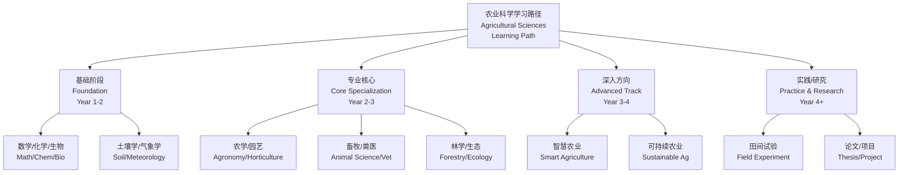
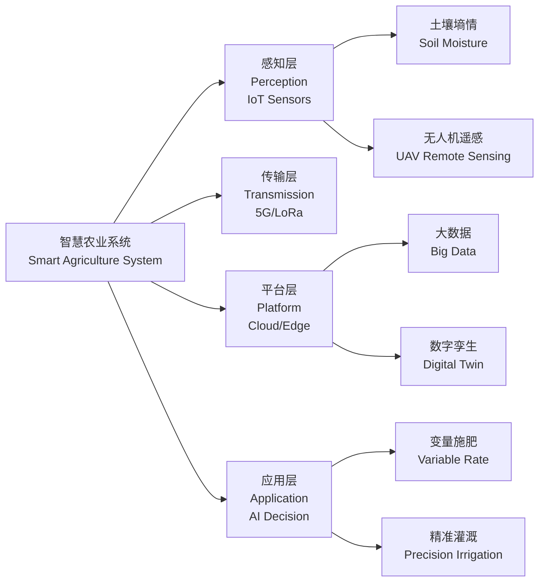

# 农业科学学习路径 (Agricultural Sciences Learning Path)

## 概述 (Overview)

农业科学（Agricultural Sciences）是研究农业生物、环境、资源与人类社会经济关系的综合性学科群。本学习路径涵盖**农学 (Agronomy)**、**园艺学 (Horticulture)**、**畜牧科学 (Animal Science)**、**林学 (Forestry)** 四大核心分支，为系统性学习提供指引。

## 第一阶段：基础学科 (Phase 1: Foundational Sciences)

### 数学与统计 (Mathematics & Statistics)

| 课程 (Course) | 核心内容 (Core Content) | 农业应用 (Agricultural Application) |
|--------------|------------------------|----------------------------------|
| 高等数学 (Calculus) | 微积分、微分方程 | 生长模型、扩散过程 |
| 线性代数 (Linear Algebra) | 矩阵、特征值 | 多变量育种值估计 |
| 概率统计 (Probability & Statistics) | 假设检验、回归分析 | 田间试验设计、产量预测 |
| 生物统计 (Biostatistics) | 方差分析、混合模型 | 遗传评估、环境效应分离 |

关键统计概念：

$$
Y_{ij} = \mu + \tau_i + \varepsilon_{ij}
$$

单因素方差分析（One-Way ANOVA）模型，其中 $\mu$ 为总体均值，$\tau_i$ 为处理效应，$\varepsilon_{ij} \sim N(0, \sigma^2)$ 为随机误差。

### 化学基础 (Chemistry Foundations)

- **普通化学 (General Chemistry)**：原子结构、化学键、热力学
- **有机化学 (Organic Chemistry)**：碳水化合物、蛋白质、脂类、核酸
- **生物化学 (Biochemistry)**：代谢途径、酶动力学、信号转导
- **土壤化学 (Soil Chemistry)**：离子交换、pH 缓冲、养分有效性

米氏方程（Michaelis-Menten Equation）描述酶促反应速率：

$$
v = \frac{V_{max} [S]}{K_m + [S]}
$$

### 生物学基础 (Biology Foundations)

| 课程 (Course) | 重点 (Focus) | 农业关联 (Agricultural Relevance) |
|--------------|-------------|--------------------------------|
| 植物学 (Botany) | 解剖、生理、分类 | 作物识别、栽培管理 |
| 动物学 (Zoology) | 解剖、生理、行为 | 畜禽饲养、福利评估 |
| 微生物学 (Microbiology) | 细菌、真菌、病毒 | 土壤肥力、病害防控 |
| 遗传学 (Genetics) | 孟德尔定律、分子遗传 | 育种、转基因技术 |
| 生态学 (Ecology) | 种群、群落、生态系统 | 农业生态、害虫管理 |

## 第二阶段：专业核心 (Phase 2: Core Specialization)

### 农学 (Agronomy)

**作物栽培学与耕作学 (Crop Cultivation & Farming Systems)**：

| 模块 (Module) | 知识点 (Key Points) | 实践技能 (Practical Skills) |
|--------------|--------------------|---------------------------|
| 作物生理学 | 光合作用、源库关系 | 叶绿素荧光测定 |
| 土壤肥力 | N-P-K 管理、有机质 | 土壤测试与施肥处方 |
| 水分管理 | 蒸散、灌溉制度 | 滴灌/喷灌设计 |
| 耕作制度 | 轮作、间作、保护性耕作 | 田间试验设计 |

作物生长模型（Crop Growth Model）：

$$
W(t) = W_{max} \left(1 + e^{-k(t-t_0)}\right)^{-1}
$$

Logistic 生长曲线，$W_{max}$ 为最大生物量，$k$ 为生长速率参数，$t_0$ 为生长拐点时间。

### 园艺学 (Horticulture)

| 分支 (Branch) | 研究对象 (Research Object) | 关键技术 (Key Technology) |
|--------------|--------------------------|-------------------------|
| 果树学 (Pomology) | 苹果、柑橘、葡萄等 | 修剪、疏花疏果、采后生理 |
| 蔬菜学 (Olericulture) | 番茄、黄瓜、叶菜等 | 设施栽培、无土栽培 |
| 观赏园艺 (Ornamental Horticulture) | 花卉、园林植物 | 花期调控、组织培养 |
| 采后技术 (Postharvest) | 保鲜、贮藏、物流 | 气调贮藏、冷链管理 |

呼吸跃变（Climacteric）果实乙烯生成：

$$
\text{ACC} \xrightarrow{\text{ACC oxidase}} \text{C}_2\text{H}_4 + \text{CO}_2 + \text{HCN}
$$

### 畜牧科学 (Animal Science)

| 模块 (Module) | 核心内容 (Core Content) | 量化指标 (Quantitative Indices) |
|--------------|------------------------|------------------------------|
| 动物营养 (Animal Nutrition) | 能量代谢、蛋白质利用 | ME、NE、CP、AA 平衡 |
| 动物遗传育种 (Animal Breeding) | 选择指数、BLUP | 遗传进展 $\Delta G = \frac{i \cdot r \cdot \sigma_A}{L}$ |
| 繁殖技术 (Reproduction) | 发情鉴定、人工授精、胚胎移植 | 受胎率、产仔数 |
| 环境控制 (Environmental Control) | 畜舍通风、温湿度 | THI（温湿指数） |

遗传进展公式（Genetic Gain）：

$$
\Delta G = \frac{i \cdot r \cdot \sigma_A}{L}
$$

其中 $i$ 为选择强度，$r$ 为估计准确度，$\sigma_A$ 为加性遗传标准差，$L$ 为世代间隔。

### 林学 (Forestry)

| 模块 (Module) | 研究内容 (Research Content) | 方法工具 (Methods & Tools) |
|--------------|---------------------------|--------------------------|
| 森林生态 (Forest Ecology) | 演替、生物多样性、碳循环 | 样地调查、遥感 |
| 森林经理 (Forest Management) | 生长收获、经营方案 | 蓄积量公式、生长模型 |
| 森林培育 (Silviculture) | 造林、抚育、更新 | 种子园、容器育苗 |
| 森林保护 (Forest Protection) | 火灾、病虫害、入侵种 | 火险等级、IPM |

立木蓄积量（Standing Volume）计算：

$$
V = g \cdot h \cdot f
$$

其中 $g$ 为胸高断面积，$h$ 为树高，$f$ 为形数。

## 第三阶段：交叉与前沿 (Phase 3: Interdisciplinary & Frontiers)

### 智慧农业 (Smart Agriculture)

### 可持续农业 (Sustainable Agriculture)

| 策略 (Strategy) | 原理 (Principle) | 实践 (Practice) |
|----------------|-----------------|---------------|
| 保护性农业 (Conservation Agriculture) | 最小土壤扰动、永久覆盖、多样化轮作 | 免耕、覆盖作物 |
| 有机农业 (Organic Farming) | 禁止化学合成投入品 | 堆肥、生物防治 |
| 循环农业 (Circular Agriculture) | 废弃物资源化 | 种养结合、沼气工程 |
| 气候智慧型农业 (CSA) | 适应 + 减缓 + 粮食安全 | 耐旱品种、碳汇林 |

### 农业生物技术 (Agricultural Biotechnology)

- **分子标记辅助选择 (MAS)**：SNP、SSR、GWAS
- **基因编辑 (Gene Editing)**：CRISPR-Cas9 在作物改良中的应用
- **合成生物学 (Synthetic Biology)**：微生物固氮、生物固碳
- **组学技术 (Omics)**：基因组学、转录组学、代谢组学、表型组学

## 学习资源 (Learning Resources)

| 类型 (Type) | 资源 (Resource) | 说明 (Description) |
|------------|----------------|------------------|
| 教材 | 《农业概论》《作物栽培学》《动物营养学》 | 国内经典教材 |
| 期刊 | *Nature Plants*, *The Plant Cell*, *Journal of Dairy Science* | 顶刊 |
| 数据库 | FAO Stat、USDA NASS、中国种植业信息网 | 统计数据 |
| 在线课程 | Coursera Sustainable Food Production、中国大学 MOOC | 免费课程 |
| 软件 | R/Python（统计）、APSIM/DSSAT（模型）、QGIS（GIS） | 工具 |

## 职业方向 (Career Paths)

| 方向 (Direction) | 岗位 (Positions) | 所需技能 (Required Skills) |
|-----------------|-----------------|--------------------------|
| 科研教育 | 高校、农科院、推广站 | 论文写作、项目申请 |
| 农业企业 | 种业、农资、食品 | 市场分析、产品开发 |
| 政府机构 | 农业农村部门、海关检疫 | 政策法规、行政管理 |
| 国际组织 | FAO、CGIAR、WFP | 英语、跨文化沟通 |
| 农业创业 | 家庭农场、农业科技公司 | 商业计划、技术应用 |

## 参考文献 (References)

1. 刘巽浩. (2019). 《农业概论》. 中国农业出版社.
2. 李振声 等. (2018). 《作物栽培学》. 中国农业出版社.
3. 杨凤. (2016). 《动物营养学》. 中国农业出版社.
4. 孙儒泳. (2017). 《基础生态学》. 高等教育出版社.
5. FAO. (2023). *The State of Food and Agriculture*. Rome.
