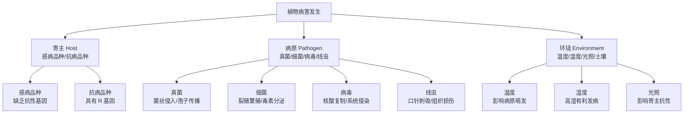
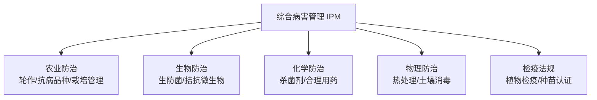

# PlantPathology

植物病理学（Plant Pathology）是研究植物病害的病原物种类、病害发生发展规律、寄主与病原相互作用机理以及病害防治策略的学科。植物病理学为保障农业生产安全、减少病害造成经济损失提供理论基础与技术支撑。

## 植物病害三角

### 三角要素

$$ D = f(H, P, E) $$

式中，D 为病害严重程度，H 为寄主感病性，P 为病原物致病力，E 为环境适宜度，三者交互作用决定病害发生的强度。

## 病原物分类

### 真菌（Fungi）

| 门类 | 代表属 | 引起病害 | 有性孢子 |
|------|--------|----------|----------|
| 鞭毛菌门 | 疫霉属（Phytophthora） | 晚疫病、疫霉根腐 | 卵孢子 |
| 子囊菌门 | 白粉菌属（Erysiphe） | 白粉病 | 子囊孢子 |
| 担子菌门 | 锈菌属（Puccinia） | 锈病 | 担孢子 |
| 半知菌类 | 镰刀菌属（Fusarium） | 枯萎病、根腐病 | 未知或缺如 |

**致病机制**：
- 机械压力：侵入钉穿透角质层和细胞壁
- 酶解作用：分泌果胶酶、纤维素酶降解组织
- 毒素产生：致病毒素破坏寄主细胞功能

### 细菌（Bacteria）

**主要属种**：
- Pseudomonas syringae：丁香假单胞菌，引起叶斑病
- Ralstonia solanacearum：青枯雷尔氏菌，引起青枯病
- Xanthomonas oryzae：水稻黄单胞菌，引起白叶枯病
- Erwinia amylovora：解淀粉欧文氏菌，引起火疫病

### 病毒（Virus）

**传播方式**：
- 媒介传播：蚜虫、叶蝉、粉虱、蓟马等
- 汁液传播：机械摩擦接触
- 种子传播：种胚带毒
- 嫁接传播：通过维管束系统

### 线虫（Nematoda）

**主要类群**：
- 根结线虫（Meloidogyne spp.）：引起根结，影响水分和养分吸收
- 胞囊线虫（Heterodera spp.）：大豆胞囊线虫为重要检疫对象
- 根腐线虫（Pratylenchus spp.）：引起根系腐变坏死

## 病害循环

### 初侵染

**侵染来源**：
- 病残体：田间遗留的带病组织
- 土壤：病原物在土壤中营腐生或形成休眠体
- 种子：种传病害的初侵染源
- 中间寄主：杂草或野生植物作为病原物的桥梁寄主

**侵入途径**：
- 直接侵入：真菌通过角质层和表皮细胞壁直接穿透
- 自然孔口：气孔、水孔、皮孔为细菌和某些真菌的侵入通道
- 伤口：机械损伤、虫伤为病原物提供侵入入口

### 再侵染

**传播方式**：
- 气流传播：真菌孢子随气流远距离扩散
- 雨水传播：雨滴飞溅携带病原物
- 昆虫传播：媒介昆虫携带病毒或细菌
- 人为传播：农事操作、机械作业传播

**潜育期（Incubation Period）**：

$$ T = \frac{K}{t - t_0} $$

式中，T 为潜育期（天），K 为有效积温常数，t 为环境温度，t₀ 为最低发育温度。

## 抗病性机制

### 结构抗病性

- **物理屏障**：表皮角质层厚度阻止真菌侵入
- **细胞壁结构**：木质化、硅质化增强机械强度
- **气孔结构**：气孔密度和开闭行为影响细菌入侵

### 生理生化抗病性

**过敏反应（Hypersensitive Response, HR）**：
- 局部细胞程序性坏死，限制病原物扩展
- 活性氧爆发和信号传导激活防御基因

**抗菌物质合成**：
- 植保素（Phytoalexins）：诱导合成的低分子抗菌化合物
- 酚类物质：氧化成醌类抑制病原物生长
- 病程相关蛋白（PR 蛋白）：几丁质酶、β-1,3-葡聚糖酶

### 分子抗病性

**抗病基因（R 基因）**：
- 编码核苷酸结合-富亮氨酸重复（NBS-LRR）蛋白
- 直接或间接识别病原物效应因子
- 激活下游防御信号通路

**信号转导通路**：

| 通路 | 关键分子 | 主要功能 |
|------|----------|----------|
| SA 通路 | 水杨酸、NPR1 | 系统获得抗性（SAR），活体营养型病原 |
| JA 通路 | 茉莉酸、COI1 | 诱导系统抗性（ISR），死体营养型病原 |
| ET 通路 | 乙烯、EIN2 | 协同 JA 通路，调节防御基因表达 |

## 病害诊断方法

### 传统诊断

**症状观察**：
- 症状类型：坏死、萎蔫、畸形、变色、腐烂
- 发病部位：根、茎、叶、花、果实
- 发病条件：田间分布、气候条件、栽培管理

**显微镜检查**：
- 病原形态观察：菌丝、孢子、子实体
- 染色技术：革兰氏染色（细菌）、乳酚棉蓝（真菌）
- 保湿培养：诱导产生典型分生孢子

### 分子诊断

**PCR 技术**：
- 特异性引物设计：基于核糖体 ITS 区或特异性基因
- 实时荧光定量 PCR（qPCR）：定量检测病原物
- 多重 PCR：同时检测多种病原物

**血清学方法**：
- ELISA（酶联免疫吸附测定）：快速检测病毒
- 免疫荧光技术：标记特异性抗体
- 免疫层析试纸条：现场快速诊断

### 快速诊断技术

- **胶体金试纸条**：操作简便，15-30 分钟出结果
- **光谱技术**：近红外光谱（NIR）无损检测植株健康状况
- **高光谱成像**：早期病害识别
- **叶绿素荧光成像**：检测光合系统损伤

## 综合防治策略（IPM）

- **农业防治**：轮作倒茬、种植抗病品种、合理密植、平衡施肥
- **生物防治**：木霉菌、枯草芽孢杆菌、荧光假单胞菌
- **化学防治**：对症用药、适时用药、轮换用药、安全间隔期
- **物理防治**：种子热处理、土壤蒸汽消毒、防虫网
- **植物检疫**：防止危险性病原物传入和扩散

## 相关条目

[[08_AgriculturalSciences/CropScience/INDEX|CropScience]], [[Entomology]], [[08_AgriculturalSciences/Horticulture/INDEX|Horticulture]], [[PesticideScience]], [[WeedScience]]
