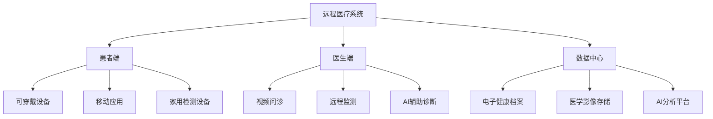

---
aliases: [DigitalHealth, 数字健康, 健康信息化]
tags: ['09_MedicineAndHealth', 'DigitalHealth', 'HealthInformatics']
created: 2026-06-27
updated: 2026-06-27
---

# 数字健康 (Digital Health)

## 一、概述

数字健康（Digital Health）是医疗保健与信息技术的交叉领域，利用数字技术改善健康 outcomes、提高医疗效率和降低成本。2024-2026年，AI、大数据、物联网和基因组学的融合推动数字健康进入快速发展期。

## 二、远程医疗 (Telemedicine)

### 2.1 发展现状

| 指标 | 2019年 | 2024年 | 增长 |
|------|--------|--------|------|
| 美国远程医疗使用率 | 0.1% | 17% | 170x |
| 全球远程医疗市场规模 | 500亿美元 | 1860亿美元 | 3.7x |
| 中国互联网医疗用户 | 2.1亿 | 3.6亿 | 1.7x |

### 2.2 技术架构

## 三、AI 辅助诊断

### 3.1 医学影像AI

| 应用 | 技术 | 代表产品 | FDA批准状态 |
|------|------|---------|------------|
| 糖尿病视网膜病变 | 深度学习 | IDx-DR | 已批准 |
| 肺结节检测 | CNN | Lunit INSIGHT | 已批准 |
| 乳腺癌筛查 | 深度学习 | Transpara | 已批准 |
| 脑卒中检测 | CNN | Viz.ai | 已批准 |
| 心电图分析 | 深度学习 | Apple Watch ECG | 已批准 |

### 3.2 AI诊断性能

| 任务 | AI性能 | 人类专家 | 提升 |
|------|--------|---------|------|
| 皮肤癌分类 | 95% | 87% | +8% |
| 糖尿病视网膜病变 | 97% | 91% | +6% |
| 肺癌筛查 | 94% | 88% | +6% |
| 乳腺癌病理 | 99% | 96% | +3% |

## 四、可穿戴健康监测

### 4.1 设备类型

| 设备 | 监测参数 | 代表产品 | 精度 |
|------|---------|---------|------|
| 智能手表 | 心率、血氧、ECG、睡眠 | Apple Watch, Samsung Galaxy Watch | 医疗级 |
| 连续血糖监测 | 血糖水平 | Dexcom G7, Abbott Libre | 医疗级 |
| 智能戒指 | 心率、体温、血氧 | Oura Ring | 消费级 |
| 智能贴片 | 心电、呼吸、体温 | VitalConnect | 医疗级 |
| 智能服装 | 心电、呼吸、运动 | Hexoskin | 研究级 |

### 4.2 健康数据生态

$$
\text{数据采集} \rightarrow \text{数据传输} \rightarrow \text{数据存储} \rightarrow \text{AI分析} \rightarrow \text{健康洞察} \rightarrow \text{干预行动}
$$

## 五、电子健康档案 (EHR)

### 5.1 全球EHR采用率

| 地区 | 采用率 | 代表系统 |
|------|--------|---------|
| 美国 | 96% | Epic, Cerner |
| 英国 | 98% | NHS Spine |
| 中国 | 85% | 医院HIS系统 |
| 欧盟 | 90% | 各国系统 |

### 5.2 互操作性挑战

- **数据标准**：HL7 FHIR 成为全球标准
- **数据交换**：跨机构、跨区域数据共享
- **隐私保护**：HIPAA、GDPR 合规要求
- **数据质量**：结构化 vs 非结构化数据

## 六、数字疗法 (Digital Therapeutics)

### 6.1 定义与分类

数字疗法（DTx）是基于软件的循证治疗干预措施：

| 类型 | 描述 | 代表产品 |
|------|------|---------|
| 认知行为疗法 | 心理健康干预 | Woebot, Wysa |
| 慢病管理 | 糖尿病、高血压管理 | Omada, Livongo |
| 药物依从性 | 提高用药依从性 | Proteus Digital Health |
| 康复训练 | 中风、骨科康复 | MindMaze |

### 6.2 监管框架

- **美国**：FDA 数字健康创新行动计划
- **欧盟**：MDR 医疗器械法规
- **中国**：NMPA 数字疗法分类注册

## 七、基因组学与精准医疗

### 7.1 基因检测应用

| 应用 | 技术 | 意义 |
|------|------|------|
| 药物基因组学 | 基因检测 | 个性化用药 |
| 遗传病筛查 | 全外显子测序 | 早期干预 |
| 肿瘤基因组 | 液体活检 | 精准治疗 |
| 无创产前检测 | NIPT | 胎儿异常筛查 |

### 7.2 精准医疗进展

$$
\text{基因组数据} + \text{临床数据} + \text{生活方式数据} \rightarrow \text{个性化治疗方案}
$$

## 八、健康大数据与AI

### 8.1 数据类型

| 数据类型 | 规模 | 应用 |
|---------|------|------|
| 医学影像 | PB级 | AI辅助诊断 |
| 电子病历 | EB级 | 疾病预测 |
| 基因组数据 | PB级 | 精准医疗 |
| 可穿戴数据 | TB级/天 | 健康监测 |
| 医学文献 | TB级 | 知识发现 |

### 8.2 AI应用场景

- **疾病预测**：基于多模态数据的早期预警
- **药物发现**：靶点识别、分子设计
- **临床决策支持**：诊疗建议、用药推荐
- **医院运营**：资源调度、流程优化

## 九、数字健康挑战与趋势

### 9.1 当前挑战

1. **数据隐私**：健康数据的安全与合规
2. **互操作性**：不同系统间的数据交换
3. **数字鸿沟**：老年患者的技术使用障碍
4. **监管适应**：快速创新与监管平衡
5. **商业模式**：数字健康产品的支付方

### 9.2 未来趋势

1. **AI原生医疗**：AI深度融入诊疗全流程
2. **预防性医疗**：从治疗转向预防
3. **去中心化医疗**：家庭和社区医疗服务
4. **数字孪生**：患者数字模型用于模拟治疗
5. **脑机接口**：神经疾病治疗新范式

## 相关条目

- [[09_MedicineAndHealth/Pharmacy/DrugDesign|DrugDesign]]
- [[09_MedicineAndHealth/ClinicalMedicine/ClinicalDiagnosis|ClinicalDiagnosis]]
- [[PublicHealth]]
- [[09_MedicineAndHealth/PublicHealth/Epidemiology|Epidemiology]]

## 参考资源

1. WHO. "Global Strategy on Digital Health 2020-2025."
2. FDA. "Digital Health Innovation Action Plan."
3. Topol, E. (2019). *Deep Medicine: How Artificial Intelligence Can Make Healthcare Human Again*
4. McKinsey. "Digital Health: A Path to Value." 2024.

