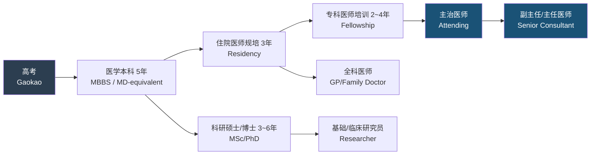

# 学习路径：医学与健康 (Medicine and Health Learning Path)

> 医学是研究人体结构、功能、疾病发生发展规律以及疾病预防、诊断、治疗和康复的科学体系，其目标是维护和促进人类健康。

## 学科全景 (Disciplinary Panorama)

```mermaid
graph TD
  A["医学与健康<br/>Medicine & Health"] --> B["基础医学<br/>Basic Medicine"]
  A --> C["临床医学<br/>Clinical Medicine"]
  A --> D["公共卫生<br/>Public Health"]
  A --> E["药学<br/>Pharmacy"]
  A --> F["护理与康复<br/>Nursing & Rehab"]
  B --> G["人体解剖学<br/>Anatomy"]
  B --> H["生理学<br/>Physiology"]
  B --> I["病理学<br/>Pathology"]
  B --> J["药理学<br/>Pharmacology"]
  B --> K["免疫学<br/>Immunology"]
  C --> L["内科学<br/>Internal Medicine"]
  C --> M["外科学<br/>Surgery"]
  C --> N["妇产科学<br/>OB/GYN"]
  C --> O["儿科学<br/>Pediatrics"]
  C --> P["神经病学<br/>Neurology"]
  D --> Q["流行病学<br/>Epidemiology"]
  D --> R["卫生统计学<br/>Biostatistics"]
  D --> S["环境卫生<br/>Env. Health"]
  D --> T["健康政策<br/>Health Policy"]
  E --> U["药物化学<br/>Medicinal Chem"]
  E --> V["药剂学<br/>Pharmaceutics"]
  E --> W["临床药学<br/>Clinical Pharmacy"]
  F --> X["基础护理<br/>Fundamental Nursing"]
  F --> Y["康复医学<br/>Rehab Medicine"]
  F --> Z["社区护理<br/>Community Nursing"]
  style A fill:#8b0000,color:#fff
  style B fill:#c0392b,color:#fff
  style C fill:#c0392b,color:#fff
  style D fill:#c0392b,color:#fff
  style E fill:#c0392b,color:#fff
  style F fill:#c0392b,color:#fff
```

## 基础阶段 — 第1~2年 (Basic Sciences)

| 序号 | 课程名称 | 核心内容 | 学习重点 |
|:----:|---------|---------|---------|
| 1 | **人体解剖学** (Human Anatomy) | 系统解剖学、局部解剖学、断层解剖学 | 结构记忆、三维空间定位 |
| 2 | **组织学与胚胎学** (Histology & Embryology) | 基本组织(上皮/结缔/肌/神经)、器官组织、胚胎发育 | 镜下识别、发育时序 |
| 3 | **生理学** (Physiology) | 细胞生理、神经/循环/呼吸/消化/泌尿/内分泌/生殖系统 | 功能调节机制 |
| 4 | **生物化学与分子生物学** (Biochemistry & Molecular Biology) | 蛋白质/核酸/糖/脂代谢、基因表达调控、信号转导 | 代谢通路、分子机制 |
| 5 | **病理学** (Pathology) | 细胞损伤与适应、炎症、肿瘤、各系统病理 | 病变特征、疾病本质 |
| 6 | **药理学** (Pharmacology) | 药物动力学、药效学、各系统药物、抗菌/抗肿瘤药物 | 机制、适应症、不良反应 |
| 7 | **免疫学** (Immunology) | 固有免疫、适应性免疫、超敏反应、自身免疫 | 免疫应答过程 |
| 8 | **医学微生物学与寄生虫学** (Microbiology & Parasitology) | 病原细菌、病毒、真菌、寄生虫 | 病原体特性与感染 |
| 9 | **病理生理学** (Pathophysiology) | 疾病发生发展的功能代谢变化 | 从病理到临床表现的桥梁 |
| 10 | **医学统计学** (Medical Statistics) | 描述统计、假设检验、回归分析、生存分析 | 研究设计与数据分析 |

## 临床桥梁课程 (Bridge Courses)

| 课程 | 核心内容 | 与基础的联系 |
|------|---------|-------------|
| **诊断学** (Diagnostics) | 问诊、体格检查、实验室检查、影像检查 | 应用解剖、病理 |
| **影像诊断学** (Medical Imaging) | X线、CT、MRI、超声、核医学 | 解剖、病理 |
| **临床技能学** (Clinical Skills) | 无菌操作、穿刺、急救 | 解剖、生理 |

## 临床阶段 — 第3~5年 (Clinical Rotations)

| 科目 | 核心内容 | 常见疾病举例 |
|------|---------|-------------|
| **内科学** (Internal Medicine) | 各系统疾病诊断与治疗 | 高血压、糖尿病、肺炎、冠心病 |
| **外科学** (Surgery) | 手术学、麻醉学、围手术期管理 | 阑尾炎、骨折、肿瘤切除 |
| **妇产科学** (OB/GYN) | 妇科疾病、产科监护、计划生育 | 子宫肌瘤、妊娠高血压、宫颈癌 |
| **儿科学** (Pediatrics) | 儿童生长发育、儿童疾病 | 肺炎、腹泻、先天性心脏病 |
| **神经病学** (Neurology) | 神经系统疾病 | 脑卒中、癫痫、帕金森病 |
| **精神病学** (Psychiatry) | 精神障碍诊断与治疗 | 抑郁症、精神分裂症、焦虑障碍 |
| **皮肤性病学** (Dermatology) | 皮肤病、性传播疾病 | 湿疹、痤疮、银屑病、梅毒 |
| **眼科学** (Ophthalmology) | 眼病诊断与治疗 | 白内障、青光眼、屈光不正 |
| **耳鼻咽喉科学** (ENT) | 耳鼻咽喉疾病 | 中耳炎、鼻窦炎、扁桃体炎 |
| **急诊医学** (Emergency Medicine) | 急危重症救治 | 心脏骤停、创伤、中毒 |
| **麻醉学** (Anesthesiology) | 临床麻醉、疼痛治疗、重症监护 | 全身麻醉、椎管内麻醉 |

## 常见医学公式 (Common Medical Formulas)

**肾小球滤过率估算 (Cockcroft-Gault公式)**：
$$ CrCl = \frac{(140 - \text{age}) \times \text{weight (kg)}}{72 \times S_{Cr}} \ (\times 0.85 \ \text{if female}) $$

**心输出量**：
$$ CO = HR \times SV $$

**平均动脉压**：
$$ MAP = DBP + \frac{1}{3}(SBP - DBP) $$

**阴离子间隙**：
$$ AG = Na^+ - (Cl^- + HCO_3^-) $$

**体表面积 (Mosteller公式)**：
$$ BSA (m^2) = \sqrt{\frac{height (cm) \times weight (kg)}{3600}} $$

## 专业方向 (Specializations)

### 临床专科

| 专科 | 培训年限 | 工作特点 | 热门程度 |
|:----:|:--------:|---------|:--------:|
| 心血管内科 | 3+3年 | 介入操作多、急症多 | ★★★★★ |
| 神经外科 | 3+4年 | 手术难度高、风险大 | ★★★ |
| 骨科 | 3+3年 | 手术量大、技术更新快 | ★★★★ |
| 皮肤科 | 3+2年 | 门诊为主、急诊少 | ★★★★★ |
| 麻醉科 | 3+3年 | 手术室内工作、压力大 | ★★★★ |
| 影像科 | 3+3年 | 无直接患者接触 | ★★★ |

### 公共卫生 (Public Health)

| 方向 | 核心课程 | 职业去向 |
|------|---------|---------|
| 流行病学 (Epidemiology) | 疾病监测、暴发调查、因果推断 | CDC、WHO、科研机构 |
| 卫生统计学 (Biostatistics) | 临床试验设计、多变量分析、贝叶斯统计 | 制药企业CRO、学术研究 |
| 环境卫生 (Environmental Health) | 职业卫生、毒理学、环境暴露评估 | 环保部门、职业病防治 |
| 健康政策与管理 (Health Policy & Management) | 卫生经济学、医院管理、医疗保险 | 卫健委、医保局、医院管理 |

## 医学教育体系 (Medical Education System)

## 职业认证 (Licensure & Certifications)

| 地区 | 考试名称 | 说明 |
|:----:|---------|------|
| 中国 | 执业医师资格考试 | 分临床/口腔/公卫/中医四类 |
| 美国 | USMLE (Step 1/2/3) | 美国医师执照考试 |
| 英国 | PLAB / MRCP(UK) | 英国医师执业考试 |
| 国际 | 医师资格国际互认 | 各地互认协议有限 |

## 推荐教材与资源 (Recommended Resources)

### 中文教材

- 人民卫生出版社"统编教材"（第9版系列）
  - 《系统解剖学》《生理学》《病理学》《内科学》《外科学》
- 八年制/长学制教材
- 《黄家驷外科学》《实用内科学》— 经典参考书

### 英文教材

| 学科 | 标准教材 | 俗称 |
|:----:|---------|:----:|
| 解剖学 | Gray's Anatomy for Students | Gray's |
| 生理学 | Guyton and Hall Textbook of Medical Physiology | Guyton |
| 病理学 | Robbins Pathologic Basis of Disease | Robbins |
| 药理学 | Goodman & Gilman's The Pharmacological Basis of Therapeutics | G&G |
| 内科学 | Harrison's Principles of Internal Medicine | Harrison |
| 外科学 | Schwartz's Principles of Surgery | Schwartz |

### 在线资源

- **UpToDate** — 临床决策支持系统（临床首选）
- **PubMed / MEDLINE** — 生物医学文献检索
- **NEJM** (New England Journal of Medicine) — 顶级临床医学期刊
- **The Lancet** — 综合性医学期刊
- **BMJ** (British Medical Journal) — 临床研究与实践
- **Medscape** — 临床资讯与CME
- **Osmosis / SketchyMedical** — 可视化学习平台
- **医脉通 / 丁香园** — 中文医学社区
- **中国大学MOOC** — 国内医学院校在线课程

## 相关条目 (Related Entries)

- [[INDEX\|总索引]]
- [[02_NaturalSciences/Physics/Thermodynamics/Entropy\|熵]]
- [[02_NaturalSciences/Physics/Thermodynamics/StatisticalMechanics\|统计力学]]
- [[11_ManagementSciences/LearningPath\|管理科学学习路径]]
