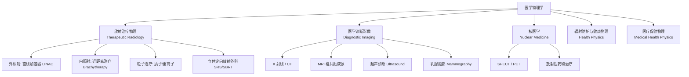

# 医学物理学 (Medical Physics)

医学物理学是物理学原理和方法在医学诊断、治疗和研究中的应用学科。它将物理学的基础理论（特别是辐射物理、声学、电磁学）转化为临床工具，在放射治疗、医学影像和核医学中发挥着关键支撑作用。

## 医学物理学的分支

## 放射治疗物理 (Therapeutic Radiology)

### 辐射与生物组织的相互作用

电离辐射在穿过组织时通过以下方式释放能量：

$$ \text{光子: 光电效应（低能）/ 康普顿散射（中能）/ 对生成（高能）} $$

$$ \text{电子: 电离 / 激发 / 韧致辐射（Bremsstrahlung）} $$

### 剂量学的核心概念与公式

**吸收剂量（Absorbed Dose）**：

$$ D = \frac{dE}{dm} $$

- 单位：Gray（Gy）= J/kg
- 1 Gy = 100 cGy（临床常用单位）

**等效剂量（Equivalent Dose）**：

$$ H_T = \sum_R w_R \cdot D_{T,R} $$

- $w_R$：辐射权重因子（光子/电子=1，质子=2，α粒子=20，中子=5-20）
- 单位：Sievert（Sv）

**放射治疗的目标函数**：

$$ \max(\text{肿瘤剂量}) \times \min(\text{危及器官剂量}) $$

### 现代放射治疗技术

| 技术 | 全称 | 精度 | 特点 |
|------|------|------|------|
| 3D-CRT | 三维适形 | mm | 多野共面/非共面 |
| IMRT | 调强放射治疗 | mm | 强度调制，剂量雕刻 |
| VMAT | 容积旋转调强 | mm | 旋转照射，高效 |
| SBRT / SRS | 立体定向放射 | <1 mm | 大剂量，少分次 |
| 质子治疗 | Proton Therapy | mm | Bragg 峰优势，入口剂量低 |

**肿瘤控制概率（TCP）vs 正常组织并发症概率（NTCP）**：

$$ \text{TCP ↑ = NTCP ↑} \quad \text{治疗计划的本质是平衡两者} $$

## 医学影像物理

### X 射线成像

X 射线穿过人体组织的衰减规律（Beer-Lambert 定律）：

$$ I = I_0 \cdot e^{-\mu x} $$

$\mu$ = 线性衰减系数，取决于组织密度和原子序数

### CT（Computed Tomography）

$$ \text{CT 值 (HU)} = 1000 \times \frac{\mu - \mu_{water}}{\mu_{water}} $$

| 组织 | CT 值范围（HU） |
|------|----------------|
| 空气 | -1000 |
| 脂肪 | -120 ~ -80 |
| 水 | 0 |
| 肌肉 | 40 ~ 80 |
| 骨 | 400 ~ 1000+ |

### MRI（Magnetic Resonance Imaging）

$$ \omega_0 = \gamma \cdot B_0 $$

- $\omega_0$：拉莫尔频率（Larmor Frequency）
- $\gamma$：旋磁比（42.58 MHz/T for ¹H）
- $B_0$：主磁场强度（1.5T / 3T / 7T）

### 超声成像（Ultrasound）

$$ f_d = \frac{2f_0 v \cos\theta}{c} $$

- $f_d$ = 多普勒频率
- $f_0$ = 发射频率
- $v$ = 血流速度
- $\theta$ = 声束与血流方向的夹角
- $c$ = 声速（软组织 ≈ 1540 m/s）

## 辐射防护

### 防护三原则

$$ \text{时间（Time）} \times \text{距离（Distance）} \times \text{屏蔽（Shielding）} $$

| 原则 | 措施 |
|------|------|
| 控制时间 | 减少在辐射区域的停留时间 |
| 增大距离 | 距离增加一倍，剂量降至四分之一（平方反比律） |
| 屏蔽 | 铅（高Z）/ 混凝土 / 水 |

### ICRP 推荐剂量限值

| 人群 | 有效剂量限值 |
|------|------------|
| 从业人员 | 20 mSv/年（5年平均） |
| 公众 | 1 mSv/年 |
| 放射科孕妇 | 2 mSv（确认妊娠后剩余孕期） |

## 核医学物理

放射性药物的体外显像和体内治疗：

- **SPECT**：单光子发射计算机断层成像，使用 ⁹⁹ᵐTc 等放射性核素
- **PET**：正电子发射断层成像，使用 ¹⁸F-FDG 等示踪剂
- **放射性核素治疗**：¹³¹I 治疗甲亢/甲癌、²²³Ra 治疗骨转移
- **Theranostics**：诊疗一体化——同一种靶向分子同时用于诊断（PET）和治疗（β/α 射线）

## 相关条目

- [[Physiotherapy]]
- [[Virology]]
- [[健康与养生]]
- [[INDEX|当前目录索引]]
