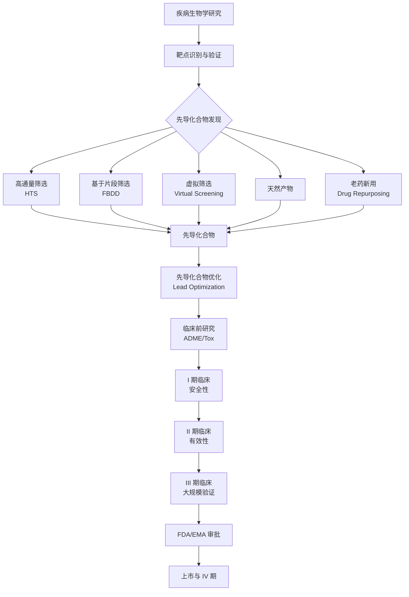
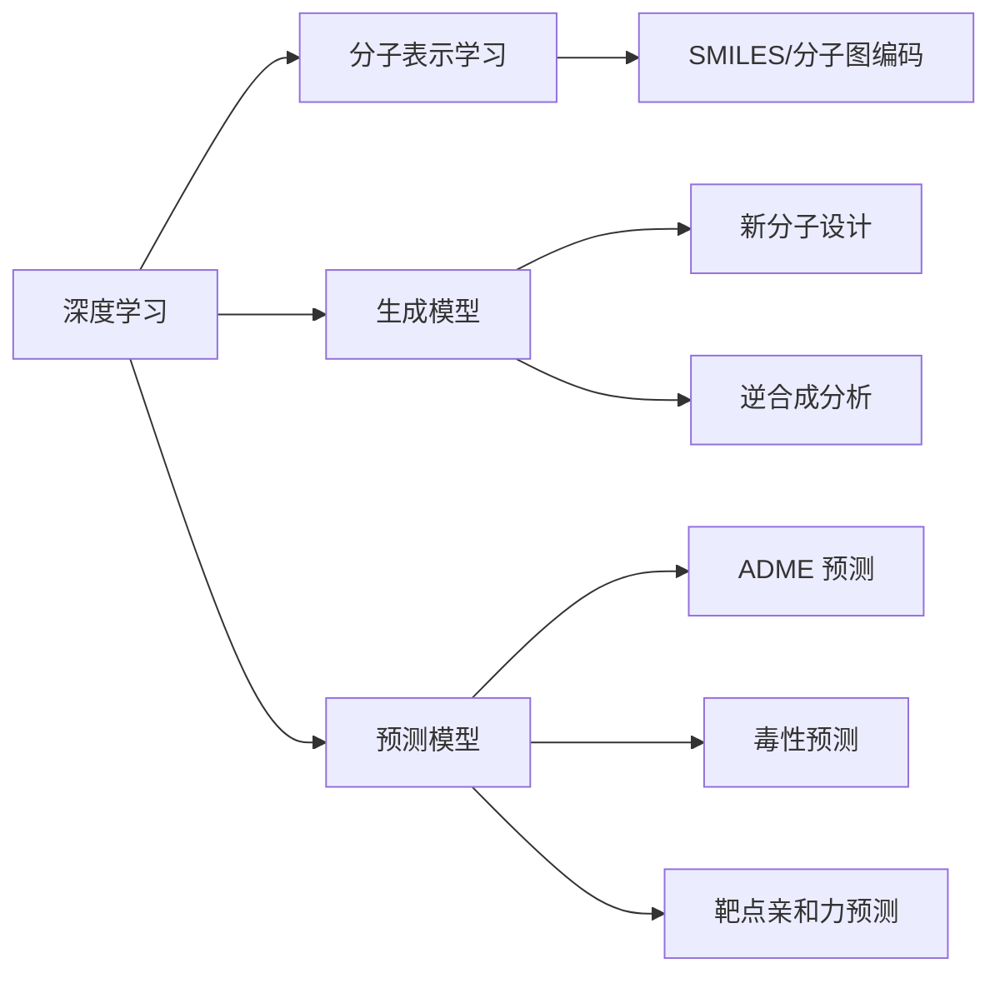

# 药物设计

药物设计（Drug Design）是发现与优化先导化合物以开发新药的跨学科过程，融合药物化学（Medicinal Chemistry）、分子生物学（Molecular Biology）、结构生物学（Structural Biology）与计算科学（Computational Science）。药物发现从确定疾病相关的生物靶点开始，经靶点验证、先导化合物发现、先导化合物优化、临床前研究到临床试验，整个过程平均耗时 10-15 年，耗资超过 10 亿美元。

## 药物发现流程

## 靶点识别与验证 （Target Identification & Validation）

生物靶点通常是蛋白质（酶、受体、离子通道、转运体）或核酸。现代靶点发现技术包括：

| 技术类型 | 方法 | 应用场景 |
|:---|:---|:---|
| 基因组学 | GWAS、CRISPR 筛选 | 基因-疾病关联 |
| 蛋白质组学 | 质谱、酵母双杂交 | 蛋白-蛋白相互作用 |
| 转录组学 | RNA-seq、单细胞测序 | 差异表达分析 |
| 化学生物学 | 亲和色谱、热位移分析 | 小分子-靶点结合 |
| 计算预测 | AlphaFold、同源建模 | 靶点三维结构 |

## 先导化合物发现 （Lead Discovery）

### 高通量筛选 （High-Throughput Screening, HTS）

使用自动化机器人平台，在 384/1536 孔板中对数十万至数百万化合物进行活性测试。典型流程：

1. 化合物库准备（多样性库 vs 定向库）
2. 检测方法开发（荧光、发光、FRET 等）
3. 初筛 → 复筛 → 剂量-响应确认
4. hit 判定标准：$IC_{50} < 10\,\mu\text{M}$，选择性 > 10 倍

### 基于片段的药物设计 （Fragment-Based Drug Design, FBDD）

筛选低分子量片段库（MW < 300 Da），通过生物物理方法（SPR、NMR、X-ray）检测弱结合片段，再通过连接（Linking）、生长（Growing）或合并（Merging）策略优化为先导化合物。

### 虚拟筛选 （Virtual Screening）

- **基于配体的虚拟筛选**（LBVS）：相似性搜索、药效团匹配、QSAR
- **基于结构的虚拟筛选**（SBVS）：分子对接（Molecular Docking）

## 合理药物设计 （Rational Drug Design）

### 基于结构的药物设计 （Structure-Based Drug Design, SBDD）

利用 X 射线晶体学、NMR 光谱或冷冻电镜（Cryo-EM）解析靶点三维结构，通过分子对接、分子动力学模拟和结合自由能计算指导分子设计。

$$ \Delta G_{\text{bind}} = RT \ln K_d = \Delta H - T\Delta S $$

结合自由能分解：

$$ \Delta G_{\text{bind}} = \Delta G_{\text{vdW}} + \Delta G_{\text{elec}} + \Delta G_{\text{solv}} + \Delta G_{\text{conf}} $$

### 基于配体的药物设计 （Ligand-Based Drug Design, LBDD）

在没有靶点三维结构时，从已知活性分子出发：

- **药效团模型**（Pharmacophore）：关键化学特征的空间排列
- **定量构效关系**（QSAR）：$ \text{活性} = f(\text{分子描述符}) $

$$ \log(1/IC_{50}) = a \cdot \log P + b \cdot \sigma + c \cdot E_s + d $$

## 计算机辅助药物设计 （CADD）

| 方法 | 输入 | 输出 | 典型软件 |
|:---|:---|:---|:---|
| 分子对接 | 靶点结构 + 配体 | 结合模式和打分 | AutoDock, Glide, Gold |
| 分子动力学 | 蛋白-配体复合物 | 轨迹和自由能 | AMBER, GROMACS, NAMD |
| 自由能微扰 | 配体系列 | $\Delta\Delta G_{\text{bind}}$ | FEP+, TIES |
| 药效团搜索 | 活性分子集合 | 三维药效团 | MOE, Phase, LigandScout |
| 生成模型 | SMILES/分子图 | 新分子结构 | REINVENT, MolDQN |

### 分子动力学模拟 （Molecular Dynamics, MD）

牛顿运动方程数值求解：

$$ m_i \frac{d^2 \mathbf{r}_i}{dt^2} = \mathbf{F}_i = -\nabla_i V(\mathbf{r}_1, \dots, \mathbf{r}_N) $$

力场（Force Field）函数形式：

$$ V = \sum_{\text{bonds}} k_b(b-b_0)^2 + \sum_{\text{angles}} k_\theta(\theta-\theta_0)^2 + \sum_{\text{dihedrals}} V_n[1+\cos(n\phi-\gamma)] + \sum_{i<j} \left( \frac{q_i q_j}{4\pi\epsilon_0 r_{ij}} + \frac{A_{ij}}{r_{ij}^{12}} - \frac{B_{ij}}{r_{ij}^6} \right) $$

## ADME/Tox 预测

早期预测药代动力学和毒性可大幅降低后期临床失败率：

| 参数 | 含义 | 理想范围 |
|:---|:---|:---:|
| $ \log P $ | 脂水分配系数 | 1-3 |
| MW | 分子量 | < 500 Da |
| HBD | 氢键供体数 | < 5 |
| HBA | 氢键受体数 | < 10 |
| $ \log D_{7.4} $ | pH 7.4 分配系数 | 1-3 |
| PSA | 极性表面积 | < 140 Ų |
| Solubility | 水溶性 | > $ 60\,\mu\text{g/mL} $ |

### Lipinski 五规则 （Rule of Five）

口服药物的类药性筛选标准：

- 分子量 ≤ 500
- log P ≤ 5
- 氢键供体 ≤ 5
- 氢键受体 ≤ 10
- 可旋转键 ≤ 10（补充规则）

## 药物代谢动力学 （Pharmacokinetics, PK）

PK 描述药物在体内的吸收（Absorption）、分布（Distribution）、代谢（Metabolism）和排泄（Excretion），即 ADME 过程。

### 关键 PK 参数

| 参数 | 符号 | 含义 | 理想范围 |
|:---|:---:|:---|:---:|
| 生物利用度 | $F$ | 口服后进入体循环的比例 | $> 30\%$ |
| 分布容积 | $V_d$ | 药物在体内理论的分布体积 | 因靶点而异 |
| 清除率 | $CL$ | 单位时间清除药物的血浆体积 | 与器官功能相关 |
| 半衰期 | $t_{1/2}$ | 血浆浓度降低一半所需时间 | 8-24 h |
| 曲线下面积 | $AUC$ | 药物暴露量的积分指标 | 越大越好 |
| 表观分布 | $V_{ss}$ | 稳态分布容积 | 反映组织结合 |

### 房室模型 （Compartment Model）

一室模型：

$$ C(t) = C_0 e^{-kt}, \quad k = \frac{CL}{V_d} $$

二室模型：

$$ C(t) = A e^{-\alpha t} + B e^{-\beta t} $$

## 药物安全性评价

毒性是药物临床失败的主要原因之一。主要毒理学评估包括：

| 毒性类型 | 评估方法 | 关键指标 |
|:---|:---|:---|
| hERG 抑制 | 膜片钳、结合实验 | $IC_{50} > 10\,\mu\text{M}$ |
| 肝毒性 | 肝细胞实验、ALT/AST | 无显著升高 |
| 遗传毒性 | Ames 试验、微核试验 | 阴性 |
| 心脏毒性 | 心电图、QT 间期 | QTc 延长 < 10 ms |
| 致癌性 | 两年啮齿类实验 | 肿瘤发生率不变 |

## 药物-靶点相互作用动力学

### 结合动力学

$$ \text{药物} + \text{靶点} \xrightleftharpoons[k_{\text{off}}]{k_{\text{on}}} \text{复合物} $$

$$ K_d = \frac{k_{\text{off}}}{k_{\text{on}}} = \frac{[\text{药物}][\text{靶点}]}{[\text{复合物}]} $$

### Residence Time

药物-靶点复合物的停留时间（Residence Time, $\tau$）是药效持续性的关键指标：

$$ \tau = \frac{1}{k_{\text{off}}} $$

延长的停留时间通常与更好的体内药效相关。

## 计算机辅助药物设计的统计学基础

### 分子描述符

分子描述符是将化学结构转换为数值特征的计算方法：

- **拓扑描述符**：Wiener 指数、分子连接性指数
- **电子描述符**：HOMO/LUMO 能级、偶极矩
- **疏水描述符**：logP、logD
- **空间描述符**：分子体积、表面积、椭圆度
- **药效团描述符**：氢键位点、电荷中心分布

### 机器学习模型评估

| 指标 | 公式 | 含义 |
|:---|:---|:---|
| $R^2$ | $1 - \frac{\sum(y_i-\hat{y}_i)^2}{\sum(y_i-\bar{y})^2}$ | 拟合优度 |
| RMSE | $\sqrt{\frac{1}{n}\sum(y_i-\hat{y}_i)^2}$ | 均方根误差 |
| MAE | $\frac{1}{n}\sum|y_i-\hat{y}_i|$ | 平均绝对误差 |
| AUC-ROC | 积分 ROC 曲线下面积 | 分类能力 |
| $Q^2$ | 交叉验证的 $R^2$ | 模型预测能力 |

## 案例：COVID-19 抗病毒药物设计

SARS-CoV-2 主要蛋白酶（M$^{\text{pro}}$）是抗 COVID-19 药物设计的关键靶点：

1. **靶点选择**：M$^{\text{pro}}$ 的晶体结构（PDB: 6LU7）在疫情初期即被解析
2. **虚拟筛选**：对已有药物库进行分子对接，发现 remdesivir 和 lopinavir 等候选
3. **共价抑制剂设计**：基于 M$^{\text{pro}}$ 的 Cys145 活性位点设计共价结合分子
4. **临床转化**：Paxlovid（nirmatrelvir + ritonavir）从发现到 EUA 仅用约 18 个月

## AI 在药物设计中的应用

- **蛋白质结构预测**：AlphaFold2/3 实现原子级精度
- **分子生成**：GANs、VAE、扩散模型生成新型分子结构
- **活性预测**：图神经网络（GNN）预测分子性质
- **逆向合成**：AI 规划有机合成路线
- **临床试验预测**：自然语言处理分析临床试验数据

## 药物设计面临的挑战

- **靶点可药性**（Druggability）：并非所有蛋白都是好靶点
- **选择性**（Selectivity）：避免脱靶效应和副作用
- **耐药性**（Drug Resistance）：突变导致药物失效
- **血脑屏障**（BBB）：中枢神经系统药物需要特殊设计
- **临床转化率**：从靶点到上市的成功率不足 10%

## 相关条目

- [[LeadDiscovery|先导化合物发现]]
- [[CADD|计算机辅助药物设计]]
- [[QSAR|定量构效关系]]
- [[MolecularDocking|分子对接]]
- [[ADMETox|ADME 与毒性预测]]
- [[Pharmacokinetics|药物代谢动力学]]
- [[MedicinalChemistry|药物化学]]
