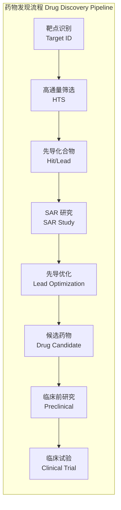
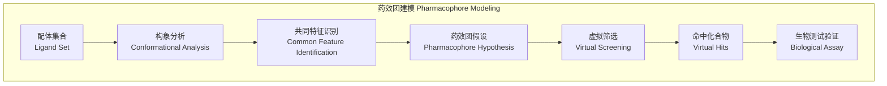

---
aliases: [MedicinalChemistry, 药物化学, PharmaceuticalChemistry, 药物化学导论]
tags: ['09_MedicineAndHealth', 'Pharmacy', 'MedicinalChemistry', 'DrugDesign', 'Pharmacology']
created: 2026-05-17
updated: 2026-05-17
---

# 药物化学 (Medicinal Chemistry)

> 药物化学是化学与药理学交叉的学科，专注于药物分子的设计、合成、结构-活性关系（SAR）研究以及先导化合物的优化，旨在发现安全有效的新药。

## 学科概述 (Overview)

### 定义与范围
药物化学（Medicinal Chemistry）整合了有机化学、生物化学、计算化学与药理学，涵盖从靶点识别到候选药物确定的全程研发链条。

### 核心研究内容
- **靶点识别与验证** (Target Identification & Validation)
- **先导化合物发现** (Hit-to-Lead Discovery) —— 高通量筛选、虚拟筛选、天然产物
- **结构-活性关系** (Structure-Activity Relationship, SAR)
- **先导化合物优化** (Lead Optimization) —— 改善 potency、selectivity、PK/PD
- **ADME/Tox 评估** (Absorption, Distribution, Metabolism, Excretion, Toxicity)

---

## 分子靶点与相互作用 (Molecular Targets & Interactions)

### 常见药物靶点

| 靶点类型 | 占比 | 示例药物 |
|---------|------|---------|
| G 蛋白偶联受体 (GPCR) | ~34% | β-受体阻滞剂（普萘洛尔） |
| 离子通道 (Ion Channels) | ~18% | 钙通道阻滞剂（硝苯地平） |
| 激酶 (Kinases) | ~15% | 伊马替尼 (Imatinib) |
| 核受体 (Nuclear Receptors) | ~13% | 他莫昔芬 (Tamoxifen) |
| 酶 (Enzymes) | ~12% | 他汀类药物 (Statins) |

### 药物-靶点相互作用力

$$
\Delta G = \Delta H - T\Delta S = -RT \ln K_d
$$

| 作用类型 | 键能 (kcal/mol) | 距离依赖性 | 特征 |
|---------|----------------|-----------|------|
| 共价键 (Covalent) | 50-110 | 短程 | 不可逆结合 |
| 离子键 (Ionic) | 5-10 | 长程 | 静电吸引 |
| 氢键 (H-bond) | 2-5 | 方向性 | 受体-配体关键作用 |
| 范德华力 (van der Waals) | 0.5-2 | 短程 | 累积效应显著 |
| 疏水作用 (Hydrophobic) | 0.5-3 | 溶剂介导 | 熵驱动 |
| π-π 堆积 (π-π Stacking) | 1-5 | 平面平行 | 芳香环间作用 |

---

## 结构-活性关系 (Structure-Activity Relationship, SAR)

### SAR 研究策略

1. **骨架跃迁** (Scaffold Hopping) —— 保留药效团，改变核心骨架
2. **生物电子等排** (Bioisosterism) —— 用具有相似理化性质的基团替代
3. **拓扑极性表面积** (TPSA) 优化 —— 调控通透性
4. **构象约束** (Conformational Restriction) —— 锁定活性构象降低熵损失
5. **pKa 调节** —— 改变化合物的电离状态与膜通透性

### 常见生物电子等排体

| 原始基团 | 等排替代 | 效果 |
|---------|---------|------|
| -COOH | -SO2NH2、四氮唑 (Tetrazole) | 酸性保持，代谢稳定性提高 |
| -OH | -NH2、-SH | 氢键供体替换 |
| -CONH- | -CH=CH-、-CH2S- | 肽键模拟 |
| 苯环 | 噻吩、吡啶、嘧啶 | 芳香性保持，溶解度改善 |

### Hansch 分析 (Hansch Analysis)

Hansch 方程将生物活性与化合物的理化参数相关联：

$$
\log(1/C) = a\pi + b\sigma + cE_s + d
$$

其中 $\pi$ 为疏水性参数，$\sigma$ 为电子效应参数（Hammett 常数），$E_s$ 为立体效应参数（Taft 常数）。

---

## 药效团模型 (Pharmacophore Modeling)

### 药效团特征
药效团（Pharmacophore）是药物分子中与靶点发生关键相互作用的空间与电子特征排列：

- **氢键供体** (Hydrogen Bond Donor, HBD)
- **氢键受体** (Hydrogen Bond Acceptor, HBA)
- **疏水中心** (Hydrophobic Center, HYD)
- **正电中心** (Positively Ionizable, PI)
- **负电中心** (Negatively Ionizable, NI)
- **芳香环中心** (Aromatic Ring, AR)

---

## 先导化合物优化 (Lead Optimization)

### Lipinski 五规则 (Rule of Five)

预测口服药物的类药性（Drug-likeness）：

| 参数 | 阈值 |
|------|------|
| 分子量 (MW) | ≤ 500 Da |
| 脂水分配系数 (LogP) | ≤ 5 |
| 氢键供体 (HBD) | ≤ 5 |
| 氢键受体 (HBA) | ≤ 10 |
| 可旋转键数 (Rotatable Bonds) | ≤ 10（补充规则） |

### ADME 优化策略

| 参数 | 目标 | 优化方法 |
|------|------|---------|
| 溶解度 (Solubility) | > 60 μg/mL | 引入极性基团、成盐 |
| 透膜性 (Permeability) | Papp > 1×10⁻⁶ cm/s | 降低 TPSA < 140 Ų |
| 代谢稳定性 (Metabolic Stability) | t₁/₂ > 30 min | 封闭代谢热点、F 取代 |
| 口服生物利用度 (Oral Bioavailability) | F > 30% | 平衡理化性质 |
| 血浆蛋白结合 (PPB) | 结合率 < 99% | 降低 LogP |

### 代谢位点阻断

- **软药设计** (Soft Drug Design) —— 引入可预测代谢位点以控制 t₁/₂
- **硬药设计** (Hard Drug Design) —— 提高代谢抗性以延长半衰期
- **同位素效应** —— 用氘 (D) 替代 C-H 键中的 H，减缓 CYP 代谢速率

---

## 药物设计案例 (Case Studies)

### 伊马替尼 (Imatinib / Gleevec)

- **靶点**：Bcr-Abl 酪氨酸激酶
- **设计策略**：基于 2-苯氨基嘧啶骨架，引入 N-甲基哌嗪改善溶解度
- **突破意义**：首个靶向治疗慢性髓系白血病 (CML) 的分子靶向药
- **SAR 要点**：嘧啶 4 位取代基对 ATP 结合口袋选择性至关重要

### 沙利度胺 (Thalidomide) 的重新定位

- **历史教训**：1950 年代作为镇静剂导致海豹肢畸形
- **机制发现**：通过与 CRBN 蛋白结合发挥免疫调节作用
- **重新定位**：用于多发性骨髓瘤（来那度胺、泊马度胺）

---

## 计算机辅助药物设计 (Computer-Aided Drug Design, CADD)

### 方法分类

| 方法 | 原理 | 适用场景 |
|------|------|---------|
| 分子对接 (Molecular Docking) | 配体在受体结合口袋的构象搜索 | 虚拟筛选、结合模式预测 |
| 分子动力学 (MD Simulation) | 牛顿力学模拟原子运动 | 结合自由能计算、稳定性分析 |
| QSAR 建模 | 统计回归预测活性 | 先导优化中的活性预测 |
| 药效团搜索 | 三维特征匹配 | 基于配体的虚拟筛选 |
| 自由能微扰 (FEP) | 热力学积分计算相对结合能 | 高精度先导优化 |

---

## 临床前与临床评价 (Preclinical & Clinical Evaluation)

### 临床前关键指标

- **IC₅₀ / EC₅₀** —— 半数抑制/有效浓度
- **选择性指数** (Selectivity Index, SI) —— IC₅₀(正常细胞) / IC₅₀(靶细胞)
- **治疗指数** (Therapeutic Index, TI) —— TD₅₀ / ED₅₀
- **hERG 安全性** —— 心脏毒性风险评估

### 药物代谢动力学参数

$$
\text{Cl} = \frac{D}{\text{AUC}} \quad V_d = \frac{D}{C_0} \quad t_{1/2} = \frac{0.693 \times V_d}{\text{Cl}}
$$

其中 Cl 为清除率，$V_d$ 为分布容积，$t_{1/2}$ 为半衰期。

---

## 药物合成策略 (Synthetic Strategies)

### 逆合成分析 (Retrosynthetic Analysis)
- 由目标分子（Target Molecule）逐步回溯至简单起始原料
- **切断**（Disconnection）：在关键键位断开，识别合成子（Synthon）
- **官能团转化**（FGI）：将目标官能团逆转为更易构建的形式
- **保护基策略**：选择性保护与脱保护以实现定点修饰

### 常见药物合成反应

| 反应类型 | 应用 | 示例 |
|---------|------|------|
| 交叉偶联 (Suzuki, Heck) | C-C 键构建 | 芳香环联结 |
| 酰胺偶联 | 肽键形成 | 多肽类药物 |
| 还原胺化 | 含氮化合物修饰 | 胺类中间体 |
| 环加成 (Diels-Alder) | 六元环构建 | 复杂天然产物 |
| 点击化学 (Click Chemistry) | 模块化连接 | 三氮唑形成 |

### 手性合成 (Chiral Synthesis)
- **手性池**（Chiral Pool）：从天然手性源出发
- **不对称催化**：手性配体/催化剂实现高对映选择性
- **手性拆分**：形成非对映体盐分离对映体

---

## 药物化学前沿 (Frontiers in Medicinal Chemistry)

### PROTAC 技术
- **PROTAC** (Proteolysis-Targeting Chimera)：双功能分子同时结合靶蛋白和 E3 泛素连接酶
- **作用机制**：诱导靶蛋白泛素化并被蛋白酶体降解
- **优势**：可靶向传统不可成药靶点（Undruggable Targets）、催化性机制

### DNA 编码化合物库 (DEL)
- 用 DNA 标签记录化学合成步骤，构建百亿级化合物库
- 通过亲和筛选（Affinity Selection）识别靶点配体
- 大幅降低筛选成本，加速先导发现

### 人工智能在药物设计中的应用

| AI 应用方向 | 方法 | 效果 |
|-----------|------|------|
| 分子生成 | GAN、VAE、扩散模型 | 产生新颖类药分子 |
| 活性预测 | 图神经网络 (GNN) | 提高虚拟筛选命中率 |
| ADMET 预测 | 随机森林、深度学习 | 降低晚期失败率 |
| 逆合成规划 | 蒙特卡洛树搜索 + 模板匹配 | 加速合成路线设计 |

### 共价抑制剂复兴
- 传统观点避免共价结合（担忧毒性）
- 精准靶向特定半胱氨酸残基实现不可逆抑制
- 代表药物：伊布替尼（BTK 抑制剂）、索托拉西布（KRAS G12C 抑制剂）

---

## 新药研发中的失败原因分析 (Root Causes of Drug Attrition)

| 失败原因 | 占比 | 改进策略 |
|---------|------|---------|
| 缺乏疗效 (Lack of Efficacy) | ~30% | 更可靠的靶点验证、生物标志物 |
| 安全性问题 (Safety/Toxicity) | ~30% | 早期毒性筛查、hERG 评估 |
| PK 性质不佳 | ~15% | 先导优化更全面的 ADME 评估 |
| 研发策略/商业决策 | ~10% | 更好的项目组合管理 |
| 配方/生产问题 | ~5% | 制剂开发前置 |

---

### 相关条目
- [[09_MedicineAndHealth/Pharmacy/INDEX|09_MedicineAndHealth/Pharmacy 索引]]
- [[09_MedicineAndHealth/Pharmacy/Pharmacology|药理学]]
- [[09_MedicineAndHealth/Pharmacy/PharmaceuticalAnalysis|药物分析]]
- [[INDEX|当前目录索引]]

