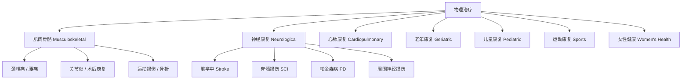

# 物理治疗 (Physiotherapy / Physical Therapy)

物理治疗是通过物理手段——包括运动疗法（Exercise Therapy）、手法治疗（Manual Therapy）和物理因子治疗（Physical Agents）——恢复和提升人体运动功能的专业医疗学科。

## 物理治疗的核心领域

## 治疗手段

### 运动疗法（Exercise Therapy）

$$ \text{Exercise = Medicine — American College of Sports Medicine} $$

| 训练类型 | 指标 | 示例 |
|---------|------|------|
| 关节活动度（ROM） | 维持/恢复关节正常活动范围 | 被动活动、牵伸 |
| 肌力训练 | 增强肌肉力量和耐力 | 抗阻训练、等长收缩 |
| 耐力训练 | 提高心肺功能 | 步行、骑行、游泳 |
| 平衡训练 | 改善姿态控制和单腿稳定性 | 单腿站、平衡板 |
| 神经肌肉训练 | 恢复运动控制与协调 | 闭链运动、不稳定面训练 |
| 功能性训练 | 模拟日常生活动作 | 蹲起、上下阶梯、抬物 |

### 手法治疗（Manual Therapy）

物理治疗师运用手法进行的诊断和治疗技术：

$$ \text{Manual Therapy} = \text{Joint Mobilization} + \text{Soft Tissue Release} + \text{Neural Dynamics} $$

- **关节松动术**：Maitland 分级 I-IV 级，改善关节滑动
- **软组织松解**：肌筋膜松解、按摩、干针（Dry Needling）
- **神经动力学**：神经滑行技术（Nerve Gliding / Sliding）

### 物理因子治疗（Physical Agents）

| 因子 | 生理效应 | 常见适应证 |
|------|---------|-----------|
| TENS（经皮电刺激） | 镇痛 | 慢性疼痛 |
| NMES（神经肌肉电刺激） | 肌肉收缩 | 肌肉萎缩 |
| 超声波（Ultrasound） | 深层热效应 | 软组织粘连 |
| 短波/微波 | 深层加热 | 慢性炎症 |
| 冲击波（Shockwave） | 组织再生 | 钙化性肌腱炎、足底筋膜炎 |
| 冷疗（Cryotherapy） | 消炎镇痛 | 急性损伤 |

## 评估体系

### SOAP 评估记录法

$$ \text{S(Subjective)} + \text{O(Objective)} + \text{A(Assessment)} + \text{P(Plan)} $$

- **S（主观）**：主诉、现病史、既往史
- **O（客观）**：视诊、触诊、活动度（ROM）、肌力（MMT）、特殊测试
- **A（评估）**：临床推理、功能障碍判断
- **P（计划）**：治疗目标、具体方案、预期时间

### 常用评估工具

| 评估内容 | 工具 |
|---------|------|
| 疼痛程度 | VAS（0-10分）、NRS（数字评定量表） |
| 关节活动度 | 量角器测量（Goniometer） |
| 肌力 | 徒手肌力测试（MMT: 0-5级） |
| 平衡功能 | Berg Balance Scale |
| 步态 | 10 米步行测试、Tinetti 步态量表 |
| ADL 能力 | Barthel Index、FIM |

## 常见疾病的物理治疗方案

### 下背痛（Low Back Pain）

$$ \text{McKenzie 方法: 根据方向偏好进行重复伸展/屈曲} $$

$$ \text{核心稳定训练: 腹横肌 + 多裂肌激活} $$

$$ \text{患者教育: 保持活动、正确姿势、避免长期卧床} $$

### 膝关节前交叉韧带重建术后（ACL Reconstruction）

| 阶段 | 时间 | 目标 |
|------|------|------|
| I - 保护期 | 0-2 周 | 消肿止痛、被动伸膝、部分负重 |
| II - 恢复期 | 2-6 周 | 主动屈膝达 120°、闭链运动 |
| III - 强化期 | 6-12 周 | 肌力重建（开链/闭链）、平衡训练 |
| IV - 重返运动 | 12+ 周 | 跳跃训练、变向跑、专项训练 |

### 脑卒中康复（Stroke Rehabilitation）

$$ \text{脑可塑性原理} \rightarrow \text{任务导向性训练} + \text{重复练习} + \text{难度递增} $$

- **早期**：良肢位摆放、被动活动、预防并发症
- **恢复期**：Bobath 技术、本体感觉训练、行走训练
- **后期**：社区康复、辅助器具适配、家庭改造

## 物理治疗师的专业角色

物理治疗师是经过专业培训的医疗专业人员，与医生的区别在于：

| 角色 | 物理治疗师 | 医生 |
|------|-----------|------|
| 诊断 | 功能诊断（运动功能障碍） | 医学诊断（疾病/病理） |
| 治疗手段 | 运动/手法/物理因子 | 药物/手术 |
| 治疗时长 | 每次 30-60 分钟，多次复诊 | 通常 5-15 分钟门诊 |
| 主动参与 | 强调患者主动运动 | 被动接受治疗为主 |

## 相关条目

- [[MedicalPhysics]]
- [[GaitAnalysis]]
- [[IntervalTraining]]
- [[健康与养生]]
- [[INDEX|当前目录索引]]
