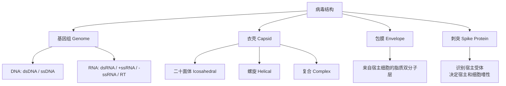

# 病毒学 (Virology)

病毒学是研究病毒的生物学特征、分类、复制机制、致病机理以及与宿主相互作用关系的学科。它在基础生物学、医学和公共卫生中都占据着核心地位。

## 病毒的基本特征

病毒是非细胞形态的感染因子，具有以下核心特征：

$$ \text{Virus} = \text{核酸基因组（DNA 或 RNA）} + \text{蛋白衣壳（Capsid）} \pm \text{包膜（Envelope）} $$

**关键生物学特征**：
- **非细胞结构（Acellular）**：没有细胞器，没有代谢系统
- **绝对专性寄生（Obligate Intracellular Parasite）**：必须依赖宿主细胞进行复制
- **无能量代谢**：不产生 ATP，全部能量和生物合成依赖宿主细胞
- **高度特异性**：对宿主、组织和细胞类型具有严格的选择性

## 病毒的结构

$$ \text{病毒大小范围: } 20 \text{ nm (细小病毒)} \rightarrow 400 \text{ nm (痘病毒)} $$

$$ \text{对比: 细菌 } 0.5-5 \mu m, \text{真核细胞 } 10-100 \mu m $$

## Baltimore 分类系统

根据**基因组类型**和**mRNA 合成策略**将病毒分为七类：

| 类别 | 基因组 | mRNA 合成 | 代表性病毒 |
|------|--------|----------|-----------|
| I | dsDNA | 直接转录 → mRNA | 疱疹病毒、腺病毒 |
| II | ssDNA | 先合成互补链再转录 | 细小病毒 B19 |
| III | dsRNA | 自身携带转录酶 → mRNA | 轮状病毒 |
| IV | (+)ssRNA | 直接作为 mRNA 翻译 | 新冠、脊灰、寨卡 |
| V | (-)ssRNA | 先转录为 (+)RNA → mRNA | 流感、狂犬、埃博拉 |
| VI | ssRNA-RT | 逆转录→DNA→整合→转录 | HIV |
| VII | dsDNA-RT | 逆转录→RNA→逆转录→DNA | 乙肝病毒 |

## 病毒的复制周期

## 病毒感染的类型

| 感染类型 | 特征 | 示例 |
|---------|------|------|
| 急性感染（Acute） | 快速复制，免疫系统清除 | 流感、普通感冒 |
| 潜伏感染（Latent） | 病毒基因组在细胞内长期潜伏 | HSV（单纯疱疹）、VZV（水痘带状疱疹） |
| 慢性感染（Chronic） | 持续低水平复制 | HBV、HCV |
| 慢发感染（Slow） | 数月至数年的缓慢进展 | HIV、Prion |
| 转化感染（Transforming） | 病毒基因导致细胞癌变 | HPV、EBV、HTLV-1 |

## 抗病毒药物

| 药物 | 作用靶点 | 针对病毒 |
|------|---------|---------|
| 奥司他韦（Oseltamivir） | 神经氨酸酶抑制剂 | 甲/乙型流感 |
| 阿昔洛韦（Acyclovir） | DNA 聚合酶抑制剂 | HSV, VZV |
| 齐多夫定（AZT） | 逆转录酶抑制剂 | HIV |
| 干扰素（Interferon） | 广谱抗病毒蛋白诱导 | 多种病毒 |
| 瑞德西韦（Remdesivir） | RNA 依赖性 RNA 聚合酶抑制剂 | SARS-CoV-2, Ebola |

## 病毒学的研究方法

1. **病毒培养**：细胞培养（最常用）、鸡胚培养、动物模型
2. **形态学观察**：电子显微镜（负染、冷冻电镜 Cryo-EM）
3. **分子检测**：PCR / RT-qPCR / 基因组测序
4. **血清学检测**：ELISA / 中和试验 / 蛋白免疫印迹
5. **结构生物学**：X 射线晶体学 / 冷冻电镜解析病毒蛋白结构

## 重要的人类病毒性疾病

| 疾病 | 病原体 | 传播途径 | 疫苗 |
|------|--------|---------|------|
| COVID-19 | SARS-CoV-2 | 呼吸道飞沫/气溶胶 | mRNA/腺病毒载体疫苗 |
| AIDS | HIV | 血液/性/母婴 | 尚无有效疫苗 |
| 流感 | Influenza A/B | 呼吸道飞沫 | 每年接种灭活疫苗 |
| 乙肝 | HBV | 血液/性/母婴 | 重组疫苗（有效） |
| 狂犬病 | Rabies virus | 动物咬伤 | 暴露后预防接种 |
| 脊髓灰质炎 | Poliovirus | 粪-口 | 口服/注射灭活疫苗 |

## 病毒与免疫系统

$$ \text{天然免疫} \rightarrow \text{干扰素应答} + \text{NK 细胞} $$

$$ \text{适应性免疫} \rightarrow \text{中和抗体(B细胞)} + \text{细胞毒性 T 细胞(CTL)} $$

### 病毒免疫逃逸机制

1. **抗原变异**：流感病毒的抗原漂移（Drift）和抗原转变（Shift）
2. **潜伏**：HSV 在三叉神经节中潜伏，免疫系统无法清除
3. **下调 MHC-I**：腺病毒和 HIV 干扰 MHC-I 呈递
4. **编码免疫调节蛋白**：EBV 编码 IL-10 同源物抑制免疫应答

## 相关条目

- [[MedicalPhysics]]
- [[Physiotherapy]]
- [[健康与养生]]
- [[INDEX|当前目录索引]]
