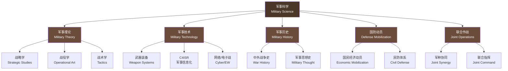
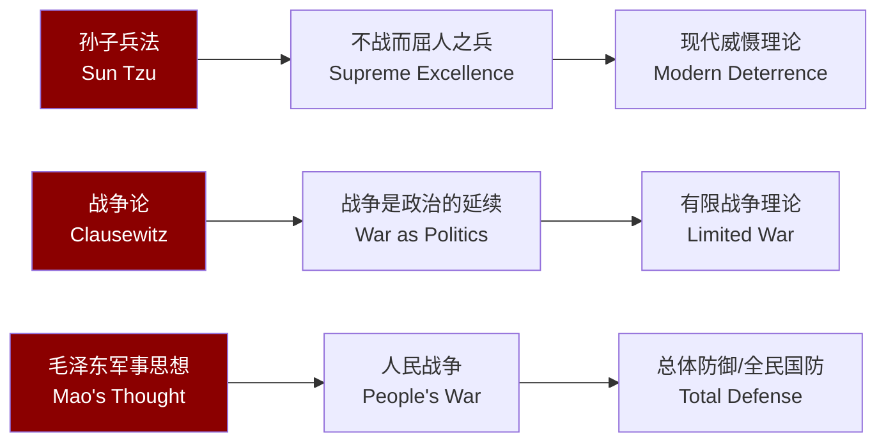

---
aliases: [LearningPath, MilitarySciencePath, 军事科学, 军事学学习路线, DefenseStudies]
tags: ['LearningPath', 'MilitarySciences', 'Defense', 'Strategy', 'NationalSecurity']
created: 2026-05-17
updated: 2026-05-17
---

# 学习路径：军事科学 (Military Science Learning Path)

> 军事科学是研究战争本质和战争规律，并用于指导战争准备与实施的综合性科学体系，涵盖军事理论、军事技术、军事历史、国防动员等多个领域。

## 学科体系 (Disciplinary System)

## 基础阶段 (Foundation Stage)

| 序号 | 课程名称 | 核心内容 | 建议学时 |
|:----:|---------|---------|:--------:|
| 1 | **军事历史** (Military History) | 中外战争史、军事思想演变 | 60h |
| 2 | **战略理论** (Strategic Theory) | 《孙子兵法》《战争论》、毛泽东军事思想 | 80h |
| 3 | **国防教育** (National Defense Education) | 国防体制、国防动员、国防法 | 40h |
| 4 | **军事地理** (Military Geography) | 地形分析、战略要地、地缘政治 | 40h |
| 5 | **军兵种知识** (Arms & Services) | 陆军、海军、空军、火箭军、战略支援部队 | 50h |
| 6 | **军事运筹学** (Military Operations Research) | 兰彻斯特方程、博弈论在军事中的应用 | 60h |

## 专业方向 (Specializations)

### 军事战略 (Military Strategy)

| 方向 | 核心内容 | 经典理论 |
|------|---------|---------|
| 威慑理论 | 核威慑、常规威慑、空间威慑 | Schelling《冲突的战略》 |
| 有限战争 | 局部战争、代理人战争、混合战争 | Osgood《有限战争》 |
| 信息化战争 | 网络中心战、决策中心战、无人化战争 | Alberts《网络中心战》 |
| 空海一体战 | 反介入/区域拒止(A2/AD)、远程打击 | 美国国防部系列报告 |
| 太空战略 | 太空军事化、反卫星武器、太空态势感知 | 太空安全系列研究 |

### 军事技术 (Military Technology)

| 方向 | 核心技术 | 典型装备 |
|------|---------|---------|
| 精确制导 | 惯性导航、GPS/北斗制导、末端制导 | 战斧巡航导弹、东风系列 |
| 网络战 | 网络攻防、漏洞挖掘、恶意代码 | Stuxnet、网络作战部队 |
| 电子战 | 电子侦察、电子干扰、电子防护 | EA-18G 咆哮者、综合电子战系统 |
| C4ISR | 指挥、控制、通信、计算机、情报、监视、侦察 | Link 16数据链、联合作战指挥平台 |
| 无人系统 | 无人机(UAV)、无人地面车辆(UGV)、无人水面艇(USV) | MQ-9死神、水下无人潜航器 |

### 国防动员 (Defense Mobilization)

| 方向 | 核心内容 | 实践案例 |
|------|---------|---------|
| 国民经济动员 | 工业动员、科技动员、财政动员 | 二战美国"民主兵工厂" |
| 民防体系 | 人防工程、警报系统、疏散方案 | 以色列民防体系 |
| 兵役动员 | 征兵制度、预备役、退役军人管理 | 瑞典全民国防 |
| 心理动员 | 舆论宣传、信息心理战、士气维护 | 二战宣传战 |

### 联合作战 (Joint Operations)

| 方向 | 核心内容 | 典型模式 |
|------|---------|---------|
| 军种协同 | 空地协同、海空协同、特种作战协同 | 美军联合作战概念(JOC) |
| 联合指挥 | 联合司令部、任务式指挥、参谋作业 | NATO 联合指挥结构 |
| 两栖作战 | 登陆战役、垂直登陆、滩头保障 | 诺曼底登陆、仁川登陆 |
| 城市战 | 城市进攻/防御、近距离作战、民事-军事合作 | 费卢杰战役 |
| 特种作战 | 直接行动、特种侦察、反恐、非常规战争 | 海神之矛行动(击毙本·拉登) |

## 军事思想体系 (Military Thought System)

## 经典著作 (Classic Works)

| 著作 | 作者 | 时代 | 核心贡献 |
|------|------|:----:|---------|
| 《孙子兵法》 | 孙武 | 春秋 | 战略哲学、不战而屈人之兵 |
| 《战争论》 | 克劳塞维茨 | 19世纪 | 战争本质、战争与政治关系 |
| 《战略论》 | 李德·哈特 | 20世纪 | 间接路线战略 |
| 《海权论》 | 马汉 | 19世纪末 | 海权决定国家兴衰 |
| 《空权论》 | 杜黑 | 20世纪初 | 战略轰炸、制空权 |
| 《毛泽东军事文集》 | 毛泽东 | 20世纪 | 人民战争、游击战理论 |
| 《战略学》 | 军事科学院 | 当代 | 中国战略理论体系 |

## 推荐期刊与资源 (Journals & Resources)

| 资源名称 | 类型 | 说明 |
|---------|:----:|------|
| 《中国军事科学》 | 期刊 | 军事科学院主办 |
| Joint Force Quarterly | 期刊 | 美军联合参谋部出版 |
| Military Review | 期刊 | 美国陆军指挥与参谋学院 |
| 美国陆军 FM 系列野战条令 | 条令 | 涉及战术、后勤、作战 |
| 简氏防务周刊 (Janes Defence) | 资讯 | 全球防务动态 |
| RAND Corporation 研究报告 | 智库 | 国防政策与分析 |
| 国防大学出版教材 | 教材 | 联合作战与指挥系列 |

## 学历与职业路径 (Education & Career Paths)

| 路径 | 教育机构 | 对应岗位 |
|------|---------|---------|
| 国防科技大学/军事院校本科 | 国防科大、各军兵种院校 | 现役军官 |
| 国防大学/军事科学院硕博 | 国防大学、军事科学院 | 军事研究员/参谋 |
| 地方高校国防相关专业 | 清华/北大/南大等 | 国防工业/智库 |
| 国际关系/安全研究 | 外交学院、国际关系学院 | 战略分析/外交 |
| ROTC/军官培训项目 | 各国后备军官训练团 | 预备役军官 |

## 相关条目 (Related Entries)

- [[INDEX\|总索引]]
- [[11_ManagementSciences/LearningPath\|管理科学学习路径]]
- [[02_NaturalSciences/Physics/Thermodynamics/StatisticalMechanics\|统计力学]]

