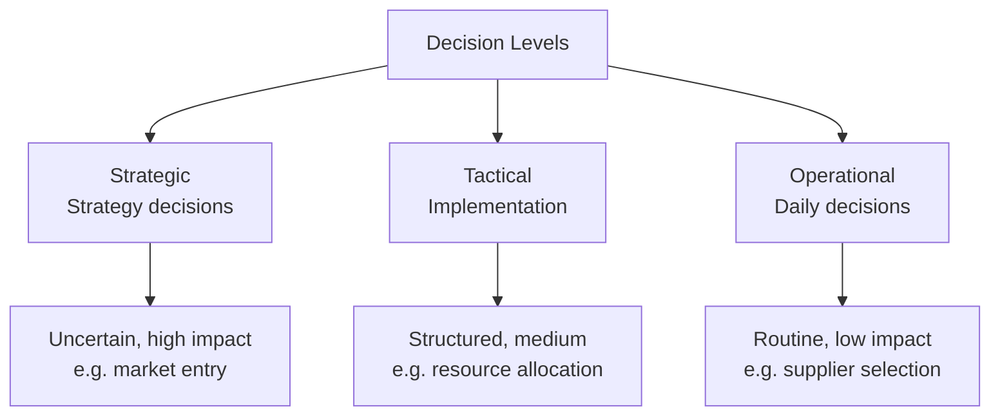
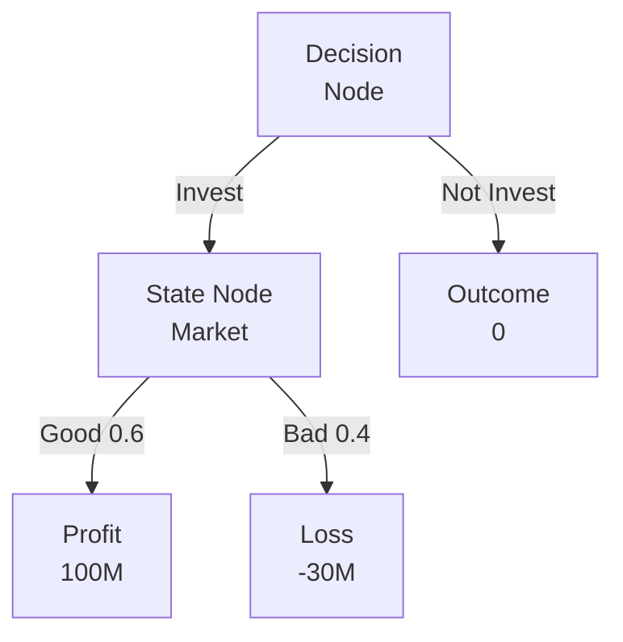
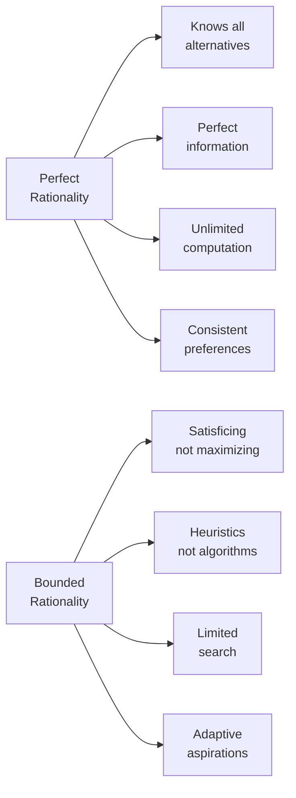
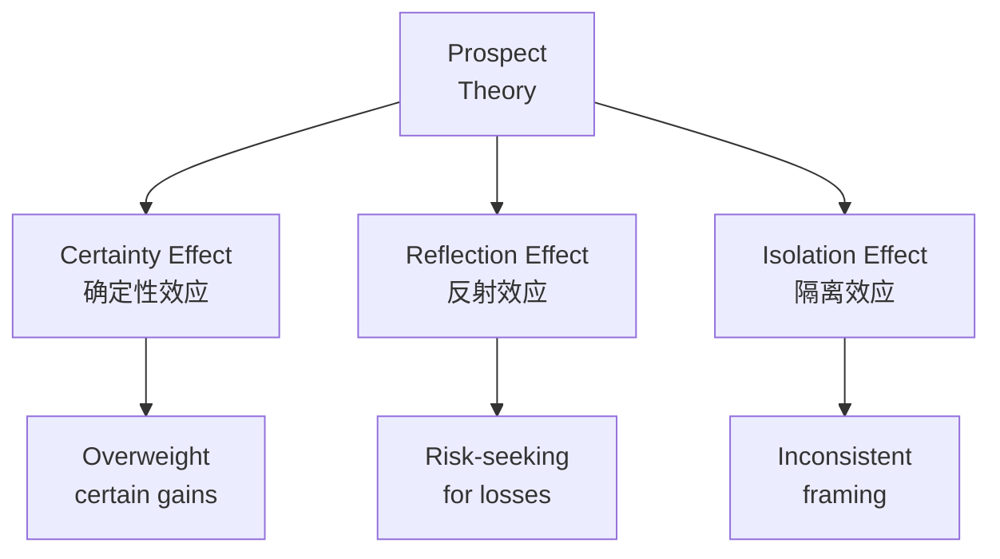
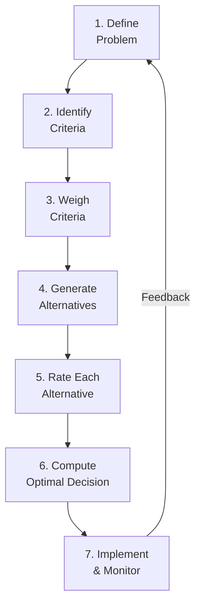

# 决策理论 (Decision Making)

## 一、概述

**决策理论（Decision Making / Decision Theory）** 是管理科学的核心领域，研究个体与组织如何在不确定性下做出最优选择。决策理论融合了**经济学（Economics）**、**心理学（Psychology）**、**统计学（Statistics）** 和 **运筹学（Operations Research）**。

### 1.1 决策的基本要素

$$ \text{决策} = \{\text{备选方案}, \text{自然状态}, \text{结果}, \text{偏好}\} $$

| 要素 | 定义 | 示例 |
|------|------|------|
| 方案（Alternatives） | 可选择的行为 | 投资项目 A 或 B |
| 状态（States） | 不可控的环境 | 市场景气或衰退 |
| 结果（Outcomes） | 方案 × 状态的收益 | 利润率 |
| 偏好（Preferences） | 决策者的价值判断 | 风险厌恶 |

### 1.2 决策的层次

## 二、理性决策模型

### 2.1 期望效用理论

**Expected Utility Theory（期望效用理论）** 由 von Neumann 和 Morgenstern 提出，是经典理性决策的基石。

$$ \text{EU}(A) = \sum_{i=1}^{n} p_i \cdot u(x_i) $$

其中 $p_i$ 是状态概率，$u(x_i)$ 是结果的效用（Utility）。

**偏好公理**：
1. **完备性（Completeness）**：任意两方案可比
2. **传递性（Transitivity）**：若 A ≥ B 且 B ≥ C，则 A ≥ C
3. **独立性（Independence）**：偏好不受无关方案影响
4. **连续性（Continuity）**：偏好关系是连续的

### 2.2 决策树

**Decision Tree（决策树）** 是结构化决策的经典工具：

**期望值计算**：

$$ \text{EV(Invest)} = 0.6 \times 100 + 0.4 \times (-30) = 48 $$

### 2.3 多属性决策

**Multi-Attribute Utility Theory（MAUT，多属性效用理论）** 处理包含多个目标的问题：

$$ U(x_1, x_2, \ldots, x_n) = \sum_{i=1}^{n} w_i \cdot u_i(x_i) $$

其中 $w_i$ 是各属性的权重。

**层次分析法（AHP，Analytic Hierarchy Process）** 由 Thomas Saaty 提出，通过两两比较矩阵确定权重：

| 比较尺度 | 含义 |
|---------|------|
| 1 | 同等重要 |
| 3 | 稍微重要 |
| 5 | 明显重要 |
| 7 | 强烈重要 |
| 9 | 极端重要 |

## 三、有限理性

### 3.1 Simon 的理论

Herbert Simon 因**有限理性（Bounded Rationality）** 理论获得 1978 年诺贝尔经济学奖。

**核心观点**：人类决策者受信息处理能力限制，无法达到完全理性。

$$ \text{完全理性} \xrightarrow{\text{信息限制}} \text{有限理性} $$

### 3.2 满意化原则

Simon 提出 **Satisficing（满意化）** 替代最优化（Optimizing）：

$$ \text{决策者设定"满意阈值"} \to \text{搜索方案} \to \text{找到首个满足阈值的方案} $$

### 3.3 垃圾桶模型

**Garbage Can Model（垃圾桶模型）** 由 Cohen, March & Olsen 提出，描述组织的无序决策过程：

$$ \text{决策} = \{\text{问题}, \text{方案}, \text{参与者}, \text{选择机会}\} \text{ 的随机相遇} $$

## 四、前景理论

### 4.1 Kahneman & Tversky

**Prospect Theory（前景理论）** 由 Daniel Kahneman 和 Amos Tversky 提出，Kahneman 因此获得 2002 年诺贝尔经济学奖。

### 4.2 三大效应

1. **确定性效应（Certainty Effect）**：人们过度重视确定性收益
   - 例：确定拿 500 元 vs. 40% 拿 1000 元，多数人选前者
2. **反射效应（Reflection Effect）**：面对损失时变成风险偏好
   - 例：确定损失 500 元 vs. 40% 损失 1000 元，多数人选后者
3. **隔离效应（Isolation Effect）**：表述方式影响选择

### 4.3 价值函数

前景理论的核心是 **S 型价值函数（Value Function）**：

$$ v(x) = \begin{cases}
x^\alpha & x \geq 0 \\
-\lambda (-x)^\beta & x < 0
\end{cases} $$

其中 $\alpha, \beta \in (0,1)$ 表示敏感度递减，$\lambda > 1$ 表示**损失厌恶（Loss Aversion）**。

$$ v(\Delta) = \text{相对于参考点的变化} $$

### 4.4 概率权重函数

$$ w(p) = \frac{p^\gamma}{(p^\gamma + (1-p)^\gamma)^{1/\gamma}} $$

特点：高估小概率事件，低估中高概率事件。

## 五、启发式与偏差

### 5.1 常见启发式

**Heuristics（启发式）** 是快速决策的思维捷径：

| 启发式 | 定义 | 典型偏差 |
|--------|------|---------|
| 代表性（Representativeness） | 按相似度判断概率 | 忽略基础率 |
| 可得性（Availability） | 按易忆性判断频率 | 近期事件高估 |
| 锚定（Anchoring） | 初始值影响判断 | 调整不足 |
| 情感（Affect） | 靠感觉做决策 | 情绪干扰 |

### 5.2 系统 1 & 系统 2

Kahneman 在《思考，快与慢》（Thinking, Fast and Slow）中提出的双系统模型：

| 特征 | 系统 1 | 系统 2 |
|------|--------|--------|
| 运作方式 | 自动、直觉 | 分析、理性 |
| 速度 | 快 | 慢 |
| 能量消耗 | 低 | 高 |
| 并行处理 | 是 | 否 |
| 典型错误 | 偏差 | 懒惰 |

## 六、群体决策

### 6.1 方法

| 方法 | 描述 | 适用场景 |
|------|------|---------|
| 头脑风暴（Brainstorming） | 自由联想 | 创意发散 |
| 德尔菲法（Delphi） | 多轮匿名问卷 | 专家预测 |
| 名义小组（Nominal Group） | 独立投票后讨论 | 平衡参与度 |
| 多数投票（Majority） | 简单多数 | 快速决策 |

### 6.2 群体偏差

$$ \text{Groupthink} = \text{高凝聚力} + \text{缺乏批判} + \text{压力一致性} $$

**群体极化（Group Polarization）**：群体讨论使初始偏好更极端。

## 七、决策分析工具

### 7.1 矩阵工具

| 工具 | 结构 | 应用 |
|------|------|------|
| 决策矩阵 | 方案 × 准则 | 多属性排序 |
| 支付矩阵 | 方案 × 状态 | 风险决策 |
| 后悔矩阵 | 机会成本 | 最小化遗憾 |

### 7.2 贝叶斯决策

**Bayesian Decision Theory（贝叶斯决策理论）** 用先验信息更新概率：

$$ P(\theta | D) = \frac{P(D | \theta) \cdot P(\theta)}{P(D)} $$

**最优决策**：

$$ a^* = \arg\max_a \int u(a, \theta) \cdot P(\theta | D) \, d\theta $$

## 八、实践框架

### 8.1 决策流程

### 8.2 常见陷阱

1. **确认偏差（Confirmation Bias）**：只找支持自己观点的信息
2. **沉没成本谬误（Sunk Cost Fallacy）**：因已投入而继续错误
3. **过度自信（Overconfidence）**：高估自己判断的准确性
4. **框架效应（Framing Effect）**：表述方式影响选择
5. **事后诸葛亮（Hindsight Bias）**：事后觉得早该知道

## 九、核心文献

- **Simon, H.** — Administrative Behavior（《管理行为》）
- **Kahneman, D.** — Thinking, Fast and Slow（《思考，快与慢》）
- **Kahneman & Tversky** — Prospect Theory: An Analysis of Decision under Risk
- **Janis, I.** — Groupthink
- **Hammond, Keeney & Raiffa** — Smart Choices

---

[[11_ManagementSciences/INDEX|当前目录索引]]
