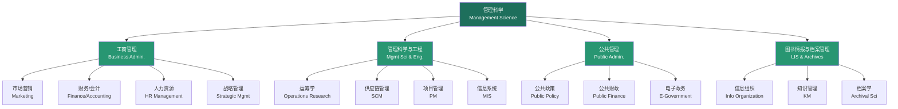
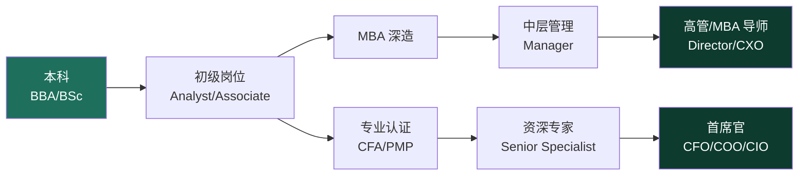

# 学习路径：管理科学 (Management Science Learning Path)

> 管理科学是研究人类管理活动规律及其应用的综合性交叉学科，涵盖工商管理、公共管理、管理科学与工程、图书情报与档案管理等多个一级学科。

## 学科概览 (Discipline Overview)

## 基础阶段 (Foundation Stage)

| 序号 | 课程名称 | 核心内容 |
|:----:|---------|---------|
| 1 | **管理学原理** (Principles of Management) | 计划、组织、领导、控制四大职能 |
| 2 | **微观经济学** (Microeconomics) | 供给需求、市场结构、边际分析 |
| 3 | **宏观经济学** (Macroeconomics) | GDP、通胀、失业、货币政策 |
| 4 | **会计学基础** (Financial Accounting) | 资产负债表、利润表、现金流量表 |
| 5 | **统计学** (Statistics for Business) | 描述统计、推断统计、回归分析 |
| 6 | **组织行为学** (Organizational Behavior) | 个体/群体行为、领导力、组织文化 |
| 7 | **商业伦理** (Business Ethics) | 企业社会责任、道德决策框架 |
| 8 | **经济法** (Economic Law) | 合同法、公司法、劳动法 |

## 专业方向 (Specializations)

### 工商管理 (Business Administration)

| 方向 | 核心课程 | 就业方向 |
|------|---------|---------|
| 市场营销 | 消费者行为、品牌管理、数字营销、市场调研 | 品牌经理、市场总监 |
| 财务/金融 | 公司金融、投资学、财务报表分析、风险管理 | CFA、财务分析师 |
| 人力资源管理 | 招聘与选拔、绩效管理、薪酬设计、劳动关系 | HRBP、招聘经理 |
| 战略管理 | 竞争战略、商业模式、并购重组、咨询方法论 | 管理咨询师 |
| 运营管理 | 流程优化、质量管理(六西格玛)、精益生产 | 运营总监 |

### 管理科学与工程 (Management Science & Engineering)

| 方向 | 核心课程 | 就业方向 |
|------|---------|---------|
| 运筹学 | 线性规划、整数规划、动态规划、排队论 | 数据分析师、算法工程师 |
| 供应链管理 | 采购管理、库存控制、物流网络设计、ERP | 供应链经理、物流总监 |
| 项目管理 | PMBOK 框架、敏捷方法、WBS、关键路径法 | PMP 认证、项目经理 |
| 管理信息系统 | 数据库管理、系统分析、IT 治理、区块链 | CIO、IT 经理 |

### 公共管理 (Public Administration)

| 方向 | 核心课程 | 就业方向 |
|------|---------|---------|
| 公共政策分析 | 政策过程、成本效益分析、政策评估 | 政策研究员 |
| 公共财政 | 预算管理、税收制度、政府会计 | 财政公务员 |
| 电子政务 | 数字政府、政务大数据、智慧城市 | 数字政府顾问 |
| 非营利管理 | 非营利组织治理、募捐管理、志愿者管理 | NGO 管理者 |

### 图书情报与档案管理 (LIS & Archives)

| 方向 | 核心课程 | 就业方向 |
|------|---------|---------|
| 信息组织 | 分类法、主题词表、元数据、本体 | 数据管理员、知识工程师 |
| 知识管理 | SECI 模型、知识图谱、组织学习 | CKO、知识管理顾问 |
| 档案学 | 档案鉴定、数字化归档、电子文件管理 | 档案管理员 |
| 图书馆学 | 信息检索、数字图书馆、阅读推广 | 图书管理员、信息专员 |

## 技能矩阵 (Skill Matrix)

| 技能类别 | 具体技能 | 重要性 | 学习建议 |
|---------|---------|:------:|---------|
| 定量分析 | 统计建模、运筹优化、计量经济学 | ★★★★★ | 掌握 Python/R + SQL |
| 定性分析 | 案例研究、访谈、内容分析 | ★★★★ | 论文写作中实践 |
| 沟通表达 | 报告撰写、演示汇报、谈判 | ★★★★★ | 参与案例竞赛 |
| 领导力 | 团队管理、冲突解决、决策 | ★★★★★ | 社团/项目管理经历 |
| 数字素养 | Excel 高级、BI 工具、ERP 系统 | ★★★★ | 考取 MOS/CPA 等认证 |

## 学历与认证 (Degrees & Certifications)

### 学位路径

- 本科：工商管理、管理科学、公共管理、信息管理与信息系统
- 硕士：MBA (Master of Business Administration)、MPA (Master of Public Administration)、MSc in Management
- 博士：PhD in Management、DBA (Doctor of Business Administration)

### 职业认证

| 认证 | 全称 | 适用方向 |
|------|------|---------|
| CFA | Chartered Financial Analyst | 金融投资 |
| CPA | Certified Public Accountant | 会计审计 |
| PMP | Project Management Professional | 项目管理 |
| SHRM-CP | SHRM Certified Professional | 人力资源 |
| CSCP | Certified Supply Chain Professional | 供应链 |
| CISA | Certified Information Systems Auditor | 信息系统审计 |

## 经典文献 (Classic Literature)

- 《科学管理原理》— 弗雷德里克·泰勒 (Frederick Taylor)
- 《管理：任务、责任、实践》— 彼得·德鲁克 (Peter Drucker)
- 《竞争战略》— 迈克尔·波特 (Michael Porter)
- 《基业长青》— 吉姆·柯林斯 (Jim Collins)
- 《第五项修炼》— 彼得·圣吉 (Peter Senge)
- 《卓有成效的管理者》— 彼得·德鲁克 (Peter Drucker)

## 推荐期刊 (Recommended Journals)

| 期刊名称 | 方向 | 级别 |
|---------|------|:----:|
| Harvard Business Review | 综合管理 | 实践顶级 |
| Academy of Management Journal | 组织管理 | FT50 |
| Management Science | 管理科学/运筹 | UT Dallas 24 |
| Journal of Marketing | 市场营销 | FT50 |
| Strategic Management Journal | 战略管理 | FT50 |
| 管理世界 | 中国管理 | 中文顶级 |
| 南开管理评论 | 综合管理 | CSSCI |

## 推荐在线资源 (Online Resources)

- **Harvard Business Review** — hbr.org 案例与管理思想
- **Coursera / edX** — 沃顿、斯坦福、LBS 在线课程
- **PMBOK Guide** — 项目管理知识体系
- **McKinsey Quarterly** — 管理咨询洞见
- **中国大学 MOOC** — 国内名校管理课程
- **得到 App** — 管理通识与商业洞察

## 职业发展路径 (Career Paths)

## 相关条目 (Related Entries)

- [[INDEX\|总索引]]
- [[01_K12/CrossDisciplinaryK12/FinancialLiteracyForTeens/PersonalFinance\|个人理财]]
- [[10_MilitarySciences/LearningPath\|军事科学学习路径]]
- [[09_MedicineAndHealth/LearningPath\|医学健康学习路径]]
