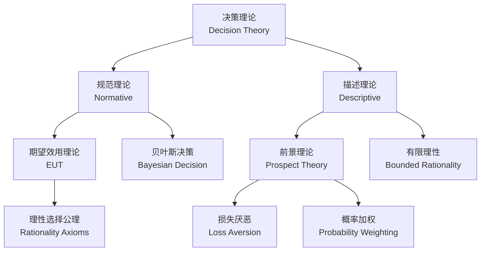
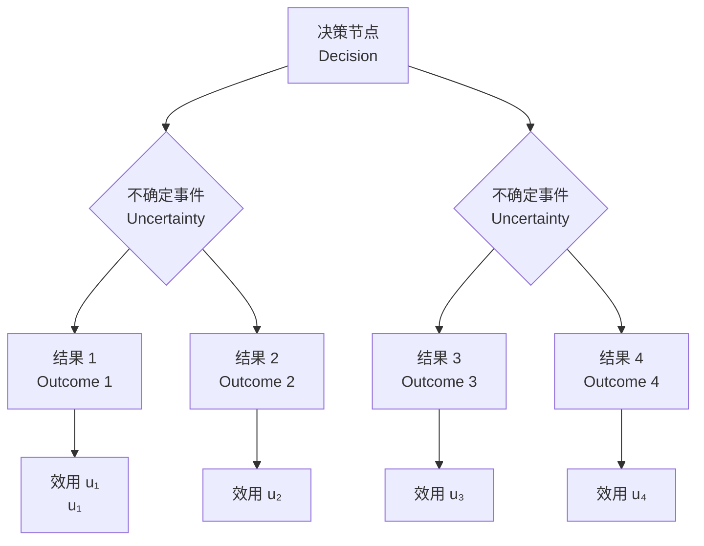

---
aliases: [DecisionTheory, 决策理论, 决策分析, DecisionAnalysis]
tags: ['11_ManagementSciences', 'ManagementScienceAndEngineering', 'DecisionMaking']
created: 2026-05-17
updated: 2026-05-17
---

# 决策理论 (Decision Theory)

## 概述

决策理论是研究个体或组织在选择方案时的行为模式与最优策略的数学框架。它分为两个主要分支：

1. **规范决策理论** (Normative Decision Theory)：研究理性决策者"应该"如何做出最优决策。
2. **描述决策理论** (Descriptive Decision Theory)：研究人们"实际"如何做决策，揭示认知偏差（cognitive bias）和非理性行为。

## 期望效用理论 (Expected Utility Theory)

期望效用理论假设理性决策者在不确定条件下会选择期望效用最大化的方案。效用函数 $u(\cdot)$ 的构造基于 von Neumann-Morgenstern 公理体系：

| 公理 | 内容 |
|------|------|
| 完备性 (Completeness) | 对任意 $A, B$，要么 $A \succeq B$，要么 $B \succeq A$，或两者无差异 |
| 传递性 (Transitivity) | 若 $A \succeq B$ 且 $B \succeq C$，则 $A \succeq C$ |
| 独立性 (Independence) | $A \succeq B \iff \lambda A + (1-\lambda)C \succeq \lambda B + (1-\lambda)C$ |
| 连续性 (Continuity) | 若 $A \succeq B \succeq C$，则存在 $\lambda$ 使 $B \sim \lambda A + (1-\lambda)C$ |

期望效用最大化准则：

$$
\max_{a \in A} \sum_{s \in S} p(s) \cdot u(a, s)
$$

## 前景理论 (Prospect Theory)

Kahneman 和 Tversky（1979）提出的前景理论修正了 EUT，引入以下关键特征：

1. **损失厌恶** (Loss Aversion)：损失带来的痛苦约等值收益带来愉悦的 2–2.5 倍。
2. **参照依赖** (Reference Dependence)：效用不依赖于绝对财富，而依赖于相对于参照点的变化。
3. **敏感性递减** (Diminishing Sensitivity)：在收益域呈风险规避，在损失域呈风险追求。
4. **概率加权** (Probability Weighting)：人们系统性高估小概率事件，低估中大概率事件。

价值函数 (value function) 的形式：

$$
v(x) = \begin{cases}
x^\alpha, & x \geq 0 \\
-\lambda(-x)^\beta, & x < 0
\end{cases}
$$

其中 $\alpha, \beta \in (0,1)$，$\lambda > 1$（典型值 $\lambda \approx 2.25$）。

## 多准则决策分析 (MCDA)

MCDA 用于处理冲突目标下的方案排序问题：

### 层次分析法 (AHP, Analytic Hierarchy Process)

Saaty 提出的 AHP 通过成对比较（pairwise comparison）矩阵和特征向量法确定各准则权重。一致性比率（Consistency Ratio, CR）需小于 0.1。

### TOPSIS (Technique for Order Preference by Similarity to Ideal Solution)

TOPSIS 通过计算各方案与正理想解（PIS）和负理想解（NIS）的接近程度进行排序：

$$
C_i^* = \frac{d_i^-}{d_i^+ + d_i^-}
$$

其中 $d_i^+$ 为到 PIS 的距离，$d_i^-$ 为到 NIS 的距离。

| 方法 | 输入类型 | 输出 | 适用场景 |
|------|----------|------|----------|
| AHP | 成对比较 | 权重向量 | 多层级决策 |
| TOPSIS | 决策矩阵 | 方案排序 | 多属性评价 |
| ELECTRE | 决策矩阵 | 优劣关系 | 非补偿性决策 |
| PROMETHEE | 偏好函数 | 净流排序 | 强偏好结构 |

## 贝叶斯决策理论

贝叶斯决策利用先验概率（prior probability）和似然函数（likelihood）更新信念，结合后验概率（posterior probability）进行最优选择：

$$
P(\theta | D) = \frac{P(D | \theta) P(\theta)}{P(D)}
$$

决策规则选择使后验期望损失最小的行动：

$$
a^* = \arg\min_a \mathbb{E}_{\theta|D}[L(a, \theta)]
$$

## 决策树与影响图

决策树（decision tree）是可视化决策路径、不确定性节点和最终报酬的常用工具。影响图（influence diagram）是决策树的紧凑表示。

## 群决策理论

群决策探讨如何聚合不同个体的偏好以得到集体决策：

### 投票理论

Arrow 不可能定理（Arrow's Impossibility Theorem）指出不存在满足所有理性条件的完美投票规则。

### 德尔菲法 (Delphi Method)

德尔菲法通过多轮匿名专家征询和反馈收敛，获取群体共识。

## 有限理性

Simon（1955）提出的有限理性（Bounded Rationality）指出，实际决策受信息获取和认知处理能力限制。决策者追求"满意解"（satisficing）而非最优解。

## 管理应用

| 应用领域 | 决策方法 | 典型问题 |
|----------|----------|----------|
| 投资组合 | 均值-方差优化 | 资产配置 |
| 供应链 | 贝叶斯决策 | 库存补货策略 |
| 定价 | 决策树 | 新产品定价 |
| 战略 | AHP | 供应商选择 |
| 风险管理 | 期望效用 | 保险购买决策 |

## 相关条目

- [[GameTheory|博弈论]]
- [[OptimizationMethods|优化方法]]
- [[ProbabilityTheory|概率论]]
- [[11_ManagementSciences/BusinessAdministration/Finance/RiskManagement|风险管理]]
- [[BehavioralEconomics|行为经济学]]
- [[INDEX|ManagementScienceAndEngineering 索引]]
- [[../../INDEX|TianshangKnowledgeBase 索引]]

