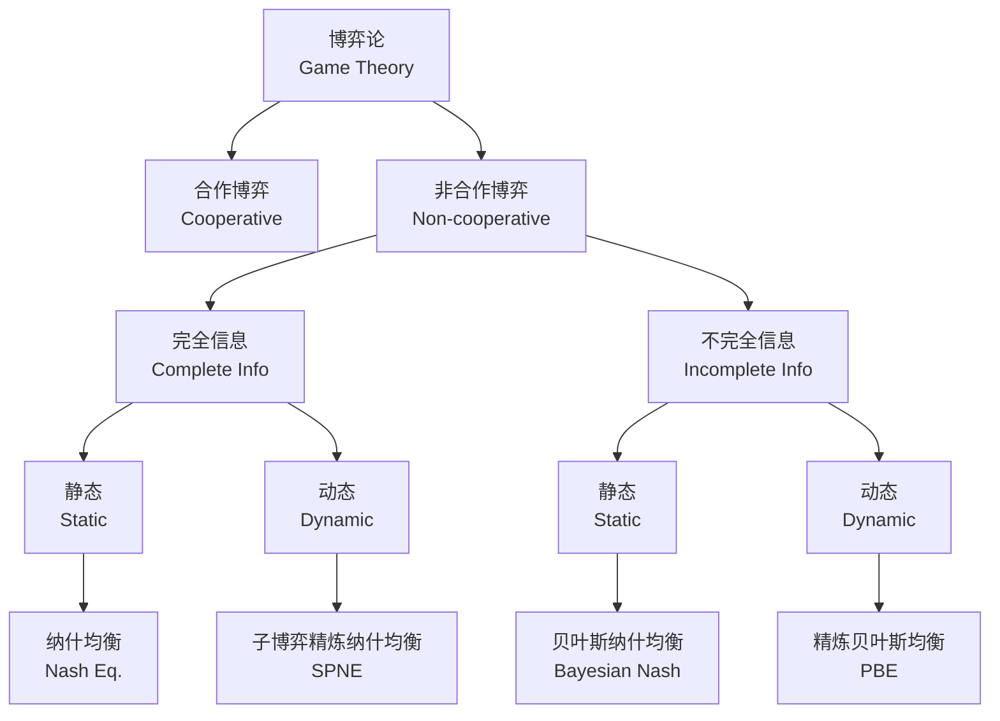
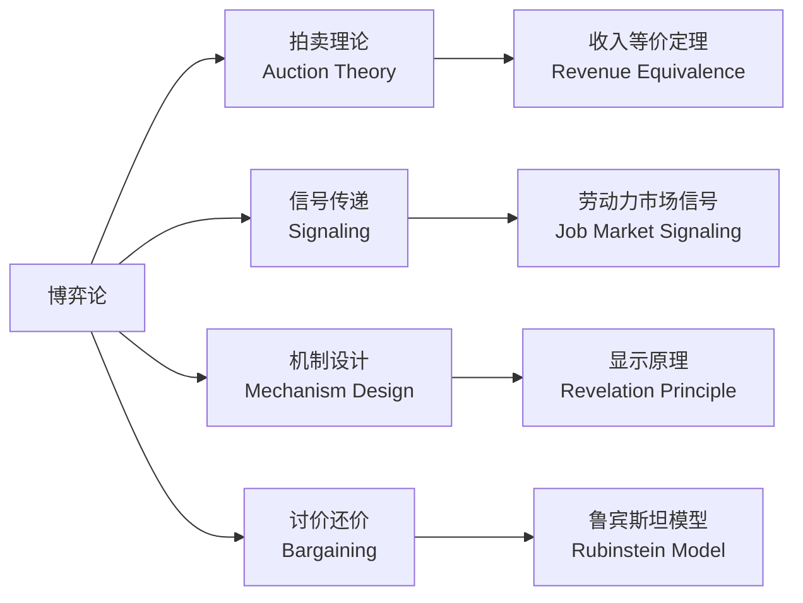

# 博弈论 (Game Theory)

## 概述

博弈论是研究多方决策者（players）在相互依存和策略互动（strategic interaction）条件下的行为选择规律的数学框架。1994 年以来，多位博弈论学者获得诺贝尔经济学奖，包括 Nash、Harsanyi、Selten、Aumann、Schelling 等，充分体现了该学科在管理科学和经济学中的核心地位。

## 基本要素

博弈的标准式表述包含以下基本要素：

| 要素 | 符号 | 说明 |
|------|------|------|
| 参与人 | $i \in \{1,2,\dots,N\}$ | 决策主体 |
| 策略集 | $S_i$ | 参与人 $i$ 可选策略的集合 |
| 收益函数 | $u_i(s_1,\dots,s_N)$ | 各参与人策略组合对应的支付 |
| 信息结构 | — | 完全/不完全、完美/不完美信息 |

博弈的分类结构：

## 纳什均衡 (Nash Equilibrium)

纳什均衡是博弈论的核心解概念：策略组合 $(s_1^*, s_2^*, \dots, s_N^*)$ 满足每个参与人的策略是对其他参与人策略的最优反应：

$$
u_i(s_i^*, s_{-i}^*) \geq u_i(s_i, s_{-i}^*), \quad \forall s_i \in S_i, \forall i
$$

### 囚徒困境 (Prisoner's Dilemma)

囚徒困境展示了个人理性与集体理性之间的冲突，是理解合作问题的经典起点。

标准收益矩阵：

|  | 合作 (Cooperate) | 背叛 (Defect) |
|--|-----------------|---------------|
| **合作** | (R, R) | (S, T) |
| **背叛** | (T, S) | (P, P) |

其中 $T > R > P > S$，且 $2R > T + S$。唯一纳什均衡是（背叛, 背叛），但帕累托最优结果是（合作, 合作）。

## 混合策略均衡

混合策略（mixed strategy）允许参与人以概率分布选择多个纯策略（pure strategy）。在零和博弈（zero-sum game）中，混合策略均衡由 minimax 定理保证存在：

$$
\max_{p} \min_{q} u(p, q) = \min_{q} \max_{p} u(p, q)
$$

**例子：猜拳博弈** 每个参与人以等概率 $p = 1/3$ 选择石头/剪刀/布，期望收益为 0。

混合策略纳什均衡的求解条件：参与人 $i$ 的混合策略 $\sigma_i$ 必须使其对手在所有被赋予正概率的纯策略间无差异：

$$
u_j(s_j, \sigma_{-j}) = u_j(s_j', \sigma_{-j}), \quad \forall s_j, s_j' \in \text{supp}(\sigma_j)
$$

## 子博弈精炼纳什均衡 (SPNE)

在完全但不完美信息博弈中，SPNE 通过逆向归纳（backward induction）剔除了不可置信威胁（incredible threats）。一个策略组合是 SPNE，当且仅当它在每一个子博弈上都构成纳什均衡。

## 演化博弈论 (Evolutionary Game Theory)

演化博弈论引入复制动态方程（replicator dynamics），分析策略如何在群体中随时间演变：

$$
\frac{dx_i}{dt} = x_i\left[f_i(\mathbf{x}) - \bar{f}(\mathbf{x})\right]
$$

其中 $x_i$ 为选择策略 $i$ 的群体比例，$f_i$ 为该策略的适应度。演化稳定策略（ESS, Evolutionarily Stable Strategy）是复制动态的渐近稳定不动点：

$$
u(s, \sigma) > u(s', \sigma), \quad \forall s' \neq s
$$

## 不完全信息博弈

### 海萨尼转换 (Harsanyi Transformation)

将不完全信息博弈转换为完全但不完美信息博弈，引入"自然"（Nature）作为虚拟参与人决定类型（type）。

### 贝叶斯纳什均衡

在静态不完全信息博弈中，每个参与人最大化其期望效用：

$$
\max_{s_i(\theta_i)} \mathbb{E}_{\theta_{-i}}\left[u_i(s_i(\theta_i), s_{-i}(\theta_{-i}), \theta_i, \theta_{-i})\right]
$$

## 重要应用领域

## 管理应用

在管理科学中，博弈论的核心应用包括：

1. **定价竞争**：Bertrand 竞争、Cournot 寡头模型
2. **供应链合约**：批发价格合约、收益共享合约、回购合约的博弈分析
3. **双边谈判**：Nash 谈判解、Rubinstein 轮流出价模型
4. **协调机制**：供应链协调、渠道冲突管理
5. **声誉与信号**：劳动力市场信号模型、品牌投资决策

## 相关条目

- [[DecisionTheory|决策理论]]
- [[OptimizationMethods|优化方法]]
- [[ProbabilityTheory|概率论]]
- [[Microeconomics|微观经济学]]
- [[SupplyChainManagement|供应链管理]]
- [[INDEX|ManagementScienceAndEngineering 索引]]
- [[../../INDEX|TianshangKnowledgeBase 索引]]
