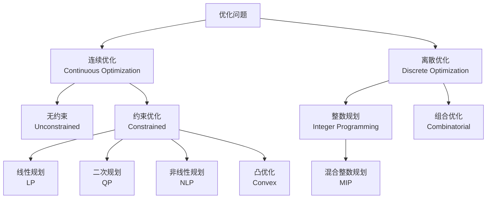
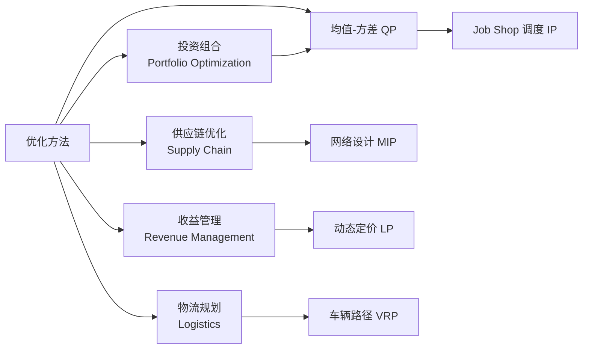

---
aliases: [OptimizationMethods, 优化方法, 最优化, MathematicalProgramming]
tags: ['11_ManagementSciences', 'ManagementScienceAndEngineering', 'OperationsResearch']
created: 2026-05-17
updated: 2026-05-17
---

# 优化方法 (Optimization Methods)

## 概述

优化方法研究在给定约束（constraints）下如何选择决策变量（decision variables）以最大化（maximize）或最小化（minimize）某一目标函数（objective function）。优化方法是运筹学（Operations Research）和管理科学的核心工具，直接影响物流、供应链、生产调度、投资组合和收益管理的决策质量。

## 优化问题的一般形式

标准形式的优化问题可表示为：

$$
\begin{aligned}
\min_{\mathbf{x} \in \mathbb{R}^n} \quad & f(\mathbf{x}) \\
\text{s.t.} \quad & g_i(\mathbf{x}) \leq 0, \quad i = 1,\dots,m \\
& h_j(\mathbf{x}) = 0, \quad j = 1,\dots,p
\end{aligned}
$$

其中 $f(\mathbf{x})$ 为目标函数，$g_i(\mathbf{x})$ 为不等式约束，$h_j(\mathbf{x})$ 为等式约束。可行域（feasible region）是所有满足约束的 $\mathbf{x}$ 的集合。

## 线性规划 (Linear Programming)

线性规划的目标函数和约束均为线性函数：

$$
\min_{\mathbf{x}} \mathbf{c}^T \mathbf{x}, \quad \text{s.t. } \mathbf{A}\mathbf{x} \leq \mathbf{b}, \mathbf{x} \geq \mathbf{0}
$$

### 单纯形法 (Simplex Method)

单纯形法在多面体（polytope）的顶点间迭代移动，沿下降方向寻找最优解。对偶单纯形法（Dual Simplex）在对偶可行基上求解。

### 内点法 (Interior Point Method)

内点法沿中心路径（central path）在可行域内部逼近最优解，求解大规模 LP 问题时具有多项式时间复杂度 $O(n^3L)$。

LP 问题的对偶（dual）形式为：

$$
\max_{\boldsymbol{\lambda}} \mathbf{b}^T \boldsymbol{\lambda}, \quad \text{s.t. } \mathbf{A}^T \boldsymbol{\lambda} \geq \mathbf{c}, \boldsymbol{\lambda} \geq \mathbf{0}
$$

## 整数规划 (Integer Programming)

整数规划（IP/MIP）在设施选址（facility location）、排班（scheduling）和物流路径规划（vehicle routing）等离散决策问题中起核心作用。

| 问题类型 | 变量类型 | 典型应用 |
|----------|----------|----------|
| 纯整数规划 (IP) | 全部整数 | 资本预算 |
| 混合整数规划 (MIP) | 连续 + 整数 | 供应链网络设计 |
| 0-1 规划 | 二元变量 | 选址、指派问题 |

求解方法包括分支定界（Branch and Bound）、切割平面（Cutting Plane）和分支切割法（Branch and Cut）。

## 非线性规划 (Nonlinear Programming)

NLP 处理目标或约束中包含非线性项的问题。求解方法包括：

1. **梯度下降法** (Gradient Descent)：

$$
\mathbf{x}^{(k+1)} = \mathbf{x}^{(k)} - \alpha_k \nabla f(\mathbf{x}^{(k)})
$$

2. **牛顿法** (Newton's Method)：

$$
\mathbf{x}^{(k+1)} = \mathbf{x}^{(k)} - [\nabla^2 f(\mathbf{x}^{(k)})]^{-1} \nabla f(\mathbf{x}^{(k)})
$$

3. **拟牛顿法** (Quasi-Newton, e.g. BFGS)：用近似黑森矩阵替代精确黑森矩阵。

### KKT 条件

约束优化的最优性条件由 Karush-Kuhn-Tucker (KKT) 条件给出：

$$
\begin{aligned}
\nabla f(\mathbf{x}^*) + \sum_{i=1}^m \mu_i \nabla g_i(\mathbf{x}^*) + \sum_{j=1}^p \lambda_j \nabla h_j(\mathbf{x}^*) &= 0 \\
\mu_i g_i(\mathbf{x}^*) &= 0, \quad \mu_i \geq 0, \quad i = 1,\dots,m \\
g_i(\mathbf{x}^*) &\leq 0, \quad h_j(\mathbf{x}^*) = 0
\end{aligned}
$$

## 凸优化 (Convex Optimization)

凸优化问题要求目标函数为凸函数（convex function），可行域为凸集（convex set）。其核心优势在于局部最优即全局最优。

常见的凸优化问题：

| 问题类型 | 目标函数 | 约束 |
|----------|----------|------|
| 线性规划 | 线性 | 线性 |
| 二次规划 | 二次 (正定) | 线性 |
| 二阶锥规划 | 线性 | 二阶锥约束 |
| 半定规划 | 线性 | 矩阵半正定约束 |

## 动态规划 (Dynamic Programming)

动态规划通过 Bellman 方程（Bellman equation）解决多阶段决策问题：

$$
V_t(s_t) = \min_{a_t} \left\{ C_t(s_t, a_t) + \beta V_{t+1}(s_{t+1}) \right\}
$$

适用于库存管理（inventory management）、设备更换（equipment replacement）和最短路径（shortest path）等问题。

## 多目标优化

多目标优化处理冲突目标间的权衡，核心概念包括：

1. **帕累托前沿** (Pareto Frontier)：没有其他可行解能同时改进所有目标的最优解集合。
2. **加权和法** (Weighted Sum)：$F(\mathbf{x}) = \sum_{i=1}^k w_i f_i(\mathbf{x})$
3. **$\varepsilon$-约束法** ($\varepsilon$-Constraint)：将一个目标保留在目标函数中，其余转为约束。

## 元启发式算法

在问题规模大或非凸空间中，元启发式算法提供近似最优解：

| 算法 | 灵感来源 | 特点 |
|------|----------|------|
| 遗传算法 (GA) | 自然选择 | 种群搜索、交叉变异 |
| 粒子群优化 (PSO) | 鸟群觅食 | 速度-位置更新 |
| 模拟退火 (SA) | 金属退火 | Metropolis 准则 |
| 蚁群算法 (ACO) | 蚂蚁寻径 | 信息素更新 |
| 禁忌搜索 (TS) | 记忆机制 | 禁忌表避免循环 |

## 管理科学中的应用

## 相关条目

- [[LinearAlgebra|线性代数]]
- [[GameTheory|博弈论]]
- [[DecisionTheory|决策理论]]
- [[ProbabilityTheory|概率论]]
- [[SupplyChainManagement|供应链管理]]
- [[OperationsResearch|运筹学]]
- [[INDEX|ManagementScienceAndEngineering 索引]]
- [[../../INDEX|TianshangKnowledgeBase 索引]]

